# Client Credentials Flow Template

OAuth 2.0 Client Credentials Grant for server-to-server authentication using client_id and client_secret.

## When to Use
- Service accounts
- Background processes
- System-to-system integrations
- When no specific user context is needed
- External Client Apps (ECAs) with client credentials enabled

## Prerequisites
1. Connected App or External Client App configured
2. Client Credentials flow enabled
3. Execution user assigned via Permission Set (for ECAs)

## Mermaid Template

```mermaid
%%{init: {'theme': 'base', 'themeVariables': {
  'actorBkg': '#ddd6fe',
  'actorTextColor': '#1f2937',
  'actorBorder': '#6d28d9',
  'signalColor': '#334155',
  'signalTextColor': '#1f2937',
  'noteBkgColor': '#f8fafc',
  'noteTextColor': '#1f2937',
  'noteBorderColor': '#334155'
}}}%%
sequenceDiagram
    autonumber

    box rgba(221,214,254,0.3) CLIENT APPLICATION
        participant C as 🖥️ Service<br/>(Backend Server)
    end

    box rgba(167,243,208,0.3) SALESFORCE
        participant SF as ☁️ Salesforce<br/>Authorization Server
    end

    Note over C,SF: Client Credentials Flow (RFC 6749 Section 4.4)

    C->>C: 1. Retrieve Client Credentials
    Note over C: client_id = CONSUMER_KEY<br/>client_secret = CONSUMER_SECRET

    C->>SF: 2. POST /services/oauth2/token
    Note over C,SF: grant_type=client_credentials<br/>client_id=CONSUMER_KEY<br/>client_secret=CONSUMER_SECRET

    SF->>SF: 3. Validate Client Credentials
    Note over SF: Verify client_id exists<br/>Verify client_secret matches

    SF->>SF: 4. Determine Execution User
    Note over SF: For ECA: Use assigned<br/>Permission Set user<br/><br/>For Connected App: Use<br/>"Run As" user

    SF->>SF: 5. Generate Access Token
    Note over SF: Token runs in context<br/>of execution user

    SF->>C: 6. Return Access Token
    Note over SF,C: {<br/>  "access_token": "...",<br/>  "instance_url": "https://...",<br/>  "token_type": "Bearer",<br/>  "issued_at": "..."<br/>}

    Note over C: ⚠️ No refresh_token returned<br/>⚠️ No user context (runs as service user)

    C->>SF: 7. Make API Calls
    Note over C,SF: Authorization: Bearer ACCESS_TOKEN

    SF->>SF: 8. Execute as Service User
    Note over SF: All operations run with<br/>execution user's permissions

    SF->>C: 9. API Response
```



## ASCII Fallback Template

```
┌───────────────────────┐     ┌────────────────────┐
│    Service/Backend    │     │     Salesforce     │
│   (client_id/secret)  │     │   (Auth Server)    │
└───────────┬───────────┘     └─────────┬──────────┘
            │                           │
            │  1. POST /token           │
            │     grant_type=           │
            │       client_credentials  │
            │     client_id=KEY         │
            │     client_secret=SECRET  │
            │──────────────────────────>│
            │                           │
            │           2. Validate     │
            │              credentials  │
            │                           │
            │           3. Determine    │
            │              execution    │
            │              user         │
            │                           │
            │           4. Generate     │
            │              access token │
            │                           │
            │  5. Access Token          │
            │     (NO refresh token!)   │
            │     (NO user context!)    │
            │<──────────────────────────│
            │                           │
            │  6. API Request           │
            │     (Bearer token)        │
            │──────────────────────────>│
            │                           │
            │  7. API Response          │
            │     (runs as svc user)    │
            │<──────────────────────────│
```

## Token Request

```bash
curl -X POST https://login.salesforce.com/services/oauth2/token \
  -d "grant_type=client_credentials" \
  -d "client_id=YOUR_CONSUMER_KEY" \
  -d "client_secret=YOUR_CONSUMER_SECRET"
```

## Response Example

```json
{
  "access_token": "00D5g000001ABC...!ARcAQNlBrLGj...",
  "instance_url": "https://mycompany.my.salesforce.com",
  "token_type": "Bearer",
  "issued_at": "1702123456789"
}
```

## Code Examples

### Python
```python
import requests

response = requests.post(
    'https://login.salesforce.com/services/oauth2/token',
    data={
        'grant_type': 'client_credentials',
        'client_id': 'YOUR_CONSUMER_KEY',
        'client_secret': 'YOUR_CONSUMER_SECRET'
    }
)

token_data = response.json()
access_token = token_data['access_token']
instance_url = token_data['instance_url']

# Make API call
headers = {'Authorization': f'Bearer {access_token}'}
api_response = requests.get(
    f'{instance_url}/services/data/v59.0/sobjects/Account',
    headers=headers
)
```

### Node.js
```javascript
const axios = require('axios');

const response = await axios.post(
  'https://login.salesforce.com/services/oauth2/token',
  new URLSearchParams({
    grant_type: 'client_credentials',
    client_id: 'YOUR_CONSUMER_KEY',
    client_secret: 'YOUR_CONSUMER_SECRET'
  })
);

const { access_token, instance_url } = response.data;

// Make API call
const apiResponse = await axios.get(
  `${instance_url}/services/data/v59.0/sobjects/Account`,
  { headers: { Authorization: `Bearer ${access_token}` } }
);
```

## Connected App vs External Client App

| Feature | Connected App | External Client App (ECA) |
|---------|--------------|--------------------------|
| Secret Management | Manual rotation | Automatic rotation supported |
| User Assignment | "Run As" user | Permission Set assignment |
| Configuration | Setup → App Manager | Setup → External Client Apps |
| Recommended | Legacy integrations | New integrations (2024+) |

## Key Characteristics

| Aspect | Value |
|--------|-------|
| User Interaction | None required |
| Refresh Token | **Not returned** - re-authenticate |
| User Context | Runs as execution/service user |
| Scopes | Limited to service account permissions |
| Best For | System integrations, batch jobs |

## Enabling Client Credentials

### For Connected App
1. Setup → App Manager → Edit Connected App
2. Enable OAuth Settings
3. Enable "Client Credentials Flow"
4. Set "Run As" user

### For External Client App
1. Setup → External Client Apps → New
2. Configure OAuth Settings
3. Enable `isClientCredentialsEnabled`
4. Assign Permission Set with user

## Security Considerations

1. **Protect client_secret** - Never expose in client-side code
2. **Use dedicated service user** with minimal permissions
3. **Rotate secrets regularly** (especially for Connected Apps)
4. **Monitor API usage** - Set up event monitoring
5. **Restrict IP ranges** if possible

## Limitations

- No refresh tokens (must re-authenticate)
- No user context (cannot impersonate users)
- Limited to service user's permissions
- Cannot use for user-specific operations

## Customization Points

Replace these placeholders:
- `CONSUMER_KEY` → Your Connected App's Consumer Key
- `CONSUMER_SECRET` → Your Connected App's Consumer Secret
- `login.salesforce.com` → Or `test.salesforce.com` for sandbox
