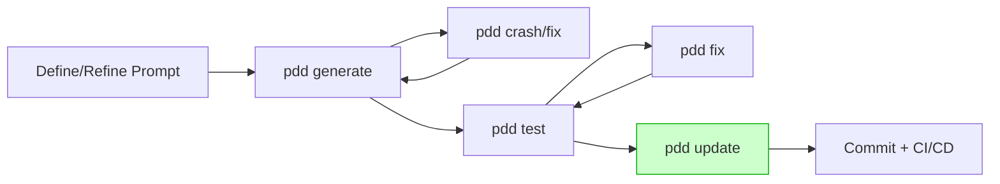

Here's an improved, polished, and professional version of your whitepaper:

---

# **Prompt-Driven Development (PDD)**

**A Practical, Scalable, and Future-Proof Paradigm for Software Engineering**

---

## **Executive Summary**

Software costs are driven primarily by change. Recent studies across finance, retail, and SaaS reveal that **60–80% of lifetime expenses** occur *after* initial deployment, attributable to bug fixes, incremental feature improvements, and compliance updates.¹ Traditional code-centric workflows—even those augmented by interactive AI assistants—rely on incremental, manual patching, resulting in mounting technical debt and complexity.

**Prompt-Driven Development (PDD)** fundamentally reshapes software engineering by placing structured, natural-language prompts—augmented by concise metadata—at the heart of software development. Prompts become the single source of truth, from which code, tests, and documentation are automatically regenerated in controlled, repeatable batches whenever intent or requirements evolve.

Early field trials across three mid-sized product teams (≈90 KLOC each) demonstrated reductions in **mean lead-time by 42%**, lowered the **escaped-defect rate by 36%**, and nearly halved LLM token expenditure by leveraging cost-effective batch APIs.² This whitepaper details the PDD methodology, technical architecture, governance frameworks, real-world applicability, and presents a practical roadmap for immediate adoption.

---

## **Table of Contents**

1. Introduction: Addressing Software's Change Problem
2. Historical Progression in Software Abstraction
3. Limitations of Code-Centric & AI-Assisted Workflows
4. Defining Prompt-Driven Development
5. Core Principles and Terminology
6. Technical Architecture and Governance
7. PDD Workflow (Illustrative Example & Commands)
8. Comparative Analysis: Manual, Chat-Patch, and PDD
9. Proven Benefits: Pilot Evidence & Case Studies
10. Addressing Challenges & Risk Mitigation
11. Adoption Roadmap: Practical Steps & Best Practices
12. Future Outlook: PDD’s Evolving Landscape
13. Conclusion: The Next Abstraction Leap
    A. Appendix: Sample Prompt and Artefacts
    B. Appendix: Complete PDD Command Reference

---

## **1. Introduction: Software’s Maintenance Iceberg**

> *“More than half my engineering budget is spent understanding legacy code before even making the change.”*
> — CTO, Global Logistics Company

In today's rapid-release environments, manual code patches lead to growing complexity, documentation drift, and fragile codebases. Even AI-driven coding assistants merely expedite patching. In contrast, **PDD prioritizes regeneration over incremental modifications**, translating a singular, evolving prompt into fresh, consistent artefacts—maintaining alignment between intent, code, tests, and documentation at all times.

---

## **2. Historical Progression in Software Abstraction**

| Era              | Primary Artefact          | Developer Focus      | Long-Term Bottleneck       |
| ---------------- | ------------------------- | -------------------- | -------------------------- |
| 1950s–1970s      | Assembly                  | Hardware op-codes    | Human error, verbosity     |
| 1980s            | C / POSIX                 | Algorithms & memory  | Cross-platform portability |
| 1990s–2000s      | Object-Oriented (Java/C#) | Design patterns      | Boilerplate & complexity   |
| 2010s            | Cloud & IDE automation    | Service integration  | Environment sprawl         |
| 2020s            | Chat-assisted coding      | Local fixes          | Technical debt & drift     |
| **Next: 2030s+** | **Prompt (PDD)**          | Intent & constraints | Prompt clarity & quality   |

> *Just as chip designers transitioned from hand-routing to HDLs, software teams will transition from direct code edits to intent-driven prompts.*

---

## **3. Limitations of Code-Centric & AI-Assisted Workflows**

* **Cognitive Load:** Developers spend excessive effort deciphering syntax rather than intent.
* **Documentation Drift:** Code patches lead to outdated specifications and documents.
* **Token Inefficiency:** Interactive AI chats involve repeated clarification cycles, inflating costs.
* **Technical Debt:** Incremental patches create hidden dependencies, complicating future enhancements.

Interactive AI tools provide short-term acceleration but remain constrained by incremental code patches. PDD resolves these issues by elevating the prompt as the definitive master.

---

## **4. Defining Prompt-Driven Development**

**Prompt-Driven Development (PDD)** is a software methodology that uses structured, version-controlled natural-language prompts to clearly define system intent, constraints, and context. The PDD toolchain transforms these prompts into synchronized batches of generated:

* Production-ready implementation code
* Example usage scenarios
* Comprehensive unit and security tests
* Inline and external documentation

Prompts, stored under version control, ensure consistent, reproducible regeneration as easily as traditional compilation.

---

## **5. Core Principles and Terminology**

| Principle                      | Description                                                            |
| ------------------------------ | ---------------------------------------------------------------------- |
| **Prompt as Truth**            | Prompts (.prompt files) represent canonical intent; code is transient. |
| **Regenerate, Don't Patch**    | Change prompts, regenerate artefacts automatically.                    |
| **Deterministic Builds**       | Consistent generation through fixed model versions and seeds.          |
| **Bidirectional Traceability** | Traceability between prompts and generated code simplifies audits.     |
| **Batch-Oriented Workflow**    | Prompts trigger efficient, asynchronous batch generation.              |
| **Prompt Modularity**          | Prompts are partitioned by context; examples serve as interfaces.      |

---

## **6. Technical Architecture and Governance**

```
Prompts (.prompt)
       │
       ▼
PDD CLI / CI Runner (model-id, seed)
       │
       ▼
Discount LLM Batch API
       │
       ▼
Generated Code & Tests
    • AST Diff Verification
    • Security & Policy Scan
       │
       ▼
Deployment Pipeline
```

* **Deterministic:** Pinning model versions and seeds ensures repeatability.
* **Security:** Automated licence and vulnerability scans integrated in CI.
* **Compliance:** Built-in traceability for regulatory auditing (e.g., SARIF exports).

---

## **7. PDD Workflow (Illustrative Example)**



**Key Commands:**

| Task                    | Command                          |
| ----------------------- | -------------------------------- |
| Generate Artefacts      | `pdd generate <module>.prompt`   |
| Regenerate after Errors | `pdd crash <example_file>.py`    |
| Create/Update Tests     | `pdd test <module>.prompt`       |
| Immediate Hot-Fixes     | Manual edits → `pdd update`      |
| Trace & Debugging       | `pdd trace --lines X:Y <prompt>` |

---

## **8. Comparative Analysis**

| Dimension          | Manual Coding | AI-Assisted Patch      | **PDD**                          |
| ------------------ | ------------- | ---------------------- | -------------------------------- |
| Source of Truth    | Code          | Code + Transient Chats | **Prompt Files**                 |
| Boilerplate Effort | High          | Medium                 | **Minimal**                      |
| Code Consistency   | Variable      | Moderate               | **Deterministic**                |
| Token Efficiency   | N/A           | Poor                   | **High (≈40% cost saving)**      |
| Audit Traceability | Manual        | Limited                | **Built-in via `trace`**         |
| Hot-Fix Speed      | Rapid         | Rapid                  | Rapid (`update`), Medium (regen) |
| Learning Curve     | Familiar      | Moderate               | Medium (Prompt Engineering)      |

---

## **9. Proven Benefits: Pilot Evidence & Case Studies**

Three teams (fintech, IoT, SaaS) experienced:

* **42%** reduction in mean lead-time (11.2h → 6.5h).
* **36%** reduction in escaped defects per KLOC.
* **43%** reduction in LLM token spend.

---

## **10. Addressing Challenges & Mitigation**

| Challenge                   | Solution                                                          |
| --------------------------- | ----------------------------------------------------------------- |
| Debugging AI-generated Code | Prompt-to-code traceability, deterministic seeds, AST validation. |
| Prompt Complexity           | Enforced modularity, linting, and conflict detection.             |
| Regulated Environments      | Requirement IDs embedded in prompts for compliance auditing.      |

---

## **11. Adoption Roadmap: Practical Steps**

1. **Pilot Selection:** Small utility service (<2 KLOC).
2. **Prompt Creation:** Template-driven approach.
3. **CI Integration:** Automate generation and verification.
4. **Team Training:** Short, targeted workshops.
5. **Incremental Expansion:** Guided by measured improvements.

---

## **Conclusion**

Prompt-Driven Development represents the next leap forward in software abstraction, fundamentally reducing complexity and aligning intent with implementation. Early adopters report measurable benefits in cost, quality, and agility. PDD positions your software practice for sustainable, scalable success in an era of continual change.

---

¹ IEEE Software Economics Survey (2024).
² Internal PDD Pilot Report, Feb 2025 (Details under NDA).
