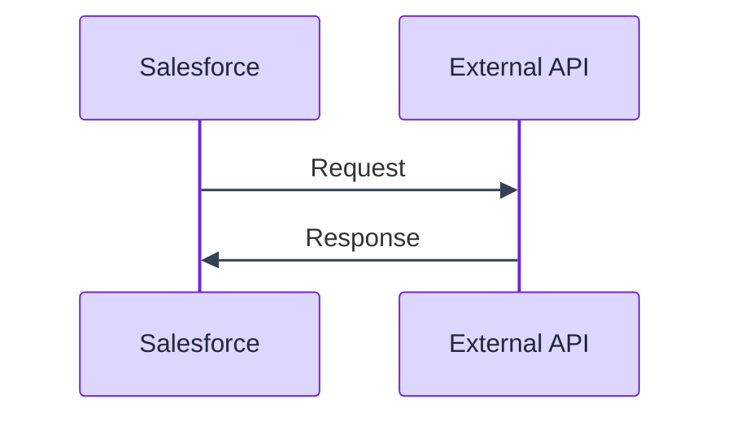
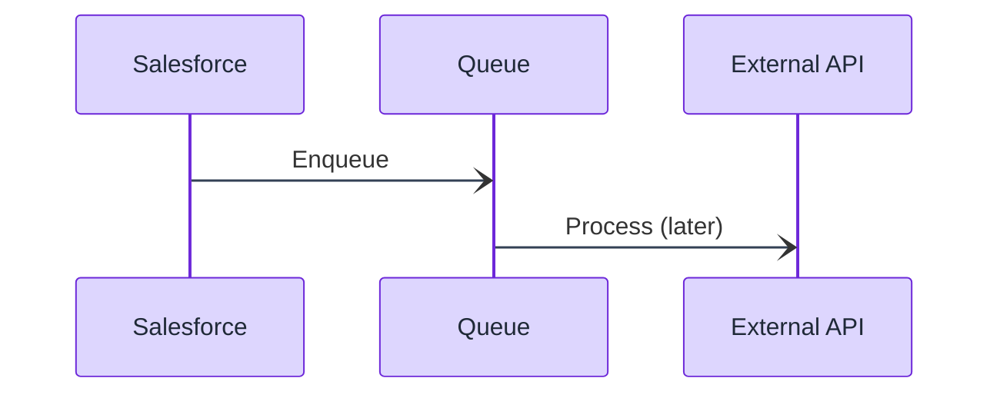
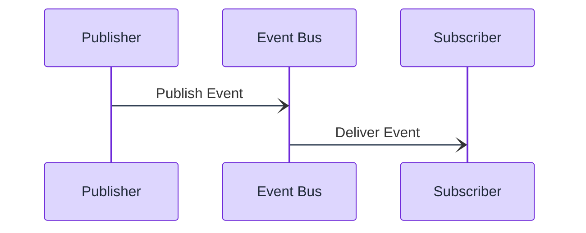
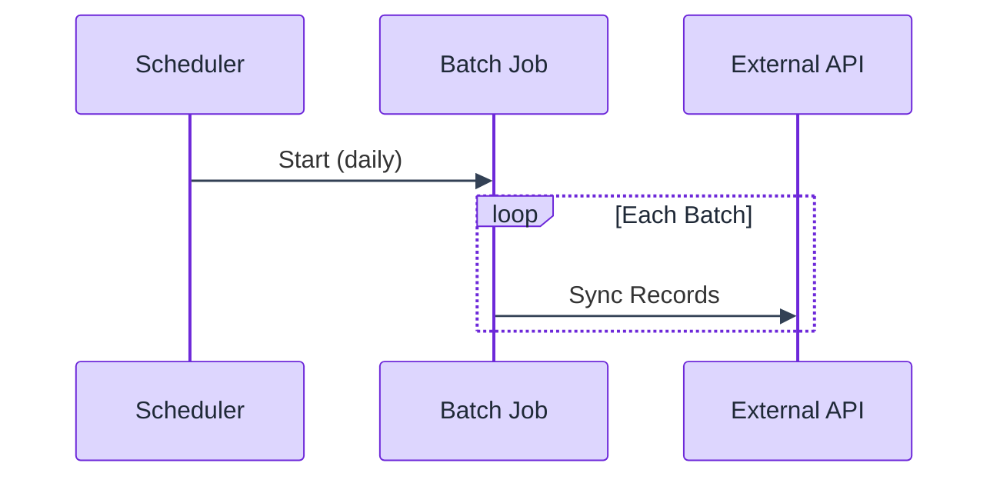
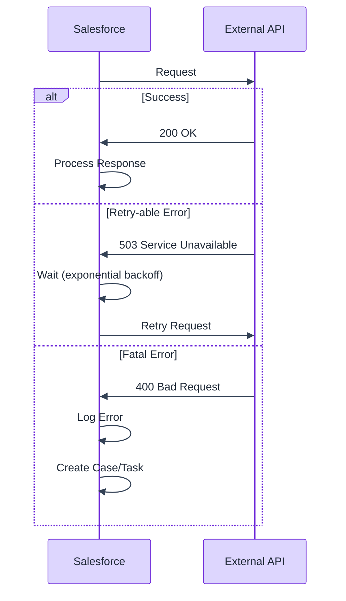

# Integration Sequence Diagram Template

Sequence diagram template for visualizing Salesforce integration patterns with external systems.

## When to Use
- Documenting API integrations
- Planning data sync flows
- Designing event-driven architectures
- Explaining callout patterns

## Mermaid Template - Outbound REST Callout

```mermaid
%%{init: {'theme': 'base', 'themeVariables': {
  'actorBkg': '#ddd6fe',
  'actorTextColor': '#1f2937',
  'actorBorder': '#6d28d9',
  'signalColor': '#334155',
  'signalTextColor': '#1f2937',
  'noteBkgColor': '#f8fafc',
  'noteTextColor': '#1f2937',
  'noteBorderColor': '#334155'
}}}%%
sequenceDiagram
    autonumber

    box rgba(167,243,208,0.3) SALESFORCE
        participant T as 🔄 Trigger/<br/>Flow
        participant Q as ⚡ Queueable
        participant NC as 🔐 Named<br/>Credential
    end

    box rgba(254,215,170,0.3) EXTERNAL SYSTEM
        participant API as 🏭 External<br/>API
    end

    Note over T,API: Outbound REST Integration (Async)

    T->>T: 1. Record Created/Updated
    Note over T: Account After Insert/Update

    T->>Q: 2. Enqueue Async Job
    Note over T,Q: System.enqueueJob(<br/>  new AccountSyncQueueable(recordIds)<br/>)

    activate Q

    Q->>Q: 3. Query Records
    Note over Q: [SELECT Id, Name, ...<br/> FROM Account<br/> WHERE Id IN :recordIds]

    Q->>Q: 4. Build Request Payload
    Note over Q: JSON.serialize(accounts)

    Q->>NC: 5. Get Auth Token
    Note over Q,NC: Named Credential handles:<br/>• OAuth token refresh<br/>• Certificate auth<br/>• Basic auth

    NC->>Q: 6. Return Auth Headers

    Q->>API: 7. POST /api/v1/accounts
    Note over Q,API: Headers:<br/>  Authorization: Bearer ...<br/>  Content-Type: application/json<br/><br/>Body: [{"name": "Acme", ...}]

    alt Success (2xx)
        API->>Q: 8a. 200 OK
        Note over API,Q: {"status": "created",<br/> "externalId": "EXT-123"}

        Q->>Q: 9a. Update SF Records
        Note over Q: Account.External_Id__c = "EXT-123"<br/>Account.Sync_Status__c = "Synced"
    else Client Error (4xx)
        API->>Q: 8b. 400 Bad Request
        Note over API,Q: {"error": "validation_failed",<br/> "details": [...]}

        Q->>Q: 9b. Log Error
        Note over Q: Create Integration_Log__c<br/>Status = "Failed"
    else Server Error (5xx)
        API->>Q: 8c. 500 Internal Error

        Q->>Q: 9c. Retry Logic
        Note over Q: if (retryCount < 3)<br/>  System.enqueueJob(this)
    end

    deactivate Q
```



## Mermaid Template - Inbound REST API

```mermaid
%%{init: {'theme': 'base', 'themeVariables': {
  'actorBkg': '#ddd6fe',
  'actorTextColor': '#1f2937',
  'actorBorder': '#6d28d9',
  'signalColor': '#334155',
  'signalTextColor': '#1f2937',
  'noteBkgColor': '#f8fafc',
  'noteTextColor': '#1f2937',
  'noteBorderColor': '#334155'
}}}%%
sequenceDiagram
    autonumber

    box rgba(254,215,170,0.3) EXTERNAL SYSTEM
        participant EXT as 🏭 External<br/>System
    end

    box rgba(167,243,208,0.3) SALESFORCE
        participant GW as 🌐 API Gateway<br/>(REST Resource)
        participant SVC as ⚙️ Service<br/>Class
        participant DB as 💾 Database
    end

    Note over EXT,DB: Inbound REST Integration

    EXT->>EXT: 1. Prepare Request
    Note over EXT: Build payload with<br/>account data

    EXT->>GW: 2. POST /services/apexrest/accounts
    Note over EXT,GW: Headers:<br/>  Authorization: Bearer ACCESS_TOKEN<br/>  Content-Type: application/json

    activate GW

    GW->>GW: 3. Authenticate Request
    Note over GW: Validate OAuth token<br/>Check user permissions

    GW->>GW: 4. Parse Request Body
    Note over GW: RestRequest req = RestContext.request<br/>String body = req.requestBody.toString()

    GW->>SVC: 5. Call Service Method
    Note over GW,SVC: AccountService.upsertAccounts(<br/>  parsedAccounts<br/>)

    activate SVC

    SVC->>SVC: 6. Validate Data
    Note over SVC: Check required fields<br/>Validate external IDs

    SVC->>DB: 7. Upsert Records
    Note over SVC,DB: Database.upsert(<br/>  accounts,<br/>  Account.External_Id__c,<br/>  false // allOrNone<br/>)

    DB->>SVC: 8. Return Results

    SVC->>SVC: 9. Process Results
    Note over SVC: Map success/errors<br/>to response format

    deactivate SVC

    SVC->>GW: 10. Return Response Object

    GW->>GW: 11. Build REST Response
    Note over GW: RestContext.response.statusCode = 200<br/>RestContext.response.responseBody = JSON

    deactivate GW

    GW->>EXT: 12. 200 OK
    Note over GW,EXT: {<br/>  "success": true,<br/>  "records": [<br/>    {"id": "001xxx", "status": "created"},<br/>    {"id": "001yyy", "status": "updated"}<br/>  ]<br/>}
```



## Mermaid Template - Platform Event (Async)

```mermaid
%%{init: {'theme': 'base', 'themeVariables': {
  'actorBkg': '#ddd6fe',
  'actorTextColor': '#1f2937',
  'actorBorder': '#6d28d9',
  'signalColor': '#334155',
  'signalTextColor': '#1f2937',
  'noteBkgColor': '#f8fafc',
  'noteTextColor': '#1f2937',
  'noteBorderColor': '#334155'
}}}%%
sequenceDiagram
    autonumber

    box rgba(167,243,208,0.3) SALESFORCE ORG A
        participant T as 🔄 Trigger
        participant PE as 📢 Platform<br/>Event
    end

    box rgba(165,243,252,0.3) EVENT BUS
        participant EB as 🚌 Salesforce<br/>Event Bus
    end

    box rgba(254,215,170,0.3) EXTERNAL SYSTEM
        participant CL as 🔌 CometD<br/>Client
        participant API as 🏭 Backend<br/>Service
    end

    Note over T,API: Event-Driven Integration

    T->>T: 1. Record Change Detected
    Note over T: Account updated with<br/>Type = 'Customer'

    T->>PE: 2. Publish Platform Event
    Note over T,PE: EventBus.publish(<br/>  new Account_Change__e(<br/>    Account_Id__c = acc.Id,<br/>    Change_Type__c = 'UPDATE'<br/>  )<br/>)

    PE->>EB: 3. Event Published
    Note over PE,EB: Event persisted to<br/>event bus (24hr retention)

    EB->>EB: 4. Event Queued

    EB-)CL: 5. Push to Subscribers
    Note over EB,CL: CometD streaming<br/>/event/Account_Change__e

    activate CL

    CL->>CL: 6. Receive Event
    Note over CL: {<br/>  "Account_Id__c": "001xxx",<br/>  "Change_Type__c": "UPDATE",<br/>  "ReplayId": 12345<br/>}

    CL->>API: 7. Process Event
    Note over CL,API: Call internal service<br/>to sync data

    API->>API: 8. Update External DB

    API->>CL: 9. Acknowledge
    Note over API,CL: Store ReplayId for<br/>resume capability

    deactivate CL

    Note over CL: ⚠️ Store last ReplayId<br/>for reconnection
```



## ASCII Fallback Template - Outbound Integration

```
┌───────────────┐  ┌───────────────┐  ┌───────────────┐  ┌───────────────┐
│    Trigger    │  │   Queueable   │  │     Named     │  │   External    │
│               │  │               │  │   Credential  │  │     API       │
└───────┬───────┘  └───────┬───────┘  └───────┬───────┘  └───────┬───────┘
        │                  │                  │                  │
        │  1. Record       │                  │                  │
        │     Changed      │                  │                  │
        │                  │                  │                  │
        │  2. Enqueue Job  │                  │                  │
        │─────────────────>│                  │                  │
        │                  │                  │                  │
        │                  │  3. Query        │                  │
        │                  │     Records      │                  │
        │                  │                  │                  │
        │                  │  4. Get Auth     │                  │
        │                  │─────────────────>│                  │
        │                  │                  │                  │
        │                  │  5. Auth Token   │                  │
        │                  │<─────────────────│                  │
        │                  │                  │                  │
        │                  │  6. POST /api/accounts              │
        │                  │─────────────────────────────────────>│
        │                  │                  │                  │
        │                  │  7. Response (200/4xx/5xx)          │
        │                  │<─────────────────────────────────────│
        │                  │                  │                  │
        │                  │  8. Update       │                  │
        │                  │     Records      │                  │
        │                  │     (or retry)   │                  │
```

## Common Integration Patterns

### 1. Request-Response (Sync)


### 2. Fire-and-Forget (Async)


### 3. Pub/Sub (Event-Driven)


### 4. Batch Sync


## HTTP Method Reference

| Method | Purpose | Salesforce Use |
|--------|---------|----------------|
| GET | Retrieve data | Query external API |
| POST | Create resource | Send new records |
| PUT | Replace resource | Full record update |
| PATCH | Partial update | Update specific fields |
| DELETE | Remove resource | Delete external record |

## Error Handling Patterns



## Salesforce Integration Components

| Component | Purpose | When to Use |
|-----------|---------|-------------|
| Named Credential | Auth management | OAuth, Certificate, Basic Auth |
| External Service | Auto-generate Apex | OpenAPI/Swagger specs |
| Platform Event | Async messaging | Event-driven integration |
| Change Data Capture | Track changes | Real-time replication |
| Outbound Message | Declarative callout | Simple workflow integrations |
| Apex REST | Inbound API | Custom REST endpoints |
| SOAP API | Inbound SOAP | Legacy systems |

## Best Practices

1. **Always use async** for callouts in triggers
2. **Use Named Credentials** for auth management
3. **Implement retry logic** with exponential backoff
4. **Log all integrations** for troubleshooting
5. **Handle partial success** in bulk operations
6. **Set appropriate timeouts** (max 120s for callouts)

## Customization Points

- Replace system names with actual integration partners
- Add specific endpoints and payload structures
- Include actual field mappings
- Show specific error codes and handling
