# System Landscape Diagram Template

Flowchart template for visualizing high-level Salesforce system architecture using the sf-skills standard styling.

## When to Use
- Architecture overview presentations
- Integration landscape documentation
- System inventory
- Stakeholder communication

## Mermaid Template - Sales Cloud Integration Landscape

```mermaid
%%{init: {"flowchart": {"nodeSpacing": 80, "rankSpacing": 70}} }%%
flowchart TB
    subgraph users["👥 USERS"]
        direction LR
        U1["📱 Sales Reps<br/><small>Mobile App</small>"]
        U2["💻 Managers<br/><small>Desktop</small>"]
        U3["🌐 Partners<br/><small>Portal</small>"]
    end

    subgraph salesforce["☁️ SALESFORCE PLATFORM"]
        direction TB

        subgraph core["CORE CRM"]
            SF1["💼 Sales Cloud<br/><small>Leads, Opps</small>"]
            SF2["🎧 Service Cloud<br/><small>Cases, Knowledge</small>"]
            SF3["🌐 Experience Cloud<br/><small>Portals</small>"]
        end

        subgraph automation["⚡ AUTOMATION"]
            FL["🔄 Flows<br/><small>Process Builder</small>"]
            AP["⚡ Apex<br/><small>Triggers, Services</small>"]
            PE["📢 Platform Events<br/><small>CDC, Streaming</small>"]
        end

        subgraph ai["🤖 AI & ANALYTICS"]
            EIN["🧠 Einstein<br/><small>Predictions</small>"]
            TB["📊 Tableau<br/><small>Dashboards</small>"]
            CRM["📈 CRM Analytics<br/><small>Reports</small>"]
        end
    end

    subgraph integration["🔄 INTEGRATION LAYER"]
        direction LR
        MW["🔗 MuleSoft<br/><small>Anypoint Platform</small>"]
        API["🔐 API Gateway<br/><small>Named Credentials</small>"]
    end

    subgraph external["🏢 EXTERNAL SYSTEMS"]
        direction TB

        subgraph erp["ERP SYSTEMS"]
            SAP["🏭 SAP S/4HANA<br/><small>Finance, Inventory</small>"]
            NET["📦 NetSuite<br/><small>Orders</small>"]
        end

        subgraph marketing["MARKETING"]
            MC["📧 Marketing Cloud<br/><small>Campaigns</small>"]
            PAR["🎯 Account Engagement<br/><small>Pardot</small>"]
        end

        subgraph data["DATA & STORAGE"]
            DW["❄️ Snowflake<br/><small>Data Warehouse</small>"]
            S3["☁️ AWS S3<br/><small>Files</small>"]
        end
    end

    %% User connections
    U1 -->|"Salesforce Mobile"| SF1
    U2 -->|"Lightning"| SF1
    U2 -->|"Lightning"| SF2
    U3 -->|"Portal"| SF3

    %% Internal SF connections
    SF1 <--> FL
    SF2 <--> FL
    FL <--> AP
    AP <--> PE

    SF1 --> EIN
    SF1 --> TB
    SF2 --> CRM

    %% Integration connections
    PE --> MW
    AP <--> API
    MW <--> API

    %% External connections
    API <-->|"REST/SOAP"| SAP
    API <-->|"REST"| NET
    MW <-->|"CDC"| MC
    MW --> PAR
    MW -->|"ETL"| DW
    API -->|"Files"| S3

    %% Node Styling - Users (violet-200)
    style U1 fill:#ddd6fe,stroke:#6d28d9,color:#1f2937
    style U2 fill:#ddd6fe,stroke:#6d28d9,color:#1f2937
    style U3 fill:#ddd6fe,stroke:#6d28d9,color:#1f2937

    %% Node Styling - Salesforce Core (cyan-200)
    style SF1 fill:#a5f3fc,stroke:#0e7490,color:#1f2937
    style SF2 fill:#a5f3fc,stroke:#0e7490,color:#1f2937
    style SF3 fill:#a5f3fc,stroke:#0e7490,color:#1f2937

    %% Node Styling - Automation (indigo-200/violet-200/teal-200)
    style FL fill:#c7d2fe,stroke:#4338ca,color:#1f2937
    style AP fill:#ddd6fe,stroke:#6d28d9,color:#1f2937
    style PE fill:#99f6e4,stroke:#0f766e,color:#1f2937

    %% Node Styling - AI (pink-200)
    style EIN fill:#fbcfe8,stroke:#be185d,color:#1f2937
    style TB fill:#fbcfe8,stroke:#be185d,color:#1f2937
    style CRM fill:#fbcfe8,stroke:#be185d,color:#1f2937

    %% Node Styling - Integration (orange-200)
    style MW fill:#fed7aa,stroke:#c2410c,color:#1f2937
    style API fill:#fed7aa,stroke:#c2410c,color:#1f2937

    %% Node Styling - External (emerald-200/amber-200)
    style SAP fill:#a7f3d0,stroke:#047857,color:#1f2937
    style NET fill:#a7f3d0,stroke:#047857,color:#1f2937
    style MC fill:#a7f3d0,stroke:#047857,color:#1f2937
    style PAR fill:#a7f3d0,stroke:#047857,color:#1f2937
    style DW fill:#fde68a,stroke:#b45309,color:#1f2937
    style S3 fill:#fde68a,stroke:#b45309,color:#1f2937

    %% Subgraph Styling - 50-level fills with dark dashed borders
    style users fill:#f5f3ff,stroke:#6d28d9,stroke-dasharray:5
    style salesforce fill:#ecfeff,stroke:#0e7490,stroke-dasharray:5
    style core fill:#ecfeff,stroke:#0e7490,stroke-dasharray:5
    style automation fill:#eef2ff,stroke:#4338ca,stroke-dasharray:5
    style ai fill:#fdf2f8,stroke:#be185d,stroke-dasharray:5
    style integration fill:#fff7ed,stroke:#c2410c,stroke-dasharray:5
    style external fill:#ecfdf5,stroke:#047857,stroke-dasharray:5
    style erp fill:#ecfdf5,stroke:#047857,stroke-dasharray:5
    style marketing fill:#ecfdf5,stroke:#047857,stroke-dasharray:5
    style data fill:#fffbeb,stroke:#b45309,stroke-dasharray:5
```



## Mermaid Template - Agentforce Architecture

```mermaid
%%{init: {"flowchart": {"nodeSpacing": 80, "rankSpacing": 70}} }%%
flowchart TB
    subgraph channels["📱 CHANNELS"]
        WEB["🌐 Web Chat<br/><small>Embedded</small>"]
        SMS["💬 SMS<br/><small>Twilio</small>"]
        WHATS["📱 WhatsApp<br/><small>Business</small>"]
        SLACK["💼 Slack<br/><small>Enterprise</small>"]
    end

    subgraph agentforce["🤖 AGENTFORCE"]
        direction TB

        subgraph agents["AI AGENTS"]
            SA["🎧 Service Agent<br/><small>Customer Support</small>"]
            SDA["📞 SDR Agent<br/><small>Lead Qualification</small>"]
            COACH["🎯 Sales Coach<br/><small>Guidance</small>"]
        end

        subgraph topics["TOPICS & ACTIONS"]
            T1["📦 Order Status<br/><small>Track, Update</small>"]
            T2["🔄 Return Request<br/><small>RMA, Refund</small>"]
            T3["✅ Lead Qualify<br/><small>Score, Route</small>"]
            A1["⚡ Apex Actions<br/><small>Custom Logic</small>"]
            A2["🔄 Flow Actions<br/><small>Automation</small>"]
        end

        subgraph foundation["FOUNDATION"]
            DM["☁️ Data Cloud<br/><small>Unified Profile</small>"]
            TRUST["🔐 Trust Layer<br/><small>Guardrails</small>"]
            PROMPT["📝 Prompt Builder<br/><small>Templates</small>"]
        end
    end

    subgraph backend["⚙️ BACKEND"]
        APEX["⚡ Apex Services<br/><small>Business Logic</small>"]
        FLOW["🔄 Flow Orchestration<br/><small>Processes</small>"]
        INT["🔗 Integrations<br/><small>Named Creds</small>"]
    end

    subgraph datasources["💾 DATA SOURCES"]
        CRM[("💼 CRM Data<br/><small>Accounts, Cases</small>")]
        EXT[("🏭 External Data<br/><small>ERP, APIs</small>")]
        KB[("📚 Knowledge Base<br/><small>Articles</small>")]
    end

    %% Channel to Agent
    WEB --> SA
    SMS --> SA
    WHATS --> SA
    SLACK --> SDA
    SLACK --> COACH

    %% Agent to Topics
    SA --> T1
    SA --> T2
    SDA --> T3

    %% Topics to Actions
    T1 --> A1
    T2 --> A2
    T3 --> A1

    %% Foundation connections
    agents --> DM
    agents --> TRUST
    topics --> PROMPT

    %% Backend connections
    A1 --> APEX
    A2 --> FLOW
    APEX --> INT

    %% Data connections
    DM --> CRM
    DM --> EXT
    TRUST --> KB

    %% Node Styling - Channels (slate-200)
    style WEB fill:#e2e8f0,stroke:#334155,color:#1f2937
    style SMS fill:#e2e8f0,stroke:#334155,color:#1f2937
    style WHATS fill:#e2e8f0,stroke:#334155,color:#1f2937
    style SLACK fill:#e2e8f0,stroke:#334155,color:#1f2937

    %% Node Styling - Agents (pink-200)
    style SA fill:#fbcfe8,stroke:#be185d,color:#1f2937
    style SDA fill:#fbcfe8,stroke:#be185d,color:#1f2937
    style COACH fill:#fbcfe8,stroke:#be185d,color:#1f2937

    %% Node Styling - Topics (violet-200)
    style T1 fill:#ddd6fe,stroke:#6d28d9,color:#1f2937
    style T2 fill:#ddd6fe,stroke:#6d28d9,color:#1f2937
    style T3 fill:#ddd6fe,stroke:#6d28d9,color:#1f2937

    %% Node Styling - Actions (indigo-200)
    style A1 fill:#c7d2fe,stroke:#4338ca,color:#1f2937
    style A2 fill:#c7d2fe,stroke:#4338ca,color:#1f2937

    %% Node Styling - Foundation (teal-200)
    style DM fill:#99f6e4,stroke:#0f766e,color:#1f2937
    style TRUST fill:#99f6e4,stroke:#0f766e,color:#1f2937
    style PROMPT fill:#99f6e4,stroke:#0f766e,color:#1f2937

    %% Node Styling - Backend (cyan-200/orange-200)
    style APEX fill:#a5f3fc,stroke:#0e7490,color:#1f2937
    style FLOW fill:#a5f3fc,stroke:#0e7490,color:#1f2937
    style INT fill:#fed7aa,stroke:#c2410c,color:#1f2937

    %% Node Styling - Data (amber-200)
    style CRM fill:#fde68a,stroke:#b45309,color:#1f2937
    style EXT fill:#fde68a,stroke:#b45309,color:#1f2937
    style KB fill:#fde68a,stroke:#b45309,color:#1f2937

    %% Subgraph Styling - 50-level fills with dark dashed borders
    style channels fill:#f8fafc,stroke:#334155,stroke-dasharray:5
    style agentforce fill:#fdf2f8,stroke:#be185d,stroke-dasharray:5
    style agents fill:#fdf2f8,stroke:#be185d,stroke-dasharray:5
    style topics fill:#f5f3ff,stroke:#6d28d9,stroke-dasharray:5
    style foundation fill:#f0fdfa,stroke:#0f766e,stroke-dasharray:5
    style backend fill:#ecfeff,stroke:#0e7490,stroke-dasharray:5
    style datasources fill:#fffbeb,stroke:#b45309,stroke-dasharray:5
```



## ASCII Fallback Template

```
┌─────────────────────────────────────────────────────────────────────────────┐
│                              SYSTEM LANDSCAPE                               │
└─────────────────────────────────────────────────────────────────────────────┘

┌─────────────────────────────────────────────────────────────────────────────┐
│  👥 USERS                                                                   │
│  ┌───────────────┐  ┌───────────────┐  ┌───────────────┐                   │
│  │  Sales Reps   │  │   Managers    │  │   Partners    │                   │
│  │  (Mobile)     │  │  (Desktop)    │  │   (Portal)    │                   │
│  └───────┬───────┘  └───────┬───────┘  └───────┬───────┘                   │
└──────────│──────────────────│──────────────────│────────────────────────────┘
           │                  │                  │
           ▼                  ▼                  ▼
┌─────────────────────────────────────────────────────────────────────────────┐
│  ☁️ SALESFORCE PLATFORM                                                     │
│  ┌───────────────────────────────────────────────────────────────────────┐ │
│  │  CORE CRM                                                              │ │
│  │  ┌─────────────┐  ┌─────────────┐  ┌─────────────┐                    │ │
│  │  │ Sales Cloud │  │Service Cloud│  │ Experience  │                    │ │
│  │  │             │  │             │  │   Cloud     │                    │ │
│  │  └──────┬──────┘  └──────┬──────┘  └─────────────┘                    │ │
│  └─────────│────────────────│────────────────────────────────────────────┘ │
│            │                │                                               │
│  ┌─────────▼────────────────▼────────────────────────────────────────────┐ │
│  │  AUTOMATION                                                            │ │
│  │  ┌─────────────┐  ┌─────────────┐  ┌─────────────┐                    │ │
│  │  │    Flows    │──│    Apex     │──│  Platform   │                    │ │
│  │  │             │  │             │  │   Events    │                    │ │
│  │  └─────────────┘  └──────┬──────┘  └──────┬──────┘                    │ │
│  └──────────────────────────│────────────────│───────────────────────────┘ │
└─────────────────────────────│────────────────│──────────────────────────────┘
                              │                │
                              ▼                ▼
┌─────────────────────────────────────────────────────────────────────────────┐
│  🔄 INTEGRATION LAYER                                                       │
│  ┌─────────────────────────┐  ┌─────────────────────────┐                  │
│  │       MuleSoft          │  │      API Gateway        │                  │
│  │      Anypoint           │──│                         │                  │
│  └───────────┬─────────────┘  └───────────┬─────────────┘                  │
└──────────────│────────────────────────────│─────────────────────────────────┘
               │                            │
               ▼                            ▼
┌─────────────────────────────────────────────────────────────────────────────┐
│  🏢 EXTERNAL SYSTEMS                                                        │
│  ┌─────────────────────┐  ┌─────────────────────┐  ┌─────────────────────┐ │
│  │        ERP          │  │      Marketing      │  │    Data Storage     │ │
│  │  ┌───────┬───────┐  │  │  ┌───────┬───────┐  │  │  ┌───────┬───────┐  │ │
│  │  │  SAP  │NetSuit│  │  │  │  MC   │Pardot │  │  │  │Snowflk│  S3   │  │ │
│  │  └───────┴───────┘  │  │  └───────┴───────┘  │  │  └───────┴───────┘  │ │
│  └─────────────────────┘  └─────────────────────┘  └─────────────────────┘ │
└─────────────────────────────────────────────────────────────────────────────┘
```

## Component Types (Tailwind 200-level)

| Category | Examples | Icon | Fill (200) | Stroke (700+) |
|----------|----------|------|------------|---------------|
| Users | Sales, Service, Partners | 👥 | `#ddd6fe` | `#6d28d9` |
| Salesforce Clouds | Sales, Service, Marketing | ☁️ | `#a5f3fc` | `#0e7490` |
| Automation | Flow, Apex, Events | ⚡ | `#c7d2fe` | `#4338ca` |
| AI/Analytics | Einstein, Tableau, CRM Analytics | 🤖 | `#fbcfe8` | `#be185d` |
| Integration | MuleSoft, API Gateway | 🔗 | `#fed7aa` | `#c2410c` |
| External Systems | ERP, Marketing, Data | 🏢 | `#a7f3d0` | `#047857` |
| Storage | Database, Data Lake, Files | 💾 | `#fde68a` | `#b45309` |

## Connection Types

| Pattern | Description | Arrow |
|---------|-------------|-------|
| Sync Request/Response | REST API call | `<-->` |
| Async (Event-based) | Platform Events, CDC | `-->` |
| Batch/ETL | Scheduled data load | `-->` (dashed) |
| Real-time streaming | CometD, Pub/Sub | `==>` |

## Customization Points

- Replace example systems with actual integrations
- Add or remove clouds based on implementation
- Include specific API names and versions
- Show data flow direction and volumes
