# ⚡ Slash Commands

Slash commands provide command-based interactions with DAIV directly from issues and merge/pull requests. They are
useful for common tasks and information requests.

---

## Slash commands vs. direct mentions

DAIV responds to two types of interactions:

| Interaction Type | Format | Use Case |
|------------------|--------|----------|
| **Slash Commands** | `@daiv /command` | Execute specific commands (get help, clone issues) |
| **Direct Mentions** | `@daiv <request>` | Address code review comments, ask questions, request code changes |

**To address code review comments**, use a direct mention without a slash command. See [Review Addressor](review-addressor.md) for details and examples.

---

## Overview

Slash commands are triggered by mentioning DAIV with specific commands in issue or merge/pull request comments.

### How slash commands work

**Command Format**: `@<daiv-username> /<command> [arguments]`

**Supported Scopes**:

- **Issues**: Available in issue comments and discussions
- **Merge/Pull Requests**: Available in merge/pull request comments and discussions

**Command Parsing**:

Slash commands use shell-like parsing with support for:

- **Simple commands**: `@daiv /help`
- **Commands with arguments**: `@daiv /clone-to-topic backend, api`
- **Case-insensitive**: `@DAIV /HELP` works the same as `@daiv /help`

### Workflow

```mermaid
graph TD
    A["👤 User"] --> B["💬 Comments with @daiv<br/>(e.g., '@daiv /help')"]
    B --> C["🔔 Comment Webhook"]
    C --> D["📝 Slash Command Parser<br/>(extracts command and args)"]
    D --> E["📋 Registry Lookup<br/>(finds matching command)"]

    E --> F["✅ Command Found?"]
    F -->|Yes| G["⚡ Execute Command"]
    F -->|No| H["❌ Unknown Command Error"]

    G --> I["🔍 Validate Scope<br/>(Issue vs Merge/Pull Request)"]
    I --> J["🛠️ Execute Specific Logic"]

    J --> K["📖 Help Command<br/>(show available commands)"]
    J --> L["🧹 Clear Command<br/>(reset conversation)"]
    J --> R["📤 Clone to Topic<br/>(clone issue to repos)"]

    K --> N["💬 Posts Help Message"]
    L --> O["🗑️ Deletes Thread<br/>(clears context)"]
    R --> S["📋 Creates Issues in<br/>Matching Repositories"]

    H --> Q["💬 Posts Error Message<br/>(suggests valid commands)"]

    style B fill:#e1f5fe
    style E fill:#fff3e0
    style G fill:#e8f5e8
    style H fill:#ffebee
```



### Basic usage

1. **Navigate** to any issue or merge/pull request
2. **Add a comment** mentioning DAIV with the desired command
3. **Submit** the comment
4. **DAIV responds** with the command result

---

## Available slash commands

### 🆘 Help command

**Command**: `/help`

**Purpose**: Displays all available slash commands for the current scope (issue or merge/pull request).

**Scopes**: Issues, Merge/Pull Requests

**Example**:
```
@daiv /help
```

**Response**: DAIV replies with a formatted list of all available slash commands and their descriptions.

---

### 🧹 Clear command

**Command**: `/clear`

**Purpose**: Clear the conversation context and start a fresh conversation with DAIV.

**Scopes**: Issues, Merge/Pull Requests

**Usage**: When you want to reset the conversation history and start fresh, use this command. This deletes the thread associated with the current issue or merge request, effectively clearing DAIV's memory of the conversation.

**Example**:
```
@daiv /clear
```

**Response**: DAIV replies with a confirmation that the context has been cleared successfully.

**Behavior**:

- Deletes the conversation thread for the current issue or merge request
- Clears all conversation history and context
- Allows starting a new conversation from scratch
- Useful when previous context is no longer relevant or causing confusion

---

### 📤 Clone to topic command

**Command**: `/clone-to-topic <topics>`

**Purpose**: Clone the current issue to all repositories matching the specified topics.

**Scopes**: Issues only

**Arguments**: Comma-separated list of topics to match repositories against.

**Usage**: Leave a comment specifying the topics, and DAIV will create a copy of the issue in every matching repository (excluding the current one).

**Example**:
```
@daiv /clone-to-topic backend, microservices
```

**Response**: DAIV replies with a summary of the cloned issues, including links to each new issue created.

**Behavior**:

- Searches for repositories that have **all** the specified topics
- Excludes the current repository from the target list
- Copies the issue title, description, and labels to each target repository
- Reports how many issues were successfully created and lists them

---

## Troubleshooting

### Common issues

**Command not recognized**:

- Check that the command supports the current scope (issue vs merge/pull request)
- Ensure proper spelling and case (commands are case-insensitive)
- Verify command syntax (e.g., `/help` not `/Help`)

**No response from DAIV**:

- Confirm DAIV has access to the repository
- Check that webhooks are properly configured
- Verify the bot username is correct in the mention

**Permission errors**:

- Ensure DAIV has sufficient repository permissions
- Confirm the user triggering the command has appropriate access levels

**Pipeline command issues**:

- Ensure the pipeline is in "failed" status
- Check that failed jobs have `script_failure` as the failure reason
- Verify jobs are not marked as `allow_failure`

**Clone to topic command issues**:

- Ensure you provide at least one topic
- Check that target repositories have the specified topics configured
- Verify DAIV has access to the target repositories
- Confirm the current repository is not the only one matching the topics

### Debug information

Slash commands log detailed information for troubleshooting:

- Command parsing results
- Registry lookup attempts
- Execution success/failure
- Error details and stack traces

---

## Examples

### Getting help

```
@daiv /help
```

**Response**:
```
### 🤖 DAIV Slash Commands
Comment one of the commands below on this issue to trigger the bot:

- `@daiv /help` - Shows the help message with the available slash commands.
- `@daiv /clear` - Clear the conversation context and start fresh.
- `@daiv /clone-to-topic <topics>` - Clone this issue to all repositories matching the specified topics.
```

---

### Cloning an issue to multiple repositories

```
@daiv /clone-to-topic backend, api
```

**Response**:
```
Cloned issue to `3` repositories:
- org/service-users#42
- org/service-orders#18
- org/service-payments#27
```

---

## Extension and development

### Adding new commands

1. **Create** new command class in `slash_commands/actions/`
2. **Implement** required methods `execute_action_for_issue`, `execute_action_for_merge_request`, and `execute_for_agent`
3. **Decorate** with `@slash_command` specifying command and scopes
4. **Import** in the actions module
5. **Test** the command in development environment

### Best practices

- **Keep commands simple**: Slash commands should execute immediately
- **Provide clear descriptions**: Help users understand what each command does
- **Handle errors gracefully**: Post user-friendly error messages
- **Use appropriate scopes**: Only enable commands where they make sense
- **Follow naming conventions**: Use clear, descriptive command names
