# Learning Paths

> **Version 3.7.8** | [Changelog](../../VERSION.md)
>
> **From zero to productive in 30 minutes.** This comprehensive guide covers setup, your first scenario,
> exploration paths, and mastery.
>
> ⚡ **In a hurry?** Use [Quick Start](quickstart.md) for 10-minute setup + first demo.

---

## The Journey at a Glance

```mermaid
%%{init: {'theme':'neutral'}}%%
flowchart LR
    A["1️⃣ Setup<br/>15 min"] --> B["2️⃣ First Scenario<br/>30 min"]
    B --> C["3️⃣ Explore<br/>Your pace"]
    C --> D["4️⃣ Master<br/>Ongoing"]

    style A fill:#e3f2fd,stroke:#1976d2
    style B fill:#e8f5e9,stroke:#388e3c
    style C fill:#fff3e0,stroke:#f57c00
    style D fill:#fce4ec,stroke:#c2185b
```



| Phase              | What You'll Do                               | Time      |
| ------------------ | -------------------------------------------- | --------- |
| **Setup**          | Clone repo, open Dev Container, verify tools | 15 min    |
| **First Scenario** | Complete S01 Bicep Baseline                  | 30 min    |
| **Explore**        | Try scenarios matching your role             | 2-4 hours |
| **Master**         | Agentic Workflow, Coding Agent               | Ongoing   |

---

## Phase 1: Setup (15 minutes)

### Step 1.1: Prerequisites Check

Before you begin, ensure you have:

| Requirement                | How to Verify                     | Get It                                                      |
| -------------------------- | --------------------------------- | ----------------------------------------------------------- |
| **GitHub account**         | Can you log in to github.com?     | [Sign up](https://github.com/signup)                        |
| **GitHub Copilot license** | Check github.com/settings/copilot | [Get Copilot](https://github.com/features/copilot)          |
| **VS Code**                | `code --version` in terminal      | [Download](https://code.visualstudio.com/)                  |
| **Docker Desktop**         | Docker icon in system tray        | [Download](https://www.docker.com/products/docker-desktop/) |

### Step 1.2: Clone and Open

```bash
# Clone the repository
git clone https://github.com/jonathan-vella/azure-agentic-infraops.git

# Open in VS Code
code azure-agentic-infraops
```

### Step 1.3: Open in Dev Container

1. Press `F1` (or `Ctrl+Shift+P` / `Cmd+Shift+P`)
2. Type: `Dev Containers: Reopen in Container`
3. Press Enter and wait 3-5 minutes

**What happens:** The Dev Container installs all tools automatically:

- Azure CLI + Bicep CLI
- Terraform + tfsec + Checkov
- PowerShell 7
- 25+ VS Code extensions

### Step 1.4: Verify Your Setup

Once the container is ready, run:

```bash
# Verify tools are installed
az --version && bicep --version && terraform --version && pwsh --version
```

✅ **You're ready!** All tools are configured.

---

## Phase 2: First Scenario (30 minutes)

### Your First Win: S01 Bicep Baseline

**Goal:** Deploy a hub-spoke network to Azure using Copilot-assisted Bicep.

**Why this scenario?**

- Teaches fundamentals without overwhelming complexity
- Real infrastructure you can see in Azure Portal
- Immediate time savings you can measure

### Step 2.1: Navigate to the Scenario

```
scenarios/
└── S01-bicep-baseline/
    ├── README.md          ← Start here
    ├── DEMO-SCRIPT.md     ← Step-by-step walkthrough
    └── solution/          ← Reference if you get stuck
```

### Step 2.2: Follow the Demo Script

Open `scenarios/S01-bicep-baseline/DEMO-SCRIPT.md` and follow along:

1. **Meet Elena** - Understand the character and challenge
2. **Discovery prompts** - Ask Copilot about Azure networking
3. **Build infrastructure** - Create VNet, subnets, NSGs with Copilot
4. **Deploy** - Push to Azure and verify

### Step 2.3: Celebrate Your Win 🎉

After completing S01, you've:

- ✅ Used Copilot Chat for infrastructure questions
- ✅ Generated Bicep code with AI assistance
- ✅ Deployed real Azure resources
- ✅ Experienced 70-80% time savings firsthand

---

## Phase 3: Explore (Your Pace)

### Choose Your Path

Based on your role and interests, follow one of these learning paths:

#### Path A: Infrastructure Fundamentals

_Best for: IT Pros new to Infrastructure as Code_

```
S01 Bicep Baseline (30 min)
        ↓
S03 Documentation Generation (20 min)
        ↓
S04 Service Validation (30 min)
```

**Total time:** ~80 minutes

**What you'll learn:**

- Bicep/IaC fundamentals
- Auto-generating documentation
- Compliance validation

---

#### Path B: Agentic Workflow

_Best for: Teams wanting AI-assisted infrastructure development_

```
S01 Bicep Baseline (30 min)
        ↓
S02 Agentic Workflow (45 min)
        ↓
S08 Coding Agent (30 min)
```

**Total time:** ~105 minutes

**What you'll learn:**

- Azure-native Bicep patterns
- Multi-agent orchestration
- Autonomous implementation with Coding Agent

---

#### Path C: Operations & Troubleshooting

_Best for: DevOps, SRE, Platform Engineers_

```
S04 Service Validation (30 min)
        ↓
S05 Troubleshooting (25 min)
        ↓
S06 SBOM Generator (20 min)
```

**Total time:** ~75 minutes

**What you'll learn:**

- Automated compliance checking
- AI-assisted diagnostics
- Security scanning and SBOM

---

#### Path D: Advanced Automation

_Best for: Senior architects, automation engineers_

```
S02 Agentic Workflow (45 min)
        ↓
S07 Diagrams as Code (20 min)
        ↓
S08 Coding Agent (30 min)
```

**Total time:** ~95 minutes

**What you'll learn:**

- Multi-agent orchestration
- Diagram automation
- Async implementation with Coding Agent

---

## Phase 4: Master (Ongoing)

### The Agentic Workflow

This is the advanced workflow that delivers **96% time savings** on complex projects.


**Workflow Components:**

| Agent             | Type   | Access                                  |
| ----------------- | ------ | --------------------------------------- |
| **Requirements**  | Custom | Select from agent picker (`Ctrl+Alt+I`) |
| **adr_generator** | Custom | Select from agent picker                |
| **architect**     | Custom | Select from agent picker                |
| **bicep-plan**    | Custom | Select from agent picker                |
| **bicep-code**    | Custom | Select from agent picker                |

> **Note**: This repository uses a custom **Requirements** agent (`requirements.agent.md`)
> specifically designed for Azure infrastructure requirements gathering. VS Code also has a
> built-in "Plan" agent for general planning tasks.

**How to use:**

1. **Start with Requirements Agent** - Select from agent picker (`Ctrl+Alt+I`)
2. **Describe your project** - e.g., "HIPAA-compliant patient portal"
3. **Follow agent handoffs** - Each agent suggests the next step via buttons
4. **Review outputs** - Plan files, ADRs, architecture docs, Bicep code

📖 **Full guide:** [S02 Agentic Workflow](../../scenarios/S02-agentic-workflow/)

### GitHub Copilot Coding Agent

Delegate entire GitHub Issues to Copilot for autonomous implementation.

**Requirements:**

- GitHub Copilot Business or Enterprise
- Coding Agent enabled by org admin

**How it works:**

1. Create a well-written GitHub Issue
2. Assign to Copilot
3. Copilot analyzes codebase and implements
4. Review the PR Copilot creates

📖 **Full guide:** [S08 Coding Agent](../../scenarios/S08-coding-agent/)

---

## Quick Reference

### Key Resources

| Resource            | Location                                                             | Purpose                   |
| ------------------- | -------------------------------------------------------------------- | ------------------------- |
| **Prerequisites**   | [docs/getting-started/prerequisites.md](prerequisites.md)            | Tool requirements         |
| **Model Selection** | [docs/guides/copilot-model-selection.md](copilot-model-selection.md) | Choose the right AI model |
| **Scenarios**       | [scenarios/](../../scenarios/)                                       | Hands-on learning         |
| **Demo Script**     | [S01 Demo Script](../../scenarios/S01-bicep-baseline/DEMO-SCRIPT.md) | Presenter guide           |
| **ROI Calculator**  | [docs/presenter/roi-calculator.md](../presenter/roi-calculator.md)   | Calculate savings         |

### Common Commands

```bash
# Validate Bicep
bicep build main.bicep && bicep lint main.bicep

# Validate Terraform
terraform init && terraform validate && tfsec .

# Deploy to Azure
az deployment group create --resource-group rg-demo --template-file main.bicep

# Run PowerShell validation
pwsh -File validation/validate.ps1
```

### Agent Quick Access

| Agent           | Type   | Access                      | Use For             |
| --------------- | ------ | --------------------------- | ------------------- |
| `plan`          | Custom | Agent picker (`Ctrl+Alt+I`) | Multi-step planning |
| `adr_generator` | Custom | Agent picker                | Document decisions  |
| `architect`     | Custom | Agent picker                | WAF assessment      |
| `bicep-plan`    | Custom | Agent picker                | Module design       |
| `bicep-code`    | Custom | Agent picker                | Code generation     |

> 📖 **Custom Agents Documentation:** [VS Code Custom Agents](https://code.visualstudio.com/docs/copilot/customization/custom-agents)

---

## Troubleshooting

### Quick Fixes

| Issue                     | Solution                                                                             |
| ------------------------- | ------------------------------------------------------------------------------------ |
| Dev Container won't start | Check Docker running, `F1` → "Rebuild Container"                                     |
| Copilot not responding    | Check [github.com/settings/copilot](https://github.com/settings/copilot), re-sign in |
| Response hit length limit | Break request into smaller prompts                                                   |
| Azure deployment fails    | Run `az login` then `az account set --subscription "Name"`                           |
| Agent not appearing       | `Ctrl+Shift+P` → "Reload Window"                                                     |

📖 **Full troubleshooting guide:** [troubleshooting.md](troubleshooting.md)

Covers: Dev Container issues, Copilot problems, Azure deployment errors, custom agents, network/proxy
issues, and a complete error message reference.

---

## What's Next?

After completing this guide, you can:

1. **Run demos for your team** - Use [S01 Demo Script](../../scenarios/S01-bicep-baseline/DEMO-SCRIPT.md)
2. **Pitch to leadership** - Use [Executive Pitch](../presenter/executive-pitch.md)
3. **Start a pilot** - Use [Pilot Success Checklist](../presenter/pilot-success-checklist.md)
4. **Calculate ROI** - Use [ROI Calculator](../presenter/roi-calculator.md)

---

## Document Info

|                |                                      |
| -------------- | ------------------------------------ |
| **Created**    | November 2025                        |
| **Purpose**    | End-to-end onboarding guide          |
| **Time**       | 15 min setup + 30 min first scenario |
| **Maintainer** | Repository maintainers               |
