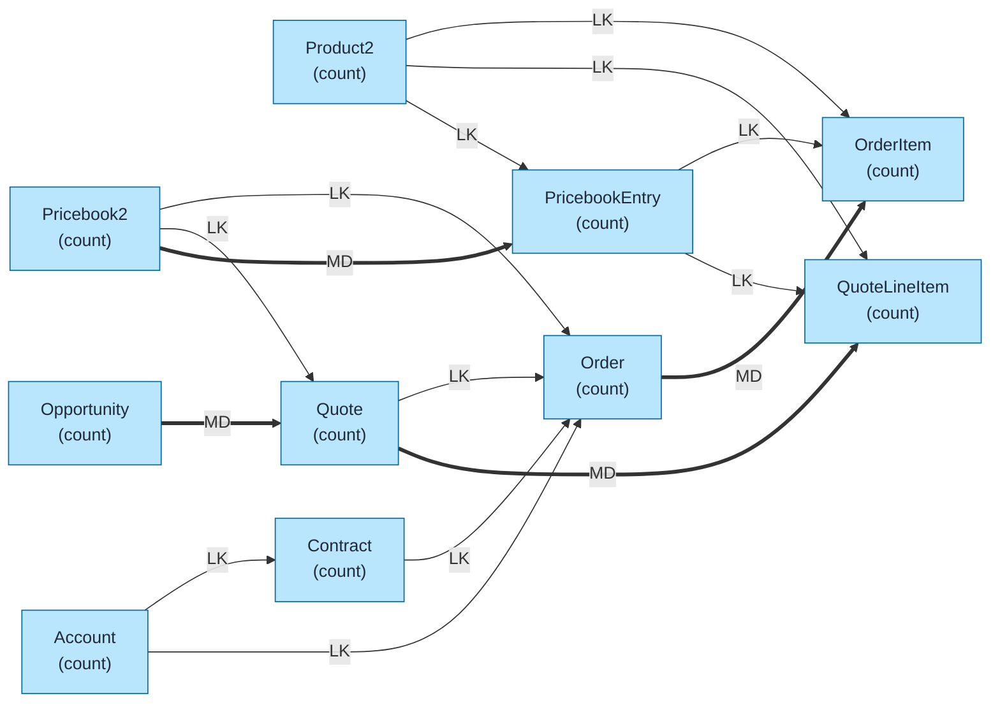
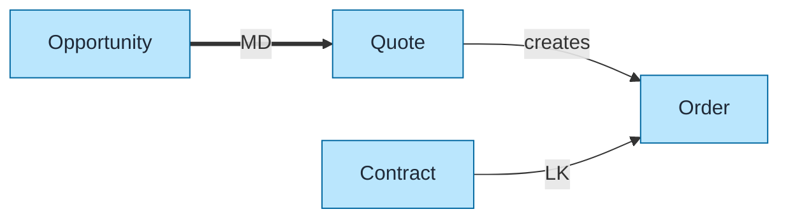
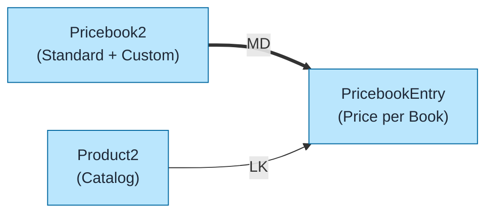
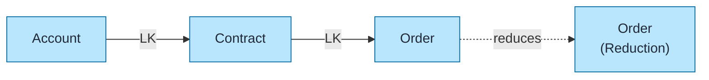

# Quote & Order Data Model Template

Pre-built data model for Salesforce Quotes and Orders using `flowchart LR` format with color coding and relationship indicators.

## Objects Included

| Object | Type | Description |
|--------|------|-------------|
| Opportunity | STD | Sales deals |
| Quote | STD | Price quotes |
| QuoteLineItem | STD | Quote products |
| Order | STD | Customer orders |
| OrderItem | STD | Order products |
| Product2 | STD | Product catalog |
| PricebookEntry | STD | Product prices |
| Pricebook2 | STD | Price lists |
| Contract | STD | Customer contracts |

---

## Query Org Metadata (Recommended)

Enrich diagram with live org data:

```bash
python3 ~/.claude/plugins/marketplaces/sf-skills/sf-diagram-mermaid/scripts/query-org-metadata.py \
    --objects Opportunity,Quote,QuoteLineItem,Order,OrderItem,Product2,Contract \
    --target-org myorg
```

---

## Mermaid Template (Preferred)

Left-to-right flowchart with color coding.



---

## Key Concepts

### Quote-to-Cash Flow
```
Opportunity → Quote → Order → Invoice → Payment
      ↓          ↓        ↓
    OLI        QLI   OrderItem
```

### Synced Quote
- One Quote per Opportunity can be marked as **Synced**
- Synced Quote copies line items to OpportunityLineItems
- `IsSyncing = true` on Synced Quote

### Quote to Order Conversion
| Action | Result |
|--------|--------|
| Create Order from Quote | Creates Order + OrderItems |
| Quote.OrderId | Links Quote to created Order |
| Reduction Orders | Negative quantity adjustments |

### Pricebook Structure
```
Pricebook2 (Standard + Custom)
    ↓
PricebookEntry (Product + Price per Pricebook)
    ↓
Product2 (Catalog)
```

---

## Simplified Version (Core Flow)

For presentations focusing on Quote-to-Order flow:



---

## Product Catalog Detail



---

## ASCII Fallback

```
┌─────────────────────────────────────────────────────────────────────────────┐
│  QUOTE & ORDER DATA MODEL (L→R)                                              │
│  Legend: LK = Lookup (-->), MD = Master-Detail (==>)                        │
└─────────────────────────────────────────────────────────────────────────────┘

                 PRODUCT CATALOG                           QUOTE FLOW
┌──────────────┐         ┌─────────────────┐         ┌──────────────┐
│  PRICEBOOK2  │═══ MD ═>│ PRICEBOOKENTRY  │         │ OPPORTUNITY  │
│   (count)    │         │    (count)      │         │   (count)    │
└──────────────┘         └────────┬────────┘         └──────┬───────┘
                                  │                         │ MD
                                  │ LK                      ▼
┌──────────────┐                  │                  ┌──────────────┐
│   PRODUCT2   │─────── LK ───────┤                  │    QUOTE     │
│   (count)    │                  │                  │   (count)    │
└──────────────┘                  │                  └──────┬───────┘
       │                          │                         │ MD
       │                          │                         ▼
       │                          │                  ┌──────────────┐
       └────────── LK ────────────┼─────────────────>│QUOTELINEITEM │
                                  └─────── LK ──────>│   (count)    │
                                                     └──────────────┘

                                 ORDER FLOW
┌──────────────┐         ┌──────────────┐         ┌──────────────┐
│   ACCOUNT    │── LK ──>│    ORDER     │═══ MD ═>│  ORDERITEM   │
│   (count)    │         │   (count)    │         │   (count)    │
└──────────────┘         └──────┬───────┘         └──────────────┘
                                │
┌──────────────┐                │
│   CONTRACT   │────── LK ──────┘
│   (count)    │
└──────────────┘
```

---

## Key Relationships Summary

| Parent | Child | Type | Behavior |
|--------|-------|------|----------|
| Opportunity | Quote | MD | Cascade delete |
| Quote | QuoteLineItem | MD | Cascade delete |
| Order | OrderItem | MD | Cascade delete |
| Pricebook2 | PricebookEntry | MD | Cascade delete |
| Product2 | PricebookEntry | LK | Product reference |
| PricebookEntry | QuoteLineItem | LK | Price reference |
| PricebookEntry | OrderItem | LK | Price reference |
| Account | Order | LK | Customer |
| Contract | Order | LK | Contract reference |
| Quote | Order | LK | Source quote |

---

## Limits & Considerations

| Limit | Value |
|-------|-------|
| Quotes per Opportunity | Unlimited (1 synced) |
| QuoteLineItems per Quote | 200 (configurable) |
| Orders per Account | Unlimited |
| OrderItems per Order | 200 (configurable) |
| Custom Pricebooks | Unlimited |
| Products | 5 million (LDV) |

---

## Contract-Based Orders

For orgs using Contracts with Orders:



---

## Best Practices

1. **Use `flowchart LR`** - Left-to-right flow for readability
2. **Keep objects simple** - Name + record count only
3. **Replace `(count)` placeholders** - With actual counts from query
4. **Add LDV indicator** - For objects >2M records: `LDV[~4M]`
5. **Color code object types** - Blue=Standard, Orange=Custom, Green=External
