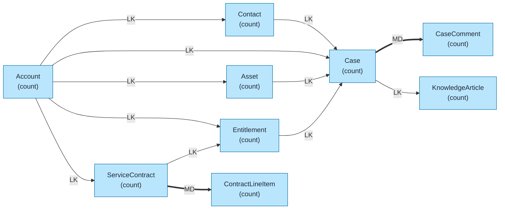
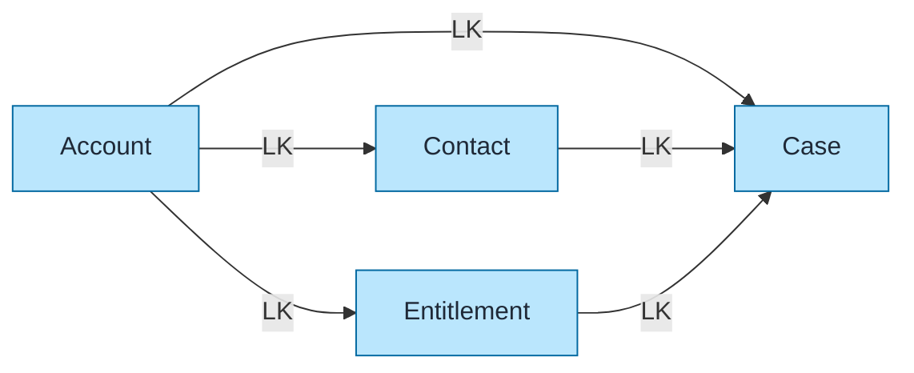
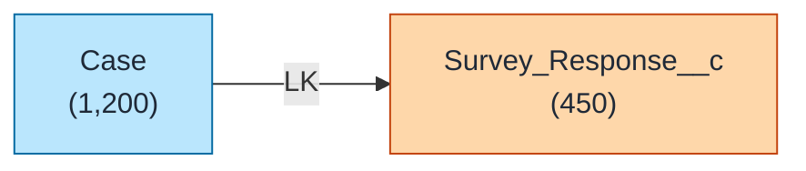

# Service Cloud Data Model Template

Pre-built data model for Salesforce Service Cloud using `flowchart LR` format with color coding and relationship indicators.

## Objects Included

| Object | Type | Description |
|--------|------|-------------|
| Account | STD | Customer accounts |
| Contact | STD | Customer contacts |
| Case | STD | Support cases/tickets |
| CaseComment | STD | Case comments |
| Entitlement | STD | Support entitlements |
| ServiceContract | STD | Service agreements |
| ContractLineItem | STD | Contract products |
| Asset | STD | Customer installed products |
| KnowledgeArticle | STD | Knowledge base articles |

---

## Query Org Metadata (Recommended)

Enrich diagram with live org data:

```bash
python3 ~/.claude/plugins/marketplaces/sf-skills/sf-diagram-mermaid/scripts/query-org-metadata.py \
    --objects Account,Contact,Case,Entitlement,ServiceContract,Asset \
    --target-org myorg
```

---

## Mermaid Template (Preferred)

Left-to-right flowchart with color coding.



---

## Simplified Version (Core Objects Only)

For presentations focusing on core service flow:



---

## ASCII Fallback

```
┌─────────────────────────────────────────────────────────────────────────────┐
│  SERVICE CLOUD DATA MODEL (L→R)                                             │
│  Legend: LK = Lookup (-->), MD = Master-Detail (==>)                        │
└─────────────────────────────────────────────────────────────────────────────┘

┌──────────┐          ┌──────────┐          ┌──────────────┐
│ ACCOUNT  │── LK ───>│ CONTACT  │── LK ───>│     CASE     │
│ (count)  │          │ (count)  │          │   (count)    │
└────┬─────┘          └──────────┘          └──────┬───────┘
     │                                             │
     │ LK                                          │ MD
     ▼                                             ▼
┌──────────────┐                           ┌──────────────┐
│    ASSET     │── LK ────────────────────>│ CASE_COMMENT │
│   (count)    │                           │   (count)    │
└──────────────┘                           └──────────────┘

┌──────────┐          ┌──────────────────┐          ┌───────────────────┐
│ ACCOUNT  │── LK ───>│ SERVICE_CONTRACT │═══ MD ══>│ CONTRACT_LINE_ITEM│
│          │          │     (count)      │          │      (count)      │
└────┬─────┘          └────────┬─────────┘          └───────────────────┘
     │                         │
     │ LK                      │ LK
     ▼                         ▼
┌──────────────┐        ┌──────────────┐
│ ENTITLEMENT  │◄───────│              │
│   (count)    │        └──────────────┘
└──────────────┘
```

---

## Key Relationships Summary

| Parent | Child | Type | Behavior |
|--------|-------|------|----------|
| Account | Contact | LK | Customer contacts |
| Account | Case | LK | Customer cases |
| Contact | Case | LK | Reporter/requestor |
| Case | CaseComment | MD | Cascade delete |
| Entitlement | Case | LK | SLA coverage |
| Account | Entitlement | LK | Customer entitlements |
| ServiceContract | Entitlement | LK | Contract includes entitlements |
| ServiceContract | ContractLineItem | MD | Cascade delete |
| Account | Asset | LK | Customer installed products |
| Asset | Case | LK | Asset-related cases |

---

## Service Cloud Patterns

### Case Flow
```
Customer → Contact → Case → CaseComment
              ↓
         Entitlement (SLA)
```

### Entitlement Coverage
```
Account → ServiceContract → Entitlement → Case
    └─────────────────────────────────────┘
                  (direct)
```

---

## Adding Custom Objects

Use orange styling for custom objects:



---

## Best Practices

1. **Use `flowchart LR`** - Left-to-right flow for readability
2. **Keep objects simple** - Name + record count only
3. **Replace `(count)` placeholders** - With actual counts from query
4. **Add LDV indicator** - For objects >2M records: `LDV[~4M]`
5. **Color code object types** - Blue=Standard, Orange=Custom, Green=External
