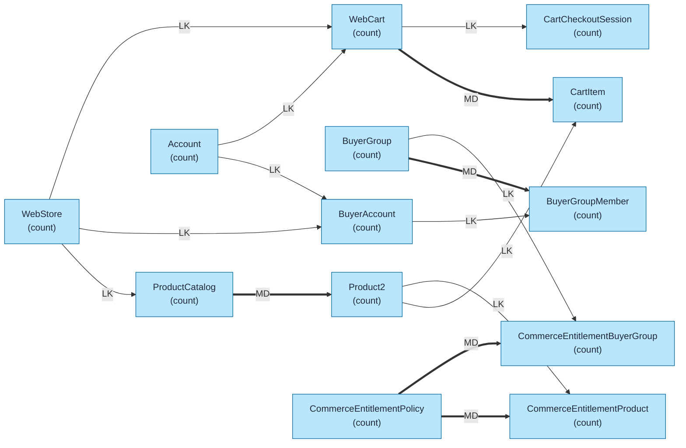
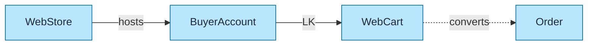
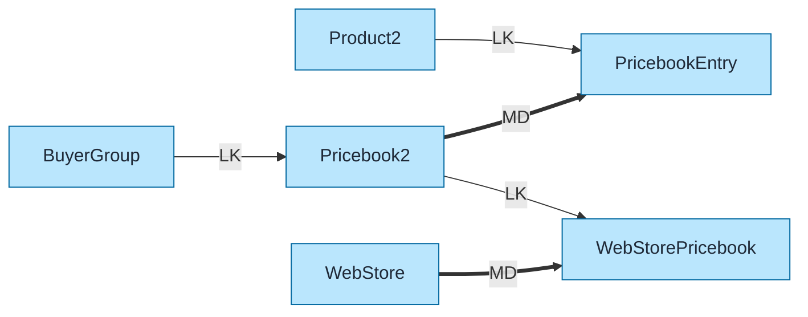
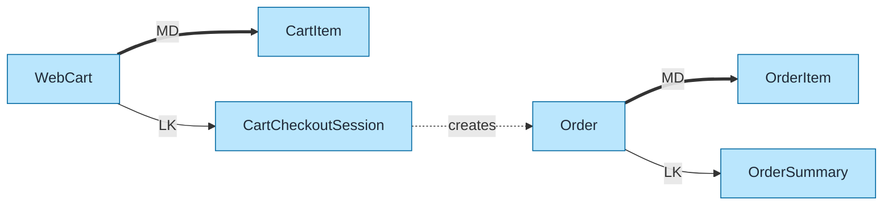

# B2B Commerce Data Model Template

Pre-built data model for Salesforce B2B Commerce using `flowchart LR` format with color coding and relationship indicators.

## Objects Included

| Object | Type | Description |
|--------|------|-------------|
| WebStore | STD | Online storefront |
| WebCart | STD | Shopping cart |
| CartItem | STD | Cart products |
| BuyerGroup | STD | Customer groups |
| BuyerAccount | STD | B2B customers |
| ProductCatalog | STD | Product catalog |
| CommerceEntitlementPolicy | STD | Access policies |
| CartCheckoutSession | STD | Checkout process |

---

## Query Org Metadata (Recommended)

Enrich diagram with live org data:

```bash
python3 ~/.claude/plugins/marketplaces/sf-skills/sf-diagram-mermaid/scripts/query-org-metadata.py \
    --objects WebStore,WebCart,CartItem,BuyerGroup,BuyerAccount \
    --target-org myorg
```

---

## Mermaid Template (Preferred)

Left-to-right flowchart with color coding.



---

## Key Concepts

### B2B Commerce Flow
```
WebStore → ProductCatalog → Product2
    ↓           ↓
BuyerAccount → WebCart → CartItem → Order
    ↓
BuyerGroup → Entitlements (What they can see/buy)
```

### Buyer vs Account
| Object | Purpose |
|--------|---------|
| Account | Standard CRM account |
| BuyerAccount | Commerce-enabled account |
| BuyerGroup | Pricing/entitlement grouping |

### Entitlement Model
```
CommerceEntitlementPolicy
    ├── CommerceEntitlementProduct (What products)
    └── CommerceEntitlementBuyerGroup (Who can see)
```

Controls which products each BuyerGroup can view and purchase.

### Cart States
| Status | Description |
|--------|-------------|
| Active | Current shopping cart |
| Checkout | In checkout process |
| Closed | Converted to Order |
| Abandoned | Inactive cart |

---

## Simplified Version (Core Objects Only)

For presentations focusing on core commerce flow:



---

## Pricing Model



---

## Cart to Order Conversion



---

## ASCII Fallback

```
┌─────────────────────────────────────────────────────────────────────────────┐
│  B2B COMMERCE DATA MODEL (L→R)                                               │
│  Legend: LK = Lookup (-->), MD = Master-Detail (==>)                        │
└─────────────────────────────────────────────────────────────────────────────┘

                           STORE & PRODUCTS
┌──────────────┐         ┌──────────────────┐         ┌──────────────┐
│   WEBSTORE   │── LK ──>│ PRODUCT_CATALOG  │═══ MD ═>│   PRODUCT2   │
│   (count)    │         │     (count)      │         │   (count)    │
└──────┬───────┘         └──────────────────┘         └──────────────┘
       │
       │                       BUYERS
       │
       │ LK              ┌──────────────────┐         ┌──────────────┐
       └────────────────>│  BUYER_ACCOUNT   │◄── LK ──│   ACCOUNT    │
                         │     (count)      │         │   (count)    │
                         └────────┬─────────┘         └──────────────┘
                                  │
                                  │ LK
                                  ▼
                         ┌──────────────────┐
                         │ BUYER_GROUP_     │◄══ MD ══┌──────────────┐
                         │ MEMBER (count)   │         │ BUYER_GROUP  │
                         └──────────────────┘         │   (count)    │
                                                      └──────────────┘

                               CART
┌──────────────┐         ┌──────────────────┐         ┌──────────────┐
│   WEBSTORE   │── LK ──>│     WEBCART      │═══ MD ═>│  CART_ITEM   │
│              │         │     (count)      │         │   (count)    │
└──────────────┘         └────────┬─────────┘         └──────────────┘
                                  │
                                  │ LK
                                  ▼
                         ┌──────────────────┐ converts ┌──────────────┐
                         │CART_CHECKOUT_    │·········>│    ORDER     │
                         │SESSION (count)   │          │   (count)    │
                         └──────────────────┘          └──────────────┘
```

---

## Key Relationships Summary

| Parent | Child | Type | Behavior |
|--------|-------|------|----------|
| WebStore | ProductCatalog | LK | Store products |
| WebStore | BuyerAccount | LK | Store customers |
| WebStore | WebCart | LK | Shopping carts |
| ProductCatalog | Product2 | MD | Catalog products |
| BuyerGroup | BuyerGroupMember | MD | Group members |
| Account | BuyerAccount | LK | Commerce enablement |
| WebCart | CartItem | MD | Cart products |
| WebCart | CartCheckoutSession | LK | Checkout |
| CommerceEntitlementPolicy | CommerceEntitlementProduct | MD | Product access |
| CommerceEntitlementPolicy | CommerceEntitlementBuyerGroup | MD | Group access |

---

## Limits & Considerations

| Limit | Value |
|-------|-------|
| Products per store | Unlimited (LDV) |
| Buyer accounts per store | Unlimited |
| Cart items per cart | 500 |
| Active carts per buyer | 1 |
| Price books per buyer group | Multiple |
| Entitlement policies | Unlimited |

---

## B2B vs B2C Commerce

| Feature | B2B Commerce | B2C Commerce |
|---------|--------------|--------------|
| Customer | Business (Account) | Consumer (Contact) |
| Pricing | Contract/negotiated | List price |
| Catalog | Entitlement-based | Public |
| Checkout | Quote/approval | Immediate |
| Platform | LWR/Aura | LWR/Headless |

---

## Best Practices

1. **Use `flowchart LR`** - Left-to-right flow for readability
2. **Keep objects simple** - Name + record count only
3. **Replace `(count)` placeholders** - With actual counts from query
4. **Add LDV indicator** - For objects >2M records: `LDV[~4M]`
5. **Color code object types** - Blue=Standard, Orange=Custom, Green=External
