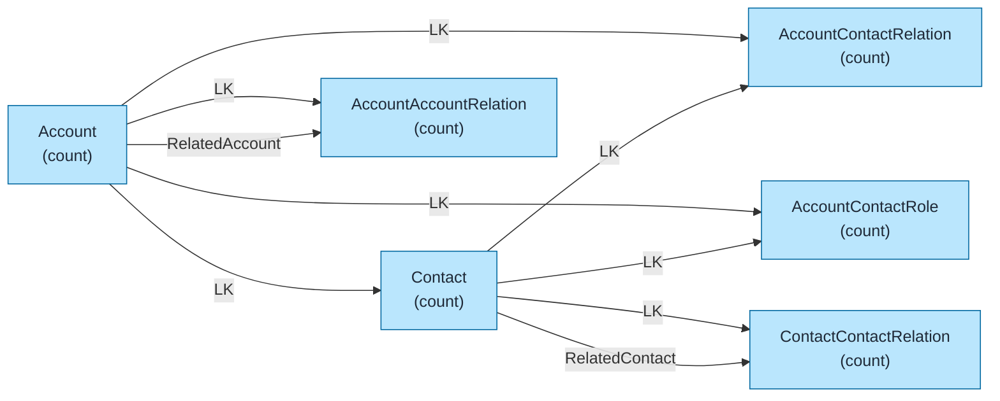
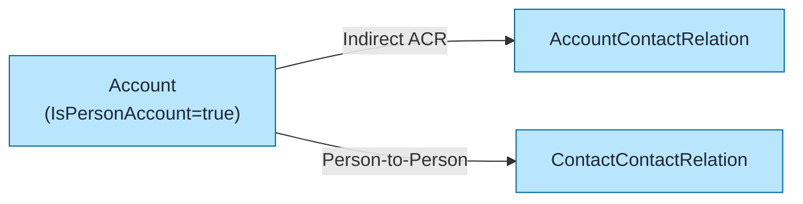
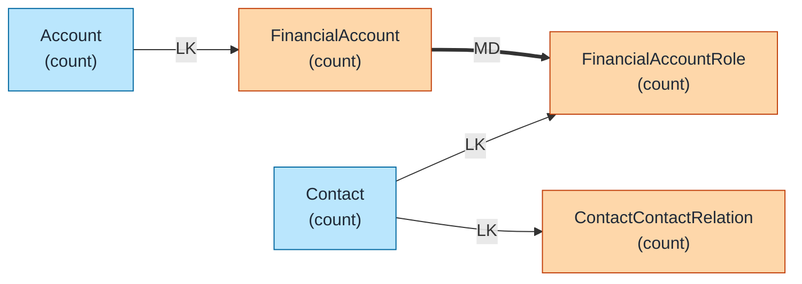

# Party Model (Industry Cloud) Data Model Template

Pre-built data model for Salesforce Party Model used in Industry Clouds (Financial Services Cloud, Health Cloud, etc.) using `flowchart LR` format with color coding.

## Objects Included

| Object | Type | Description |
|--------|------|-------------|
| Account | STD | Person or Business accounts |
| Contact | STD | Individual contacts |
| AccountContactRelation | STD | Account-Contact junction (ACR) |
| AccountContactRole | STD | Role-based relationship |
| ContactContactRelation | Managed | Contact-to-Contact relationships |
| AccountAccountRelation | Managed | Account-to-Account relationships |

---

## Query Org Metadata (Recommended)

Enrich diagram with live org data:

```bash
python3 ~/.claude/plugins/marketplaces/sf-skills/sf-diagram-mermaid/scripts/query-org-metadata.py \
    --objects Account,Contact,AccountContactRelation,AccountContactRole \
    --target-org myorg
```

---

## Mermaid Template (Preferred)

Left-to-right flowchart with color coding.



---

## Key Concepts

### Person Accounts vs Business Accounts
| Type | RecordType | IsPersonAccount |
|------|------------|-----------------|
| Business | Business_Account | false |
| Person | Person_Account | true |

Person Accounts merge Account + Contact into single record.

### AccountContactRelation (ACR)
- **Indirect relationship** between Account and Contact
- Enables **many-to-many** Account↔Contact
- Has `Roles` multi-select picklist
- `IsDirect` flag indicates primary relationship

### Industry Cloud Extensions
| Object | Cloud | Purpose |
|--------|-------|---------|
| ContactContactRelation | FSC, Health | Family/household relationships |
| AccountAccountRelation | FSC, Health | Business relationships |
| FinancialAccount | FSC | Financial accounts |
| HealthCloudGA__EhrPatient__c | Health | Patient records |

---

## Person Account Model

Shows Person Account relationships:



---

## Financial Services Cloud Extension



---

## ASCII Fallback

```
┌─────────────────────────────────────────────────────────────────────────────┐
│  PARTY MODEL (INDUSTRY CLOUD) DATA MODEL (L→R)                              │
│  Legend: LK = Lookup (-->), MD = Master-Detail (==>)                        │
└─────────────────────────────────────────────────────────────────────────────┘

┌──────────────┐                              ┌──────────────────────────┐
│   ACCOUNT    │──────────── LK ─────────────>│ ACCOUNT_CONTACT_RELATION │
│   (count)    │                              │        (count)           │
└──────┬───────┘                              └────────────┬─────────────┘
       │                                                   │
       │ LK                                                │ LK
       ▼                                                   │
┌──────────────┐                                          │
│   CONTACT    │<─────────────────────────────────────────┘
│   (count)    │
└──────┬───────┘
       │
       │ LK (both sides)
       ▼
┌──────────────────────────┐
│ CONTACT_CONTACT_RELATION │  (FSC/Health Cloud)
│        (count)           │
└──────────────────────────┘

┌──────────────┐                              ┌──────────────────────────┐
│   ACCOUNT    │──────────── LK ─────────────>│ ACCOUNT_ACCOUNT_RELATION │
│   (parent)   │                              │        (count)           │
└──────────────┘                              └──────────────────────────┘
       ▲                                                   │
       └───────────────── RelatedAccount ──────────────────┘
```

---

## Key Relationships Summary

| Parent | Child | Type | Behavior |
|--------|-------|------|----------|
| Account | Contact | LK | Primary account |
| Account | AccountContactRelation | LK | Indirect relationships |
| Contact | AccountContactRelation | LK | Indirect relationships |
| Account | AccountContactRole | LK | Opportunity roles |
| Contact | AccountContactRole | LK | Opportunity roles |
| Contact | ContactContactRelation | LK | Person-to-person |
| Account | AccountAccountRelation | LK | Business-to-business |

---

## Limits & Considerations

| Limit | Value |
|-------|-------|
| ACR per Account | No hard limit |
| ACR per Contact | No hard limit |
| Roles per ACR | Multi-select (limited by picklist size) |
| Person Account fields | Merged Account + Contact fields |

---

## Industry Cloud Packages

| Cloud | Key Objects |
|-------|-------------|
| **Financial Services** | FinancialAccount, FinancialAccountRole, Securities, Holdings |
| **Health Cloud** | CarePlan, CareProgram, EhrPatient, Medication |
| **Manufacturing** | SalesAgreement, RebateProgram, VisitPlan |
| **Consumer Goods** | RetailStore, StoreProduct, Promotion |

---

## Best Practices

1. **Use `flowchart LR`** - Left-to-right flow for readability
2. **Keep objects simple** - Name + record count only
3. **Replace `(count)` placeholders** - With actual counts from query
4. **Add LDV indicator** - For objects >2M records: `LDV[~4M]`
5. **Color code object types** - Blue=Standard, Orange=Custom/Managed, Green=External
