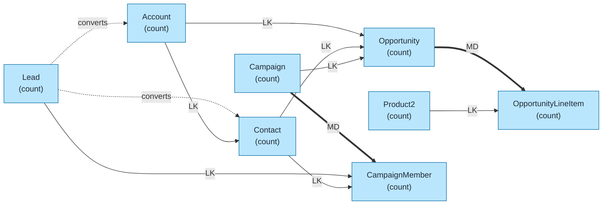
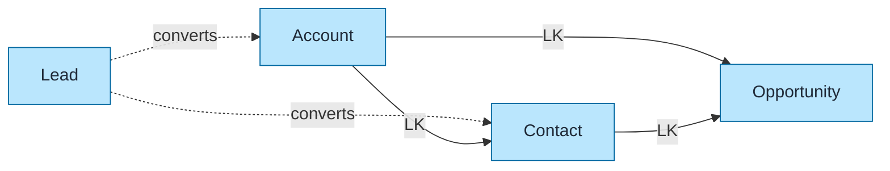
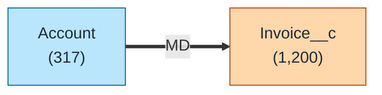

# Sales Cloud Data Model Template

Pre-built data model for Salesforce Sales Cloud using `flowchart LR` format with color coding and relationship indicators.

## Objects Included

| Object | Type | Description |
|--------|------|-------------|
| Account | STD | Companies and organizations |
| Contact | STD | People associated with accounts |
| Lead | STD | Potential customers |
| Opportunity | STD | Sales deals and revenue |
| OpportunityLineItem | STD | Products on opportunities |
| Product2 | STD | Product catalog |
| Campaign | STD | Marketing campaigns |
| CampaignMember | STD | Campaign responses |

---

## Query Org Metadata (Recommended)

Enrich diagram with live org data:

```bash
python3 ~/.claude/plugins/marketplaces/sf-skills/sf-diagram-mermaid/scripts/query-org-metadata.py \
    --objects Account,Contact,Lead,Opportunity,Product2,Campaign \
    --target-org myorg
```

---

## Mermaid Template (Preferred)

Left-to-right flowchart with color coding.



---

## Simplified Version (Core Objects Only)

For presentations focusing on core sales flow:



---

## ASCII Fallback

```
┌─────────────────────────────────────────────────────────────────────────────┐
│  SALES CLOUD DATA MODEL (L→R)                                               │
│  Legend: LK = Lookup (-->), MD = Master-Detail (==>), -.-> = converts       │
└─────────────────────────────────────────────────────────────────────────────┘

┌──────────┐          ┌──────────┐          ┌──────────────┐
│   LEAD   │··········│ ACCOUNT  │── LK ───>│   CONTACT    │
│ (count)  │ converts │ (count)  │          │   (count)    │
└────┬─────┘          └────┬─────┘          └──────┬───────┘
     │                     │                       │
     │ converts            │ LK                    │ LK
     │                     ▼                       ▼
     │                ┌──────────────┐       ┌─────────────────┐
     └───────────────>│ OPPORTUNITY  │<──────│  (via OCR)      │
                      │   (count)    │       └─────────────────┘
                      └──────┬───────┘
                             │ MD
                             ▼
                      ┌──────────────────────┐
                      │ OPPORTUNITY_LINE_ITEM│◄── LK ──┌───────────┐
                      │      (count)         │         │ PRODUCT2  │
                      └──────────────────────┘         │  (count)  │
                                                       └───────────┘

┌──────────┐          ┌─────────────────┐
│ CAMPAIGN │═══ MD ══>│ CAMPAIGN_MEMBER │
│ (count)  │          │    (count)      │
└──────────┘          └─────────────────┘
```

---

## Key Relationships Summary

| Parent | Child | Type | Behavior |
|--------|-------|------|----------|
| Account | Contact | LK | Optional parent |
| Account | Opportunity | LK | Optional parent |
| Opportunity | OpportunityLineItem | MD | Cascade delete |
| Product2 | OpportunityLineItem | LK | Optional parent |
| Campaign | CampaignMember | MD | Cascade delete |
| Campaign | Opportunity | LK | Primary campaign source |
| Lead | (converts to) | - | Account + Contact created |

---

## Adding Custom Objects

Use orange styling for custom objects:



---

## Best Practices

1. **Use `flowchart LR`** - Left-to-right flow for readability
2. **Keep objects simple** - Name + record count only
3. **Replace `(count)` placeholders** - With actual counts from query
4. **Add LDV indicator** - For objects >2M records: `LDV[~4M]`
5. **Color code object types** - Blue=Standard, Orange=Custom, Green=External
