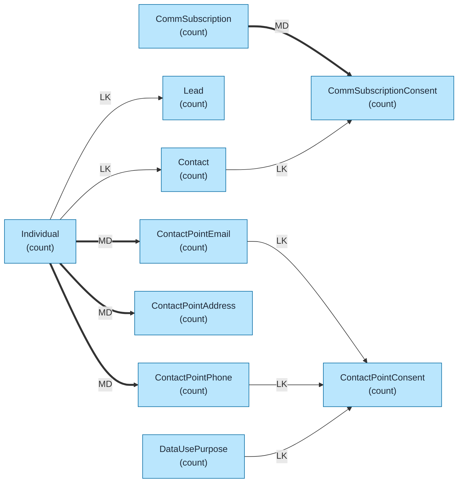
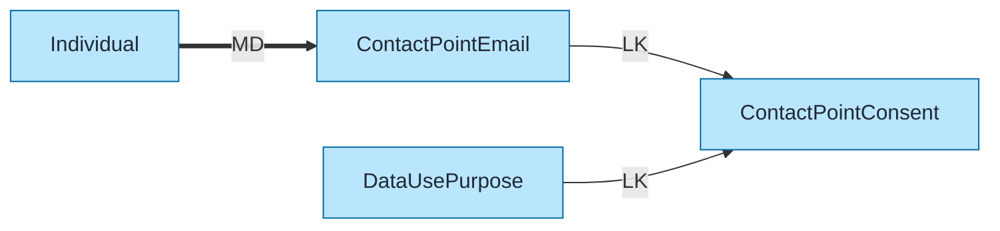
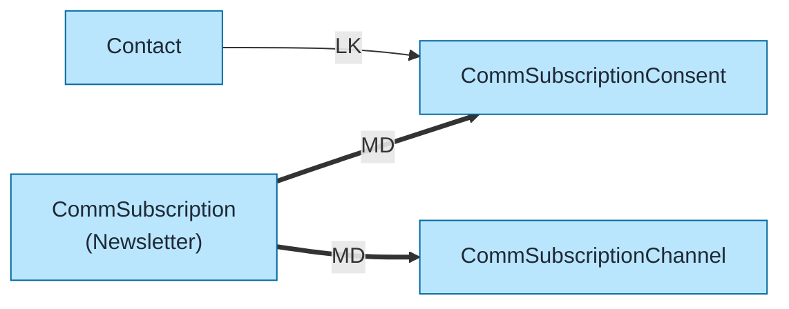

# Consent Data Model Template

Pre-built data model for Salesforce Consent Management (GDPR/Privacy) using `flowchart LR` format with color coding and relationship indicators.

## Objects Included

| Object | Type | Description |
|--------|------|-------------|
| Individual | STD | Privacy identity |
| Contact | STD | Contact record |
| Lead | STD | Lead record |
| ContactPointEmail | STD | Email contact points |
| ContactPointPhone | STD | Phone contact points |
| ContactPointAddress | STD | Address contact points |
| DataUsePurpose | STD | Purpose definitions |
| ContactPointConsent | STD | Consent per contact point |
| CommSubscription | STD | Communication subscriptions |
| CommSubscriptionConsent | STD | Subscription consent |

---

## Query Org Metadata (Recommended)

Enrich diagram with live org data:

```bash
python3 ~/.claude/plugins/marketplaces/sf-skills/sf-diagram-mermaid/scripts/query-org-metadata.py \
    --objects Individual,ContactPointEmail,ContactPointPhone,DataUsePurpose,ContactPointConsent \
    --target-org myorg
```

---

## Mermaid Template (Preferred)

Left-to-right flowchart with color coding.



---

## Key Concepts

### Individual Object
- **Privacy identity** that links to Contact/Lead/User
- Required for consent tracking
- Can be auto-created when Contact/Lead created
- Stores global privacy preferences

### Contact Points
| Object | Purpose |
|--------|---------|
| ContactPointEmail | Email addresses |
| ContactPointPhone | Phone numbers |
| ContactPointAddress | Physical addresses |
| ContactPointSocialHandle | Social media IDs |

Each contact point links to an Individual.

### Consent Model
```
DataUsePurpose  →  ContactPointConsent  ←  ContactPoint
(e.g., Marketing)        (Opt-In/Out)        (Email/Phone)
```

### Consent Values
| Value | Meaning |
|-------|---------|
| **OptIn** | Consent given |
| **OptOut** | Consent withdrawn |
| **Seen** | Notice displayed |
| **NotSeen** | Notice not yet shown |

---

## Simplified Version (Core Objects Only)

For presentations focusing on core consent flow:



---

## Communication Subscriptions Model

For email preference centers:



---

## ASCII Fallback

```
┌─────────────────────────────────────────────────────────────────────────────┐
│  CONSENT DATA MODEL (GDPR/PRIVACY) (L→R)                                     │
│  Legend: LK = Lookup (-->), MD = Master-Detail (==>)                        │
└─────────────────────────────────────────────────────────────────────────────┘

┌──────────────┐
│  INDIVIDUAL  │─────── LK ──────┬──────────────────────────────────┐
│   (count)    │                 │                                  │
└──────┬───────┘                 ▼                                  ▼
       │                  ┌──────────────┐              ┌──────────────┐
       │                  │   CONTACT    │              │     LEAD     │
       │                  │   (count)    │              │   (count)    │
       │                  └──────────────┘              └──────────────┘
       │
       ├═══ MD ═══>┌────────────────────┐
       │           │ CONTACT_POINT_EMAIL│─── LK ──>┌────────────────────┐
       │           │      (count)       │          │CONTACT_POINT_      │
       │           └────────────────────┘          │    CONSENT         │
       │                                           │    (count)         │
       ├═══ MD ═══>┌────────────────────┐          └─────────┬──────────┘
       │           │ CONTACT_POINT_PHONE│─── LK ───────────>│
       │           │      (count)       │                   │
       │           └────────────────────┘                   │
       │                                                    │ LK
       └═══ MD ═══>┌────────────────────┐                   │
                   │CONTACT_POINT_ADDR  │          ┌────────┴───────────┐
                   │      (count)       │          │  DATA_USE_PURPOSE  │
                   └────────────────────┘          │     (count)        │
                                                   └────────────────────┘
```

---

## Key Relationships Summary

| Parent | Child | Type | Behavior |
|--------|-------|------|----------|
| Individual | Contact | LK | Privacy identity |
| Individual | Lead | LK | Privacy identity |
| Individual | ContactPointEmail | MD | Cascade delete |
| Individual | ContactPointPhone | MD | Cascade delete |
| Individual | ContactPointAddress | MD | Cascade delete |
| ContactPointEmail | ContactPointConsent | LK | Email consent |
| ContactPointPhone | ContactPointConsent | LK | Phone consent |
| DataUsePurpose | ContactPointConsent | LK | Purpose reference |
| CommSubscription | CommSubscriptionConsent | MD | Cascade delete |
| Contact | CommSubscriptionConsent | LK | Subscriber |

---

## GDPR Compliance Considerations

| Right | Implementation |
|-------|----------------|
| **Right to Access** | Query Individual + Contact Points |
| **Right to Rectification** | Update Contact Points |
| **Right to Erasure** | Delete Individual (cascades) |
| **Right to Restrict** | Set ConsentCaptureSource |
| **Right to Object** | ContactPointConsent = OptOut |

---

## Limits & Considerations

| Limit | Value |
|-------|-------|
| Contact Points per Individual | Unlimited |
| Data Use Purposes | Unlimited |
| Consent records | LDV consideration |
| Audit trail retention | Configurable |

---

## Best Practices

1. **Use `flowchart LR`** - Left-to-right flow for readability
2. **Keep objects simple** - Name + record count only
3. **Replace `(count)` placeholders** - With actual counts from query
4. **Add LDV indicator** - For objects >2M records: `LDV[~4M]`
5. **Color code object types** - Blue=Standard, Orange=Custom, Green=External
