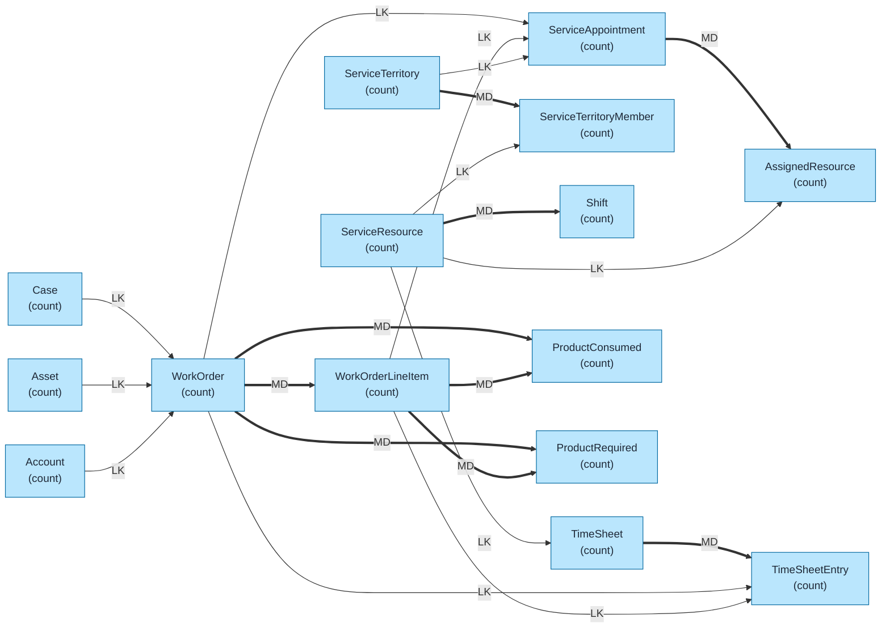
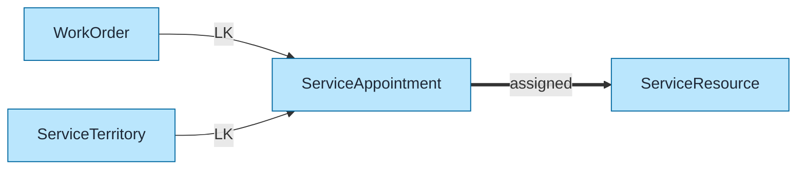
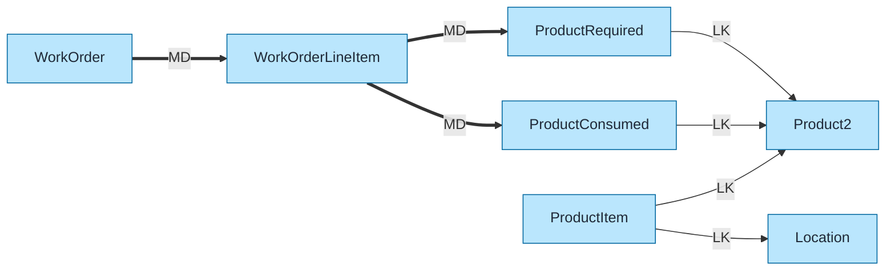
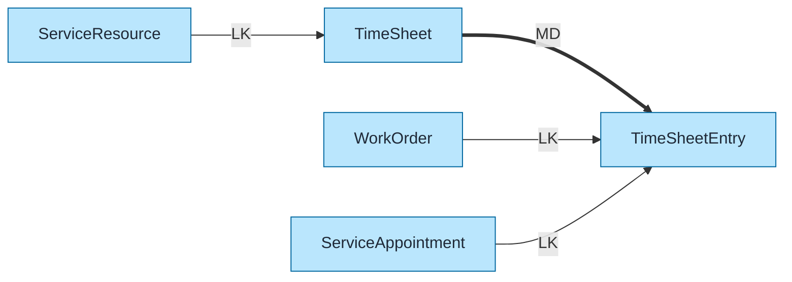

# Field Service Lightning (FSL) Data Model Template

Pre-built data model for Salesforce Field Service (formerly Field Service Lightning) using `flowchart LR` format with color coding and relationship indicators.

## Objects Included

| Object | Type | Description |
|--------|------|-------------|
| WorkOrder | STD | Service jobs |
| WorkOrderLineItem | STD | Job tasks |
| ServiceAppointment | STD | Scheduled visits |
| ServiceResource | STD | Technicians/assets |
| ServiceTerritory | STD | Service areas |
| AssignedResource | STD | Appointment assignments |
| Shift | STD | Resource schedules |
| TimeSheet | STD | Time tracking |
| TimeSheetEntry | STD | Time details |
| ProductConsumed | STD | Parts used |
| ProductRequired | STD | Parts needed |

---

## Query Org Metadata (Recommended)

Enrich diagram with live org data:

```bash
python3 ~/.claude/plugins/marketplaces/sf-skills/sf-diagram-mermaid/scripts/query-org-metadata.py \
    --objects WorkOrder,WorkOrderLineItem,ServiceAppointment,ServiceResource,ServiceTerritory \
    --target-org myorg
```

---

## Mermaid Template (Preferred)

Left-to-right flowchart with color coding.



---

## Key Concepts

### FSL Object Hierarchy
```
Case/Asset → WorkOrder → WorkOrderLineItem → ServiceAppointment
                   ↓              ↓                    ↓
              ProductRequired  ProductConsumed   AssignedResource
                                                        ↓
                                                 ServiceResource
```

### Work Order vs Service Appointment
| Object | Purpose |
|--------|---------|
| WorkOrder | What needs to be done (job definition) |
| ServiceAppointment | When/where it will be done (scheduling) |

One WorkOrder can have multiple ServiceAppointments (multi-day jobs).

### Resource Types
| Type | Description |
|------|-------------|
| Technician | Field worker (User-based) |
| Crew | Group of technicians |
| Dispatcher | Scheduling coordinator |
| Tool | Equipment (Asset-based) |
| Contractor | External resource |

### Scheduling Policies
| Policy | Purpose |
|--------|---------|
| Customer First | Minimize customer wait |
| High Intensity | Maximize utilization |
| Soft Boundaries | Flexible territories |
| Emergency | Override normal rules |

---

## Simplified Version (Core Objects Only)

For presentations focusing on core FSL flow:



---

## Inventory/Parts Model



---

## Time Tracking Model



---

## ASCII Fallback

```
┌─────────────────────────────────────────────────────────────────────────────┐
│  FIELD SERVICE LIGHTNING DATA MODEL (L→R)                                    │
│  Legend: LK = Lookup (-->), MD = Master-Detail (==>)                        │
└─────────────────────────────────────────────────────────────────────────────┘

                           WORK ORDER STRUCTURE
┌──────────────┐         ┌──────────────────┐         ┌──────────────────┐
│     CASE     │── LK ──>│    WORK_ORDER    │═══ MD ═>│ WORK_ORDER_LINE  │
│   (count)    │         │     (count)      │         │  ITEM (count)    │
└──────────────┘         └────────┬─────────┘         └────────┬─────────┘
                                  │                            │
┌──────────────┐                  │ LK                         │ LK
│    ASSET     │── LK ────────────┤                            │
│   (count)    │                  ▼                            ▼
└──────────────┘         ┌──────────────────┐         ┌──────────────────┐
                         │SERVICE_APPOINTMENT│◄────────│                  │
                         │     (count)      │         └──────────────────┘
                         └────────┬─────────┘
                                  │ MD
                                  ▼
                         ┌──────────────────┐         ┌──────────────────┐
                         │ASSIGNED_RESOURCE │── LK ──>│ SERVICE_RESOURCE │
                         │     (count)      │         │     (count)      │
                         └──────────────────┘         └────────┬─────────┘
                                                               │ MD
                                                               ▼
                                                      ┌──────────────────┐
                                                      │      SHIFT       │
                                                      │     (count)      │
                                                      └──────────────────┘
```

---

## Key Relationships Summary

| Parent | Child | Type | Behavior |
|--------|-------|------|----------|
| WorkOrder | WorkOrderLineItem | MD | Cascade delete |
| WorkOrder | ServiceAppointment | LK | Scheduling |
| ServiceAppointment | AssignedResource | MD | Cascade delete |
| ServiceResource | AssignedResource | LK | Resource reference |
| ServiceTerritory | ServiceTerritoryMember | MD | Cascade delete |
| ServiceResource | Shift | MD | Cascade delete |
| ServiceResource | TimeSheet | LK | Time owner |
| TimeSheet | TimeSheetEntry | MD | Cascade delete |
| WorkOrder | ProductConsumed | MD | Parts used |
| WorkOrder | ProductRequired | MD | Parts needed |
| Case | WorkOrder | LK | Source case |
| Asset | WorkOrder | LK | Serviced asset |

---

## Limits & Considerations

| Limit | Value |
|-------|-------|
| Work Order Line Items per WO | 200 (default) |
| Appointments per Work Order | Unlimited |
| Resources per Territory | Unlimited |
| Optimization batch size | 50 appointments |
| Shift duration | Max 24 hours |
| Service History retention | Configurable |

---

## FSL Managed Package Objects

| Object | Purpose |
|--------|---------|
| FSL__Scheduling_Policy__c | Optimization rules |
| FSL__Service_Goal__c | SLA definitions |
| FSL__Resource_Preference__c | Customer preferences |
| FSL__Time_Dependency__c | Appointment sequences |

---

## Best Practices

1. **Use `flowchart LR`** - Left-to-right flow for readability
2. **Keep objects simple** - Name + record count only
3. **Replace `(count)` placeholders** - With actual counts from query
4. **Add LDV indicator** - For objects >2M records: `LDV[~4M]`
5. **Color code object types** - Blue=Standard, Orange=Custom/Managed, Green=External
