# Agentforce Flow Diagram Template

Flowchart template for visualizing Agentforce agent architecture and conversation flows.

## When to Use
- Documenting Agentforce agent structure
- Planning agent topics and actions
- Visualizing conversation flows
- Architecture reviews

## Mermaid Template - Agent Structure

```mermaid
%%{init: {"flowchart": {"nodeSpacing": 80, "rankSpacing": 70}} }%%
flowchart TB
    subgraph agent["🤖 SERVICE AGENT"]
        direction TB

        DESC[/"Agent Description:<br/>AI-powered customer service<br/>assistant for order management"/]

        subgraph topics["📋 TOPICS"]
            direction LR
            T1[Order Status]
            T2[Return Request]
            T3[Product Info]
            T4[Escalation]
        end

        subgraph instructions["📝 INSTRUCTIONS"]
            I1[Greet professionally]
            I2[Verify customer identity]
            I3[Use knowledge base first]
            I4[Escalate if frustrated]
        end
    end

    subgraph topic_order["📦 TOPIC: ORDER STATUS"]
        direction TB
        TO_DESC[/"Help customers check<br/>order and shipping status"/]
        TO_SCOPE[Scope: Order tracking,<br/>delivery estimates]

        subgraph to_actions["ACTIONS"]
            TO_A1[Get Order Details<br/>⚡ Apex]
            TO_A2[Check Shipping<br/>🔄 Flow]
        end
    end

    subgraph topic_return["🔄 TOPIC: RETURN REQUEST"]
        direction TB
        TR_DESC[/"Process return and<br/>refund requests"/]
        TR_SCOPE[Scope: Returns, refunds,<br/>exchanges]

        subgraph tr_actions["ACTIONS"]
            TR_A1[Create Case<br/>🔄 Flow]
            TR_A2[Generate Label<br/>⚡ Apex]
            TR_A3[Process Refund<br/>⚡ Apex]
        end
    end

    %% Connections
    T1 --> topic_order
    T2 --> topic_return

    TO_A1 --> ORDER_SVC[Order Service]
    TO_A2 --> SHIP_API[Shipping API]

    TR_A1 --> CASE_OBJ[(Case Object)]
    TR_A2 --> SHIP_API
    TR_A3 --> PAY_API[Payment API]

    %% Node Styling - Topics (violet-200)
    style T1 fill:#ddd6fe,stroke:#6d28d9,color:#1f2937
    style T2 fill:#ddd6fe,stroke:#6d28d9,color:#1f2937
    style T3 fill:#ddd6fe,stroke:#6d28d9,color:#1f2937
    style T4 fill:#ddd6fe,stroke:#6d28d9,color:#1f2937

    %% Node Styling - Actions (emerald-200)
    style TO_A1 fill:#a7f3d0,stroke:#047857,color:#1f2937
    style TO_A2 fill:#a7f3d0,stroke:#047857,color:#1f2937
    style TR_A1 fill:#a7f3d0,stroke:#047857,color:#1f2937
    style TR_A2 fill:#a7f3d0,stroke:#047857,color:#1f2937
    style TR_A3 fill:#a7f3d0,stroke:#047857,color:#1f2937

    %% Node Styling - External (orange-200)
    style ORDER_SVC fill:#fed7aa,stroke:#c2410c,color:#1f2937
    style SHIP_API fill:#fed7aa,stroke:#c2410c,color:#1f2937
    style PAY_API fill:#fed7aa,stroke:#c2410c,color:#1f2937
    style CASE_OBJ fill:#fde68a,stroke:#b45309,color:#1f2937

    %% Node Styling - Descriptions (slate-200)
    style DESC fill:#e2e8f0,stroke:#334155,color:#1f2937
    style TO_DESC fill:#e2e8f0,stroke:#334155,color:#1f2937
    style TO_SCOPE fill:#e2e8f0,stroke:#334155,color:#1f2937
    style TR_DESC fill:#e2e8f0,stroke:#334155,color:#1f2937
    style TR_SCOPE fill:#e2e8f0,stroke:#334155,color:#1f2937
    style I1 fill:#e2e8f0,stroke:#334155,color:#1f2937
    style I2 fill:#e2e8f0,stroke:#334155,color:#1f2937
    style I3 fill:#e2e8f0,stroke:#334155,color:#1f2937
    style I4 fill:#e2e8f0,stroke:#334155,color:#1f2937

    %% Subgraph Styling - 50-level fills with dashed borders
    style agent fill:#fdf2f8,stroke:#be185d,stroke-dasharray:5
    style topics fill:#f5f3ff,stroke:#6d28d9,stroke-dasharray:5
    style instructions fill:#f8fafc,stroke:#334155,stroke-dasharray:5
    style topic_order fill:#f5f3ff,stroke:#6d28d9,stroke-dasharray:5
    style to_actions fill:#ecfdf5,stroke:#047857,stroke-dasharray:5
    style topic_return fill:#f5f3ff,stroke:#6d28d9,stroke-dasharray:5
    style tr_actions fill:#ecfdf5,stroke:#047857,stroke-dasharray:5
```



## Mermaid Template - Conversation Flow

```mermaid
%%{init: {"flowchart": {"nodeSpacing": 80, "rankSpacing": 70}} }%%
flowchart TD
    START([🟢 Conversation Start])

    START --> GREET[Greet Customer]
    GREET --> CLASSIFY{Classify Intent}

    CLASSIFY -->|Order Related| ORDER_TOPIC
    CLASSIFY -->|Return Related| RETURN_TOPIC
    CLASSIFY -->|General Question| KB_SEARCH
    CLASSIFY -->|Unknown| CLARIFY

    subgraph ORDER_TOPIC["📦 ORDER STATUS TOPIC"]
        ORD_1[Ask for Order Number]
        ORD_2[Retrieve Order Details<br/>⚡ GetOrderDetails Action]
        ORD_3{Order Found?}
        ORD_4[Display Status]
        ORD_5[Offer Additional Help]

        ORD_1 --> ORD_2 --> ORD_3
        ORD_3 -->|Yes| ORD_4 --> ORD_5
        ORD_3 -->|No| ORD_1
    end

    subgraph RETURN_TOPIC["🔄 RETURN REQUEST TOPIC"]
        RET_1[Verify Order Eligible]
        RET_2{Eligible for Return?}
        RET_3[Create Return Case<br/>🔄 CreateReturnCase Action]
        RET_4[Generate Return Label<br/>⚡ GenerateLabel Action]
        RET_5[Provide Instructions]
        RET_6[Explain Policy]

        RET_1 --> RET_2
        RET_2 -->|Yes| RET_3 --> RET_4 --> RET_5
        RET_2 -->|No| RET_6
    end

    KB_SEARCH[Search Knowledge Base<br/>📚 Knowledge Action]
    KB_SEARCH --> KB_RESULT{Found Answer?}
    KB_RESULT -->|Yes| PROVIDE_ANSWER[Provide Answer]
    KB_RESULT -->|No| ESCALATE

    CLARIFY[Ask Clarifying Question]
    CLARIFY --> CLASSIFY

    ESCALATE[Escalate to Human<br/>👤 Transfer Action]

    ORD_5 --> SATISFIED{Customer Satisfied?}
    RET_5 --> SATISFIED
    PROVIDE_ANSWER --> SATISFIED

    SATISFIED -->|Yes| END_SUCCESS([🟢 End - Resolved])
    SATISFIED -->|No| ESCALATE

    ESCALATE --> END_TRANSFER([🟡 End - Transferred])

    %% Node Styling - Start/End (emerald-200)
    style START fill:#a7f3d0,stroke:#047857,color:#1f2937
    style END_SUCCESS fill:#a7f3d0,stroke:#047857,color:#1f2937
    style END_TRANSFER fill:#fde68a,stroke:#b45309,color:#1f2937

    %% Node Styling - Decisions (violet-200)
    style CLASSIFY fill:#ddd6fe,stroke:#6d28d9,color:#1f2937
    style ORD_3 fill:#ddd6fe,stroke:#6d28d9,color:#1f2937
    style RET_2 fill:#ddd6fe,stroke:#6d28d9,color:#1f2937
    style KB_RESULT fill:#ddd6fe,stroke:#6d28d9,color:#1f2937
    style SATISFIED fill:#ddd6fe,stroke:#6d28d9,color:#1f2937

    %% Node Styling - Actions (cyan-200)
    style GREET fill:#a5f3fc,stroke:#0e7490,color:#1f2937
    style ORD_1 fill:#a5f3fc,stroke:#0e7490,color:#1f2937
    style ORD_2 fill:#a5f3fc,stroke:#0e7490,color:#1f2937
    style ORD_4 fill:#a5f3fc,stroke:#0e7490,color:#1f2937
    style ORD_5 fill:#a5f3fc,stroke:#0e7490,color:#1f2937
    style RET_1 fill:#a5f3fc,stroke:#0e7490,color:#1f2937
    style RET_3 fill:#a5f3fc,stroke:#0e7490,color:#1f2937
    style RET_4 fill:#a5f3fc,stroke:#0e7490,color:#1f2937
    style RET_5 fill:#a5f3fc,stroke:#0e7490,color:#1f2937
    style RET_6 fill:#a5f3fc,stroke:#0e7490,color:#1f2937
    style KB_SEARCH fill:#a5f3fc,stroke:#0e7490,color:#1f2937
    style PROVIDE_ANSWER fill:#a5f3fc,stroke:#0e7490,color:#1f2937
    style CLARIFY fill:#a5f3fc,stroke:#0e7490,color:#1f2937
    style ESCALATE fill:#fed7aa,stroke:#c2410c,color:#1f2937

    %% Subgraph Styling - 50-level fills with dashed borders
    style ORDER_TOPIC fill:#f5f3ff,stroke:#6d28d9,stroke-dasharray:5
    style RETURN_TOPIC fill:#f5f3ff,stroke:#6d28d9,stroke-dasharray:5
```



## ASCII Fallback Template

```
┌─────────────────────────────────────────────────────────────────────────────┐
│                        🤖 SERVICE AGENT STRUCTURE                           │
└─────────────────────────────────────────────────────────────────────────────┘

┌─────────────────────────────────────────────────────────────────────────────┐
│  AGENT: Customer Service Bot                                                │
│  ─────────────────────────────                                              │
│  Description: AI-powered assistant for order and return inquiries           │
│                                                                             │
│  Instructions:                                                              │
│  • Greet customers professionally                                           │
│  • Verify identity before sharing order details                             │
│  • Search knowledge base before escalating                                  │
│  • Escalate if customer expresses frustration                               │
└─────────────────────────────────────────────────────────────────────────────┘
          │
          │
          ▼
┌─────────────────────────────────────────────────────────────────────────────┐
│  📋 TOPICS                                                                  │
│  ┌───────────────────┐  ┌───────────────────┐  ┌───────────────────┐       │
│  │  📦 Order Status  │  │ 🔄 Return Request │  │  ❓ General Help  │       │
│  │                   │  │                   │  │                   │       │
│  │  Scope:           │  │  Scope:           │  │  Scope:           │       │
│  │  - Track orders   │  │  - Process return │  │  - FAQ answers    │       │
│  │  - Delivery ETA   │  │  - Generate label │  │  - Knowledge base │       │
│  │  - Order history  │  │  - Refund status  │  │  - Escalation     │       │
│  └─────────┬─────────┘  └─────────┬─────────┘  └─────────┬─────────┘       │
└────────────│──────────────────────│──────────────────────│──────────────────┘
             │                      │                      │
             ▼                      ▼                      ▼
┌─────────────────────────────────────────────────────────────────────────────┐
│  ⚡ ACTIONS                                                                 │
│  ┌───────────────────┐  ┌───────────────────┐  ┌───────────────────┐       │
│  │ GetOrderDetails   │  │ CreateReturnCase  │  │ SearchKnowledge   │       │
│  │ [Apex Invocable]  │  │ [Flow]            │  │ [Standard Action] │       │
│  ├───────────────────┤  ├───────────────────┤  ├───────────────────┤       │
│  │ Input:            │  │ Input:            │  │ Input:            │       │
│  │ - orderNumber     │  │ - orderId         │  │ - query           │       │
│  │ - customerId      │  │ - reason          │  │ - language        │       │
│  │                   │  │ - quantity        │  │                   │       │
│  │ Output:           │  │ Output:           │  │ Output:           │       │
│  │ - status          │  │ - caseId          │  │ - articles[]      │       │
│  │ - items[]         │  │ - returnLabel     │  │ - confidence      │       │
│  │ - trackingUrl     │  │ - instructions    │  │                   │       │
│  └───────────────────┘  └───────────────────┘  └───────────────────┘       │
└─────────────────────────────────────────────────────────────────────────────┘
             │                      │                      │
             ▼                      ▼                      ▼
┌─────────────────────────────────────────────────────────────────────────────┐
│  🔗 INTEGRATIONS                                                            │
│  ┌───────────────────┐  ┌───────────────────┐  ┌───────────────────┐       │
│  │   Order Service   │  │   Shipping API    │  │  Knowledge Base   │       │
│  │   (Salesforce)    │  │   (FedEx/UPS)     │  │   (Salesforce)    │       │
│  └───────────────────┘  └───────────────────┘  └───────────────────┘       │
└─────────────────────────────────────────────────────────────────────────────┘
```

## Agent Components

| Component | Description | Example |
|-----------|-------------|---------|
| Agent | The AI assistant container | Service Agent, SDR Agent |
| Topic | Conversation category | Order Status, Returns |
| Action | Executable capability | Apex method, Flow |
| Instruction | Behavioral guideline | "Always verify identity" |
| Scope | Topic boundaries | What's in/out of scope |

## Action Types

| Type | Icon | Use Case |
|------|------|----------|
| Apex Invocable | ⚡ | Complex logic, callouts |
| Flow | 🔄 | Record creation, updates |
| Standard | 📚 | Knowledge search, case creation |
| Prompt Template | 💬 | Dynamic response generation |

## Conversation Flow Patterns

### 1. Linear Flow
```
Start → Topic → Action → Response → End
```

### 2. Branching Flow
```
Start → Classify → [Topic A | Topic B | Escalate]
```

### 3. Loop Back
```
Start → Topic → Action → Validate → [Success | Retry]
```

## Best Practices

1. **Clear topic boundaries** - Don't overlap scope
2. **Minimal actions per topic** - 3-5 max
3. **Always have escalation path** - Human handoff
4. **Use knowledge base first** - Before custom actions
5. **Verify before acting** - Confirm understanding

## Customization Points

- Replace example topics with actual use cases
- Add specific action inputs/outputs
- Include actual integration endpoints
- Show conversation sample flows
