# The Jupyter Kernel

The Jupyter kernel module handles Python code execution within the agent system. At around 500 lines, it manages kernel initialization, code submission, output capture, and health monitoring. The implementation is notably defensive, with multiple fallback strategies for compatibility across different jupyter-client versions.

---

## Component Hierarchy

The kernel architecture consists of several interconnected components.

```mermaid
graph TB
    subgraph Main ["JupyterKernel Module (17KB)"]
        direction TB
        JK["<b>JupyterKernel</b><br/>Main orchestration class"]:::main
        ER["<b>ExecutionResult</b><br/>Output container"]:::data
    end
    
    subgraph Management ["Process Management"]
        direction TB
        KM["<b>KernelManager</b><br/>start_kernel()<br/>shutdown_kernel()<br/>is_alive()"]:::mgmt
        Process["🔧 IPython Process<br/>PID: 300-400<br/>Spawned subprocess"]:::process
        KM -->|spawns| Process
    end
    
    subgraph Communication ["ZeroMQ Communication"]
        direction TB
        KC["<b>KernelClient</b><br/>execute()<br/>get_iopub_msg()"]:::comm
        Channels["5 ZMQ Channels:<br/>• shell (code)<br/>• iopub (output)<br/>• stdin (input)<br/>• control (interrupt)<br/>• hb (heartbeat)"]:::info
        KC -.-> Channels
        KC -.->|ZeroMQ| Process
    end
    
    subgraph Viz ["Visualization"]
        MPL["📊 Matplotlib<br/>configure_cjk_fonts()<br/>CJK character support"]:::visual
    end
    
    JK --> KM
    JK --> KC
    JK --> MPL
    JK -->|returns| ER
    
    classDef main fill:#90caf9,stroke:#0d47a1,stroke-width:4px,color:#000
    classDef data fill:#ffcc80,stroke:#e65100,stroke-width:3px,color:#000
    classDef mgmt fill:#ce93d8,stroke:#4a148c,stroke-width:3px,color:#000
    classDef process fill:#a5d6a7,stroke:#1b5e20,stroke-width:4px,color:#000
    classDef comm fill:#f48fb1,stroke:#880e4f,stroke-width:3px,color:#000
    classDef visual fill:#fff59d,stroke:#f57f17,stroke-width:3px,color:#000
    classDef info fill:#e0e0e0,stroke:#424242,stroke-width:2px,stroke-dasharray: 5 5,color:#000
```



This structure separates concerns: process management handles the kernel's lifecycle, ZeroMQ communication manages message passing, and visualization support handles chart rendering with proper font configuration.

---

## Initialization Sequence

When the kernel starts, it goes through a specific initialization flow.

```python
def __init__(self):
    # 1. Create KernelManager
    self.km = KernelManager()

    # 2. Start kernel process
    self.km.start_kernel()

    # 3. Get connection info
    self.connection_file = self.km.connection_file

    # 4. Create KernelClient
    self.kc = self.km.client()

    # 5. Wait for heartbeat
    self._wait_for_ready(timeout=30)

    # 6. Initialize matplotlib
    self._init_matplotlib()
```

Each step builds on the previous. The KernelManager spawns the IPython process, the connection file provides ZeroMQ endpoints, the KernelClient establishes communication channels, and finally matplotlib gets configured for chart generation.

---

## Code Execution Model

When code executes, the module submits it through the shell channel, polls the iopub channel for output, and collects results until the kernel reports idle status.


```python
def execute(self, code: str, timeout: int = 30) -> ExecutionResult:
    # 1. Ensure kernel is alive
    self._ensure_kernel_alive()

    # 2. Submit code
    msg_id = self.kc.execute(code)

    # 3. Poll for output
    outputs = []
    start_time = time.time()

    while time.time() - start_time < timeout:
        # Get message from IOPub
        msg = self.kc.get_iopub_msg(timeout=1)

        # Process based on msg_type
        if msg['msg_type'] == 'stream':
            outputs.append(msg['content']['text'])
        elif msg['msg_type'] == 'error':
            return ExecutionResult(
                success=False,
                error=msg['content']['ename'],
                traceback=msg['content']['traceback']
            )
        elif msg['msg_type'] == 'execute_result':
            outputs.append(msg['content']['data'].get('text/plain', ''))
        elif msg['msg_type'] == 'display_data':
            # Handle images
            if 'image/png' in msg['content']['data']:
                outputs.append(ImageOutput(msg['content']['data']['image/png']))
        elif msg['msg_type'] == 'status' and msg['content']['execution_state'] == 'idle':
            break

    return ExecutionResult(success=True, outputs=outputs)
```

The execution loop handles multiple message types. Stream messages contain stdout/stderr output. Error messages return exceptions with tracebacks. Execute result messages contain the final evaluation result. Display data messages handle rich output like images.

---

## The Compatibility Dance

One of the more interesting implementation details is the multi-strategy approach to finding the kernel process ID. Different versions of jupyter-client expose this information differently, and the module tries multiple approaches in sequence.

```python
def _get_kernel_pid(self) -> Optional[int]:
    # Strategy 1: Provisioner API (jupyter-client ≥7.0)
    if hasattr(self.km, 'provisioner') and self.km.provisioner:
        return self.km.provisioner.process.pid

    # Strategy 2: Legacy kernel property
    if hasattr(self.km, 'kernel') and hasattr(self.km.kernel, 'pid'):
        return self.km.kernel.pid

    # Strategy 3: Process table scanning
    import psutil
    for proc in psutil.process_iter(['pid', 'cmdline']):
        if self.km.kernel_id in ' '.join(proc.info['cmdline'] or []):
            return proc.info['pid']

    return None
```

This kind of defensive coding suggests the module needs to work in varied deployment environments where library versions aren't guaranteed. Rather than requiring a specific jupyter-client version, it adapts to whatever's installed.

Connection file resolution uses similar fallback logic.

```python
def _get_connection_file(self) -> str:
    # Strategy 1: Direct attribute (newer versions)
    if hasattr(self.km, 'connection_file'):
        return self.km.connection_file

    # Strategy 2: From connection file path
    if hasattr(self.km, 'connection_file_path'):
        return self.km.connection_file_path

    # Strategy 3: Construct from kernel ID
    return os.path.join(
        jupyter_runtime_dir(),
        f'kernel-{self.km.kernel_id}.json'
    )
```

---

## CJK Font Support

The module initializes matplotlib with CJK (Chinese, Japanese, Korean) font support. On startup, it rebuilds the font cache, searches for Noto Sans CJK fonts, and configures matplotlib to use them.

```python
def _init_matplotlib(self):
    import matplotlib.pyplot as plt
    import matplotlib.font_manager as fm

    # Force font cache rebuild
    fm.fontManager.__init__()

    # Find CJK fonts
    cjk_fonts = [f.name for f in fm.fontManager.ttflist if 'CJK' in f.name]
    preferred = ['Noto Sans CJK SC', 'Noto Sans CJK TC', 'Noto Sans CJK JP']

    # Select first available preferred font
    selected = next((f for f in preferred if f in cjk_fonts), cjk_fonts[0] if cjk_fonts else None)

    if selected:
        plt.rcParams['font.family'] = selected
        plt.rcParams['axes.unicode_minus'] = False
```

This matters because matplotlib's default fonts don't include CJK characters. Without this configuration, charts with Chinese text would show missing character boxes.

---

## Health Monitoring and Recovery

The kernel can die unexpectedly—memory exhaustion, segfault, killed by OOM. The module checks kernel health before each execution attempt.

```python
def _ensure_kernel_alive(self):
    """Check kernel health and restart if necessary"""

    # Check 1: Process status
    if not self.km.is_alive():
        self._restart_kernel()
        return

    # Check 2: Responsiveness
    try:
        self.kc.kernel_info(timeout=5)
    except:
        self._restart_kernel()
```

If either check fails, it triggers a restart. The restart procedure shuts down the existing kernel, clears the client channels, starts a fresh kernel, reconnects the client, waits for the heartbeat, and reinitializes matplotlib.

```python
def _restart_kernel(self):
    """Graceful kernel restart with state preservation"""

    # 1. Shutdown existing kernel
    self.km.shutdown_kernel(now=True)

    # 2. Clear client
    self.kc.stop_channels()

    # 3. Start new kernel
    self.km.start_kernel()

    # 4. Reconnect client
    self.kc = self.km.client()

    # 5. Wait for ready
    self._wait_for_ready()

    # 6. Reinitialize matplotlib
    self._init_matplotlib()
```

This all happens automatically. From the agent's perspective, the kernel just becomes available again.

---

## Timeout Handling

The ExecutionResult class captures both successful output and timeout conditions.

```python
class ExecutionResult:
    success: bool
    outputs: List[Union[str, ImageOutput]]
    error: Optional[str] = None
    traceback: Optional[List[str]] = None
    timed_out: bool = False
```

On timeout, the module sets `timed_out = True` and returns partial outputs collected so far. This allows the caller to see what happened before the timeout occurred.

---

## Limitations

The module runs a single kernel instance, so there's no parallel execution. Code runs sequentially. Long-running sessions can accumulate memory as Python objects persist across executions. Periodic kernel restarts clear this, but at the cost of losing state.

The timeout granularity is one second due to the polling loop. This is fine for most use cases but means very short timeouts aren't precise. CJK font detection can fail on minimal systems that don't have Noto fonts installed, though the fallback to default fonts prevents crashes.

These are reasonable trade-offs for an agent execution environment. The module prioritizes reliability and recovery over advanced features like parallel execution or precise timing.
