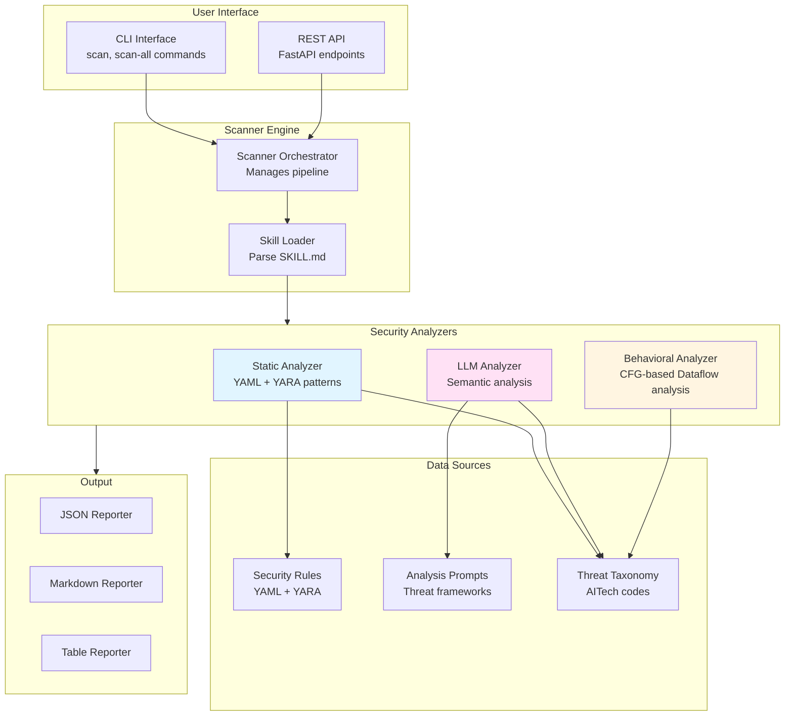

# Skill Scanner Architecture

## Overview

The Skill Scanner is built with a modular, extensible architecture for Agent Skills security analysis. It supports the Agent Skills specification format used by OpenAI Codex Skills and Cursor Agent Skills. This document describes the system design, data flow, and key components.

**Structure**: Organized by component (core/, config/, data/, threats/, cli/, api/)
**Coverage**: Static analysis (YAML + YARA), LLM analysis, Behavioral dataflow analysis
**Validation**: 163 tests passing, enhanced with dataflow detection

## High-Level Architecture



## Core Components

### 1. Data Models (`models.py`)

Defines the core data structures:

- **`Skill`**: Represents a complete Agent Skill package
  - `directory`: Path to skill package
  - `manifest`: Parsed YAML frontmatter
  - `instruction_body`: Markdown instructions
  - `files`: List of all files in package
  - `referenced_files`: Files linked in instructions

- **`SkillManifest`**: YAML frontmatter from SKILL.md
  - `name`, `description`, `license`
  - `allowed_tools`: Tool permission declarations
  - `compatibility`: Environment requirements
  - `disable_model_invocation`: Cursor-specific auto-invocation control

- **`Finding`**: A detected security issue
  - `rule_id`, `category`, `severity`
  - `file_path`, `line_number`, `snippet`
  - `description`, `remediation`

- **`ScanResult`**: Results from scanning one skill
  - `findings`: List of Finding objects
  - `is_safe`: Boolean flag
  - `max_severity`: Highest severity found

- **`Report`**: Aggregated results from multiple skills
  - `scan_results`: List of ScanResult objects
  - Severity counters (critical_count, high_count, etc.)

### 2. Skill Loader (`loader.py`)

Responsible for loading and parsing skill packages:

**Key Class: `SkillLoader`**

```python
class SkillLoader:
    def load_skill(self, skill_directory: Path) -> Skill:
        # 1. Find and validate SKILL.md
        # 2. Parse YAML frontmatter using python-frontmatter
        # 3. Extract instruction body
        # 4. Discover all files (scripts, markdown, etc.)
        # 5. Extract file references from instructions
        # 6. Build and return Skill object
```

**File Type Detection:**
- `.py` → python
- `.sh`, `.bash` → bash
- `.md`, `.markdown` → markdown
- `.exe`, `.so`, `.dylib` → binary (flagged as suspicious)

**Reference Extraction:**
Parses instruction body for:
- Markdown links: `[text](file.md)`
- "See FILE.md" patterns
- Script execution: "run scripts/foo.py"

### 3. Static Analyzer (`analyzers/static.py`)

The primary security analyzer in Phase 1.

**Multi-Pass Scanning Strategy:**

1. **Manifest Pass**
   - Validate YAML structure
   - Check description length/quality
   - Detect brand impersonation

2. **Instruction Pass**
   - Scan SKILL.md body for prompt injection
   - Detect override attempts
   - Find concealment directives

3. **Code Pass**
   - Scan Python/Bash scripts
   - Apply language-specific rules
   - Detect dangerous functions

4. **Consistency Pass**
   - Cross-check manifest vs. behavior
   - Verify tool declarations
   - Detect description mismatches

5. **Reference Pass**
   - Scan linked files recursively
   - Follow references in instructions

6. **Binary Pass**
   - Flag any binary executables
   - Detect obfuscation

**Rule Application:**

```python
for rule in rules:
    matches = rule.scan_content(content, file_path)
    for match in matches:
        finding = create_finding_from_match(rule, match)
        findings.append(finding)
```

### 4. Security Rules (`rules/`)

**`signatures.yaml`**: Declarative rule definitions

```yaml
- id: RULE_ID
  category: threat_category
  severity: CRITICAL|HIGH|MEDIUM|LOW
  patterns:
    - "regex_pattern_1"
    - "regex_pattern_2"
  file_types: [python, bash, markdown]
  description: "What this detects"
  remediation: "How to fix it"
```

**`patterns.py`**: Rule loading and matching

- `SecurityRule`: Represents a compiled rule
- `RuleLoader`: Loads rules from YAML
- Pattern compilation with regex
- File type filtering

### 5. Scanner Engine (`scanner.py`)

Orchestrates the entire scanning process.

**Key Class: `SkillScanner`**

```python
class SkillScanner:
    def scan_skill(self, skill_directory: Path) -> ScanResult:
        # 1. Load skill using SkillLoader
        # 2. Run each configured analyzer
        # 3. Aggregate findings from all analyzers
        # 4. Calculate metrics (max_severity, is_safe)
        # 5. Return ScanResult

    def scan_directory(self, skills_dir: Path) -> Report:
        # 1. Find all skill packages
        # 2. Scan each skill
        # 3. Aggregate into Report
        # 4. Calculate summary statistics
```

**Analyzer Management:**
- Default: Static Analyzer only
- Extensible: Can add multiple analyzers
- Future: LLM Analyzer, Behavioral Analyzer

### 6. Reporters (`reporters/`)

Generate output in various formats.

**`JSONReporter`**
- Converts ScanResult/Report to JSON
- `pretty=True`: Indented output
- `pretty=False`: Compact single-line

**`MarkdownReporter`**
- Human-readable reports
- `detailed=True`: Includes snippets and remediation
- Severity-grouped findings
- Emoji indicators for quick scanning

**`TableReporter`**
- Tabular output using `tabulate`
- Multiple format styles (grid, simple, plain)
- Summary tables and detailed findings

### 7. CLI Interface (`cli.py`)

Command-line interface built with `argparse`.

**Commands:**

- `scan DIRECTORY`: Scan single skill
- `scan-all DIRECTORY`: Scan multiple skills
- `list-analyzers`: Show available analyzers
- `validate-rules`: Validate rule signatures

**Common Options:**
- `--format`: Output format (summary, json, markdown, table)
- `--output`: Save to file
- `--detailed`: Include full details
- `--fail-on-findings`: Exit with error if issues found

## Data Flow

### Single Skill Scan Flow

```
1. User runs: skill-scanner scan /path/to/skill

2. CLI parses arguments → calls scan_command()

3. Scanner.scan_skill() is invoked
   ├─→ SkillLoader.load_skill()
   │   ├─→ Parse SKILL.md (frontmatter + body)
   │   ├─→ Discover files (.py, .sh, .md)
   │   └─→ Return Skill object
   │
   └─→ For each analyzer:
       ├─→ StaticAnalyzer.analyze(skill)
       │   ├─→ Load rules from signatures.yaml
       │   ├─→ Run 6 scanning passes
       │   └─→ Return List[Finding]
       │
       └─→ Aggregate findings

4. Generate ScanResult
   ├─→ Calculate is_safe, max_severity
   └─→ Add metadata (duration, analyzers)

5. Reporter generates output
   └─→ Display or save results

6. Exit with appropriate code
```

### Multi-Skill Scan Flow

```
1. User runs: skill-scanner scan-all /path/to/skills

2. Scanner.scan_directory()
   ├─→ Find all skill packages (SKILL.md files)
   │
   └─→ For each skill:
       ├─→ scan_skill() (same as above)
       └─→ Add result to Report

3. Report aggregates statistics
   ├─→ Count total skills, findings
   ├─→ Calculate severity distribution
   └─→ Determine safe vs. unsafe skills

4. Reporter generates summary
   └─→ Display or save results
```

## Extensibility Points

### Adding New Analyzers

1. Create new analyzer class inheriting `BaseAnalyzer`
2. Implement `analyze(skill: Skill) -> List[Finding]`
3. Add to scanner: `scanner.add_analyzer(MyAnalyzer())`

Example:

```python
from skill_scanner.analyzers.base import BaseAnalyzer

class LLMAnalyzer(BaseAnalyzer):
    def __init__(self):
        super().__init__("llm_analyzer")

    def analyze(self, skill: Skill) -> List[Finding]:
        # Use LLM to analyze skill semantically
        findings = []
        # ... analysis logic ...
        return findings
```

### Adding New Rules

Edit `skill_scanner/data/rules/signatures.yaml`:

```yaml
- id: MY_CUSTOM_RULE
  category: command_injection
  severity: HIGH
  patterns:
    - "my_pattern_here"
  file_types: [python]
  description: "Detects X"
  remediation: "Do Y instead"
```

### Adding New Output Formats

1. Create new reporter class
2. Implement `generate_report(data) -> str`
3. Add to CLI format choices

## Performance Considerations

### Optimization Strategies

1. **Lazy File Reading**
   - Files only read when needed
   - Large files can be skipped (size limit)

2. **Compiled Regex Patterns**
   - Rules compiled once at startup
   - Reused across all files

3. **Parallel Scanning** (Future)
   - Scan multiple skills in parallel
   - Independent file analysis

4. **Rule Filtering**
   - Only apply rules matching file type
   - Skip irrelevant rules early

### Scalability

- Current: Suitable for 100s of skills
- Typical scan time: 0.1-0.5s per skill
- Memory: ~10-50MB per scan
- Future: Distributed scanning for 1000s of skills

## Security Considerations

### Scanner Security

The scanner itself must be secure:

1. **Input Validation**
   - Validate all file paths
   - Limit file sizes
   - Prevent path traversal

2. **Safe Pattern Matching**
   - Regex patterns validated at load
   - No code execution in patterns
   - Timeouts for complex regex

3. **Isolation**
   - No network access during scan
   - No file modifications
   - Read-only operations

### Future: Sandbox Execution

For behavioral analysis (Phase 3):
- Skills run in isolated containers
- Network/filesystem access monitored
- Resource limits enforced

## Testing Architecture

### Test Structure

```
tests/
├── test_loader.py          # Skill loading tests
├── test_static_analyzer.py # Pattern detection tests
├── test_scanner.py         # End-to-end scanning tests
└── test_reporters.py       # Output format tests
```

### Test Fixtures

- Test skills in `evals/skills/` (used for evaluation)
- Safe skill (negative test)
- Malicious skills (positive tests)

### Test Coverage Goals

- Core logic: >90%
- CLI: >70%
- Edge cases: Comprehensive

## Future Architecture Enhancements

### LLM Analyzer (Production)

```
LLMAnalyzer (Cisco Architecture)
├─→ Load Cisco prompts from data/prompts/
├─→ Create protected prompt with random delimiters
├─→ Call LLM via LiteLLM (100+ models)
├─→ Parse JSON with fallbacks
├─→ Map to AITech taxonomy
└─→ Return findings with AITech codes
```

**Key Features:**
- LiteLLM for universal model support
- Prompt injection protection
- Exponential backoff retry
- AWS Bedrock with IAM
- Async architecture

### Behavioral Analyzer

```
BehavioralAnalyzer (Static Analysis Mode)
├─→ Parse Python scripts with AST parser
├─→ Build Control Flow Graph (CFG)
├─→ Forward dataflow analysis (fixpoint algorithm)
├─→ Detect script-level sources (credential files, env vars)
├─→ Track flows from sources to sinks (network, eval, file ops)
├─→ Cross-file correlation analysis
└─→ Generate findings from dataflow patterns
```

**Note**: Uses static analysis (no code execution). CFG-based analysis provides accurate flow tracking through branches and loops.

### REST API Server

```
FastAPI Server
├─→ /scan endpoint (POST skill package)
├─→ /scan/{id} endpoint (GET results)
├─→ /rules endpoint (GET/POST custom rules)
└─→ WebSocket for real-time updates
```

## Conclusion

The Skill Scanner is designed with modularity, extensibility, and security in mind. The current static analysis foundation provides a solid base for future enhancements including semantic analysis, behavioral monitoring, and enterprise features. It supports Codex Skills and Cursor Agent Skills formats, which follow the Agent Skills specification.
