# Diagram Conventions

Consistency guidelines for all sf-diagram generated diagrams.

## General Principles

1. **Clarity over completeness** - Show key elements, not every detail
2. **Consistent naming** - Use API names for Salesforce objects/fields
3. **Accessibility first** - Colors supplement, not replace, meaning
4. **Dual output** - Always provide Mermaid + ASCII fallback

---

## Sequence Diagram Conventions

### Actor Naming

| System | Display Name | Icon |
|--------|--------------|------|
| End User | User | 👤 |
| Web Browser | Browser | 🌐 |
| Mobile App | Mobile App | 📱 |
| Backend Server | App Server | 🖥️ |
| Salesforce Auth | Salesforce<br/>Authorization Server | ☁️ |
| Salesforce API | Salesforce<br/>REST API | 📊 |
| External API | [System Name]<br/>API | 🏭 |
| Middleware | [Name]<br/>(MuleSoft, etc.) | 🔄 |
| Database | Database / Data Lake | 💾 |

### Arrow Usage

| Scenario | Arrow | Example |
|----------|-------|---------|
| HTTP Request | `->>` | `Client->>Server: GET /api` |
| HTTP Response | `-->>` | `Server-->>Client: 200 OK` |
| Async (fire-forget) | `-)` | `Trigger-)Queue: Enqueue job` |
| Internal call | `->` | `Service->Service: Process` |
| Failed/Error | `-x` | `Client-x Server: 500 Error` |

### Standard Sections

1. **Title Note** - First element, describes the flow
2. **Actor Boxes** - Group related actors
3. **Numbered Steps** - Use `autonumber`
4. **Notes** - Add context for complex steps
5. **Alt/Else** - Show branching (success/error)

### Example Structure

```
%%{init: {...}}%%
sequenceDiagram
    autonumber

    %% Actor groups
    box rgb(...) [Group Name]
        participant ...
    end

    %% Title
    Note over ...: [Flow Name]

    %% Main flow
    A->>B: Step description
    Note over A,B: Technical details

    %% Branching
    alt Success
        ...
    else Error
        ...
    end
```

---

## ERD Conventions

### Object Naming

- Use **API Names** (e.g., `Account`, `Custom_Object__c`)
- Use **CamelCase** for standard objects
- Include `__c` suffix for custom objects

### Field Representation

```
OBJECT {
    Type FieldName Annotation "Comment"
}
```

**Type Mapping:**

| Salesforce Type | ERD Type |
|-----------------|----------|
| Id | Id |
| Text, String | Text |
| Number, Integer | Number |
| Decimal, Double | Decimal |
| Currency | Currency |
| Percent | Percent |
| Checkbox | Checkbox |
| Date | Date |
| DateTime | DateTime |
| Picklist | Picklist |
| Multi-Select Picklist | MultiPicklist |
| Lookup | Lookup |
| Master-Detail | MasterDetail |
| Formula | Formula |
| Roll-Up Summary | RollUp |
| Email | Email |
| Phone | Phone |
| URL | URL |
| Auto Number | AutoNumber |

**Annotations:**

| Annotation | Meaning |
|------------|---------|
| PK | Primary Key (Id field) |
| FK | Foreign Key (Lookup/Master-Detail) |
| UK | Unique Key (External ID) |

**Comments:**

- `"Required"` for non-nullable fields
- `"FK → Object"` to indicate relationship target
- `"Roll-Up: SUM(Amount)"` for roll-up formulas

### Relationship Lines

| Relationship | Line | Salesforce Equivalent |
|--------------|------|----------------------|
| One-to-Many | `\|\|--o{` | Parent Lookup |
| Many-to-Many | `}o--o{` | Junction Object |
| One-to-One | `\|\|--\|\|` | Rare, use Lookup |
| Master-Detail | `\|\|--\|{` | MD (cascade delete) |

### Layout Guidelines

1. **Primary objects at top** - Account, Lead at top
2. **Related objects below** - Contact under Account
3. **Junction objects between** - Show many-to-many clearly
4. **Limit fields shown** - Key fields only (5-10 per object)

---

## Flowchart Conventions

### Direction

| Use Case | Direction |
|----------|-----------|
| Process flow | `TB` (Top to Bottom) |
| System integration | `LR` (Left to Right) |
| Hierarchy | `TB` |
| Timeline | `LR` |

### Node Shapes

| Concept | Shape | Syntax |
|---------|-------|--------|
| Start/End | Stadium | `([Start])` |
| Process/Action | Rectangle | `[Process]` |
| Decision | Diamond | `{Decision?}` |
| Database | Cylinder | `[(Database)]` |
| External System | Parallelogram | `[/External/]` |
| Subprocess | Double Rectangle | `[[Subprocess]]` |

### Subgraph Usage

Group related components:

```mermaid
%%{init: {"flowchart": {"nodeSpacing": 80, "rankSpacing": 70}} }%%
flowchart LR
    subgraph sf["☁️ SALESFORCE"]
        A[Flow]
        B[Apex]
    end

    subgraph ext["🏭 EXTERNAL"]
        C[API]
    end

    style sf fill:#ecfeff,stroke:#0e7490,stroke-dasharray:5
    style ext fill:#ecfdf5,stroke:#047857,stroke-dasharray:5
    style A fill:#c7d2fe,stroke:#4338ca,color:#1f2937
    style B fill:#ddd6fe,stroke:#6d28d9,color:#1f2937
    style C fill:#a7f3d0,stroke:#047857,color:#1f2937
```



---

## ASCII Diagram Conventions

### Box Drawing Characters

```
Standard Box:
┌─────────────────┐
│                 │
└─────────────────┘

Rounded corners (optional):
╭─────────────────╮
│                 │
╰─────────────────╯
```

### Line Characters

| Character | Unicode | Usage |
|-----------|---------|-------|
| `─` | U+2500 | Horizontal line |
| `│` | U+2502 | Vertical line |
| `┌` | U+250C | Top-left corner |
| `┐` | U+2510 | Top-right corner |
| `└` | U+2514 | Bottom-left corner |
| `┘` | U+2518 | Bottom-right corner |
| `├` | U+251C | Left T-junction |
| `┤` | U+2524 | Right T-junction |
| `┬` | U+252C | Top T-junction |
| `┴` | U+2534 | Bottom T-junction |
| `┼` | U+253C | Cross junction |

### Arrow Characters

```
Right:  ───>  or  ──▶  or  ────────────────>
Left:   <───  or  ◀──
Up:     ▲
Down:   ▼
Bidirectional: <──>
```

### Width Guidelines

- **Max width**: 80 characters (terminal friendly)
- **Box width**: Consistent within diagram
- **Label padding**: At least 1 space inside boxes

### Example ASCII Sequence

```
┌──────────┐     ┌───────────────┐     ┌────────────────┐
│  Client  │     │    Server     │     │    Database    │
└────┬─────┘     └───────┬───────┘     └───────┬────────┘
     │                   │                     │
     │  1. Request       │                     │
     │──────────────────>│                     │
     │                   │                     │
     │                   │  2. Query           │
     │                   │────────────────────>│
     │                   │                     │
     │                   │  3. Results         │
     │                   │<────────────────────│
     │                   │                     │
     │  4. Response      │                     │
     │<──────────────────│                     │
```

---

## Scoring Criteria

### Accuracy (20 points)
- Correct actors/entities
- Accurate flow sequence
- Proper relationships (ERD)
- Valid syntax

### Clarity (20 points)
- Readable labels
- Logical layout
- Appropriate detail level
- Good spacing

### Completeness (15 points)
- All key steps included
- Error paths shown (where applicable)
- Annotations for context
- Legend if needed

### Styling (15 points)
- Consistent colors
- Proper theming
- Icons where helpful
- Professional appearance

### Best Practices (10 points)
- UML/notation conventions
- Accessibility considerations
- Dual format output
- Documentation

---

## Validation Checklist

Before delivering a diagram:

- [ ] Mermaid syntax is valid (renders without errors)
- [ ] ASCII fallback is provided
- [ ] Colors follow palette
- [ ] Icons supplement colors
- [ ] Labels are clear and consistent
- [ ] Appropriate detail level
- [ ] Flow/relationships are accurate
- [ ] Key points documented
- [ ] Score calculated and shown
