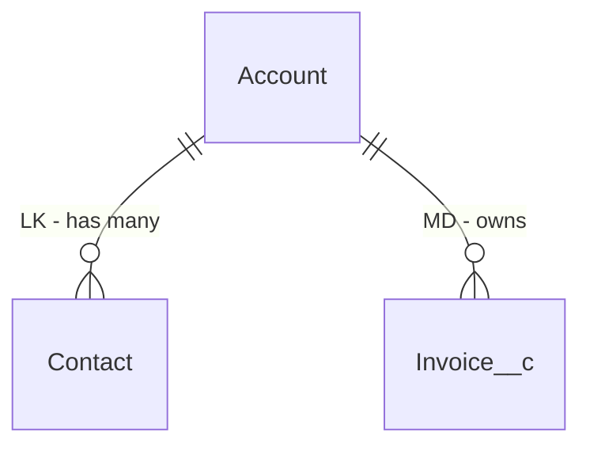
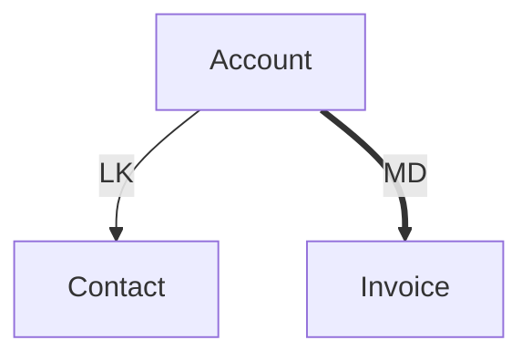
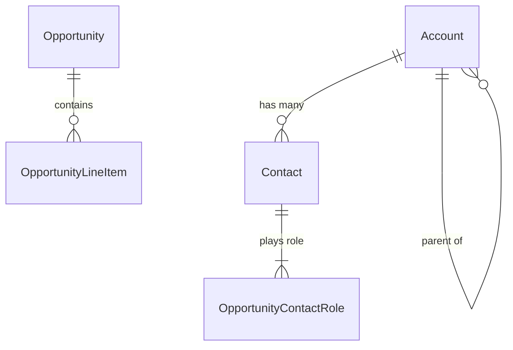
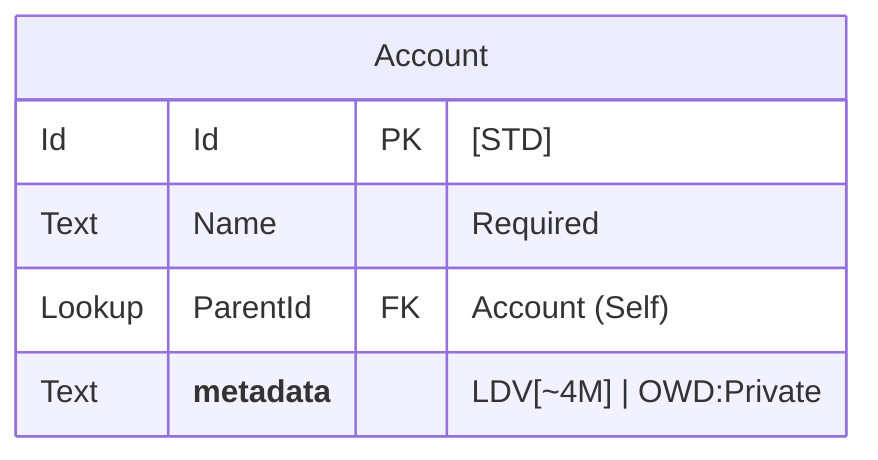
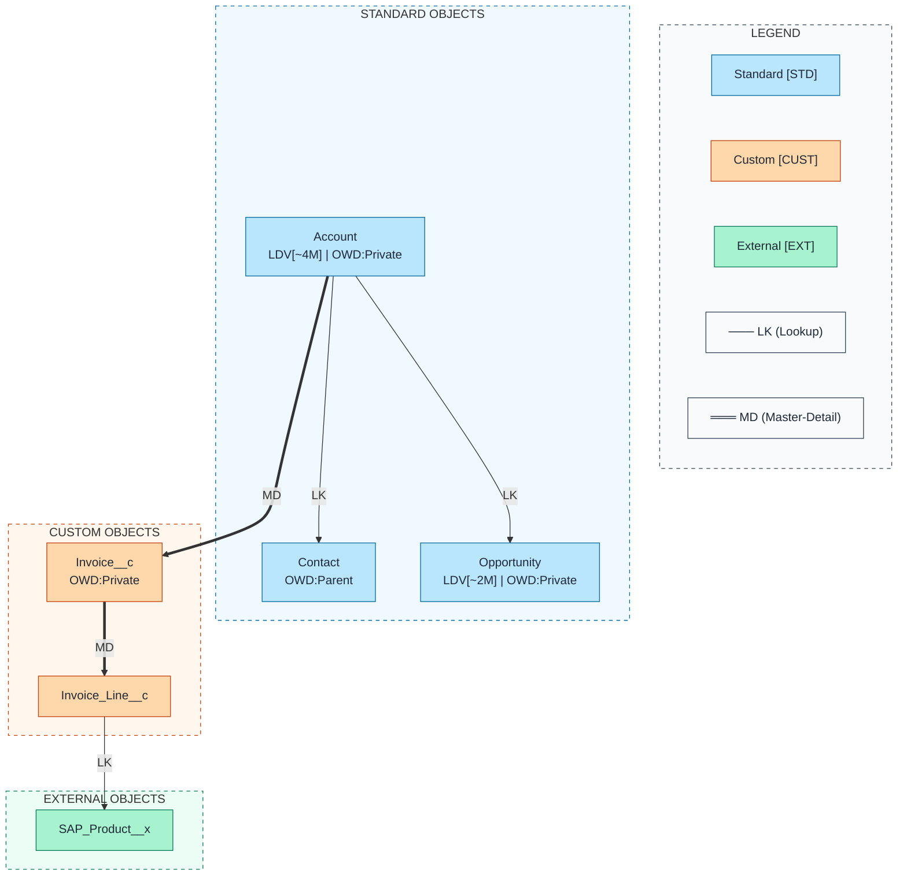

# ERD Conventions for sf-diagram

Standardized conventions for Salesforce data model diagrams with object type indicators, LDV markers, OWD annotations, and relationship type labels.

## Object Type Indicators

| Indicator | Object Type | Color (Flowchart) | Fill | Stroke | API Suffix |
|-----------|-------------|-------------------|------|--------|------------|
| `[STD]` | Standard Object | Sky Blue | `#bae6fd` | `#0369a1` | None |
| `[CUST]` | Custom Object | Orange | `#fed7aa` | `#c2410c` | `__c` |
| `[EXT]` | External Object | Green | `#a7f3d0` | `#047857` | `__x` |

### Examples

```
Account [STD]         → Standard Salesforce object
Invoice__c [CUST]     → Custom object
SAP_Product__x [EXT]  → External object via Salesforce Connect
```

---

## LDV (Large Data Volume) Indicator

Objects with **>2M records** should display an LDV indicator to highlight potential performance considerations.

| Record Count | Display Format | Example |
|--------------|----------------|---------|
| < 2,000,000 | (none) | Account |
| 2M - 10M | `LDV[~XM]` | `LDV[~4M]` |
| 10M - 100M | `LDV[~XXM]` | `LDV[~15M]` |
| > 100M | `LDV[~XXXM]` | `LDV[~250M]` |

### Query Record Count

```bash
sf data query --query "SELECT COUNT() FROM Account" --target-org myorg --json
```

### In Diagram

**erDiagram format** (in entity description):
```mermaid
Account {
    Id Id PK "[STD] LDV[~4M]"
    Text Name "Required"
}
```

**Flowchart format** (in node label):
```mermaid
Account["Account<br/>LDV[~4M]"]
```

---

## OWD (Org-Wide Default) Display

Display sharing model on entities to show default record access levels.

| OWD Setting | Display | Meaning |
|-------------|---------|---------|
| Private | `OWD:Private` | Owner + role hierarchy only |
| PublicRead | `OWD:Read` | All users can view |
| PublicReadWrite | `OWD:ReadWrite` | All users can view and edit |
| PublicReadWriteTransfer | `OWD:Full` | All users have full access |
| ControlledByParent | `OWD:Parent` | Inherits from master object |
| FullAccess | `OWD:Full` | Full access to all |

### Query OWD

```bash
sf sobject describe --sobject Account --target-org myorg --json | jq '.result.sharingModel'
```

### Common OWD Patterns

| Object | Typical OWD | Notes |
|--------|-------------|-------|
| Account | Private | Most orgs restrict account access |
| Contact | ControlledByParent | Usually follows Account OWD |
| Opportunity | Private | Sales data is sensitive |
| Case | Private or Public Read | Depends on support model |
| Lead | Public Read/Write | Often shared across sales |

---

## Relationship Type Labels

Distinguish between Lookup and Master-Detail relationships for understanding data dependencies.

| Label | Relationship | Cascade Delete | Roll-Up | Required Parent |
|-------|--------------|----------------|---------|-----------------|
| `LK` | Lookup | No | No | No |
| `MD` | Master-Detail | Yes | Yes | Yes |

### In erDiagram Syntax



### In Flowchart Syntax

| Type | Arrow | Visual |
|------|-------|--------|
| Lookup | `-->` | Single arrow |
| Master-Detail | `==>` | Thick double arrow |



---

## Cardinality Notation (Crow's Foot)

Standard ERD cardinality symbols:

| Symbol | Meaning | Description |
|--------|---------|-------------|
| `\|\|` | Exactly one | One and only one |
| `\|o` | Zero or one | Optional, at most one |
| `o{` | Zero or many | Optional, any number |
| `\|{` | One or many | Required, at least one |

### Common Salesforce Patterns



---

## Entity Metadata Row Pattern

Add a special metadata row in erDiagram entities to consolidate annotations:



**Note**: The `__metadata__` row is a convention for displaying object-level info within the erDiagram entity block.

---

## Color Palette for ERD

### Entity Colors (for Flowchart ERD)

| Object Type | Fill | Stroke | Text |
|-------------|------|--------|------|
| Standard | `#bae6fd` | `#0369a1` | `#1f2937` |
| Custom | `#fed7aa` | `#c2410c` | `#1f2937` |
| External | `#a7f3d0` | `#047857` | `#1f2937` |

### Subgraph Colors (for Grouping)

| Category | Fill | Stroke | Style |
|----------|------|--------|-------|
| Standard Group | `#f0f9ff` | `#0369a1` | dashed |
| Custom Group | `#fff7ed` | `#c2410c` | dashed |
| External Group | `#ecfdf5` | `#047857` | dashed |
| Legend | `#f8fafc` | `#334155` | dashed |

### Style Declarations

```mermaid
%% Standard Object - Sky Blue
style Account fill:#bae6fd,stroke:#0369a1,color:#1f2937

%% Custom Object - Orange
style Invoice fill:#fed7aa,stroke:#c2410c,color:#1f2937

%% External Object - Green
style SAP_Product fill:#a7f3d0,stroke:#047857,color:#1f2937

%% Subgraph - Standard group
style std fill:#f0f9ff,stroke:#0369a1,stroke-dasharray:5
```

---

## Query Commands Reference

### Batch Query Script

Use the provided Python script for efficient metadata queries:

```bash
python3 ~/.claude/plugins/marketplaces/sf-skills/sf-diagram-mermaid/scripts/query-org-metadata.py \
    --objects Account,Contact,Lead,Opportunity,Case \
    --target-org myorg \
    --output table
```

### Manual Queries

**Record Count (LDV)**:
```bash
sf data query --query "SELECT COUNT() FROM Account" --target-org myorg --json
```

**OWD Setting**:
```bash
sf sobject describe --sobject Account --target-org myorg --json | jq '.result.sharingModel'
```

**Object Type Check**:
```bash
sf sobject describe --sobject Invoice__c --target-org myorg --json | jq '.result.custom'
```

---

## Complete Example

### Flowchart ERD with All Conventions



---

## Best Practices

1. **Always include a legend** in flowchart diagrams for color/arrow meaning
2. **Query live org data** for accurate LDV and OWD values
3. **Use consistent naming** - API names, not labels
4. **Group related objects** using subgraphs
5. **Limit fields shown** to key relationships (5-10 per entity max)
6. **Show relationship direction** - parent on left, child on right
7. **Mark required relationships** with appropriate cardinality

---

## References

- [Salesforce Data Model Notation](https://developer.salesforce.com/docs/platform/data-models/guide/salesforce-data-model-notation.html)
- [Mermaid ERD Syntax](https://mermaid.js.org/syntax/entityRelationshipDiagram.html)
- [Mermaid Flowchart Syntax](https://mermaid.js.org/syntax/flowchart.html)
- [sf-diagram Color Palette](color-palette.md)
