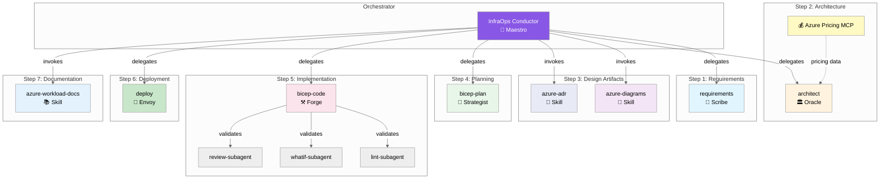

# Agent and Skill Workflow

> Version 8.1.0 | The 7-step infrastructure development workflow

## Overview

Agentic InfraOps uses a multi-agent orchestration system where specialized AI agents coordinate
through artifact handoffs to transform Azure infrastructure requirements into deployed Bicep code.

The **InfraOps Conductor** (🎼 Maestro) orchestrates the complete workflow, delegating to
specialized agents at each phase while enforcing mandatory approval gates.

## Agent Architecture

### The Conductor Pattern



---

## Agent Roster

### Primary Orchestrator

| Agent | Persona | Role | Model |
|-------|---------|------|-------|
| **InfraOps Conductor** | 🎼 Maestro | Master orchestrator for 7-step workflow | Claude Sonnet 4.5 |

### Core Agents (7 Steps)

| Step | Agent | Persona | Role | Artifact |
|------|-------|---------|------|----------|
| 1 | `requirements` | 📜 Scribe | Captures infrastructure requirements | `01-requirements.md` |
| 2 | `architect` | 🏛️ Oracle | WAF assessment and design decisions | `02-architecture-assessment.md` |
| 3 | `design` | 🎨 Artisan | Diagrams and ADRs | `03-des-*.md/.py/.png` |
| 4 | `bicep-plan` | 📐 Strategist | Implementation planning | `04-implementation-plan.md` |
| 5 | `bicep-code` | ⚒️ Forge | Bicep template generation | `infra/bicep/{project}/` |
| 6 | `deploy` | 🚀 Envoy | Azure deployment | `06-deployment-summary.md` |
| 7 | — | — | Documentation (via skills) | `07-*.md` |

### Validation Subagents

| Subagent | Purpose | Invoked By |
|----------|---------|------------|
| `bicep-lint-subagent` | Syntax validation (`bicep lint`, `bicep build`) | `bicep-code` |
| `bicep-whatif-subagent` | Deployment preview (`az deployment what-if`) | `bicep-code`, `deploy` |
| `bicep-review-subagent` | Code review (AVM, security, naming) | `bicep-code` |

### Diagnostic Agent

| Agent | Persona | Role |
|-------|---------|------|
| `diagnose` | 🔍 Sentinel | Resource health assessment and troubleshooting |

---

## Approval Gates

The Conductor enforces mandatory pause points for human oversight:

| Gate | After Step | User Action |
|------|------------|-------------|
| **Gate 1** | Planning (Step 4) | Approve implementation plan |
| **Gate 2** | Pre-Deploy (Step 5) | Approve lint/what-if/review results |
| **Gate 3** | Post-Deploy (Step 6) | Verify deployed resources |

---

## Workflow Steps

### Step 1: Requirements (📜 Scribe)

**Agent**: `requirements`

Gather infrastructure requirements through interactive conversation.

```text
Invoke: Ctrl+Shift+A → requirements
Output: agent-output/{project}/01-requirements.md
```

**Captures**:

- Functional requirements (what the system does)
- Non-functional requirements (performance, availability, security)
- Compliance requirements (regulatory, organizational)
- Budget constraints

**Handoff**: Passes context to `architect` agent.

---

### Step 2: Architecture (🏛️ Oracle)

**Agent**: `architect`

Evaluate requirements against Azure Well-Architected Framework pillars.

```text
Invoke: Ctrl+Shift+A → architect
Output: agent-output/{project}/02-architecture-assessment.md
```

**Features**:

- WAF pillar scoring (Reliability, Security, Cost, Operations, Performance)
- SKU recommendations with real-time pricing (via Azure Pricing MCP)
- Architecture decisions with rationale
- Risk identification and mitigation

**Handoff**: Suggests `azure-diagrams` skill or `bicep-plan` agent.

---

### Step 3: Design Artifacts (🎨 Artisan | Optional)

**Skills**: `azure-diagrams`, `azure-adr`

Create visual and textual design documentation.

```text
Trigger: "Create an architecture diagram for {project}"
Output: agent-output/{project}/03-des-diagram.py, 03-des-adr-*.md
```

**Diagram types**: Azure architecture, business flows, ERD, timelines

**ADR content**: Decision, context, alternatives, consequences

---

### Step 4: Planning (📐 Strategist)

**Agent**: `bicep-plan`

Create detailed implementation plan with governance discovery.

```text
Invoke: Ctrl+Shift+A → bicep-plan
Output: agent-output/{project}/04-implementation-plan.md, 04-governance-constraints.md
```

**Features**:

- Azure Policy compliance discovery
- AVM module selection
- Resource dependency mapping
- Naming convention validation
- Phased implementation approach

**Gate 1**: User approves the implementation plan before proceeding.

---

### Step 5: Implementation (⚒️ Forge)

**Agent**: `bicep-code`

Generate Bicep templates following Azure Verified Modules standards.

```text
Invoke: Ctrl+Shift+A → bicep-code
Output: infra/bicep/{project}/main.bicep, modules/
Output: agent-output/{project}/05-implementation-reference.md
```

**Standards**:

- AVM-first approach (Azure Verified Modules from public registry)
- Unique suffix for global resource names
- Required tags on all resources
- Security defaults (TLS 1.2, HTTPS-only, managed identity)

**Preflight Validation** (via subagents):

| Subagent | Validation |
|----------|------------|
| `bicep-lint-subagent` | Syntax check, linting rules |
| `bicep-whatif-subagent` | Deployment what-if preview |
| `bicep-review-subagent` | AVM compliance, security scan |

**Gate 2**: User approves preflight validation results.

---

### Step 6: Deployment (🚀 Envoy)

**Agent**: `deploy`

Execute Azure deployment with preflight validation.

```text
Invoke: Ctrl+Shift+A → deploy
Output: agent-output/{project}/06-deployment-summary.md
```

**Features**:

- Bicep build validation
- What-if analysis before deploy
- Deployment execution with progress tracking
- Post-deployment resource verification

**Gate 3**: User verifies deployed resources.

---

### Step 7: Documentation (📚 Skills)

**Skill**: `azure-workload-docs`

Generate comprehensive workload documentation.

```text
Trigger: "Generate documentation for {project}"
Output: agent-output/{project}/07-*.md
```

**Document Suite**:

| File | Purpose |
|------|---------|
| `07-documentation-index.md` | Master index with links |
| `07-design-document.md` | Technical design documentation |
| `07-operations-runbook.md` | Day-2 operational procedures |
| `07-resource-inventory.md` | Complete resource listing |
| `07-ab-cost-estimate.md` | As-built cost analysis |
| `07-compliance-matrix.md` | Security control mapping |
| `07-backup-dr-plan.md` | Disaster recovery procedures |

---

## Agents vs Skills

| Aspect | Agents | Skills |
|--------|--------|--------|
| **Invocation** | Manual (`Ctrl+Shift+A`) or via Conductor | Automatic or explicit |
| **Interaction** | Conversational with handoffs | Task-focused |
| **State** | Session context | Stateless |
| **Output** | Multiple artifacts | Specific outputs |
| **When to use** | Core workflow steps | Specialized capabilities |

---

## Quick Reference

### Using the Conductor (Recommended)

```text
1. Ctrl+Shift+I → Select "InfraOps Conductor"
2. Describe your infrastructure project
3. Follow guided workflow through all 7 steps with approval gates
```

### Direct Agent Invocation

```text
1. Ctrl+Shift+A → Select specific agent
2. Provide context for that step
3. Agent produces artifacts and suggests next step
```

### Skill Invocation

**Automatic**: Skills activate based on prompt keywords:

```text
"Create an architecture diagram" → azure-diagrams skill
"Document the decision to use AKS" → azure-adr skill
```

**Explicit**: Reference the skill by name:

```text
"Use the azure-workload-docs skill to generate documentation"
```

---

## Artifact Naming Convention

| Step | Prefix | Example |
|------|--------|---------|
| Requirements | `01-` | `01-requirements.md` |
| Architecture | `02-` | `02-architecture-assessment.md` |
| Design | `03-des-` | `03-des-diagram.py`, `03-des-adr-0001-*.md` |
| Planning | `04-` | `04-implementation-plan.md`, `04-governance-constraints.md` |
| Implementation | `05-` | `05-implementation-reference.md` |
| Deployment | `06-` | `06-deployment-summary.md` |
| As-Built | `07-` | `07-design-document.md`, `07-ab-diagram.py` |
| Diagnostics | `08-` | `08-resource-health-report.md` |
