# Agentic InfraOps - Agent Workflow

> **Version 3.7.8** | [Changelog](../../VERSION.md)

This document describes the 7-step agent workflow for Azure infrastructure development with Agentic InfraOps.

---

## How to Invoke Agents

1. Press `Ctrl+Alt+I` to open Copilot Chat
2. Select the agent from the **agent picker dropdown** at the top of the chat
3. Type your prompt and submit
4. Wait for approval before proceeding to the next step

> **Note: Requirements Agent**
>
> VS Code includes a built-in **Plan** agent for general planning tasks. This repository uses a custom
> **Requirements** agent (`requirements.agent.md`) specifically designed for Azure infrastructure
> requirements gathering. The custom agent includes Azure-specific instructions, templates, and handoffs
> to other agents in this 7-step workflow.

---

## Overview

```mermaid
%%{init: {'theme':'neutral'}}%%
graph TB
    subgraph "Step 1: Requirements"
        P["Project Planner<br/>(custom agent)"]
    end

    subgraph "Step 2: Architecture"
        A["architect<br/>(NO CODE)"]
        MCP["💰 Azure Pricing MCP"]
    end

    subgraph "Step 3: Design Artifacts"
        D["📊 diagram<br/>(-des suffix)"]
        ADR1["📝 adr<br/>(-des suffix)"]
    end

    subgraph "Step 4: Planning"
        B["bicep-plan<br/>(governance discovery)"]
    end

    subgraph "Step 5: Implementation"
        I["bicep-code<br/>(code generation)"]
    end

    subgraph "Step 6: Deploy"
        DEP["🚀 Deploy to Azure<br/>(Deploy Agent)"]
    end

    subgraph "Step 7: As-Built Artifacts"
        D2["📊 diagram<br/>(-ab suffix)"]
        ADR2["📝 adr<br/>(-ab suffix)"]
        WL["📚 workload-documentation"]
    end

    P -->|"requirements"| A
    MCP -.->|"pricing data"| A
    A -->|"architecture"| D
    A -->|"architecture"| ADR1
    D --> B
    ADR1 --> B
    A -->|"skip artifacts"| B
    B -->|"plan"| I
    I -->|"code complete"| DEP
    DEP -->|"deployed"| D2
    DEP -->|"deployed"| ADR2
    DEP -->|"deployed"| WL

    style P fill:#e1f5fe
    style A fill:#fff3e0
    style MCP fill:#fff9c4
    style D fill:#f3e5f5
    style ADR1 fill:#e8eaf6
    style B fill:#e8f5e9
    style I fill:#fce4ec
    style DEP fill:#c8e6c9
    style D2 fill:#f3e5f5
    style ADR2 fill:#e8eaf6
    style WL fill:#e3f2fd
```



## Workflow Steps

| Step | Agent/Phase             | Purpose                              | Creates                                   | Required |
| ---- | ----------------------- | ------------------------------------ | ----------------------------------------- | -------- |
| 1    | `requirements` (custom) | Gather requirements                  | `01-requirements.md`                      | ✅ Yes   |
| 2    | `architect`             | WAF assessment                       | `02-architecture-assessment.md`           | ✅ Yes   |
| 3    | Design Artifacts        | Visualize design, document decisions | `03-des-*` diagrams + cost + ADRs         | Optional |
| 4    | `bicep-plan`            | Implementation planning + governance | `04-*` plan + governance constraints      | ✅ Yes   |
| 5    | `bicep-code`            | Code generation                      | Bicep templates + `05-*` reference        | ✅ Yes   |
| 6    | Deploy                  | Deploy to Azure                      | `06-deployment-summary.md`                | ✅ Yes   |
| 7    | As-Built Artifacts      | Document final state                 | `07-ab-*` diagrams + ADRs + workload docs | Optional |

### Step 1: Requirements (Project Planner)

Use the **Project Planner** custom agent to gather comprehensive requirements.

**📋 Requirements Template:** See [`.github/prompts/plan-requirements.prompt.md`](../../.github/prompts/plan-requirements.prompt.md)

**Key Information to Capture:**

| Category                    | Examples                                                 |
| --------------------------- | -------------------------------------------------------- |
| **Project Overview**        | Name, type, timeline, stakeholders                       |
| **Functional Requirements** | Core capabilities, user types, integrations, data types  |
| **Non-Functional (NFRs)**   | SLA (99.9%/99.95%/99.99%), RTO, RPO, performance targets |
| **Compliance & Security**   | HIPAA, PCI-DSS, GDPR, SOC 2, data residency, auth method |
| **Cost Constraints**        | Monthly/annual budget, optimization priorities, FinOps   |
| **Operational**             | Monitoring needs, support SLAs, backup/DR requirements   |

**Example Prompt:**

```text
Create deployment plan for HIPAA-compliant patient portal.
Business context: Healthcare startup serving 10,000 patients.
NFRs: 99.95% SLA, RTO=4hrs, RPO=1hr, <2s page load.
Compliance: HIPAA, SOC 2, data residency in EU.
Budget: $3,000/month maximum.
```

### Step 2: Architecture (architect)

See agent definition: [`.github/agents/architect.agent.md`](../../.github/agents/architect.agent.md)

**Validates requirements include NFRs** before proceeding with WAF assessment.

### Step 3: Design Artifacts (Optional)

| Tool/Agent   | Purpose                         | Output Suffix | Triggered By                        |
| ------------ | ------------------------------- | ------------- | ----------------------------------- |
| 📊 `diagram` | Visualize proposed architecture | `-des`        | Ask: "generate diagram"             |
| 📝 `adr`     | Document design decisions       | `-des`        | Ask: "create ADR for this decision" |

### Step 4: Governance Discovery

The `bicep-plan` agent now discovers Azure Policy constraints before creating the plan:

1. Queries Azure Resource Graph for policy assignments
2. Generates `agent-output/{project}/04-governance-constraints.md` and `.json`
3. Ensures implementation plan complies with org policies

### Step 6: Deploy

Deploy infrastructure to Azure using generated scripts:

1. Run `deploy.ps1` with `-WhatIf` to preview changes
2. Review deployment plan and approve
3. Execute deployment
4. Generates `agent-output/{project}/06-deployment-summary.md`

### Step 7: As-Built Artifacts (Optional)

| Tool/Agent                       | Purpose                           | Output Suffix | Triggered By                         |
| -------------------------------- | --------------------------------- | ------------- | ------------------------------------ |
| 📊 `diagram`                     | Document deployed architecture    | `-ab`         | Ask: "generate as-built diagram"     |
| 📝 `adr`                         | Document implementation decisions | `-ab`         | Ask: "create ADR for implementation" |
| 📚 `workload-documentation-gen.` | Customer-deliverable docs         | `07-*`        | Ask: "generate workload docs"        |

---

## 💰 Azure Pricing MCP Integration

The Azure Pricing MCP Server provides **real-time cost data** to agents during infrastructure planning.
This eliminates guesswork and ensures accurate cost estimates.

### Available Tools

| Tool                     | Purpose                                | Used By               |
| ------------------------ | -------------------------------------- | --------------------- |
| `azure_price_search`     | Query Azure retail prices with filters | architect, bicep-plan |
| `azure_price_compare`    | Compare prices across regions/SKUs     | architect             |
| `azure_cost_estimate`    | Calculate monthly/yearly costs         | architect, bicep-plan |
| `azure_region_recommend` | Find cheapest Azure regions for a SKU  | architect             |
| `azure_discover_skus`    | List available SKUs for a service      | architect, bicep-plan |
| `azure_sku_discovery`    | Fuzzy SKU name matching                | architect             |

### How It Works


### Setup

The MCP server is **automatically configured** when you open the Dev Container. Manual setup:

```bash
cd mcp/azure-pricing-mcp
python -m venv .venv
source .venv/bin/activate  # Windows: .venv\Scripts\activate
pip install -r requirements.txt
```

### Configuration

Pre-configured in `.vscode/mcp.json`:

```json
{
  "servers": {
    "azure-pricing": {
      "type": "stdio",
      "command": "${workspaceFolder}/mcp/azure-pricing-mcp/.venv/bin/python",
      "args": ["-m", "azure_pricing_mcp"],
      "cwd": "${workspaceFolder}/mcp/azure-pricing-mcp/src"
    }
  }
}
```

### Creating Cost Documentation

During the architecture phase, ask:

- **"save costs"** - Creates `docs/{project}-cost-estimate.md`
- **"save"** - Creates `docs/{project}-waf-assessment.md`

### Fallback

If MCP tools are unavailable, agents will use the **MCP Pricing Fallback Chain**:

1. **Azure Pricing MCP** (`mcp_azure-pricing_*`) - First choice, real-time data
2. **`fetch_webpage`** - Fetch official Azure pricing pages for specific services
3. **Azure Retail API** - Direct API query via `curl` for programmatic access
4. **Azure Pricing Calculator** - Manual fallback (link for user reference)
5. **Web search** - Last resort for general pricing information

---

## How to Use

### Starting the Workflow

1. Open GitHub Copilot Chat (`Ctrl+Alt+I`)
2. Click the **Agent** button or press `Ctrl+Shift+A`
3. Select `@requirements` to start with requirements
4. Follow the agent handoffs through each step

### Approval Gates

Each step requires your explicit approval before proceeding:

| Response                   | Action                             |
| -------------------------- | ---------------------------------- |
| **"yes"** or **"approve"** | Continue to next step              |
| **Feedback text**          | Agent refines output               |
| **"no"**                   | Return to previous step or restart |

### Example Conversation Flow

```
You: @requirements Create a HIPAA-compliant patient portal with Azure App Service and SQL Database

Requirements Agent: [Generates requirements plan]
           Do you approve this plan?

You: yes

[Handoff to architect]

Architect: [Provides WAF assessment with scores]
           [Queries Azure Pricing MCP for real-time costs]

           💰 Cost Breakdown (via MCP):
           ┌─────────────────────────┬──────────────┐
           │ Resource                │ Monthly Cost │
           ├─────────────────────────┼──────────────┤
           │ App Service P1v4 (x2)   │ $412         │
           │ Azure SQL S3            │ $150         │
           │ Key Vault Standard      │ $3           │
           │ Log Analytics (5GB/day) │ $50          │
           └─────────────────────────┴──────────────┘
           Total: ~$615/month

           Do you approve? Want a diagram first?

You: yes generate the diagram

Architect: [Invokes diagram]
           ✅ Created docs/diagrams/patient-portal/architecture.py
           ✅ Generated architecture.png

           Ready to continue to Bicep planning?

You: approve

[Handoff to bicep-plan]

Planner: [Creates implementation plan in agent-output/{project}/]
         [Validates costs with Azure Pricing MCP]
         Do you approve this implementation plan?

You: yes

[Handoff to bicep-code]

Implementer: [Generates Bicep templates]
             Validation: bicep build ✅ | bicep lint ✅
             Do you approve this implementation?

You: deploy

Implementer: [Executes deployment to Azure]
```

---

## Agent Responsibilities

### @requirements (Custom Agent)

- **Input**: Natural language requirements
- **Output**: Structured requirements plan (`01-requirements.md`)
- **Handoff**: To `architect` for WAF assessment

### architect

- **Input**: Requirements from @requirements or user
- **Output**: WAF pillar assessment, SKU recommendations (no cost estimates)
- **Integrations**:
  - 💰 Uses Azure Pricing MCP for SKU pricing context
  - 📊 Can invoke diagram for visualizations (Step 3)
  - 📝 Can invoke adr for decisions (Step 3)
- **Limitations**: ❌ Cannot create or edit Bicep code files
- **Documentation**: Creates `02-architecture-assessment.md` only (cost estimates in Step 3)

### diagram

- **Input**: Architecture context from architect OR bicep-code
- **Output**: Python diagram file in `agent-output/{project}/` + PNG image
- **Artifact Suffix**:
  - `-des` when called from Step 3 (design phase)
  - `-ab` when called from Step 7 (as-built phase)
- **Triggered By**: User request ("generate diagram", "create as-built diagram")
- **Library**: Uses Python `diagrams` library

### bicep-plan

- **Input**: Architecture assessment from architect
- **Output**:
  - Implementation plan in `agent-output/{project}/04-implementation-plan.md`
  - Governance constraints in `agent-output/{project}/04-governance-constraints.md` and `.json`
- **Governance Discovery**: Queries Azure Policy via MCP before planning
- **Integrations**: 💰 Uses Azure Pricing MCP for SKU cost validation
- **Limitations**: ❌ Cannot create actual Bicep code
- **Focus**: Detailed planning with AVM modules + policy compliance

### bicep-code

- **Input**: Implementation plan from `agent-output/{project}/04-implementation-plan.md`
- **Output**:
  - Bicep templates in `infra/bicep/{project}/`
  - Reference file: `agent-output/{project}/05-implementation-reference.md`
- **Limitations**: Must follow the approved plan
- **Validation**: Runs `bicep build` and `bicep lint`
- **Focus**: Code generation and deployment
- **Handoffs**: Can invoke diagram and adr for as-built artifacts

### adr (Optional)

- **Input**: Any architectural decision during the workflow
- **Output**: ADR in `agent-output/{project}/`
- **Artifact Suffix**:
  - `-des` when documenting design decisions (Step 3)
  - `-ab` when documenting implementation decisions (Step 7)
- **When to Use**: Major technology choices, trade-off decisions, policy exceptions

### docs (Optional)

- **Input**: All previous artifacts (WAF assessment, plan, Bicep code)
- **Output**: Customer-deliverable documentation in `agent-output/{project}/07-*.md`
- **Includes**: Design document, operations runbook, resource inventory, compliance matrix
- **When to Use**: Customer handoffs, consulting engagements, formal documentation needs

---

## File Locations

| Artifact               | Location                                                |
| ---------------------- | ------------------------------------------------------- |
| Requirements           | `agent-output/{project}/01-requirements.md`             |
| WAF Assessment         | `agent-output/{project}/02-architecture-assessment.md`  |
| Design Cost Estimate   | `agent-output/{project}/03-des-cost-estimate.md`        |
| Design Diagram         | `agent-output/{project}/03-des-diagram.py`, `.png`      |
| Design ADRs            | `agent-output/{project}/03-des-adr-NNN-*.md`            |
| Implementation Plan    | `agent-output/{project}/04-implementation-plan.md`      |
| Governance Constraints | `agent-output/{project}/04-governance-constraints.md`   |
| Governance JSON        | `agent-output/{project}/04-governance-constraints.json` |
| Bicep Templates        | `infra/bicep/{project}/`                                |
| Implementation Ref     | `agent-output/{project}/05-implementation-reference.md` |
| Deployment Summary     | `agent-output/{project}/06-deployment-summary.md`       |
| As-Built Diagram       | `agent-output/{project}/07-ab-diagram.py`, `.png`       |
| As-Built ADRs          | `agent-output/{project}/07-ab-adr-NNN-*.md`             |
| Workload Documentation | `agent-output/{project}/07-*.md`                        |
| Agent Definitions      | `.github/agents/`                                       |
| MCP Server             | `mcp/azure-pricing-mcp/`                                |
| MCP Configuration      | `.vscode/mcp.json`                                      |
| Legacy Diagrams        | `docs/diagrams/` (preserved for demos)                  |
| Global ADRs            | `docs/adr/` (repository-level decisions)                |

---

## Troubleshooting

### Agent Not Available

1. Press `Ctrl+Shift+A` to open agent picker
2. Verify agent files exist in `.github/agents/`
3. Restart VS Code if agents don't appear

### MCP Pricing Not Working

1. Check MCP server status: Command Palette → "MCP: List Servers"
2. Verify `azure-pricing` shows 6 tools
3. If not, run setup: `cd mcp/azure-pricing-mcp && pip install -r requirements.txt`
4. Restart VS Code

### Handoff Not Working

1. Look for the handoff button in chat response
2. If no button, manually switch agents with `Ctrl+Shift+A`
3. Copy relevant context to new agent conversation

### Validation Failures

| Error                 | Solution                            |
| --------------------- | ----------------------------------- |
| `bicep build` fails   | Check syntax errors in Bicep files  |
| `bicep lint` warnings | Address best practice violations    |
| Deployment fails      | Verify Azure permissions and quotas |

---

## Related Documentation

- [Time Savings Evidence](../presenter/time-savings-evidence.md) — Quantified efficiency gains (45 min vs 18+ hours)
- [Copilot Portfolio Showcase](../presenter/copilot-portfolio-showcase.md) — Real-world projects
- [ADR-003: AVM-First Approach](../adr/ADR-003-avm-first-approach.md) — Why we use Azure Verified Modules
- [ADR-004: Region Defaults](../adr/ADR-004-region-defaults.md) — Default `swedencentral`, fallback guidance
- [Copilot Instructions](../../.github/copilot-instructions.md)
- [Azure Pricing MCP README](../../mcp/azure-pricing-mcp/README.md)
- [README](../../README.md)
