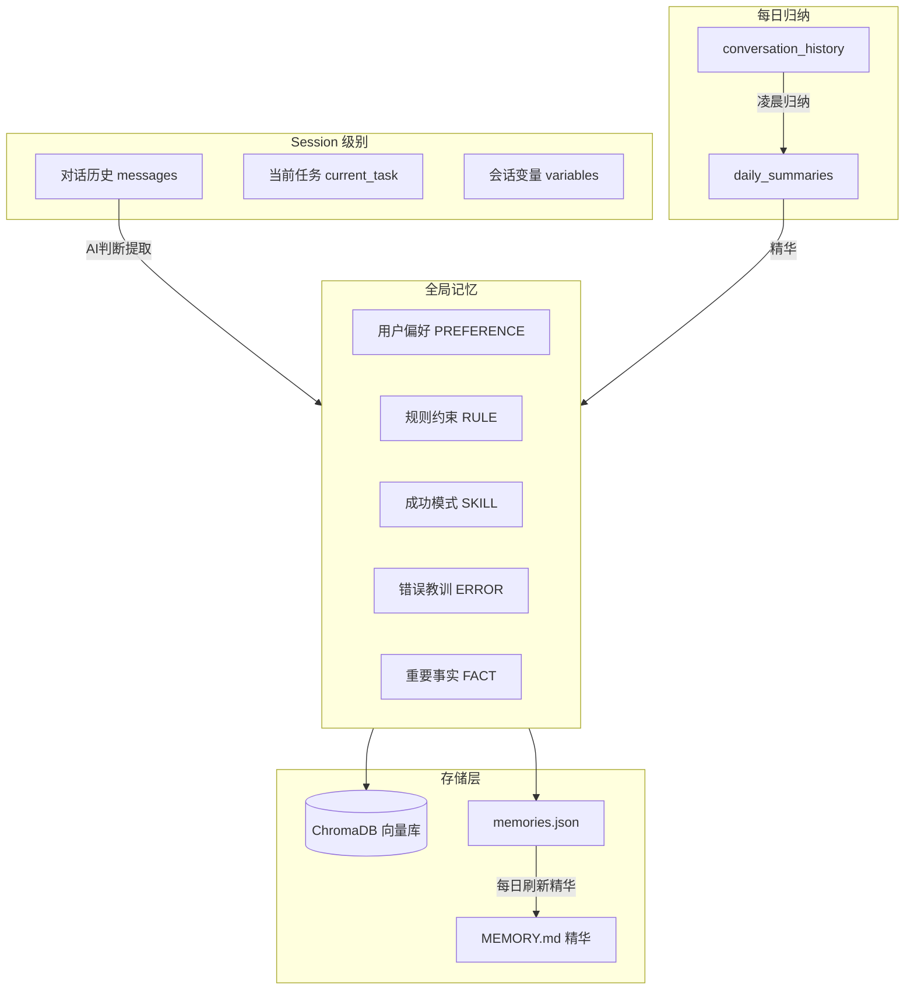
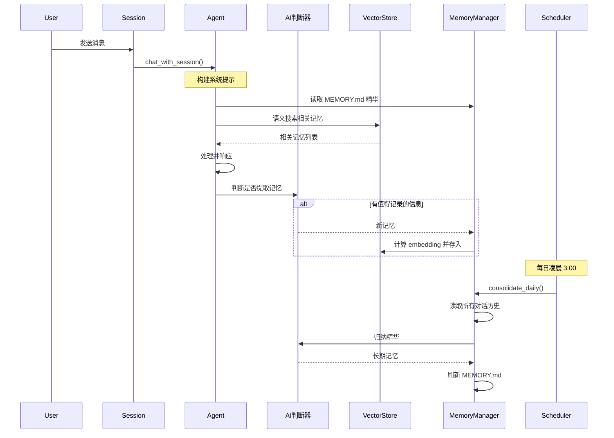
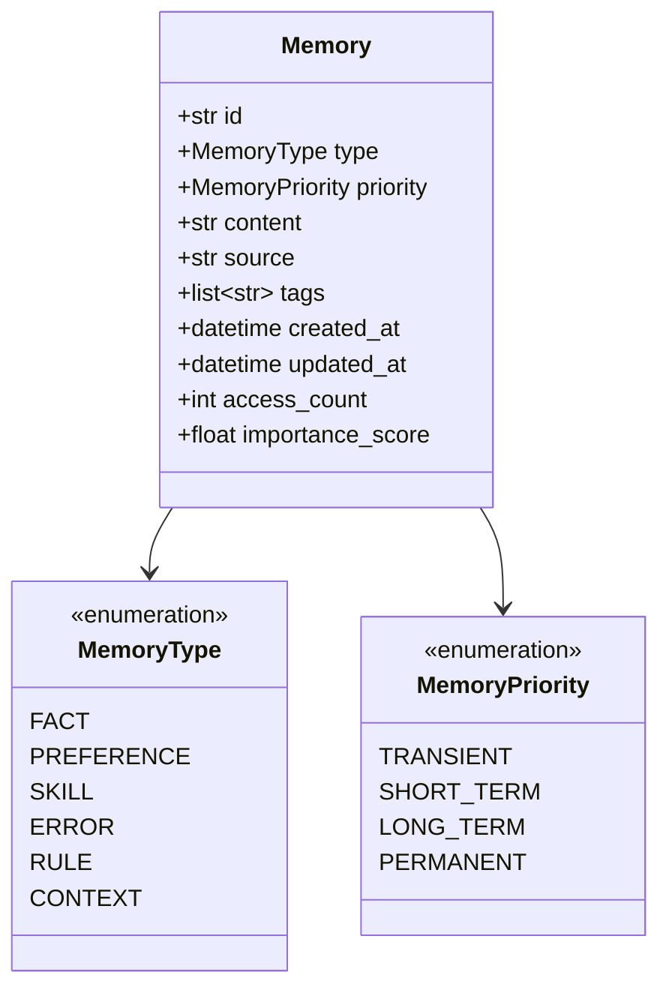
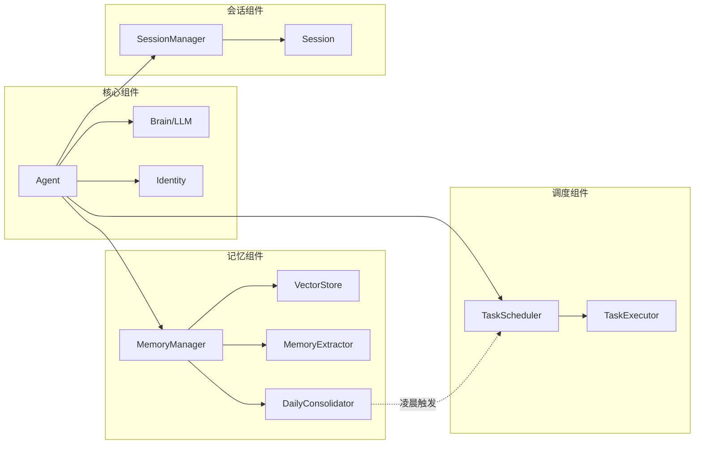
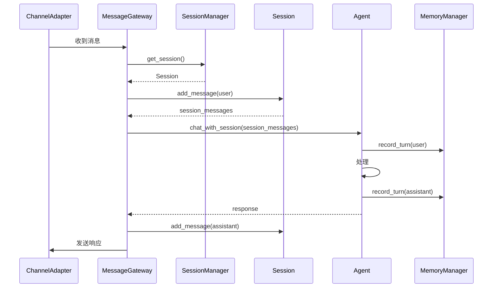
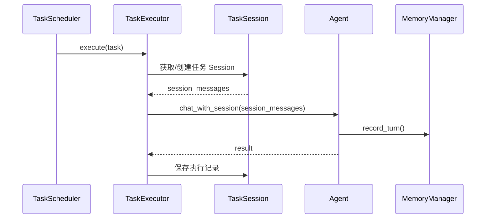
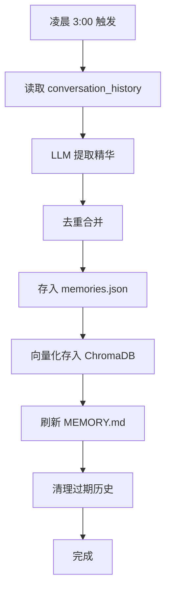

# 记忆系统架构

> 最后更新: 2026-01-31

## 一、整体架构



## 二、三层存储设计

| 存储 | 用途 | 更新频率 | 注入方式 |
|------|------|----------|----------|
| **ChromaDB** | 向量索引，语义搜索 | 实时（有新记忆就索引） | 按需搜索相关记忆 |
| **memories.json** | 完整记忆库 | 实时 | 作为 ChromaDB 的元数据 |
| **MEMORY.md** | 精华摘要（最重要的 10-15 条） | 每日凌晨刷新 | 每次系统提示都带上 |

## 三、数据流



## 四、记忆类型



| 类型 | 说明 | 示例 |
|------|------|------|
| FACT | 事实信息 | "用户的代码目录在 D:\code" |
| PREFERENCE | 用户偏好 | "用户喜欢用 Python" |
| SKILL | 成功模式 | "用 pytest 测试更可靠" |
| ERROR | 错误教训 | "直接删除文件会导致数据丢失" |
| RULE | 规则约束 | "不要有太强的风险意识" |
| CONTEXT | 上下文 | "当前项目是 myagent" |

| 优先级 | 保留时长 | 说明 |
|--------|----------|------|
| TRANSIENT | 会话结束后删除 | 临时信息 |
| SHORT_TERM | 3 天 | 短期记忆 |
| LONG_TERM | 数周 | 长期记忆 |
| PERMANENT | 永不删除 | 重要规则、核心偏好 |

## 五、组件关系



## 六、上下文获取流程

### IM 通道 (Telegram/Feishu)



### 定时任务



## 七、每日归纳流程



## 八、数据目录结构

```
data/memory/
├── memories.json              # 全局记忆（JSON，完整数据）
├── chromadb/                  # ChromaDB 向量索引
│   └── chroma.sqlite3
├── daily_summaries/           # 每日归纳摘要
│   ├── 2026-01-30.json
│   └── 2026-01-31.json
└── conversation_history/      # 原始对话历史（按日期）
    ├── {conversation_safe_id}.jsonl
    ├── {conversation_safe_id}.jsonl
    └── ...

data/scheduler/
└── task_sessions/             # 定时任务专属 Session
    └── {task_id}.json

identity/MEMORY.md             # 精华摘要（核心记忆，系统提示每次注入）
```

## 九、容量限制

| 限制 | 默认值 | 说明 |
|------|--------|------|
| MAX_HISTORY_DAYS | 30 | 超过 30 天的历史文件删除 |
| MAX_HISTORY_FILES | 1000 | 超过 1000 个文件删除最旧的 |
| MAX_HISTORY_SIZE_MB | 500 | 超过 500MB 删除最旧的 |
| MEMORY_MD_MAX_CHARS | 800 | MEMORY.md 精华最多 800 字符 |

## 十、性能指标

| 操作 | 耗时 | 备注 |
|------|------|------|
| 首次加载 embedding 模型 | ~5-10s | 仅启动时一次 |
| 单条记忆向量化 | ~50ms | 实时可接受 |
| 向量搜索 (100条记忆) | <10ms | ChromaDB 很快 |
| MEMORY.md 读取 | <1ms | 每次请求都读 |
| 每日归纳 | ~1-2min | 凌晨执行 |
| 首次下载模型 | ~1-5min | 约 100MB |

## 十一、关键文件

| 文件 | 说明 |
|------|------|
| `src/openakita/memory/manager.py` | 记忆管理器，核心协调组件 |
| `src/openakita/memory/vector_store.py` | 向量存储，语义搜索 |
| `src/openakita/memory/extractor.py` | AI 记忆提取器 |
| `src/openakita/memory/daily_consolidator.py` | 每日归纳器 |
| `src/openakita/memory/types.py` | 记忆类型定义 |
| `src/openakita/core/identity.py` | 身份管理，加载 MEMORY.md |
| `src/openakita/sessions/session.py` | Session 定义 |
| `src/openakita/scheduler/executor.py` | 定时任务执行器 |
