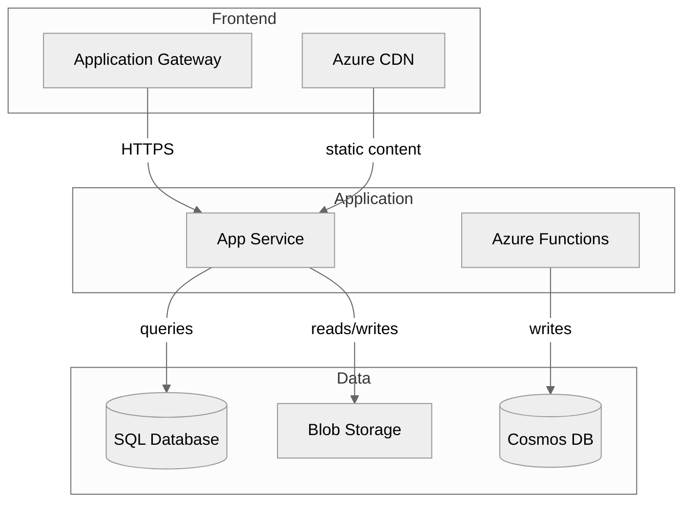

# Effective Prompts for Documentation Generation

**Purpose**: Learn how to use GitHub Copilot to generate professional documentation in minutes instead of hours.  
**Time Savings**: 90% reduction (20 hours → 2 hours)  
**Use Cases**: Architecture docs, runbooks, troubleshooting guides, API documentation

---

## Core Principles

### 1. Be Specific About Output Format

❌ **Vague**: "Generate documentation"  
✅ **Specific**: "Generate a Markdown architecture document with Mermaid diagrams, resource inventory table, and cost analysis section"

### 2. Provide Context

❌ **No Context**: "Document these Azure resources"  
✅ **With Context**: "Generate operational runbook for production e-commerce infrastructure deployed via Bicep, including deployment steps, scaling procedures, and rollback instructions"

### 3. Specify Structure

❌ **Unstructured**: "Make docs"  
✅ **Structured**: "Create documentation with these sections: Overview, Prerequisites, Architecture, Deployment Steps, Validation Checklist, Troubleshooting, References"

### 4. Use Templates

❌ **Ad-hoc**: Generate from scratch every time  
✅ **Template-based**: "Use this template structure: [paste template], fill with Azure Resource Graph data for resource group rg-prod"

---

## Pattern 1: Architecture Documentation

### Basic Architecture Doc

**Prompt**:

```bicep
Generate comprehensive Azure architecture documentation for resource group [name].

Include:
- Executive summary with resource count and primary location
- Complete resource inventory table (Name, Type, Location, Purpose)
- Architecture diagram in Mermaid syntax showing resource relationships
- Network topology diagram with VNets, subnets, and address spaces
- Security controls section (NSGs, Key Vaults, managed identities)
- Cost analysis with monthly/annual estimates
- Best practices recommendations (security, HA, performance, cost)

Output format: Markdown with embedded Mermaid diagrams
```

**Result**: 15-page architecture document in 5 minutes (vs. 6 hours manually)

### Advanced Architecture with Compliance

**Prompt**:

```bicep
Generate Azure architecture documentation for [resource group] with focus on compliance.

Required sections:
1. Executive Summary
2. Compliance Framework Mapping (NIST, ISO 27001, HIPAA where applicable)
3. Resource Inventory with compliance tags
4. Architecture Diagram (Mermaid) showing data flows and security boundaries
5. Network Security Architecture
6. Identity and Access Management
7. Data Protection (encryption at rest/transit, key management)
8. Audit and Monitoring configuration
9. Compliance Controls Matrix

For each resource, note:
- Compliance controls implemented
- Data classification
- Encryption status
- Access control method

Output: Markdown with Mermaid diagrams, compliance matrix table
```

**When to Use**: Regulated industries (healthcare, finance, government)

---

## Pattern 2: Operational Runbooks

### Deployment Runbook from Bicep

**Prompt**:

```bicep
Generate operational runbook from Bicep template at [path/to/template.bicep].

Extract and document:
1. Deployment prerequisites (tools, permissions, resource providers)
2. Parameter configuration requirements
3. Step-by-step deployment procedure with Azure CLI commands
4. What-If deployment validation steps
5. Post-deployment validation checklist
6. Common deployment errors and resolutions
7. Rollback procedure

Include:
- Code examples with proper syntax highlighting
- Expected output for each step
- Estimated time per phase
- Screenshots placeholders: [INSERT: deployment validation output]

Output: Markdown with PowerShell/Bash code blocks
```

**Result**: 25-page runbook in 20 minutes (vs. 5 hours manually)

### Operational Procedures Runbook

**Prompt**:

```text
Create operational procedures runbook for [application name] deployed in Azure.

Sections:
1. Daily Operations
   - Health check procedures
   - Log review and monitoring
   - Backup verification
2. Scaling Operations
   - Manual scaling (up/down, in/out)
   - Auto-scale configuration
   - Performance testing post-scale
3. Incident Response
   - Triage procedure (assess impact, identify root cause)
   - Communication plan (stakeholders, updates, resolution)
   - Escalation matrix
4. Maintenance Windows
   - Pre-maintenance checklist
   - Maintenance procedures
   - Post-maintenance validation
5. Access Management
   - Role assignment procedures
   - PIM activation
   - Access review process

For each procedure:
- Prerequisites
- Step-by-step instructions with commands
- Validation steps
- Rollback if applicable

Output: Wiki-style Markdown with linked table of contents
```

---

## Pattern 3: Troubleshooting Guides

### From Application Insights Patterns

**Prompt**:

```bicep
Generate troubleshooting guide from Application Insights telemetry.

Analyze past [30/60/90] days of data from Application Insights [resource name].

For each common issue pattern:
1. Issue Title (clear, descriptive)
2. Frequency (how often it occurs)
3. Symptoms (how users/operators observe it)
4. Root Cause (when identified)
5. Diagnostic Steps
   - KQL queries to investigate
   - Metrics to check
   - Logs to review
6. Resolution Steps (numbered, actionable)
7. Prevention (how to avoid in future)
8. Related Issues (cross-reference)

Common patterns to identify:
- HTTP 5xx errors (dependency failures, timeouts)
- Performance degradation (slow queries, high latency)
- Authentication failures
- Resource exhaustion (memory, CPU, connections)
- External dependency issues

Include:
- Decision tree diagram (Mermaid) for issue triage
- KQL query templates
- Escalation criteria

Output: Markdown with Mermaid flowcharts and KQL code blocks
```

### Generic Troubleshooting Template

**Prompt**:

```text
Create troubleshooting guide for [Azure service/application].

Structure as decision tree:
1. Symptom: [Description]
2. Quick Checks:
   - [ ] Is service health normal? (Azure Status)
   - [ ] Are alerts firing? (Azure Monitor)
   - [ ] Recent deployments? (Activity Log)
3. Diagnostic Path A: [Scenario]
   - Investigation steps
   - Resolution
4. Diagnostic Path B: [Scenario]
   - Investigation steps
   - Resolution

Top 10 Issues:
For each issue:
- Title
- Symptoms
- Diagnostic commands (CLI, Portal, KQL)
- Resolution steps
- Prevention tips

Include:
- Triage flowchart (Mermaid)
- Common error codes table
- Useful KQL queries
- Escalation contact information

Output: Markdown with Mermaid diagrams
```

---

## Pattern 4: API Documentation

### From Code Comments

**Prompt**:

```text
Generate API documentation from C# Web API project at [path].

Extract from XML documentation comments:
- Controller descriptions
- Endpoint routes (HTTP method, path)
- Request parameters (query, route, body)
- Request/response models with properties
- Authentication requirements
- Status codes and error responses

For each endpoint document:
1. Endpoint: [METHOD] /api/path
2. Description: [from XML comments]
3. Authentication: [Bearer token/API key/None]
4. Parameters:
   - Name, Type, Required, Description
5. Request Body: (JSON schema)
6. Response: (status code, JSON schema)
7. Example Request (cURL and PowerShell)
8. Example Response (JSON)
9. Error Responses (4xx, 5xx with explanations)

Include:
- Authentication flow diagram (Mermaid sequence)
- Rate limiting information
- API versioning strategy
- Sample code in multiple languages

Output: Markdown with OpenAPI/Swagger-style formatting
```

### From OpenAPI Spec

**Prompt**:

```text
Convert OpenAPI specification at [path/to/openapi.yaml] to user-friendly API documentation.

Generate:
1. Overview
   - API purpose and capabilities
   - Base URL and versioning
   - Authentication method
2. Getting Started
   - How to authenticate
   - First API call example
   - Common use cases
3. Endpoints (grouped by resource)
   For each endpoint:
   - Purpose and use case
   - Request examples (cURL, PowerShell, Python)
   - Response examples with descriptions
   - Error handling
4. Data Models
   - Object schemas with descriptions
   - Relationships between models
5. Code Examples
   - C# using HttpClient
   - PowerShell using Invoke-RestMethod
   - Python using requests library
6. Best Practices
   - Error handling patterns
   - Retry logic recommendations
   - Pagination strategies

Output: Developer-friendly Markdown with extensive examples
```

---

## Pattern 5: Disaster Recovery Documentation

### DR Procedures from Configuration

**Prompt**:

```sql
Generate disaster recovery runbook for [application/infrastructure name].

Based on:
- Azure Backup configuration
- Site Recovery settings
- Database replication setup
- Multi-region deployment

Document:
1. RTO/RPO Requirements
   - Per application/data tier
   - Business justification
2. Backup Strategy
   - What's backed up (resources, frequency, retention)
   - Backup locations (primary, secondary regions)
   - Backup validation procedures
3. Recovery Procedures
   Scenario A: Data Loss (point-in-time restore)
   - Detection and impact assessment
   - Restore procedure step-by-step
   - Data validation steps
   - Time estimate
   
   Scenario B: Regional Outage (failover)
   - Failover decision criteria
   - Failover procedure (automated vs manual)
   - Verification of services in secondary region
   - Time estimate
   
   Scenario C: Complete Environment Recreation
   - Infrastructure as Code deployment
   - Data restore from backups
   - Configuration and secrets restoration
   - Time estimate
4. DR Testing Plan
   - Quarterly test schedule
   - Test scenarios and checklists
   - Success criteria
   - Lessons learned process
5. Communication Plan
   - Stakeholder notification (when, how)
   - Status update cadence
   - Resolution announcement

Include:
- DR process flowchart (Mermaid)
- Contact information and escalation paths
- Recovery time estimates per scenario

Output: PDF-ready Markdown
```

---

## Pattern 6: Generating Diagrams

### Architecture Diagrams (Mermaid)

**Prompt**:

```bicep
Generate Mermaid architecture diagram for Azure infrastructure.

Resources:
[paste resource list or describe infrastructure]

Diagram requirements:
- Use `graph TB` (top-to-bottom layout)
- Group resources by tier: `subgraph Frontend`, `subgraph Application`, `subgraph Data`
- Show resource relationships with labeled arrows
- Use Azure service types as node labels
- Include external dependencies (on-prem, third-party APIs)

Relationships to show:
- Application → Database (connections)
- Application → Storage (data access)
- Frontend → Application (API calls)
- All → Monitoring (telemetry)

Output: Valid Mermaid syntax in Markdown code block
```

**Example Output**:



### Network Topology Diagrams

**Prompt**:

```

Create network topology diagram in Mermaid for Azure virtual network.

VNet configuration:
[paste VNet details: name, address space, subnets, NSGs, peering]

Diagram should show:

- VNet boundary with address space
- Subnets with address prefixes
- NSG associations
- VNet peering connections
- VPN Gateway or ExpressRoute (if present)
- Azure Firewall or NVA

Use `graph LR` (left-to-right) layout for network flow visualization.

Output: Mermaid syntax

```

### Sequence Diagrams for Workflows

**Prompt**:

```

Generate Mermaid sequence diagram for [workflow/process name].

Actors:

- User
- Application
- Authentication Service (Azure AD)
- Database
- External API

Flow:
[describe or paste workflow steps]

Diagram requirements:

- Show authentication flow
- Include success and error paths
- Note async operations
- Show retry logic if applicable

Output: Mermaid sequence diagram syntax

```

---

## Advanced Techniques

### Technique 1: Iterative Refinement

**Step 1 - Generate Basic Version**:

```

Generate basic architecture documentation for [resource group].
Include resource inventory and simple diagram.

```

**Step 2 - Enhance Specific Section**:

```

Expand the network security section of the architecture document.
Add details on:

- NSG rules and their purposes
- Azure Firewall configuration
- DDoS protection
- Private endpoints
- Service endpoints

```

**Step 3 - Add Cross-References**:

```

Add cross-references throughout the document:

- Link troubleshooting guide for common issues
- Reference runbook for operational procedures
- Link to compliance documentation
- Add related Azure documentation links

```

**Step 4 - Customize Tone**:

```

Adjust document tone for [audience]:

- Executive summary: Business-focused, non-technical
- Technical sections: Detailed for operations team
- Appendix: Reference information for support staff

```

### Technique 2: Template-Based Generation

**Create Template Once**:

```markdown
# [SERVICE NAME] Architecture Documentation

## Executive Summary
[AUTO: Service overview, resource count, cost estimate]

## Architecture Overview
[AUTO: High-level description]

### Architecture Diagram
[AUTO: Mermaid diagram]

## Resource Inventory
[AUTO: Table of resources]

## [Continue with your standard sections...]
```

**Prompt for Each Project**:

```bicep
Fill this architecture template for resource group [name]:
[paste template]

Extract data from Azure Resource Graph.
Generate Mermaid diagrams automatically.
Calculate cost estimates from resource SKUs.
```

### Technique 3: Multi-Document Generation

**Prompt for Complete Documentation Suite**:

```bicep
Generate complete documentation suite for [project name]:

1. Architecture Documentation (architecture.md)
   - Resource inventory, diagrams, security, costs
2. Deployment Runbook (deployment.md)
   - From Bicep templates at [path]
3. Operations Runbook (operations.md)
   - Daily, weekly, monthly procedures
4. Troubleshooting Guide (troubleshooting.md)
   - From Application Insights data
5. API Documentation (api.md)
   - From code at [path]
6. DR Procedures (disaster-recovery.md)
   - From backup/replication config

All documents should:
- Use consistent formatting and terminology
- Cross-reference each other
- Include generated date and version
- Use Mermaid for all diagrams

Output: 6 separate Markdown files
```

---

## Real-World Examples

### Example 1: Cloud Migration Handoff

**Scenario**: MSP completed Azure migration, needs to hand off to customer IT team

**Prompt**:

```text
Generate customer handoff documentation for completed Azure migration.

Context:
- 50 servers migrated from on-premises
- 3-tier web application architecture
- Production + DR environment
- Customer IT team will manage post-handoff

Required documents:
1. Architecture Overview (executive-friendly)
   - What was migrated, how it's organized
   - Cost breakdown and optimization opportunities
   - High-level architecture diagram
2. Operations Handbook
   - How to manage day-to-day
   - Monitoring and alerting
   - Common tasks (scaling, updates, backups)
3. Troubleshooting Guide
   - Most likely issues and resolutions
   - When to call support vs handle internally
   - Diagnostic tools and procedures
4. Contact and Escalation
   - Support tiers and contacts
   - Escalation criteria
   - SLA expectations

Tone: Educational (teach customer IT team), professional, comprehensive
Output: 4 linked Markdown documents
```

**Time**: 2 hours with Copilot vs. 20 hours manually

### Example 2: Audit Documentation

**Scenario**: Security audit requires comprehensive architecture and compliance documentation

**Prompt**:

```text
Generate audit-ready documentation for [environment name].

Purpose: SOC 2 Type II compliance audit

Required sections:
1. System Description
   - Architecture and boundaries
   - Data flows (Mermaid diagrams)
   - Trust Services Categories (security, availability, confidentiality)
2. Security Controls
   - Identity and access management
   - Network security (NSGs, firewalls, private endpoints)
   - Data protection (encryption, key management)
   - Logging and monitoring
3. Control Evidence
   - Configuration screenshots/exports
   - Policy documentation
   - Access logs
   - Change management records
4. Risk Assessment
   - Identified risks and mitigations
   - Control effectiveness rating

For each control:
- Control objective
- How it's implemented in Azure
- Evidence of operation
- Testing procedures

Tone: Formal, audit-appropriate
Output: Structured Markdown for PDF conversion
```

### Example 3: Knowledge Transfer

**Scenario**: Senior engineer leaving, need to document tribal knowledge

**Prompt**:

```text
Generate knowledge transfer documentation for [system name].

Capture:
1. Architecture Decisions
   - Why this design was chosen
   - Alternatives considered
   - Trade-offs made
   - Known limitations
2. Common Issues and Workarounds
   - Recurring problems and fixes
   - Temporary workarounds (and why needed)
   - Long-term solutions planned
3. Non-Obvious Configurations
   - Special settings and why they're necessary
   - Environment-specific quirks
   - Undocumented dependencies
4. Operational Tips
   - Things to watch out for
   - Seasonal patterns (load, costs, issues)
   - Useful tools and queries
5. Future Improvements
   - Technical debt items
   - Planned enhancements
   - Optimization opportunities

Tone: Conversational, mentor-to-mentee
Format: Wiki-style with lots of examples
```

---

## Measuring Success

### Documentation Quality Metrics

**Completeness**:

```text
Generate documentation completeness checklist for [doc type].
List all required sections, verify each is present and adequate.
Report completeness percentage.
```

**Accuracy Validation**:

```text
Compare generated documentation against actual Azure resources.
Verify:
- All resources documented
- No phantom resources (documented but don't exist)
- Properties match reality (SKUs, locations, configurations)
- Diagrams accurately represent relationships
Report discrepancies for manual review.
```

### Time Savings Tracking

| Document Type | Manual Time | Copilot Time | Savings | Savings % |
|---------------|-------------|--------------|---------|-----------|
| Architecture (15 pages) | 6 hours | 20 minutes | 5h 40m | 95% |
| Runbook (25 pages) | 5 hours | 20 minutes | 4h 40m | 93% |
| Troubleshooting (20 pages) | 4 hours | 30 minutes | 3h 30m | 87.5% |
| API Docs (18 pages) | 3 hours | 30 minutes | 2h 30m | 83% |
| DR Procedures (12 pages) | 2 hours | 20 minutes | 1h 40m | 83% |
| **TOTAL (90 pages)** | **20 hours** | **2 hours** | **18 hours** | **90%** |

---

## Troubleshooting Copilot

### Issue: Generated Content Too Generic

**Problem**: Documentation lacks specific details  
**Solution**: Provide more context in prompt

```yaml
# Instead of:
"Generate architecture documentation"

# Use:
"Generate architecture documentation for e-commerce platform on Azure.
Environment: Production
Scale: 10,000 concurrent users
Critical components: Payment processing, inventory management, order fulfillment
Compliance: PCI DSS, GDPR
Include specific configuration details for each component."
```

### Issue: Diagram Syntax Errors

**Problem**: Mermaid diagram won't render  
**Solution**: Request validation and fix

```text
Generate Mermaid architecture diagram for [resources].
After generation, validate Mermaid syntax is correct.
Fix any syntax errors.
Test in Mermaid Live Editor.
```

### Issue: Outdated Information

**Problem**: Documentation references old Azure Portal or deprecated features  
**Solution**: Specify current best practices

```text
Generate documentation using current Azure best practices (2024).
Use:
- Azure CLI (latest version)
- Bicep (not ARM templates)
- Managed identities (not service principals where possible)
- Private endpoints (not service endpoints)
- Azure Monitor (not classic alerts)
```

### Issue: Inconsistent Formatting

**Problem**: Multiple documents have different styles  
**Solution**: Use consistent template

```javascript
Generate all documents using this template structure:
[paste template with heading styles, section order, formatting rules]

Ensure consistency:
- Heading hierarchy (# ## ###)
- Code block language tags (```powershell, ```json)
- Table formatting
- Bullet vs numbered lists (bullets for items, numbers for steps)
```

---

## Best Practices Summary

### DO

✅ Provide detailed context about your infrastructure  
✅ Specify exact output format (Markdown, sections, diagrams)  
✅ Use templates for consistency across projects  
✅ Iterate and refine (basic → detailed → polished)  
✅ Verify generated content against reality  
✅ Customize for your audience (executives vs. operations)  
✅ Version control documentation alongside code  
✅ Regenerate when infrastructure changes  

### DON'T

❌ Use vague prompts ("make docs")  
❌ Skip human review and customization  
❌ Treat generated docs as 100% accurate without validation  
❌ Forget to update documentation when infrastructure changes  
❌ Store only in Word/Visio (use version-controlled Markdown)  
❌ Generate once and forget (docs should be living)  

---

## Getting Started Checklist

- [ ] Install VS Code with GitHub Copilot extension
- [ ] Set up Azure CLI and authenticate
- [ ] Install PowerShell Az module
- [ ] Prepare sample resource group for testing
- [ ] Create documentation template for your organization
- [ ] Generate first architecture document (follow Example 1)
- [ ] Review and customize output
- [ ] Measure time saved vs. manual approach
- [ ] Establish documentation regeneration schedule
- [ ] Share prompts with team

---

**Time to create this prompts guide with Copilot**: 30 minutes  
**Time to create manually**: 4 hours  
**Your time saved by using these prompts**: 18 hours per documentation project

Start with Pattern 1 (Architecture Documentation) and expand from there!
