# Agents Overview

> **Version 3.7.8** | Complete reference for all agents in the Agentic InfraOps workflow

This document provides a comprehensive overview of all agents in Agentic InfraOps, covering the complete 8-phase
infrastructure development and operations workflow. Each agent is designed for a specific purpose in the lifecycle
from requirements gathering through post-deployment diagnostics.

## Contents

- [Workflow Visualization](#workflow-visualization)
- [Agent Comparison Table](#agent-comparison-table)
- [How to Use Agents](#how-to-use-agents)
- [Phase-by-Phase Workflow](#phase-by-phase-workflow)
- [Agent Details](#agent-details)
- [Quick Reference Guide](#quick-reference-guide)
- [Related Documentation](#related-documentation)

---

## Workflow Visualization

The Agentic InfraOps workflow spans 8 phases, from initial requirements through post-deployment health diagnostics.
Agents work together in a coordinated workflow, with each specializing in a specific phase or cross-cutting concern.

```mermaid
%%{init: {'theme':'neutral'}}%%
graph TB
    subgraph "Phase 1: Requirements"
        P["Project Planner<br/>(custom agent)<br/>📋"]
    end

    subgraph "Phase 2: Architecture & Cost"
        A["architect<br/>🏛️"]
        MCP["💰 Azure Pricing MCP"]
    end

    subgraph "Phase 3: Design Artifacts"
        D["diagram<br/>📊 (-des)"]
        ADR1["adr<br/>📝 (-des)"]
        COST["Cost Estimate<br/>💰 (-des)"]
    end

    subgraph "Phase 4: Policy & Planning"
        POL["Policy Discovery<br/>🛡️ (bicep-plan)"]
        B["bicep-plan<br/>📐"]
    end

    subgraph "Phase 5: Code Generation"
        I["bicep-code<br/>⚙️"]
    end

    subgraph "Phase 6: Deployment"
        DEP["deploy<br/>🚀"]
    end

    subgraph "Phase 7: As-Built Documentation"
        D2["diagram<br/>📊 (-ab)"]
        ADR2["adr<br/>📝 (-ab)"]
        COST2["Cost Estimate<br/>💰 (-ab)"]
        WL["workload-documentation<br/>📚"]
    end

    subgraph "Phase 8: Health & Diagnostics"
        DIAG["azure-resource-health<br/>🏥"]
    end

    P -->|"01-requirements.md"| A
    MCP -.->|"real-time pricing"| A
    A -->|"02-assessment.md"| D
    A --> ADR1
    A --> COST
    D --> POL
    ADR1 --> POL
    COST --> POL
    POL -->|"04-governance-<br/>constraints.md"| B
    B -->|"04-implementation-<br/>plan.md"| I
    I -->|"infra/bicep/<br/>{project}/"| DEP
    DEP -->|"06-deployment-<br/>summary.md"| D2
    DEP --> ADR2
    DEP --> COST2
    DEP --> WL
    DEP -.->|"optional"| DIAG
    DIAG -->|"08-health-<br/>report.md"| WL

    style P fill:#e1f5fe
    style A fill:#fff3e0
    style MCP fill:#fff9c4
    style D fill:#f3e5f5
    style ADR1 fill:#e8eaf6
    style COST fill:#c8e6c9
    style POL fill:#ffe0b2
    style B fill:#e8f5e9
    style I fill:#fce4ec
    style DEP fill:#c8e6c9
    style D2 fill:#f3e5f5
    style ADR2 fill:#e8eaf6
    style COST2 fill:#c8e6c9
    style WL fill:#e3f2fd
    style DIAG fill:#ffccbc
```



### Workflow Flow Legend

| Symbol | Meaning                                    |
| ------ | ------------------------------------------ |
| `-->`  | Required sequential handoff                |
| `-.->` | Optional integration or supplementary data |
| 📋     | Requirements and planning                  |
| 🏛️     | Architecture and design                    |
| 💰     | Cost estimation and pricing                |
| 📊     | Visualization and diagrams                 |
| 📝     | Documentation and ADRs                     |
| 🛡️     | Governance and compliance                  |
| 📐     | Implementation planning                    |
| ⚙️     | Code generation                            |
| 🚀     | Deployment and execution                   |
| 📚     | Comprehensive documentation                |
| 🏥     | Health diagnostics and monitoring          |

---

## Agent Comparison Table

A comprehensive overview of all agents, their workflow phases, and outputs:

| Agent           | Phase | Purpose                            | Creates Code? | Output Files                          | Required |
| --------------- | ----- | ---------------------------------- | ------------- | ------------------------------------- | -------- |
| `plan` (custom) | 1     | Requirements & NFR gathering       | ❌ No         | `01-requirements.md`                  | ✅ Yes   |
| `architect`     | 2     | WAF assessment & architecture      | ❌ No         | `02-architecture-assessment.md`       | ✅ Yes   |
| `diagram`       | 3, 7  | Python architecture diagrams       | ✅ Yes        | `03-des-diagram.*`, `07-ab-diagram.*` | Optional |
| `adr`           | 3, 7  | Architecture Decision Records      | ❌ No         | `03-des-adr-*`, `07-ab-adr-*`         | Optional |
| `bicep-plan`    | 4     | Policy discovery & planning        | ❌ No         | `04-implementation-plan.md`           | ✅ Yes   |
| `bicep-code`    | 5     | Bicep IaC generation               | ✅ Yes        | `infra/bicep/{project}/`              | ✅ Yes   |
| `deploy`        | 6     | Azure deployment orchestration     | ❌ No         | `06-deployment-summary.md`            | ✅ Yes   |
| `docs`          | 7     | Customer-deliverable docs          | ❌ No         | `07-*.md` (6 files)                   | Optional |
| `diagnose`      | 8     | Post-deployment health diagnostics | ❌ No         | `08-resource-health-report.md`        | Optional |

### Key Capabilities by Function

| Capability                          | Agents                    |
| ----------------------------------- | ------------------------- |
| Requirements Analysis               | `plan`                    |
| Architecture Design                 | `architect`               |
| Cost Estimation (Real-time)         | `architect`, `bicep-plan` |
| Policy Compliance Discovery         | `bicep-plan`              |
| Infrastructure Code                 | `bicep-code`              |
| Visualization                       | `diagram`                 |
| Decision Documentation              | `adr`                     |
| Deployment Automation               | `deploy`                  |
| Operational Documentation           | `docs`                    |
| Health Assessment & Troubleshooting | `diagnose`                |

---

## How to Use Agents

### Invocation Steps

1. Press `Ctrl+Alt+I` to open Copilot Chat
2. Select agent from the **agent picker dropdown** at the top
3. Type your prompt and submit
4. **Wait for approval prompt** before proceeding to next step

### Agent Selection Guide

| I want to...                        | Use Agent    | Phase |
| ----------------------------------- | ------------ | ----- |
| Gather requirements                 | `plan`       | 1     |
| Get architecture guidance           | `architect`  | 2     |
| Create architecture diagram         | `diagram`    | 3, 7  |
| Document a decision                 | `adr`        | 3, 7  |
| Plan implementation with governance | `bicep-plan` | 4     |
| Generate Bicep code                 | `bicep-code` | 5     |
| Deploy to Azure                     | `deploy`     | 6     |
| Create customer documentation       | `docs`       | 7     |
| Diagnose resource health            | `diagnose`   | 8     |

---

## Phase-by-Phase Workflow

This section provides a detailed walkthrough of each phase in the 8-phase workflow.

### Phase 1: Requirements Definition

**Agent**: `plan` (custom)

**Objectives:**

- Capture comprehensive project requirements
- Define non-functional requirements (NFRs): SLA, RTO, RPO, performance
- Document compliance and security requirements
- Establish cost constraints and budget

**Key Outputs:**

- `01-requirements.md` - Structured requirements document

**Next Phase**: Architecture assessment with `architect`

### Phase 2: Well-Architected Framework Assessment & Cost Estimation

**Agent**: `architect`

**Objectives:**

- Assess architecture against Azure WAF five pillars
- Recommend Azure services and patterns
- Provide real-time cost estimates via Azure Pricing MCP
- Validate NFRs are captured before proceeding

**Key Outputs:**

- `02-architecture-assessment.md` - WAF pillar scores and recommendations

**MCP Integration**: Azure Pricing MCP provides real-time SKU pricing and cost comparisons

**Next Phase**: Design artifacts (diagrams, ADRs, cost estimates)

### Phase 3: Design Artifacts & Documentation

**Agents**: `diagram`, `adr`

**Objectives:**

- Visualize proposed architecture with diagrams
- Document key architectural decisions
- Generate detailed cost estimates

**Key Outputs:**

- `03-des-diagram.py` + `.png` - Architecture visualization
- `03-des-adr-NNN-{title}.md` - Architecture Decision Records
- `03-des-cost-estimate.md` - Detailed cost breakdown

**Suffix Convention**: `-des` indicates design-phase artifacts

**Next Phase**: Policy discovery and implementation planning

### Phase 4: Azure Policy Discovery & Implementation Planning

**Agent**: `bicep-plan`

**Objectives:**

- Query Azure Resource Graph for policy assignments
- Discover governance constraints and compliance requirements
- Plan module structure and resource dependencies
- Validate cost estimates against implementation plan

**Key Outputs:**

- `04-implementation-plan.md` - Detailed implementation roadmap
- `04-governance-constraints.md` - Policy compliance documentation
- `04-governance-constraints.json` - Machine-readable policy data

**MCP Integration**: Azure Pricing MCP for cost validation

**Next Phase**: Bicep code generation

### Phase 5: Bicep Infrastructure-as-Code Generation

**Agent**: `bicep-code`

**Objectives:**

- Generate production-ready Bicep templates
- Create modular, reusable infrastructure code
- Follow AVM-first approach (Azure Verified Modules)
- Validate code with bicep build and lint

**Key Outputs:**

- `infra/bicep/{project}/main.bicep` - Main template
- `infra/bicep/{project}/modules/*.bicep` - Modular resources
- `infra/bicep/{project}/deploy.ps1` - Deployment script
- `05-implementation-reference.md` - Code documentation

**Standards Applied**:

- Unique suffix pattern for resource naming
- Security defaults (TLS 1.2, HTTPS-only, Azure AD auth)
- Diagnostic settings for all resources

**Next Phase**: Deployment to Azure

### Phase 6: Azure Deployment

**Agent**: `deploy`

**Objectives:**

- Execute infrastructure deployment to Azure
- Perform what-if analysis before deployment
- Manage deployment lifecycle
- Generate deployment summary with resource IDs

**Workflow Steps:**

1. Pre-deployment validation (Azure CLI auth, Bicep build)
2. Run what-if analysis for impact assessment
3. Execute deployment after user approval
4. Generate deployment summary

**Key Outputs:**

- `06-deployment-summary.md` - Deployment record with endpoints

**Next Phase**: As-built documentation and optional health diagnostics

### Phase 7: As-Built Documentation

**Agents**: `diagram`, `adr`, `docs`

**Objectives:**

- Document deployed infrastructure state
- Create customer-deliverable documentation package
- Capture implementation decisions
- Generate operational runbooks

**Key Outputs:**

- `07-ab-diagram.py` + `.png` - As-built architecture diagram
- `07-ab-adr-NNN-{title}.md` - Implementation ADRs
- `07-ab-cost-estimate.md` - Actual deployment costs
- `07-documentation-index.md` - Master documentation index
- `07-design-document.md` - Complete design document
- `07-operations-runbook.md` - Day-2 operations procedures
- `07-resource-inventory.md` - Resource listing
- `07-compliance-matrix.md` - Security control mapping (optional)
- `07-backup-dr-plan.md` - DR procedures (optional)

**Suffix Convention**: `-ab` indicates as-built artifacts

**Next Phase**: Optional health diagnostics

### Phase 8: Resource Health Diagnostics (Optional)

**Agent**: `diagnose`

**Objectives:**

- Validate deployed resource health
- Identify and diagnose issues
- Recommend remediation actions
- Generate comprehensive health report

**When to Use:**

- Post-deployment validation before go-live
- Troubleshooting production issues
- Periodic health assessments
- Before major changes or scaling events

**Key Outputs:**

- `08-resource-health-report.md` - Diagnostic findings and remediation actions

**Workflow Phases:**

1. Resource discovery and validation
2. Health status assessment
3. Log and telemetry analysis
4. Issue classification and root cause
5. Remediation planning and execution
6. Report generation

**Interactive Features**: Approval-first execution, clarifying questions at each phase

---

## Agent Details

This section provides detailed information about each agent, including purpose, behaviors, example prompts, and outputs.

### requirements

> **Phase 1** | Custom requirements gathering agent

**Purpose**: Gather comprehensive requirements including business context, NFRs (SLA/RTO/RPO), compliance needs,
and cost constraints. This is a custom agent specifically designed for Azure infrastructure projects.

> **Note**: VS Code includes a built-in "Plan" agent for general planning. This repository uses the custom
> **Requirements** agent (`requirements.agent.md`) with Azure-specific instructions and workflow handoffs.

**📋 Template**: Use [`.github/prompts/plan-requirements.prompt.md`](../../.github/prompts/plan-requirements.prompt.md)

**Example Prompt**:

```text
Create deployment plan for HIPAA-compliant patient portal.
Business context: Healthcare startup serving 10,000 patients.
NFRs: 99.95% SLA, RTO=4hrs, RPO=1hr, <2s page load.
Compliance: HIPAA, SOC 2, data residency in EU.
Budget: $3,000/month maximum.
```

**Output**: `agent-output/{project}/01-requirements.md`

---

### architect

> **Phase 2** | Azure Well-Architected Framework assessment

**Purpose**: Provide architectural guidance based on Azure WAF pillars. Does NOT create any code—only assessment
and recommendations.

**Key Behaviors**:

- Validates that Step 1 captured NFRs before proceeding
- Scores each WAF pillar (Reliability, Security, Cost, Operations, Performance)
- Recommends Azure services and patterns
- Integrates with Azure Pricing MCP for cost estimates

**Example Prompt**:

```text
@architect Assess architecture for patient portal from Step 1.
Focus on HIPAA compliance and high availability requirements.
```

**Output**: `agent-output/{project}/02-architecture-assessment.md`

**📖 Definition**: [`.github/agents/architect.agent.md`](../../.github/agents/architect.agent.md)

---

### diagram

> **Phases 3 & 7** | Python architecture diagrams

**Purpose**: Generate architecture diagrams using the `diagrams` Python library. Creates both `.py` source files
and rendered `.png` images.

**When to Use**:

- Step 3: Design-phase diagrams (`-des` suffix)
- Step 7: As-built diagrams (`-ab` suffix)

**Example Prompts**:

```text
@diagram Create architecture diagram for the patient portal design.

@diagram Generate as-built diagram showing deployed infrastructure.
```

**Output**:

- `agent-output/{project}/03-des-diagram.py` + `.png`
- `agent-output/{project}/07-ab-diagram.py` + `.png`

**📖 Definition**: [`.github/agents/diagram.agent.md`](../../.github/agents/diagram.agent.md)

---

### adr

> **Phases 3 & 7** | Architecture Decision Records

**Purpose**: Create ADRs documenting significant architectural decisions with context, options considered,
and rationale.

**When to Use**:

- Step 3: Design-phase decisions (`-des` suffix)
- Step 7: Implementation decisions (`-ab` suffix)

**Example Prompts**:

```text
@adr Create ADR for database selection decision (SQL vs Cosmos DB).

@adr Document the decision to use App Service instead of AKS.
```

**Output**:

- `agent-output/{project}/03-des-adr-NNN-{title}.md`
- `agent-output/{project}/07-ab-adr-NNN-{title}.md`

**📖 Definition**: [`.github/agents/adr.agent.md`](../../.github/agents/adr.agent.md)

---

### bicep-plan

> **Phase 4** | Implementation planning with governance discovery

**Purpose**: Create detailed implementation plan including module structure, resource dependencies, and
governance constraints from Azure Policy.

**Key Behaviors**:

- Queries Azure Resource Graph for policy assignments
- Generates governance constraints file
- Plans module structure and dependencies
- Integrates with Azure Pricing MCP for cost validation

**Example Prompt**:

```text
@bicep-plan Create implementation plan for patient portal architecture.
Include module structure and deployment order.
```

**Output**:

- `agent-output/{project}/04-implementation-plan.md`
- `agent-output/{project}/04-governance-constraints.md`

**📖 Definition**: [`.github/agents/bicep-plan.agent.md`](../../.github/agents/bicep-plan.agent.md)

---

### bicep-code

> **Phase 5** | Bicep code generation

**Purpose**: Generate production-ready Bicep templates based on the implementation plan. Creates modular,
validated code following AVM-first approach.

**Key Behaviors**:

- Generates `main.bicep` + module files
- Creates deployment script (`deploy.ps1`)
- Validates with `bicep build` and `bicep lint`
- Follows unique suffix pattern for resource names
- Uses Azure Verified Modules where available

**Example Prompt**:

```text
@bicep-code Generate Bicep templates for patient portal.
Follow the implementation plan from Step 4.
```

**Output**:

- `infra/bicep/{project}/main.bicep`
- `infra/bicep/{project}/modules/*.bicep`
- `infra/bicep/{project}/deploy.ps1`
- `agent-output/{project}/05-implementation-reference.md`

**📖 Definition**: [`.github/agents/bicep-code.agent.md`](../../.github/agents/bicep-code.agent.md)

---

### deploy

> **Phase 6** | Azure deployment orchestration

**Purpose**: Execute Azure infrastructure deployments using generated Bicep templates. Runs deploy.ps1 scripts,
performs what-if analysis, and manages deployment lifecycle.

**Workflow**:

1. Pre-deployment validation (Azure CLI auth, Bicep build)
2. Run what-if analysis for impact assessment
3. Execute deployment after user approval
4. Generate deployment summary

**Creates**:

- `06-deployment-summary.md` — Deployment record with resource IDs and endpoints

**Example Prompt**:

```text
@deploy Deploy the Bicep templates for the ecommerce project to Azure.
Run what-if analysis first before actual deployment.
```

**Output**: `agent-output/{project}/06-deployment-summary.md`

**📖 Definition**: [`.github/agents/deploy.agent.md`](../../.github/agents/deploy.agent.md)

---

### docs

> **Phase 7** | Customer-deliverable documentation

**Purpose**: Generate comprehensive workload documentation package for customer handoff, including design docs,
runbooks, and compliance matrices.

**Creates**:

- `07-documentation-index.md` — Master index
- `07-design-document.md` — Architecture design document
- `07-operations-runbook.md` — Day-2 operational procedures
- `07-resource-inventory.md` — Complete resource listing
- `07-compliance-matrix.md` — Security control mapping
- `07-backup-dr-plan.md` — DR procedures

**Example Prompt**:

```text
@docs Generate complete workload documentation package
for the deployed patient portal infrastructure.
```

**Output**: `agent-output/{project}/07-*.md` (6 files)

**📖 Definition**: [`.github/agents/docs.agent.md`](../../.github/agents/docs.agent.md)

---

### diagnose

> **Phase 8** | Post-deployment health assessment and diagnostics

**Purpose**: Interactive diagnostic agent that guides users through Azure resource health assessment, issue
identification, and remediation planning. Operates on a single resource or entire resource group.

**Key Behaviors**:

- **Approval-First Execution**: All diagnostic commands require user approval before execution
- **Interactive Guidance**: Asks clarifying questions at each phase transition
- **Educational Approach**: Explains what each diagnostic step reveals and why it matters
- **Flexible Scope**: Supports single-resource or resource-group-level diagnostics

**Diagnostic Workflow**:

1. **Resource Discovery** - Identify and validate target Azure resources
2. **Health Assessment** - Evaluate availability, performance, and error rates
3. **Log Analysis** - Analyze logs and telemetry for patterns and issues
4. **Issue Classification** - Categorize by severity and root cause
5. **Remediation Planning** - Create and execute approved remediation actions
6. **Report Generation** - Document findings and actions taken

**When to Use**:

- Post-deployment validation before go-live
- Troubleshooting production issues
- Periodic health assessments of production workloads
- Before major changes or scaling events

**Handoff Options**:

- To `architect` - For architectural issues requiring WAF evaluation
- To `docs` - To incorporate health findings into as-built documentation

**Example Prompt**:

```text
@diagnose Diagnose health of my-app-prod web app
in rg-myapp-prod. Check availability, performance, and recent errors.
```

**Output**: `agent-output/{project}/08-resource-health-report.md`

**📖 Definition**: [`.github/agents/diagnose.agent.md`](../../.github/agents/diagnose.agent.md)

---

## Quick Reference Guide

### By Task

| I want to...                        | Use Agent    | Phase |
| ----------------------------------- | ------------ | ----- |
| Gather requirements                 | `plan`       | 1     |
| Get architecture guidance           | `architect`  | 2     |
| Create architecture diagram         | `diagram`    | 3, 7  |
| Document a decision                 | `adr`        | 3, 7  |
| Plan implementation with governance | `bicep-plan` | 4     |
| Generate Bicep code                 | `bicep-code` | 5     |
| Deploy to Azure                     | `deploy`     | 6     |
| Create customer documentation       | `docs`       | 7     |
| Diagnose resource health            | `diagnose`   | 8     |

### By Workflow Phase

| Phase | Focus Area               | Primary Agents                  | Outcome                                 |
| ----- | ------------------------ | ------------------------------- | --------------------------------------- |
| 1     | Requirements             | `requirements`                  | Clear project scope & NFRs              |
| 2     | Architecture & Costing   | `architect` + Azure Pricing MCP | WAF-aligned design with real-time costs |
| 3     | Design Documentation     | `diagram`, `adr`                | Visual architecture & decisions         |
| 4     | Governance & Planning    | `bicep-plan`                    | Policy-compliant implementation plan    |
| 5     | Code Generation          | `bicep-code`                    | Production-ready Bicep templates        |
| 6     | Deployment               | `deploy`                        | Live Azure infrastructure               |
| 7     | As-Built Documentation   | `diagram`, `adr`, `workload-*`  | Customer-deliverable documentation      |
| 8     | Health & Troubleshooting | `diagnose`                      | Health validation & issue resolution    |

### By Output Artifact

| Artifact                        | Agent(s)       | Phase |
| ------------------------------- | -------------- | ----- |
| `01-requirements.md`            | `requirements` | 1     |
| `02-architecture-assessment.md` | `architect`    | 2     |
| `03-des-diagram.*`              | `diagram`      | 3     |
| `03-des-adr-*.md`               | `adr`          | 3     |
| `03-des-cost-estimate.md`       | `architect`    | 3     |
| `04-implementation-plan.md`     | `bicep-plan`   | 4     |
| `04-governance-constraints.md`  | `bicep-plan`   | 4     |
| `infra/bicep/{project}/`        | `bicep-code`   | 5     |
| `06-deployment-summary.md`      | `deploy`       | 6     |
| `07-ab-diagram.*`               | `diagram`      | 7     |
| `07-*.md` (documentation set)   | `docs`         | 7     |
| `08-resource-health-report.md`  | `diagnose`     | 8     |

---

## Related Documentation

### Core Workflow Documents

- [Workflow Guide](workflow.md) — Complete 8-phase workflow with detailed examples
- [Defaults Reference](defaults.md) — Regional standards, naming conventions, tags
- [Bicep Patterns](bicep-patterns.md) — Infrastructure code best practices

### Agent Definitions

All agent definitions are located in `.github/agents/`:

- [requirements.agent.md](../../.github/agents/requirements.agent.md)
- [architect.agent.md](../../.github/agents/architect.agent.md)
- [diagram.agent.md](../../.github/agents/diagram.agent.md)
- [adr.agent.md](../../.github/agents/adr.agent.md)
- [bicep-plan.agent.md](../../.github/agents/bicep-plan.agent.md)
- [bicep-code.agent.md](../../.github/agents/bicep-code.agent.md)
- [deploy.agent.md](../../.github/agents/deploy.agent.md)
- [docs.agent.md](../../.github/agents/docs.agent.md)
- [diagnose.agent.md](../../.github/agents/diagnose.agent.md)

### Supporting Resources

- [Azure Pricing MCP Server](../../mcp/azure-pricing-mcp/README.md) — Real-time pricing integration
- [Copilot Instructions](../../.github/copilot-instructions.md) — Repository-level guidance
- [Repository README](../../README.md) — Project overview and getting started

### Templates & Prompts

- [Requirements Template](../../.github/prompts/plan-requirements.prompt.md) — Phase 1 starting point
- [Artifact Templates](../../.github/templates/) — Canonical output structures
