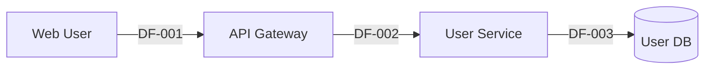

<!-- Threat Modeling Skill | Version 3.0.2 (20260204a) | https://github.com/fr33d3m0n/threat-modeling | License: BSD-3-Clause -->

# Phase 2: Call Flow & DFD Analysis

**Type**: Constructive
**Executor**: LLM + Script
**Knowledge**: Security Principles, security-design.yaml, Phase 2 Knowledge Base

---

## ⚠️ MANDATORY: 4-Phase Gating Protocol (BLOCKING)

> **CRITICAL**: You MUST complete the following four stages in sequence and **output the result of each stage**. Skipping any stage will degrade analysis quality!

━━━━━━━━━━━━━━━━━━━━━━━━━━━━━━━━━━━━━━━━━━━━━━━━━━━━━━━━━━━━━━━━━━
### 🧠 THINKING - Phase 2 Entry Gate
━━━━━━━━━━━━━━━━━━━━━━━━━━━━━━━━━━━━━━━━━━━━━━━━━━━━━━━━━━━━━━━━━━

**Purpose**: Build DFD based on P1 data. MUST NOT generate from memory.

**⚠️ You MUST output THINKING results in the following format:**

```
🧠 THINKING - P2 Entry Gate
━━━━━━━━━━━━━━━━━━━━━━━━━━━━━━━━━━━━━━━━━━━━━━━

📌 CORE PROBLEM
Build complete Data Flow Diagram (DFD) and Call Flow Diagram (CFD) to establish the foundation for STRIDE analysis

📊 UPSTREAM DATA (Read from P1 YAML)
| Metric | Value | Source |
|--------|-------|--------|
| P1 Total Modules | {actual_value} | P1_project_context.yaml → module_inventory.summary.total_modules |
| P1 Total Entry Points | {actual_value} | P1_project_context.yaml → entry_point_inventory.summary.total |
| P1 Coverage Confidence | {actual_value} | P1_project_context.yaml → coverage_confidence.overall_confidence |
| Project Type | {actual_value} | P1_project_context.yaml → project_context.project_type |

❓ UNKNOWNS
- Complete data flow path for each entry point
- Cross-module call chains
- Data store access patterns
- Security checkpoint locations

⚠️ RISKS
- L1 coverage < 100% (any dimension)
- Interface missing data_flow mapping
- Data store missing access_patterns
- Dynamic call indicators not documented

━━━━━━━━━━━━━━━━━━━━━━━━━━━━━━━━━━━━━━━━━━━━━━━
⛔ STOP CHECK
- P1 YAML read? [YES/NO]
- Upstream data complete (module count/entry point count/confidence all have values)? [YES/NO]
- Ready to continue PLANNING? [YES/NO]
━━━━━━━━━━━━━━━━━━━━━━━━━━━━━━━━━━━━━━━━━━━━━━━
```

⛔ **STOP CONDITION**: If any STOP CHECK = NO → Read P1 data first before continuing

━━━━━━━━━━━━━━━━━━━━━━━━━━━━━━━━━━━━━━━━━━━━━━━━━━━━━━━━━━━━━━━━━━
### 📋 PLANNING - Sub-task Decomposition
━━━━━━━━━━━━━━━━━━━━━━━━━━━━━━━━━━━━━━━━━━━━━━━━━━━━━━━━━━━━━━━━━━

**Step 1: Read Upstream Data** (BLOCKING - MUST execute)
```bash
# Read P1 YAML data
python scripts/phase_data.py --query --phase 1 --summary --root .
python scripts/phase_data.py --query --phase 1 --type entry_points --root .

# Or read directly
cat .phase_working/{SESSION_ID}/data/P1_project_context.yaml
```
⛔ If P1 YAML does not exist or is invalid → STOP and return to complete P1

**Step 2: Output Sub-task Table** (MANDATORY)

**⚠️ You MUST output PLANNING results in the following format:**

```
📋 PLANNING - P2 Sub-tasks
━━━━━━━━━━━━━━━━━━━━━━━━━━━━━━━━━━━━━━━━━━━━━━━

| # | Sub-task | Expected Output |
|---|----------|-----------------|
| T1 | Read P1 data, extract module/entry point inventory | Data structure |
| T2 | P2.0 Init - Extract traversal tasks | Task list |
| T3 | P2.1-P2.4 Critical Path Track | Interface/data flow/call flow/data store |
| T4 | P2.T Full Traversal Track | Parallel sub-agent results |
| T5 | P2.T.3 Coverage validation | 100% coverage confirmation |
| T6 | P2.5 Synthesis - Generate dfd_elements | DFD element inventory |
| T7 | Write final output | P2_dfd_elements.yaml + MD |

⛔ PLANNING CHECK
- Sub-tasks decomposed? [YES/NO]
- Ready to execute TaskCreate? [YES/NO]
━━━━━━━━━━━━━━━━━━━━━━━━━━━━━━━━━━━━━━━━━━━━━━━
```

**Step 3: TaskCreate for ALL sub-tasks** (MANDATORY)

⚠️ Before starting any implementation, you MUST execute `TaskCreate` to create all sub-tasks!

━━━━━━━━━━━━━━━━━━━━━━━━━━━━━━━━━━━━━━━━━━━━━━━━━━━━━━━━━━━━━━━━━━
### ⚡ EXECUTION LOOP
━━━━━━━━━━━━━━━━━━━━━━━━━━━━━━━━━━━━━━━━━━━━━━━━━━━━━━━━━━━━━━━━━━

For each sub-task:
1. `TaskUpdate(status: "in_progress")`
2. Implement sub-task
3. Verify: Does output match expectations?
4. If verification passes: `TaskUpdate(status: "completed")` → Next sub-task
5. If verification fails: Diagnose → Fix → Retry (max 3x) → If still failing: CHECKPOINT to request user decision

**Output Order** (CRITICAL):
1. **Write YAML first**: `.phase_working/{SESSION_ID}/data/P2_dfd_elements.yaml`
2. **Write MD second**: `.phase_working/{SESSION_ID}/reports/P2-DFD-ANALYSIS.md`

**Key Commands**:
```bash
# P2.0 Task extraction
python scripts/phase_data.py --p2-extract-tasks --root .

# P2.T.3 Coverage validation
python scripts/phase_data.py --p2-validate-coverage --root .
```

━━━━━━━━━━━━━━━━━━━━━━━━━━━━━━━━━━━━━━━━━━━━━━━━━━━━━━━━━━━━━━━━━━
### 🔍 REFLECTION - Completion Verification
━━━━━━━━━━━━━━━━━━━━━━━━━━━━━━━━━━━━━━━━━━━━━━━━━━━━━━━━━━━━━━━━━━

**⚠️ After completing EXECUTION, you MUST output REFLECTION results in the following format:**

```
🔍 REFLECTION - P2 Completion Check
━━━━━━━━━━━━━━━━━━━━━━━━━━━━━━━━━━━━━━━━━━━━━━━

| Check Item | Status |
|------------|--------|
| P1 YAML data read and understood? | [✅/❌] |
| P2_dfd_elements.yaml exists and valid? | [✅/❌] |
| interface_inventory contains all L1-L3 interfaces? | [✅/❌] |
| data_flow_traces covers all entry points? | [✅/❌] |
| interfaces.coverage_percentage == 100? | [✅/❌] |
| data_flows.coverage_percentage == 100? | [✅/❌] |
| call_chains.coverage_percentage >= 95? | [✅/❌] |
| data_stores.coverage_percentage == 100? | [✅/❌] |
| Hook validation passed (exit 0)? | [✅/❌] |

⛔ COMPLETION GATE
- All checks passed? [YES/NO]
- Ready to enter P3? [YES/NO]
━━━━━━━━━━━━━━━━━━━━━━━━━━━━━━━━━━━━━━━━━━━━━━━
```

⛔ If any check fails → Fix and re-verify until all pass

---

## ⚠️ MANDATORY OUTPUT RULES

> **CRITICAL**: Phase 2 requires TWO outputs - a YAML data file AND a Markdown report.

### Dual Output Requirement

```
┌─────────────────────────────────────────────────────────────────────┐
│  PHASE 2 MUST PRODUCE TWO FILES:                                    │
├─────────────────────────────────────────────────────────────────────┤
│                                                                      │
│  1. DATA FILE (PRIMARY - Write First!)                              │
│     Path: .phase_working/{SESSION_ID}/data/P2_dfd_elements.yaml     │
│     Purpose: Structured data for P3 to read                         │
│     Format: Valid YAML with schema_version: "3.0.2 (20260204a)"                   │
│                                                                      │
│  2. REPORT FILE (SECONDARY - Write After Data!)                     │
│     Path: .phase_working/{SESSION_ID}/reports/P2-DFD-ANALYSIS.md    │
│     Purpose: Human-readable DFD analysis report                     │
│     Format: Markdown with diagrams and tables                       │
│                                                                      │
│  INPUT REQUIREMENT:                                                  │
│     Read: .phase_working/{SESSION_ID}/data/P1_project_context.yaml  │
│     ❌ DO NOT read P1's .md report for data extraction              │
│     ✅ REQUIRED: Parse P1's YAML for entry_points, modules          │
│                                                                      │
└─────────────────────────────────────────────────────────────────────┘
```

### Required Data Sections in YAML

| Section | Validation |
|---------|------------|
| `interface_inventory` | BLOCKING - all L1-L3 interfaces |
| `data_flow_traces` | BLOCKING - all entry points traced |
| `call_flow_graph` | BLOCKING - security checkpoints mapped |
| `data_store_inventory` | BLOCKING - sensitivity tagged |
| `dfd_elements` | BLOCKING - unified DFD model |
| `l1_coverage` | BLOCKING - coverage_percentage == 100 |
| `dataflow_findings` | WARNING - security observations from DFD analysis |

### Validation Gate

Phase 2 CANNOT complete until:
1. `.phase_working/{SESSION_ID}/data/P2_dfd_elements.yaml` exists and is valid YAML
2. **Multi-Dimensional Coverage Verification (GAP-2 FIX)**:
   - `l1_coverage.interfaces.coverage_percentage == 100` (BLOCKING)
   - `l1_coverage.data_flows.coverage_percentage == 100` (BLOCKING)
   - `l1_coverage.call_chains.coverage_percentage >= 95` (BLOCKING, allows minor dynamic gaps)
   - `l1_coverage.data_stores.coverage_percentage == 100` (BLOCKING)
3. Every interface has corresponding data_flow with source/destination
4. Every data_store has access_patterns[] and sensitivity_level
5. Dynamic call indicators documented with impact assessment
6. `.phase_working/{SESSION_ID}/reports/P2-DFD-ANALYSIS.md` exists

---

## Input Context

← P1: `project_context` {project_type, modules[], entry_points[], security_design{}}

### ⚠️ MANDATORY: Query P1 Data Before Analysis

**Before starting P2 analysis**, LLM MUST execute these queries to obtain P1 data:

```bash
# Step 1: Get P1 summary for context
python scripts/phase_data.py --query --phase 1 --summary --root .

# Step 2: Get detailed entry points (REQUIRED for DFD)
python scripts/phase_data.py --query --phase 1 --type entry_points --root .

# Step 3: Get module inventory (REQUIRED for mapping)
python scripts/phase_data.py --query --phase 1 --type modules --root .
```

**Or read YAML directly**:
```bash
# PRIMARY source - REQUIRED
cat .phase_working/{SESSION_ID}/data/P1_project_context.yaml
```

**CRITICAL**: Do NOT generate P2 DFD from memory or context alone. MUST read P1 data first!

## Output Context

→ P3: `dfd_elements` {external_interactors[], processes[], data_stores[], data_flows[], call_flows[], l1_coverage{}}

---

## Sub-Phase Architecture (Enhanced with Full-Path Traversal)

### Overview: Two-Track Architecture

P2 uses a two-track analysis approach:
1. **Critical Path Track** (P2.1-P2.5): High-risk path analysis by LLM
2. **Full Traversal Track** (P2.T): Systematic enumeration with 100% coverage validation

```
┌────────────────────────────────────────────────────────────────────────────────┐
│                    P2 Enhanced Sub-Phase Architecture                           │
├────────────────────────────────────────────────────────────────────────────────┤
│                                                                                 │
│  P2.0 Init (Script)                                                            │
│    │ phase_data.py --p2-extract-tasks                                          │
│    │ Input: P1_project_context.yaml                                            │
│    │ Output: P2_traversal_tasks.yaml                                           │
│    ▼                                                                            │
│  ┌─────────────────────────────────────────────────────────────────────────┐  │
│  │ P2.1 Critical Path Analysis (LLM - High-Risk Priority)                   │  │
│  │   P2.1 Interface Enumeration → P2.2 Data Flow Tracing                   │  │
│  │                    ↓                    ↓                                │  │
│  │   P2.3 Call Flow Analysis → P2.4 Data Store Discovery                   │  │
│  │                    ↓                                                      │  │
│  │   P2.5 Synthesis (partial dfd_elements)                                  │  │
│  └─────────────────────────────────────────────────────────────────────────┘  │
│    │                                                                            │
│    ▼                                                                            │
│  P2.T Full Traversal Track (Sub-Agent Parallel)                                │
│    │                                                                            │
│    ├── P2.T.1: Dispatch traversal tasks → Sub-Agents                          │
│    │      Task: analyze_module(M-xxx), analyze_entry_point(EP-xxx)            │
│    │      Output: P2_traverse_{NNN}.yaml per sub-agent                         │
│    │                                                                            │
│    ├── P2.T.2: Merge results (Script)                                          │
│    │      phase_data.py --p2-merge-traversal                                   │
│    │      Output: P2_full_traversal.yaml                                       │
│    │                                                                            │
│    └── P2.T.3: Validate coverage (Script)                                      │
│           phase_data.py --p2-validate-coverage                                 │
│           If coverage < 100%:                                                  │
│             phase_data.py --p2-gap-analysis                                    │
│             → Create supplemental tasks                                        │
│             → LOOP (MAX_ITERATIONS=3)                                          │
│           If coverage == 100%: PROCEED                                         │
│           If MAX_ITERATIONS reached: HALT (user decision)                      │
│                                                                                 │
│    ▼                                                                            │
│  P2.F Final Aggregation                                                        │
│    │ Merge: P2.5 critical + P2_full_traversal.yaml                            │
│    │ Output: P2_dfd_elements.yaml (complete)                                   │
│    │ Validation: l1_coverage.coverage_percentage == 100                        │
│    ▼                                                                            │
│  ✅ Phase 2 Complete                                                            │
│                                                                                 │
└────────────────────────────────────────────────────────────────────────────────┘
```

### Sub-Phase Summary Table

| Sub-Phase | Executor | Mandatory | Output | Purpose |
|-----------|----------|-----------|--------|---------|
| P2.0 | Script | Yes | P2_traversal_tasks.yaml | Extract enumerable items from P1 |
| P2.1 | LLM | Yes | yaml:interface_inventory | High-risk interface analysis |
| P2.2 | LLM | Yes | yaml:data_flow_traces | Critical data path tracing |
| P2.3 | LLM | Yes | yaml:call_flow_graph | Security checkpoint mapping |
| P2.4 | LLM | Yes | yaml:data_store_inventory | Sensitive data store discovery |
| P2.5 | LLM+Script | Yes | yaml:dfd_elements (partial) | Synthesis of critical paths |
| P2.T.1 | Sub-Agents | Yes | P2_traverse_{NNN}.yaml | Parallel module/entry traversal |
| P2.T.2 | Script | Yes | P2_full_traversal.yaml | Merge all traversal results |
| P2.T.3 | Script | Yes | coverage_report + gaps | Validate 100% coverage |
| P2.F | LLM+Script | Yes | P2_dfd_elements.yaml (final) | Final aggregation and validation |

### Error Handling

| Error | Cause | Recovery Action |
|-------|-------|-----------------|
| P1 YAML not found | P1 not completed | Return to P1, complete project context |
| Script timeout | Large project | Add `--timeout 300` flag, or split into smaller batches |
| Sub-agent failure | Timeout or crash | Retry with smaller scope, log failed tasks |
| Coverage < 100% after 3 iterations | Complex/legacy code | User decision: accept_partial / manual_analysis / abort |
| Merge conflict | Duplicate IDs | Script auto-deduplicates, logs conflicts |

**Fallback Strategy**: If script fails after 2 retries, log error to `P2_error_log.yaml` and continue with partial data. Set `coverage_confidence: 0.50` with `"script_fallback": true` note.

---

### P2.0 Init: Task Extraction

**Executor**: Script (`phase_data.py --p2-extract-tasks`)

**Input**: `P1_project_context.yaml`

**Output**: `P2_traversal_tasks.yaml`

```yaml:P2_traversal_tasks
schema_version: "3.0.2 (20260204a)"
session_id: "OPEN-WEBUI-20260130_143022"
generated_at: "2026-01-30T14:30:22Z"

source_p1:
  total_modules: 25
  total_entry_points: 34
  total_high_risk_paths: 8

traversal_tasks:
  - task_id: TT-001
    type: module_analysis
    target_id: M-001
    target_name: "Authentication Module"
    priority: high
    estimated_complexity: 3
    status: pending

  - task_id: TT-002
    type: entry_point_analysis
    target_id: EP-001
    target_name: "/api/v1/auth/login"
    priority: high
    estimated_complexity: 2
    status: pending

  # ... all modules and entry points from P1

task_summary:
  total_tasks: 59
  by_type:
    module_analysis: 25
    entry_point_analysis: 34
  by_priority:
    high: 12
    medium: 27
    low: 20
```

### P2.T Full Traversal Track

#### Sub-Agent Execution Specification

**Spawning Mechanism**: Use Claude Code's `Task` tool to spawn parallel sub-agents:
```
Task tool invocation:
- subagent_type: "Explore" (for code analysis)
- prompt: "Analyze module M-xxx for DFD elements..."
- run_in_background: true (for parallel execution)
```

**Concurrency Control**:
- Maximum parallel sub-agents: 5 (configurable via session settings)
- Each sub-agent receives non-overlapping task assignment

**Timeout & Failure Handling**:
- Sub-agent timeout: 5 minutes per task
- On timeout: Mark task as `failed` in TraversalTask, retry once
- On persistent failure: Mark as `failed`, document in `P2_full_traversal.yaml.merge_failures[]`
- Partial results: Accept and merge; document incomplete coverage

**ID Offset Normalization**:
- Sub-agent 1: IDs 100-199 (e.g., IF-101, DF-102)
- Sub-agent 2: IDs 200-299
- Sub-agent 3: IDs 300-399
- ... (up to 900-999)
- Merge step renumbers to sequential IDs (IF-001, IF-002, ...)

#### P2.T.1 Dispatch to Sub-Agents

Each sub-agent receives a subset of traversal tasks and produces a `P2_traverse_{NNN}.yaml` file.

**Sub-Agent Task Format**:
```
Analyze the following module/entry point for DFD elements:
- Module: M-xxx (name)
- Files: [list of files]
- Entry Points: [associated entry points]

Output required:
1. All interfaces (L1-L3) in this module
2. All data flows originating/terminating here
3. All call flows through this module
4. All data stores accessed
5. Security checkpoints identified
```

**Sub-Agent Output**: `P2_traverse_{NNN}.yaml`

> **ID Numbering Convention**: Sub-agents use offset sequences (100+, 200+, etc.) to avoid ID conflicts during parallel analysis. The merge step (P2.T.2) normalizes all IDs to standard `{Entity}-{Seq:03d}` format.

```yaml:P2_traverse_001
schema_version: "3.0.2 (20260204a)"
task_id: TT-001
target_id: M-001
analyzed_at: "2026-01-30T14:35:00Z"

discovered_elements:
  interfaces:
    - id: IF-101                    # Offset ID (will be renumbered in merge)
      layer: L1
      type: REST
      path: "/api/v1/auth/login"
      # ... full interface details

  data_flows:
    - id: DF-101
      from: EI-001
      to: P-101
      # ... full flow details

  call_flows:
    - id: CF-101
      entry: IF-101
      # ... full call chain

  data_stores:
    - id: DS-101
      name: "User Sessions"
      # ... full store details

coverage_metrics:
  entry_points_analyzed: 5
  entry_points_total: 5
  coverage: 1.0
```

#### P2.T.2 Merge Traversal Results

**Executor**: Script (`phase_data.py --p2-merge-traversal`)

**Input**: All `P2_traverse_{NNN}.yaml` files

**Output**: `P2_full_traversal.yaml`

```yaml:P2_full_traversal
schema_version: "3.0.2 (20260204a)"
session_id: "OPEN-WEBUI-20260130_143022"
merged_at: "2026-01-30T15:00:00Z"

source_files:
  - P2_traverse_001.yaml
  - P2_traverse_002.yaml
  # ...

merged_elements:
  interfaces: []       # All interfaces from all sub-agents
  data_flows: []       # All data flows (deduplicated)
  call_flows: []       # All call flows (deduplicated)
  data_stores: []      # All data stores (deduplicated)

deduplication_log:
  - original_id: IF-101
    merged_into: IF-001
    reason: "Same endpoint path"

aggregate_metrics:
  total_interfaces: 45
  total_data_flows: 89
  total_call_flows: 67
  total_data_stores: 5
```

#### P2.T.3 Coverage Validation

**Executor**: Script (`phase_data.py --p2-validate-coverage`)

**Validation Logic**:
```python
coverage = {
    "modules": analyzed_modules / P1.total_modules,
    "entry_points": analyzed_entry_points / P1.total_entry_points,
    "interfaces_with_flow": interfaces_with_data_flow / total_interfaces,
    "data_stores_with_access": stores_with_access_pattern / total_stores
}

# BLOCKING: All must be 100%
if any(v < 1.0 for v in coverage.values()):
    return {"status": "INCOMPLETE", "gaps": identify_gaps()}
else:
    return {"status": "COMPLETE"}
```

**Output**: `P2_coverage_report.yaml`

```yaml:P2_coverage_report
schema_version: "3.0.2 (20260204a)"
session_id: "OPEN-WEBUI-20260130_143022"
validated_at: "2026-01-30T15:10:00Z"

coverage_metrics:
  modules:
    analyzed: 25
    total: 25
    coverage: 1.0
    status: PASS

  entry_points:
    analyzed: 34
    total: 34
    coverage: 1.0
    status: PASS

  interfaces:
    with_data_flow: 45
    total: 45
    coverage: 1.0
    status: PASS

  data_stores:
    with_access_pattern: 5
    total: 5
    coverage: 1.0
    status: PASS

overall_status: PASS  # or FAIL
iteration: 1
max_iterations: 3

gaps: []  # Empty if PASS

validation_result:
  ready_for_phase_3: true
  blocking_issues: []
  warnings: []
```

#### Gap Analysis (if coverage < 100%)

**Executor**: Script (`phase_data.py --p2-gap-analysis`)

**Output**: Supplemental tasks for missing elements with root cause analysis

**Root Cause Categories** (v3.1 Enhancement):

| Root Cause | Description | Severity | Remediation |
|------------|-------------|----------|-------------|
| `timeout` | Sub-agent timeout during analysis | Medium | Retry with increased timeout or split tasks |
| `code_complexity` | Code too complex for automated analysis | High | Manual review or simplify scope |
| `missing_handler` | Route/endpoint handler not found | Medium | Check different file or dynamic generation |
| `dynamic_routing` | Routes dynamically generated at runtime | Low | Trace runtime or document as dynamic |
| `external_dependency` | Module depends on external service | Low | Document as external boundary |
| `incomplete_traversal` | Traversal started but not completed | Medium | Resume from checkpoint or retry |
| `unknown` | Unknown root cause | High | Manual investigation required |

```yaml:P2_gap_tasks
schema_version: "3.0.2 (20260204a)"
analyzed_at: "2026-01-30T15:15:00Z"

gaps_identified:
  - gap_type: uncovered_module
    count: 2
    items:
      - id: M-015
        name: "Legacy Auth Handler"
        root_cause: code_complexity
        root_cause_details:
          description: "Code too complex for automated analysis"
          severity: high
          remediation: "Manual review required or simplify target scope"

  - gap_type: uncovered_entry_point
    count: 1
    items:
      - id: EP-API-033
        path: "/api/v1/admin/settings"
        root_cause: missing_handler
        root_cause_details:
          description: "Route/endpoint handler not found in code"
          severity: medium
          remediation: "Check if handler exists in different file"

root_cause_summary:
  code_complexity:
    count: 2
    items: [M-015, M-022]
    severity: high
    remediation: "Manual review required"
  missing_handler:
    count: 1
    items: [EP-API-033]
    severity: medium

remediation_tasks:
  - task_id: TT-GAP-001
    type: module_analysis
    target_id: M-015
    target_name: "Legacy Auth Handler"
    priority: critical
    status: pending
    iteration_number: 2
    root_cause: code_complexity
    remediation_hint: "Manual review required or simplify target scope"

iteration_status:
  current: 1
  iteration_number: 1
  max: 3
  next_action: "dispatch_gap_tasks"
```

#### Gap Task Dispatch

**Executor**: Script (`phase_data.py --p2-dispatch-gap-tasks`)

Dispatches gap remediation tasks to sub-agents with appropriate instructions based on root cause.

### Iteration Control

**MAX_ITERATIONS**: 3 (configurable)

**Iteration Behavior**:
1. **Iteration 1**: Initial full traversal
2. **Iteration 2**: Gap remediation tasks dispatched
3. **Iteration 3**: Final remediation attempt
4. **After Iteration 3**: HALT and wait for user decision

**HALT Behavior** (100% not achieved after 3 iterations):
```yaml:P2_halt_status
status: HALTED
reason: "Coverage threshold not met after 3 iterations"
current_coverage:
  modules: 0.96
  entry_points: 0.97
  interfaces: 0.98
  data_stores: 1.0

unresolved_gaps:
  - M-015: "Legacy Auth Handler - code too complex"
  - IF-033: "/api/v1/admin/settings - missing route handler"

user_decision_required:
  options:
    - "accept_partial: Proceed with partial coverage (document gaps)"
    - "manual_analysis: User provides missing data"
    - "abort: Cancel Phase 2 analysis"
```

---

## Legacy Sub-Phase Architecture (Reference)

> The following sub-phases (P2.1-P2.5) represent the **Critical Path Track** that focuses on high-risk elements. They are now integrated into the enhanced architecture above.

```
P2.1 Interface Enumeration → P2.2 Data Flow Tracing → P2.3 Call Flow Analysis
                    ↓                    ↓                       ↓
              interface_inventory   data_flow_traces      call_flow_graph
                         ↘              ↓                     ↙
                          P2.4 Data Store Discovery
                                    ↓
                          data_store_inventory
                                    ↓
                          P2.5 Synthesis & Validation
                                    ↓
                          unified_flow_model + DFD diagram
```

| Sub-Phase | Executor | Mandatory | Output |
|-----------|----------|-----------|--------|
| P2.1 | LLM | Yes | yaml:interface_inventory |
| P2.2 | LLM | Yes | yaml:data_flow_traces |
| P2.3 | LLM | Yes | yaml:call_flow_graph |
| P2.4 | LLM | Yes | yaml:data_store_inventory |
| P2.5 | LLM+Script | Yes | yaml:dfd_elements + validation |

---

## DFD + CFD Dual-View Model

**Why both DFD and CFD?**

| Aspect | DFD (Data Flow Diagram) | CFD (Call Flow Diagram) |
|--------|------------------------|------------------------|
| Focus | How data flows | How execution propagates |
| Question | "Where does data go?" | "Who calls whom?" |
| Threat Use | STRIDE per Interaction | Attack path tracing |
| Synergy | DFD finds sensitive data → CFD traces access path |

**STRIDE Mapping**:

| STRIDE | DFD Contribution | CFD Contribution |
|--------|-----------------|------------------|
| **S** Spoofing | Identity data flows | Auth call chains |
| **T** Tampering | Mutable data nodes | Data modification functions |
| **R** Repudiation | Audit log flows | Logging call coverage |
| **I** Info Disclosure | Sensitive data paths | Data access call paths |
| **D** DoS | Resource-intensive processing | Recursive/loop calls |
| **E** Elevation | Permission data changes | Authorization bypass paths |

---

## P2.1 Interface Enumeration

**Goal**: Discover ALL external and internal interfaces systematically.

### Discovery Sources (Priority Order)

| Priority | Source | Examples |
|----------|--------|----------|
| **1** | API Specs | openapi.yaml, schema.graphql, *.proto |
| **2** | Static Code | @app.route, @router.get, @Controller |
| **3** | Config Files | nginx.conf, docker-compose.yaml, k8s manifests |
| **4** | Runtime | /health, /docs, /swagger-ui |

### Interface Layers (L1-L4)

```
L1: External Interfaces (Attack Surface)
├── Public APIs (REST, GraphQL, gRPC)
├── Web UI entry points
├── WebSocket endpoints
├── Webhook receivers
└── OAuth/SSO callbacks

L2: Internal Services
├── Service-to-service APIs
├── Message queue consumers/producers
├── Event handlers
└── Background job triggers

L3: Data Stores
├── Database connections
├── Cache interfaces
├── File storage APIs
└── External storage (S3, GCS)

**Data Flow Patterns** (Cross-Layer):
├── L1 → L2 (entry to service)
├── L2 → L2 (service to service)
├── L2 → L3 (service to storage)
└── L3 → L2 (storage to service)

**AI/LLM Data Flow Patterns** (Extension for P1 AI Entry Types):
├── User → LLM Gateway → Model Endpoint (prompt injection surface)
├── RAG Pipeline → Vector Store → LLM (context injection path)
├── Agent Tool → External API → LLM (tool abuse path)
└── LLM Response → User (output filtering checkpoint)
```

### Output: `yaml:interface_inventory`

```yaml:interface_inventory
discovery_sources:
  openapi_spec: "api/openapi.yaml"    # or null
  static_analysis: true
  config_files: ["nginx.conf"]

interfaces:
  - id: IF-001
    layer: L1                          # L1|L2|L3
    type: REST                         # REST|GraphQL|gRPC|WebSocket
    path: "/api/v1/users"
    methods: [GET, POST, PUT, DELETE]
    auth_required: true
    discovery_source: "static_analysis"
    code_location:
      file: "src/routes/users.py"
      line: 45
    input_modalities:
      - type: path_params
        params: [{name: "user_id", type: "uuid"}]
      - type: query_params
        params: [{name: "page", type: "int"}]
      - type: json_body
        schema_ref: "UserCreateRequest"
      - type: file_upload
        max_size: "10MB"
      - type: headers
        params: [{name: "Authorization", type: "bearer"}]

summary:
  total_interfaces: 45
  by_layer: {L1: 12, L2: 23, L3: 10}
  by_type: {REST: 30, GraphQL: 5, gRPC: 8, WebSocket: 2}
  input_modalities_total: 156
```

---

## P2.2 Data Flow Tracing

**Goal**: Trace data path from EVERY entry point to ALL data stores.

### Trace Elements

| Element | Description |
|---------|-------------|
| **step** | Sequence number in trace |
| **component** | Function/method name |
| **action** | receive/validate/transform/persist/respond |
| **data_in/out** | Data before and after |
| **data_transform** | Transformation type (hash, encrypt, sanitize) |
| **security_relevant** | true if security-related operation |
| **sensitive_data** | true if handles sensitive data |

### Output: `yaml:data_flow_traces`

```yaml:data_flow_traces
flows:
  - id: DF-001
    name: "User Creation Data Flow"
    entry_interface: IF-001
    entry_modality: json_body

    trace:
      - step: 1
        component: "UserRouter.create"
        action: receive_request
        data_in: "raw_json"
        data_out: "parsed_request"

      - step: 2
        component: "InputValidator.validate"
        action: validate_input
        data_in: "parsed_request"
        data_out: "validated_data"
        security_relevant: true

      - step: 3
        component: "PasswordService.hash"
        action: hash_password
        data_in: "validated_data.password"
        data_out: "hashed_password"
        data_transform: "bcrypt"
        security_relevant: true
        sensitive_data: true

      - step: 4
        component: "UserRepository.insert"
        action: persist
        data_in: "user_entity"
        data_out: "persisted_user"
        data_store: DS-001

    exit_interface: IF-001
    sensitive_data_points:
      - {step: 3, field: "password", classification: "credential"}
    security_transforms:
      - {step: 2, type: "input_validation"}
      - {step: 3, type: "password_hashing"}

summary:
  total_flows: 89
  by_entry_layer: {L1: 45, L2: 44}
  sensitive_flows: 23
  avg_trace_depth: 6.2
```

---

## P2.3 Call Flow Analysis

**Goal**: Map execution paths and security checkpoints.

### Call Chain Elements

| Element | Description |
|---------|-------------|
| **caller/callee** | Function names |
| **call_type** | sync/async/event |
| **security_check** | true if security checkpoint |
| **check_type** | authentication/authorization/validation |
| **bypass_possible** | true if can be bypassed |

### Output: `yaml:call_flow_graph`

```yaml:call_flow_graph
call_flows:
  - id: CF-001
    entry_interface: IF-001

    call_chain:
      - step: 1
        caller: "UserRouter.create"
        callee: "AuthMiddleware.verify"
        security_check: true
        check_type: "authentication"
        bypass_possible: false

      - step: 2
        caller: "AuthMiddleware.verify"
        callee: "RBACMiddleware.authorize"
        security_check: true
        check_type: "authorization"
        required_permission: "user:create"

      - step: 3
        caller: "RBACMiddleware.authorize"
        callee: "UserController.create"
        security_check: false

      - step: 4
        caller: "UserController.create"
        callee: "InputValidator.validate"
        security_check: true
        check_type: "input_validation"

    related_data_flows: [DF-001]

    security_checkpoints:
      - {step: 1, type: "authentication", bypass_risk: "low"}
      - {step: 2, type: "authorization", bypass_risk: "low"}
      - {step: 4, type: "input_validation", bypass_risk: "medium"}

    exception_paths:
      - trigger_step: 1
        exception: "AuthenticationError"
        handler: "ErrorHandler.handle_auth_error"
        response_code: 401
        info_disclosure_risk: "low"

    trust_boundary_crossings:
      - from_zone: "external"
        to_zone: "api_layer"
        crossing_point: step_1
        protection: "authentication"

summary:
  total_call_flows: 67
  avg_chain_depth: 5.8
  security_checkpoint_coverage: 0.72
  exception_path_coverage: 0.85
```

---

## P2.4 Data Store Discovery

**Goal**: Identify ALL data stores and their sensitivity.

### Output: `yaml:data_store_inventory`

```yaml:data_store_inventory
data_stores:
  - id: DS-001
    name: "Primary PostgreSQL"
    type: relational_database
    technology: PostgreSQL
    discovery_source: config_analysis
    config_location: "config/database.yml"

    sensitive_data:
      - table: "users"
        fields:
          - {name: "password_hash", classification: "credential", encryption: "bcrypt"}
          - {name: "email", classification: "PII", encryption: "none"}

    access_patterns:
      - component: "UserRepository"
        operations: [INSERT, SELECT, UPDATE, DELETE]
        file: "src/repositories/user.py"

    security_config:
      encryption_at_rest: true
      encryption_in_transit: true
      backup_enabled: true

summary:
  total_data_stores: 5
  by_type: {relational: 1, cache: 1, object_storage: 1, message_queue: 1, search: 1}
  sensitive_data_locations: 12
  encryption_coverage: 0.83
```

---

## P2.5 Synthesis & Validation

**Goal**: Merge all inventories into unified DFD model and validate completeness.

### Validation Checks

| Check | Severity | Threshold |
|-------|----------|-----------|
| Every interface has data flow | BLOCKING | 100% |
| Every data flow has call flow | WARNING | 95% |
| Every data store has access path | BLOCKING | 100% |
| Sensitive data fields tagged | WARNING | 95% |
| Trust boundaries annotated | BLOCKING | 100% |
| Input modalities complete | WARNING | 95% |

### Output: `yaml:dfd_elements`

```yaml:dfd_elements
external_interactors:
  - id: EI-001
    name: "Web User"
    type: Human
    trust_level: untrusted
    interacts_with: [IF-001, IF-002]

processes:
  - id: P-001
    name: "API Gateway"
    layer: L1
    maps_to_module: M-001              # Format: M-{Seq:03d}
    trust_boundary: external

data_stores:
  - id: DS-001
    name: "User Database"
    type: PostgreSQL
    sensitivity: HIGH
    # ref: data_store_inventory

data_flows:
  - id: DF-001
    from: EI-001
    to: P-001
    data: "User Request"
    protocol: HTTPS
    encrypted: true
    entry_points: [IF-001]
    # ref: data_flow_traces

call_flows:
  - id: CF-001
    entry: IF-001
    chain_depth: 6
    security_checks: 3
    # ref: call_flow_graph

l1_coverage:
  # ============================================================
  # Multi-Dimensional Coverage Verification (GAP-2 FIX)
  # P2 must verify 4 dimensions, not just interface count
  # ============================================================

  # Dimension 1: Interface Coverage (100% required)
  interfaces:
    total: 45                     # All discovered interfaces
    analyzed: 45                  # Interfaces with complete analysis
    coverage_percentage: 100      # MUST be 100%
    validation: "Every interface has entry_point_id, code_location, and authentication_required"

  # Dimension 2: Data Flow Coverage (100% required)
  data_flows:
    total: 67                     # All data flows from/to interfaces
    traced: 67                    # Flows with complete source→destination trace
    coverage_percentage: 100      # MUST be 100%
    validation: "Every flow has source, destination, data_type, and encryption_status"
    untraced_flows: []            # MUST be empty

  # Dimension 3: Call Chain Coverage (≥95% acceptable)
  call_chains:
    total_deterministic: 120      # Static call paths
    mapped: 118                   # Successfully traced
    coverage_percentage: 98.3     # ≥95% acceptable
    dynamic_indicators: 5         # Reflection, plugins, etc.
    validation: "All deterministic calls traced; dynamic indicators documented"
    unmapped_reasons:             # Document why <100%
      - path: "src/plugins/*"
        reason: "Plugin system uses dynamic loading"
        impact: "May have additional call paths at runtime"

  # Dimension 4: Data Store Coverage (100% required)
  data_stores:
    total: 8                      # All identified data stores
    with_access_patterns: 8       # Stores with access_patterns[]
    coverage_percentage: 100      # MUST be 100%
    validation: "Every data store has sensitivity_level, access_patterns, and encryption_at_rest"

  # Overall Coverage Assessment
  overall:
    dimensions_verified: 4
    dimensions_passed: 4          # All 4 must pass
    minimum_thresholds:
      interfaces: 100             # Strict
      data_flows: 100             # Strict
      call_chains: 95             # Allows minor dynamic gaps
      data_stores: 100            # Strict
    overall_score: 99.6           # Weighted average
    recommendation: PROCEED_TO_PHASE_3

  # Per-Interface Detailed Analysis
  interface_analysis:
    IF-001:
      analyzed: true
      data_flow_traced: true       # Dimension 2
      call_flow_mapped: true       # Dimension 3
      data_stores_accessed: [DS-001, DS-002]  # Dimension 4 linkage
      security_checkpoints: 4

# Validation Gate for Multi-Dimensional Coverage
validation_results:
  interface_coverage: 1.0         # Dimension 1: PASS
  data_flow_coverage: 1.0         # Dimension 2: PASS
  call_flow_coverage: 0.98        # Dimension 3: PASS (≥0.95)
  data_store_coverage: 1.0        # Dimension 4: PASS
  all_dimensions_pass: true       # REQUIRED for P3 proceed
  blocking_issues: []
  warnings:
    - "5 dynamic call indicators documented but not fully traced"
```

---

## DFD Diagram

### ASCII DFD (Required)

```
┌─────────────────────────────────────────────────────────────────┐
│                          DFD Level 1                             │
├─────────────────────────────────────────────────────────────────┤
│                                                                  │
│  ┌─────────┐        ┌─────────┐        ┌─────────┐             │
│  │ EI-001  │───────▶│  P-001  │───────▶│  P-002  │             │
│  │Web User │ DF-001 │API Gate │ DF-002 │User Svc │             │
│  └─────────┘        └─────────┘        └────┬────┘             │
│                                              │                   │
│                                              │ DF-003            │
│                                              ▼                   │
│                                        ┌─────────┐              │
│                                        │ DS-001  │              │
│                                        │User DB  │              │
│                                        └─────────┘              │
└─────────────────────────────────────────────────────────────────┘
```

### Mermaid DFD (Appendix)



---

## Completion Checklist

Before marking Phase 2 complete:

- [ ] P2.1: yaml:interface_inventory present (all layers L1-L3)
- [ ] P2.2: yaml:data_flow_traces present (all interfaces traced)
- [ ] P2.3: yaml:call_flow_graph present (security checkpoints mapped)
- [ ] P2.4: yaml:data_store_inventory present (sensitivity tagged)
- [ ] P2.5: yaml:dfd_elements present with validation
- [ ] l1_coverage.coverage_percentage == 100
- [ ] yaml:dataflow_findings present (even if empty)
- [ ] ASCII and Mermaid diagrams included
- [ ] All sensitive data paths identified

---

## Report Template

```markdown
# P2: Call Flow & DFD Analysis

## Summary

| Metric | Value |
|--------|-------|
| Total Interfaces | N |
| Data Flows | N |
| Call Flows | N |
| Data Stores | N |
| L1 Coverage | 100% |

## P2.1 Interface Inventory
[yaml:interface_inventory]

## P2.2 Data Flow Traces
[yaml:data_flow_traces]

## P2.3 Call Flow Graph
[yaml:call_flow_graph]

## P2.4 Data Store Inventory
[yaml:data_store_inventory]

## P2.5 DFD Elements
[yaml:dfd_elements]

## DFD Diagram
[ASCII diagram]

## Key Findings

[yaml:dataflow_findings block - see below]

## Data Flow Findings

```yaml:dataflow_findings
findings:
  - id: F-P2-001
    type: dataflow
    title: "Finding title"
    description: "Detailed description"
    severity: HIGH      # CRITICAL|HIGH|MEDIUM|LOW|INFO
    category: missing_validation|sensitive_exposure|unencrypted_flow|checkpoint_gap
    location:
      flow_id: DF-xxx
      interface_id: IF-xxx
      data_store_id: DS-xxx
      file: "path/to/file.py"
      line: 123
    affected_elements:
      - type: data_flow
        id: DF-xxx
      - type: data_store
        id: DS-xxx
    security_relevance: "Why this matters for security"
    data_sensitivity: HIGH  # Classification of affected data
    recommended_action: "What to investigate in later phases"

summary:
  total: 0
  by_severity:
    critical: 0
    high: 0
    medium: 0
    low: 0
    info: 0
  by_category:
    missing_validation: 0
    sensitive_exposure: 0
    unencrypted_flow: 0
    checkpoint_gap: 0
```

**Finding Categories**:
- `missing_validation`: Input not validated at interface
- `sensitive_exposure`: Sensitive data exposed in flow
- `unencrypted_flow`: Data transmitted without encryption
- `checkpoint_gap`: Missing security checkpoint in call flow

## Appendix: Mermaid Source
[Mermaid code]
```

---

**End of Phase 2 Instructions** (~450 lines, ~3.5K tokens)
