# Plugin Creator Workflow Diagram

This diagram shows the complete agentic workflow for creating Claude Code plugins.

---

## High-Level Flow

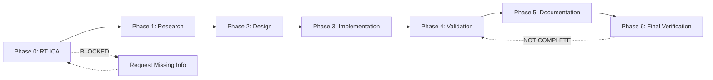

---

## Phase 0: RT-ICA Prerequisite Check

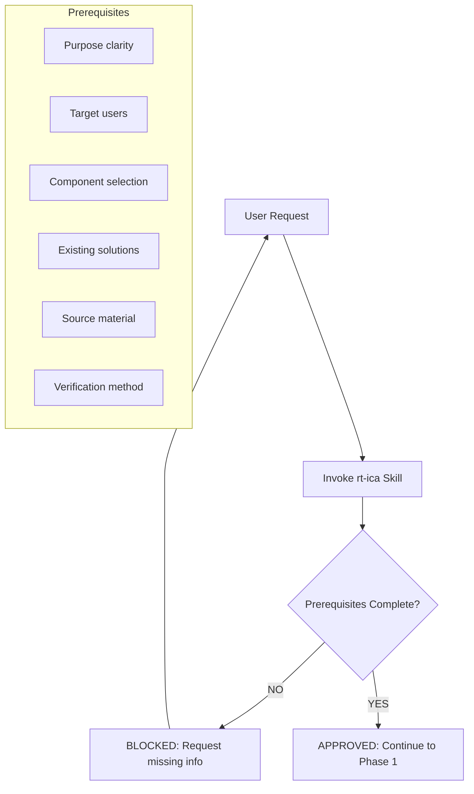

---

## Phase 1: Research

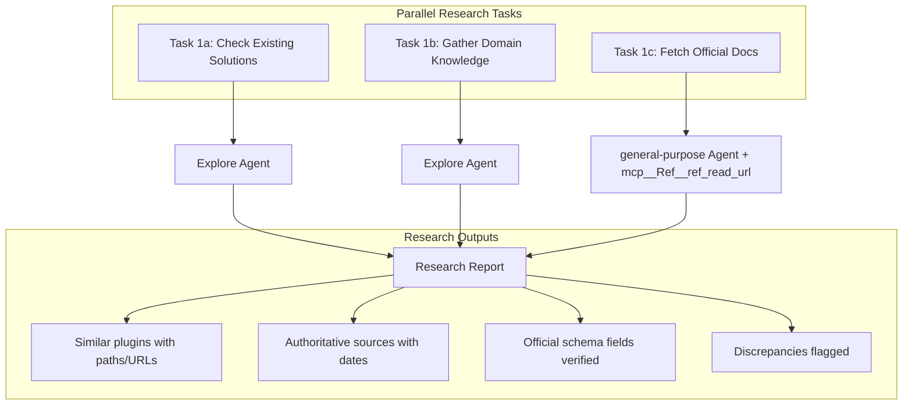

---

## Phase 2: Design

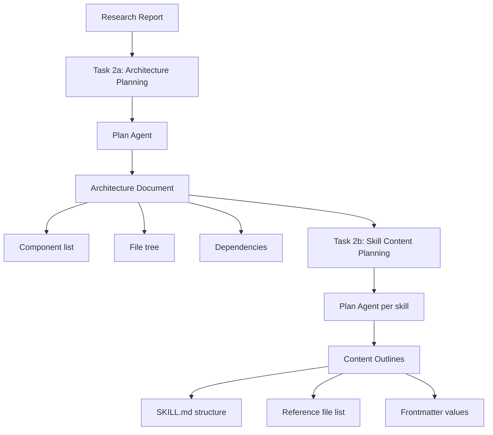

---

## Phase 3: Implementation

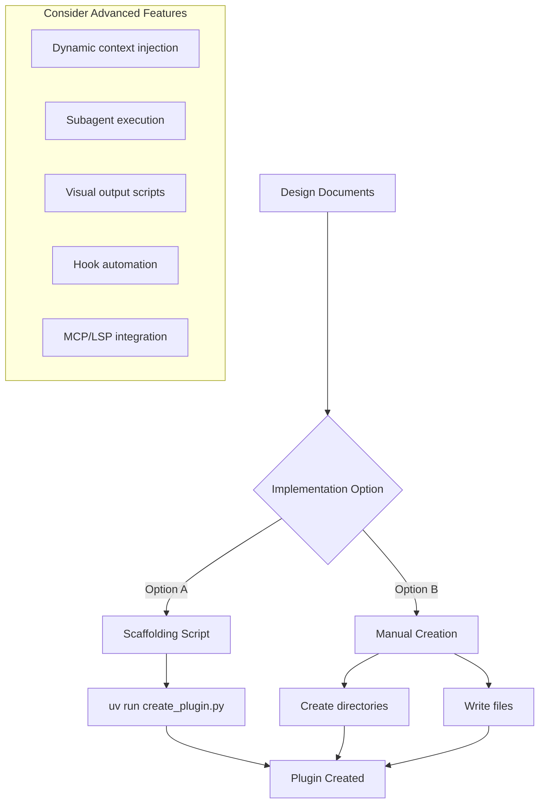

---

## Phase 4: Validation

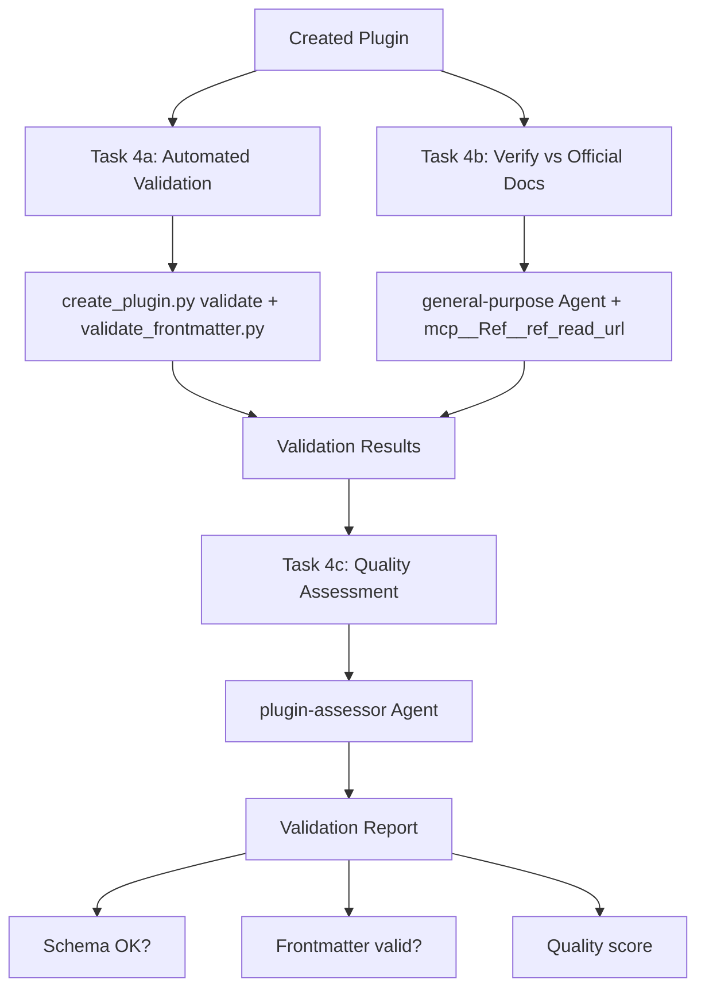

---

## Phase 5: Documentation

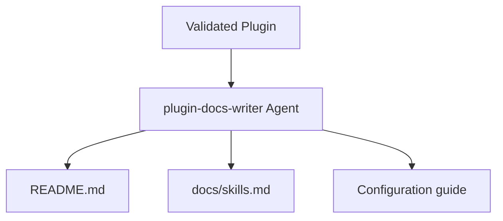

---

## Phase 6: Final Verification

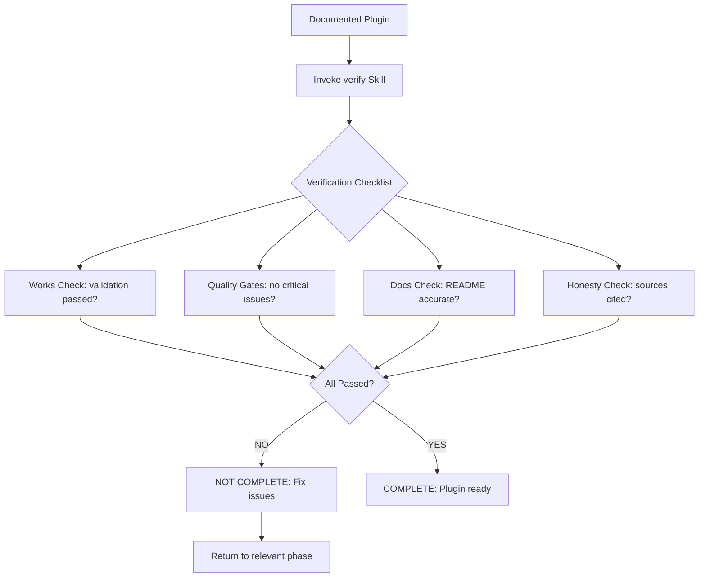

---

## Agent Delegation Map

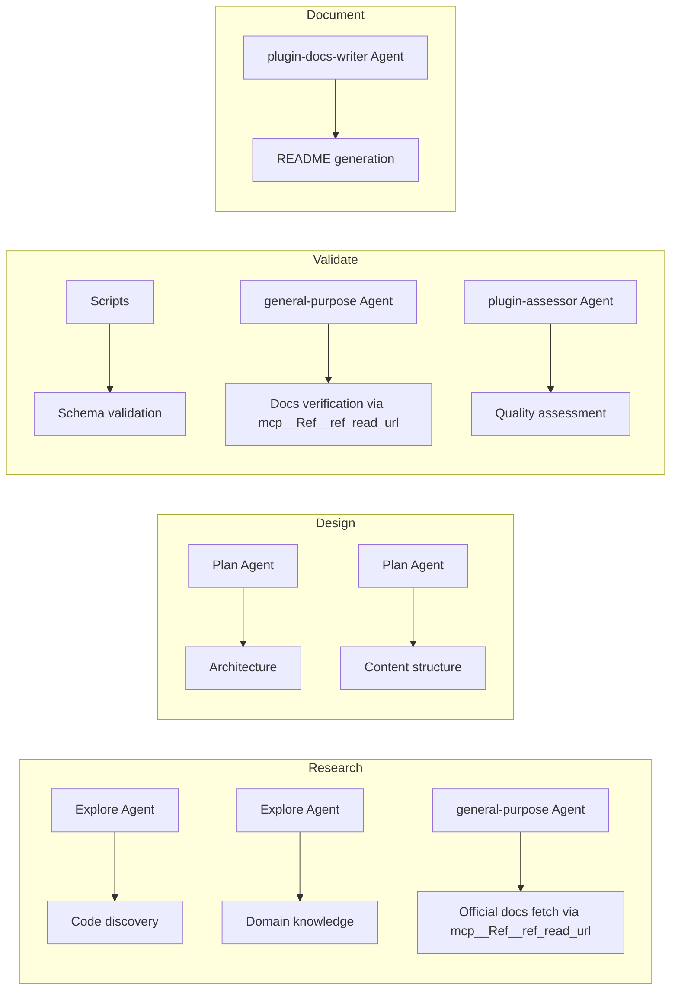

---

## Orchestrator Rules

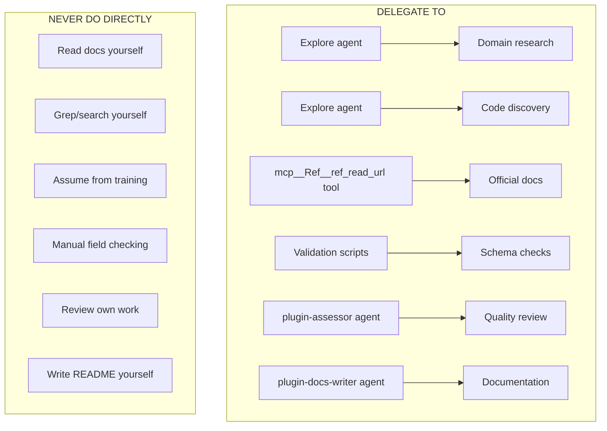

---

## Failure Recovery Paths

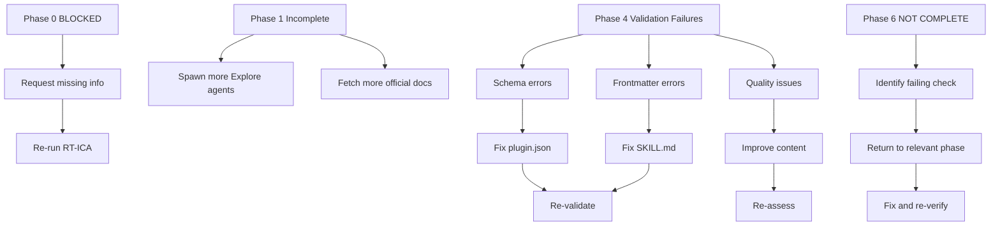

---

## Tool Inventory Reference

### Built-in Claude Code Agents

| Agent Name        | Model   | Purpose                                |
| ----------------- | ------- | -------------------------------------- |
| `general-purpose` | inherit | Complex operations requiring reasoning |
| `Explore`         | haiku   | Fast read-only codebase navigation     |
| `Plan`            | inherit | Research with reasoning capability     |

**SOURCE**: [CLAUDE.md global instructions](https://docs.claude.com) (accessed 2026-01-28)

### MCP Tools for Documentation

| Tool                                 | Purpose                 | Required For           |
| ------------------------------------ | ----------------------- | ---------------------- |
| `mcp__Ref__ref_read_url`             | Read documentation URLs | Official docs fetching |
| `mcp__Ref__ref_search_documentation` | Search documentation    | Finding relevant docs  |

**SOURCE**: Lines 9-12 of [claude-plugins-reference-2026/SKILL.md](../../claude-plugins-reference-2026/SKILL.md)

### Validation Scripts

| Script                        | Purpose                         | Location                         |
| ----------------------------- | ------------------------------- | -------------------------------- |
| `create_plugin.py`            | Plugin scaffolding + validation | `${CLAUDE_PLUGIN_ROOT}/scripts/` |
| `validate_frontmatter.py`     | Frontmatter schema validation   | `${CLAUDE_PLUGIN_ROOT}/scripts/` |
| `validate-skill-structure.sh` | Skill quality checks            | `${CLAUDE_PLUGIN_ROOT}/scripts/` |

**SOURCE**: Verified from plugin-creator plugin scripts directory

### Plugin-Specific Agents

| Agent                | Model  | Purpose                               |
| -------------------- | ------ | ------------------------------------- |
| `plugin-assessor`    | sonnet | Plugin quality analysis               |
| `plugin-docs-writer` | sonnet | README generation (if exists in repo) |
| `refactor-planner`   | sonnet | Refactoring plan creation             |
| `refactor-executor`  | sonnet | Refactoring task execution            |
| `refactor-validator` | sonnet | Refactoring validation                |

**SOURCE**: Lines 130-138 of [plugin-creator/CLAUDE.md](../../CLAUDE.md)

---

## Agent Discovery Mechanism

Claude Code discovers agents in this order:

1. **Project agents**: `.claude/agents/*.md` in current repository
2. **User agents**: `~/.claude/agents/*.md` in home directory
3. **Plugin agents**: `{plugin-root}/agents/*.md` for all enabled plugins

**Agent Selection**:

- Agents are matched based on `description` field trigger keywords
- Multiple matching agents may be presented to user
- User can manually invoke with `@agent-name`

**SOURCE**: [Agent system documentation](https://code.claude.com/docs/en/agents.md) (accessed 2026-01-28)

---

## Source

This workflow diagram documents the agentic plugin creation process defined in [SKILL.md](../SKILL.md).
