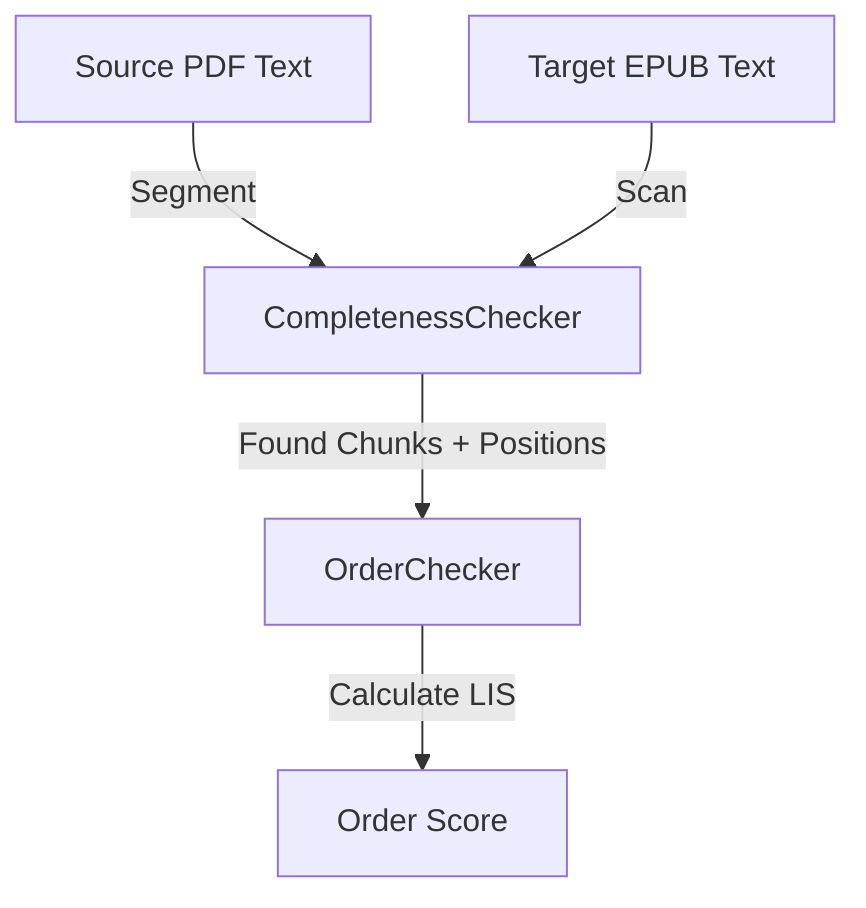

# Design & Technical Specification

## System Architecture
**How does it fit into the system?**



- `OrderChecker` sits in the `validation/` module.
- It is designed to be lightweight: it works on **positions**, not raw text.

## Data Models
**What data structures are needed?**

- Input: `List[FoundChunk]`, where `FoundChunk` contains `{chunk_id: int, epub_position: int}`.
- Output: `ValidationResult` extended with `order_score`.

## Interface Design
**How will components communicate?**

```python
class OrderChecker:
    def __init__(self, found_chunks: List[ValidationFailure]):
        # Note: We reuse ValidationFailure or a new FoundItem struct
        # We need the list of successfully found items sorted by their original PDF index.
        pass
    
    def check(self) -> float:
        """Returns score 0.0 - 1.0"""
        pass
```

## Key Decisions
**What are the critical choices?**

1. **Algorithm: Longest Increasing Subsequence (LIS)**
   - Inputs: A list of integers representing the positions of chunks in the EPUB.
   - Example: 
     - PDF Order: 1, 2, 3, 4, 5
     - EPUB Positions: 100, 200, 500, 300, 400
     - Vector to check: `[100, 200, 500, 300, 400]`
     - LIS: `[100, 200, 300, 400]` (Length 4)
     - Score: 4 / 5 = 80%.
   - **Rationale:** LIS is efficient O(N log N) and perfectly models the "reading order" problem.

2. **Integration:** `OrderChecker` is purely mathematical. It relies on `CompletenessChecker` to do the heavy lifting of finding text.

## Security & Performance
- **Performance:** O(N log N) is extremely fast. Processing 10,000 chunks (average book) will take milliseconds.
