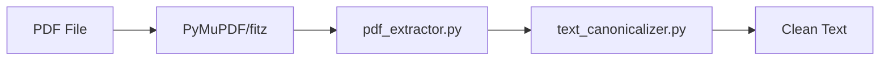

# System Design & Architecture

## Architecture Overview
**What is the high-level system structure?**

The `pdf_extractor` acts as a data source for the validation engine. It encapsulates all PDF-specific complexity.

## Data Models
**What data do we need to manage?**

- **PDFContent:** A simple container or string containing the extracted text.
- **ExtractionMetadata:** Page count, info (title, author).

## API Design
**How do components communicate?**

### Primary Interface
- `class PDFExtractor`:
    - `__init__(file_path: Path)`
    - `get_full_text() -> str`
    - `iter_pages() -> Iterator[str]` (Memory efficient extraction)
    - `get_page_text(page_num: int) -> str`
    - `get_metadata() -> dict`

## Component Breakdown
**What are the major building blocks?**

- **Fitz Wrapper:** Handles opening and reading the PDF.
- **Text Cleaner:** Integrates with `text_canonicalizer`.
- **Layout Manager:** Uses `page.get_text("blocks")` to respect reading order and preserve paragraph-like structures.

## Design Decisions
**Why did we choose this approach?**

- **PyMuPDF (fitz):** Chosen for its speed and superior "block-based" extraction which helps preserve paragraphs better than line-based tools.
- **Direct Canonicalization:** We canonicalize at the source to ensure no "dirty" text ever enters the system.

## Non-Functional Requirements
**How should the system perform?**

- **Robustness:** Handle encrypted PDFs (raise clear exception).
- **Speed:** Extract a 300-page book in < 5 seconds.
