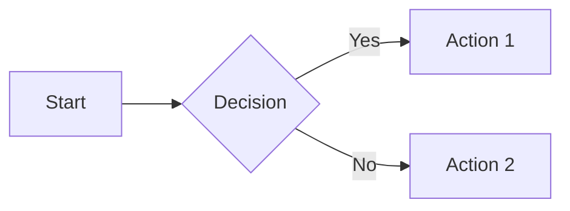

# Book Installer

The book-installer skill is a meta-skill that handles installation and setup tasks for intelligent textbook projects. It consolidates multiple installation skills into a single entry point with on-demand loading of specific installation guides.

## Quick Feature List

Type `book-installer help` to see this list, then select by number or name:

| # | Feature | Description |
|---|---------|-------------|
| 1 | [Site logo](#site-logo) | Add custom logo to header |
| 2 | [Favicon](#favicon) | Browser tab/bookmark icon |
| 3 | [Cover image & social preview](#cover-image--social-preview) | Home page image + og:image metadata |
| 4 | [Math equations](#math-equations) | KaTeX (recommended) or MathJax |
| 5 | [Code syntax highlighting](#code-syntax-highlighting) | Language-aware code blocks |
| 6 | [Code copy button](#code-copy-button) | One-click copy for code blocks |
| 7 | [Mermaid diagrams](#mermaid-diagrams) | Flowcharts, sequence diagrams from text |
| 8 | [Content tabs](#content-tabs) | Tabbed sections for alternatives |
| 9 | [Image zoom (GLightbox)](#image-zoom-glightbox) | Click to enlarge images |
| 10 | [Custom admonitions](#custom-admonitions) | Prompt boxes with copy button |
| 11 | [Interactive quizzes](#interactive-quizzes) | Self-assessment questions |
| 12 | [Abbreviations & tooltips](#abbreviations--tooltips) | Glossary hover definitions |
| 13 | [Task lists](#task-lists) | Checkbox lists |
| 14 | [Simple feedback](#simple-feedback) | Thumbs up/down per page |
| 15 | [Detailed comments (Giscus)](#detailed-comments-giscus) | GitHub Discussions integration |
| 16 | [Tags & categorization](#tags-and-categorization) | Page tagging system |
| 17 | [Search enhancements](#search-enhancements) | Suggestions and highlighting |
| 18 | [Table of contents config](#table-of-contents-config) | TOC sidebar options |
| 19 | [Blog support](#blog-support) | Add blog section |
| 20 | [Announcement bar](#announcement-bar) | Dismissible top banner |
| 21 | [Privacy & cookie consent](#privacy--cookie-consent) | GDPR compliance |
| 22 | [Learning graph viewer](#3-learning-graph-viewer-installation-learning-graph-viewermd) | Interactive concept visualization |
| 23 | [Skill usage tracker](#4-skill-tracker-installation-skill-trackermd) | Claude Code analytics hooks |

## Key Capabilities

This meta-skill routes to the appropriate installation guide based on your request:

| Request Type | Guide | Purpose |
|--------------|-------|---------|
| Feature by number or name | mkdocs-features | Install specific MkDocs feature |
| New textbook project | mkdocs-template | Create complete MkDocs Material project |
| Learning graph viewer | learning-graph-viewer | Add interactive graph visualization |
| Skill usage tracking | skill-tracker | Set up usage analytics with hooks |
| Cover image/home page | home-page-template | Configure social media optimization |

## When to Use This Skill

Use this skill when you need to:

- Add a specific feature to an existing MkDocs project (math, quizzes, feedback, etc.)
- Set up a new MkDocs Material project from scratch
- Create a new intelligent textbook
- Add an interactive learning graph viewer to an existing project
- Set up skill usage tracking with Claude Code hooks
- Create a cover image or configure home page social metadata

## Available Installation Guides

### 1. MkDocs Features (mkdocs-features.md)

Detailed configuration for all 23 MkDocs feature enhancements. Contains:

- Complete YAML snippets for mkdocs.yml
- JavaScript files to create
- CSS files to create
- Usage examples for each feature

**Trigger keywords:** Feature number (1-23), feature name, enrich, add feature, math, equations, quiz, feedback, logo, favicon, mermaid, admonition, code highlighting, image zoom, tabs, blog, tags

### 2. MkDocs Template Installation (mkdocs-template.md)

Creates a complete MkDocs Material intelligent textbook project structure:

- Conda virtual environment named 'mkdocs' with Python 3.11
- Full MkDocs Material project with all theme options
- Custom CSS for branding with configurable colors
- Social media card plugins including per-page override
- GitHub Pages deployment configuration

**Prerequisites:** Conda installed, Git installed, GitHub repository created

**Trigger keywords:** new project, mkdocs, textbook, bootstrap, setup, template, new book

[Detailed MkDocs template documentation](./install-mkdocs-template.md)

### 3. Learning Graph Viewer Installation (learning-graph-viewer.md)

Adds interactive learning graph exploration to an existing textbook:

- Interactive vis-network graph viewer
- Search, filtering, and statistics features
- Color-coded taxonomy categories with legend
- Integration with existing learning-graph.json

**Prerequisites:** Existing MkDocs project, learning-graph.json file present

**Trigger keywords:** graph viewer, learning graph, visualization, interactive graph, concept viewer

[Detailed learning graph viewer documentation](./install-learning-graph-viewer.md)

### 4. Skill Tracker Installation (skill-tracker.md)

Sets up Claude Code skill usage tracking:

- Hook scripts for tracking skill invocations
- Activity log directory structure
- Reporting scripts for usage analysis

**Prerequisites:** Claude Code installed, ~/.claude directory exists

**Trigger keywords:** track skills, skill usage, activity tracking, hooks, usage analytics

### 5. Home Page Template (home-page-template.md)

Creates professional home page with cover image and social media optimization:

- docs/index.md with proper frontmatter metadata
- AI image generation prompts for cover with montage background
- Open Graph and Twitter Card configuration
- Cover image design guidance (1.91:1 aspect ratio)

**Prerequisites:** Existing MkDocs project, access to AI image generator

**Trigger keywords:** cover image, home page, social media, og:image, montage, book cover, index page

## Important: Navigation Tabs

When working with existing projects, the book-installer will check for and remove navigation tabs from mkdocs.yml:

```yaml
# These lines will be removed if present:
theme:
  features:
    - navigation.tabs        # DELETE
    - navigation.tabs.sticky # DELETE
```

These books use **side navigation** optimized for wide landscape screens. Top navigation tabs waste vertical space and are not appropriate for this format.

## Typical Workflow

For a complete new project, use these installations in order:

1. **mkdocs-template** - Create the project structure
2. **home-page-template** - Create cover image and configure home page
3. **learning-graph-viewer** - Add graph visualization (after learning graph exists)
4. **skill-tracker** - Enable usage analytics (optional)

## How It Works

When you invoke `/book-installer` or ask for installation help, the skill:

1. Analyzes your request using keyword matching
2. Routes to the appropriate guide from its `references/` directory
3. Loads only the relevant installation guide (token-efficient)
4. Executes the step-by-step installation workflow

## Verification

After any installation, verify with:

```bash
# For MkDocs projects
mkdocs serve
# Visit http://127.0.0.1:8000/[project-name]/

# For skill tracker
cat ~/.claude/activity-logs/skill-usage.jsonl | tail -5
```

## Integration

This skill is typically the **first step** in the intelligent textbook creation workflow. After setting up the project infrastructure, proceed with:

1. **Course Description Analyzer** - Create/validate course description
2. **Learning Graph Generator** - Generate concept dependencies
3. **Book Chapter Generator** - Design chapter structure
4. **Chapter Content Generator** - Generate detailed content

---

## Feature Details

### Site Logo

**Location:** Upper-left corner of every page, next to the site title.

**File requirements:**

- Format: PNG with transparency (recommended) or SVG
- Size: 48x48 to 64x64 pixels
- Location: `docs/img/logo.png`

**mkdocs.yml configuration:**

```yaml
theme:
  name: material
  logo: img/logo.png
```
Browse over 7,000 sample icons at: [Material Design Icons](https://pictogrammers.com/library/mdi/)

**Best practices:**

- Use simple geometric shapes that remain recognizable at small sizes
- Ensure high contrast against both light and dark backgrounds
- Avoid text in the logo (illegible at small sizes)
- Test at 32x32 to ensure it's still recognizable

**AI prompt for logo generation:**

```
Please generate a minimalist [SUBJECT] png formatted logo icon.
Use simple geometric shapes.
Use [PRIMARY COLOR] and [SECONDARY COLOR] on transparent background, flat design,
suitable for small size display, professional, clean lines,
no text, centered composition, square format.
```

Adding transparency to an existing logo can be done by Claude Code:

```
> Claude, please make the background of this logo transparent: @docs/img/logo.png
```

**Example prompts by topic:**

- **Programming:** "A minimalist code brackets logo icon, angular < > symbols, indigo (#3F51B5) on transparent background, modern tech feel, clean vector style, no text"
- **Data Science:** "A minimalist neural network logo icon, three connected nodes in triangular arrangement, purple gradient (#7C4DFF to #536DFE), transparent background, flat design, no text"
- **Education:** "A minimalist open book logo icon, simple geometric book shape with pages fanning out, warm orange (#FF9800) on transparent background, flat design, no text"

**CSS to customize logo size:**

```css
/* Add to docs/css/extra.css */
.md-header__button.md-logo img {
  width: 48px;
  height: 48px;
}
```

**Post-processing:** Generate at 512x512, resize to 64x64, ensure transparent background, save as PNG.

---

### Favicon

**Location:** Browser tab, bookmarks bar, and mobile home screen icon.

**File requirements:**

- Format: `.ico` (multi-resolution) or `.png` (32x32)
- Must be extremely simple - recognizable at 16x16 pixels
- Location: `docs/img/favicon.ico`

**mkdocs.yml configuration:**

```yaml
theme:
  favicon: img/favicon.ico
```

**Best practices:**

- Use a single bold shape or letter
- No gradients or fine details
- High contrast colors
- Test at 16x16 pixels - if unrecognizable, simplify further

**AI prompt for favicon generation:**

```
An extremely minimalist [SINGLE SHAPE] icon, [ONE COLOR] on white
background, ultra-simple geometric form, must be recognizable at
16x16 pixels, no details, no gradients, bold single element,
favicon style, flat design
```

**Example prompts:**

- **Single Letter:** "An extremely minimalist letter 'A' favicon icon, bold sans-serif, deep blue (#1A237E) on white background, ultra-simple, geometric, must be clear at 16 pixels, no decoration"
- **Geometric Shape:** "An extremely minimalist hexagon favicon icon, solid teal (#009688), white background, simple flat shape, clear at 16x16 pixels"

**Post-processing:**

1. Generate at 512x512
2. Simplify (remove any fine details)
3. Create multi-resolution .ico with: 16x16, 32x32, 48x48
4. Tools:
  - [Favicon Converter](https://favicon.io/favicon-converter/) - upload the logo and it generates multiple sizes of logos and a favicon.ico - all free
  - [RealFaviconGenerator](https://realfavicongenerator.net/) or ImageMagick

---

### Cover Image & Social Preview

**Location:** Home page hero image and social media preview when links are shared.

**File requirements:**

- Aspect ratio: 1.91:1 (wide landscape)
- Recommended size: 1200x630 pixels
- Format: PNG (< 5MB)
- Location: `docs/img/cover.png`

**Best practices:**

- Title must be readable at small preview sizes (social cards are often 400px wide)
- Use high contrast between text and background
- Include subtle montage of topic-related images around edges
- Test with social preview validators before deploying

**AI prompt for cover image:**

```
A professional book cover image in wide landscape format (1.91:1 aspect ratio),
'[YOUR BOOK TITLE]' in large elegant typography centered on a [COLOR] gradient
background, surrounded by a subtle montage collage of [TOPIC ELEMENTS] arranged
around the edges, professional educational design, clean modern aesthetic,
social media preview style, high contrast text, 1200x630 pixels
```

**Example prompt:**

```
A professional book cover in wide 1.91:1 landscape format,
'Introduction to Python Programming' in bold white typography centered
on a deep blue (#1A237E) to purple (#4A148C) gradient background,
surrounded by a subtle montage of code snippets, terminal windows,
Python logo elements, circuit patterns, and geometric shapes around
the edges, modern tech aesthetic, clean professional design,
suitable for social media preview, 1200x630 pixels
```

**CSS for cover image display:**

```css
.cover-image {
  width: 100%;
  max-width: 800px;
  border-radius: 8px;
  box-shadow: 0 4px 20px rgba(0,0,0,0.15);
  margin: 1rem auto 2rem;
  display: block;
}
```

**Validation tools:**

- [Twitter Card Validator](https://cards-dev.twitter.com/validator)
- [LinkedIn Post Inspector](https://www.linkedin.com/post-inspector/)

---

### Math Equations

**Purpose:** Render LaTeX math notation in your documentation.

**Two options:**

| Aspect | KaTeX (Recommended) | MathJax |
|--------|---------------------|---------|
| Speed | Much faster (100x+) | Slower |
| LaTeX coverage | Most common commands | More complete |
| File size | Smaller | Larger |
| Best for | Most textbooks | Obscure LaTeX commands |

**KaTeX configuration (recommended):**

```yaml
markdown_extensions:
  - pymdownx.arithmatex:
      generic: true

extra_javascript:
  - javascripts/katex.js
  - https://unpkg.com/katex@0/dist/katex.min.js
  - https://unpkg.com/katex@0/dist/contrib/auto-render.min.js

extra_css:
  - https://unpkg.com/katex@0/dist/katex.min.css
```

**Usage:**

```markdown
Inline: $E = mc^2$

Display:
$$\int_0^\infty e^{-x^2} dx = \frac{\sqrt{\pi}}{2}$$
```

---

### Code Syntax Highlighting

**Purpose:** Language-aware syntax coloring for code blocks.

**mkdocs.yml:**

```yaml
markdown_extensions:
  - pymdownx.highlight:
      anchor_linenums: true
      line_spans: __span
      pygments_lang_class: true
  - pymdownx.inlinehilite
  - pymdownx.snippets
  - pymdownx.superfences
```

---

### Code Copy Button

**Purpose:** One-click copy button on all code blocks.

**mkdocs.yml:**

```yaml
theme:
  features:
    - content.code.copy
    - content.code.select
    - content.code.annotate
```

---

### Mermaid Diagrams

**Purpose:** Create flowcharts, sequence diagrams, and more from text.

**mkdocs.yml:**

```yaml
markdown_extensions:
  - pymdownx.superfences:
      custom_fences:
        - name: mermaid
          class: mermaid
          format: !!python/name:pymdownx.superfences.fence_code_format
```

**Usage:**

````markdown

````

---

### Content Tabs

**Purpose:** Tabbed sections for showing alternatives (e.g., code in multiple languages).

**mkdocs.yml:**

```yaml
markdown_extensions:
  - pymdownx.tabbed:
      alternate_style: true
```

**Usage:**

```markdown
=== "Python"
    ```python
    print("Hello")
    ```

=== "JavaScript"
    ```javascript
    console.log("Hello");
    ```
```

---

### Image Zoom (GLightbox)

**Purpose:** Click any image to view it in a lightbox overlay.

**Installation:** `pip install mkdocs-glightbox`

**mkdocs.yml:**

```yaml
plugins:
  - glightbox:
      touchNavigation: true
      effect: zoom
      zoomable: true
```

**Exclude specific images:**

```markdown
{ .off-glb }
```

---

### Custom Admonitions

**Purpose:** Create custom callout boxes like "Prompt" with copy buttons.

See the full mkdocs-features.md reference for complete CSS and JavaScript implementation.

---

### Interactive Quizzes

**Purpose:** Self-assessment multiple choice questions with instant feedback.

Requires custom JavaScript and CSS. See mkdocs-features.md for full implementation.

---

### Abbreviations & Tooltips

**Purpose:** Define terms that show tooltips on hover site-wide.

**mkdocs.yml:**

```yaml
markdown_extensions:
  - abbr
  - pymdownx.snippets:
      auto_append:
        - includes/abbreviations.md
```

**Create `docs/includes/abbreviations.md`:**

```markdown
*[HTML]: Hyper Text Markup Language
*[API]: Application Programming Interface
*[DAG]: Directed Acyclic Graph
```

---

### Task Lists

**Purpose:** GitHub-style checkbox lists.

**mkdocs.yml:**

```yaml
markdown_extensions:
  - pymdownx.tasklist:
      custom_checkbox: true
```

**Usage:**

```markdown
- [x] Completed task
- [ ] Incomplete task
```

---

### Simple Feedback

**Purpose:** Thumbs up/down widget at bottom of each page.

Requires custom JavaScript. See mkdocs-features.md for implementation.

---

### Detailed Comments (Giscus)

**Purpose:** GitHub Discussions-powered comment system.

**Prerequisites:**

1. Enable GitHub Discussions on your repository
2. Install Giscus app: https://github.com/apps/giscus
3. Configure at: https://giscus.app

---

### Tags and Categorization

**Purpose:** Add tags to pages for filtering and organization.

**Why use tags:**

- **Content Discovery** - Readers find related content across chapters (e.g., all pages tagged "recursion")
- **Skill Level Filtering** - Tag by difficulty: `beginner`, `intermediate`, `advanced`
- **Content Type Organization** - Tag by type: `tutorial`, `reference`, `exercise`, `case-study`
- **Cross-Cutting Concerns** - Topics spanning multiple chapters: `best-practices`, `performance`, `security`
- **Auto-Generated Index** - MkDocs creates a `tags.md` page listing all tags with linked pages

**When it's most useful:**

- Large textbooks with 15+ chapters
- Reference materials readers return to repeatedly
- Content with overlapping topics across chapters

**mkdocs.yml:**

```yaml
plugins:
  - tags:
      tags_file: tags.md
```

**Usage in frontmatter:**

```yaml
---
tags:
  - beginner
  - loops
  - python
---
```

**Create `docs/tags.md`:**

```markdown
# Tags

This page lists all tagged content in the textbook.
```

---

### Search Enhancements

**Purpose:** Improved search with suggestions and highlighting.

**mkdocs.yml:**

```yaml
theme:
  features:
    - search.suggest
    - search.highlight
    - search.share
```

---

### Table of Contents Config

**Purpose:** Configure the right-side table of contents.

**mkdocs.yml:**

```yaml
markdown_extensions:
  - toc:
      permalink: true
      toc_depth: 3
```

---

### Blog Support

**Purpose:** Add a blog section to your documentation.

**mkdocs.yml:**

```yaml
plugins:
  - blog:
      blog_dir: blog
      post_date_format: long
```

---

### Announcement Bar

**Purpose:** Dismissible banner at top of all pages.

**mkdocs.yml:**

```yaml
extra:
  announcement: "🎉 New version released! <a href='/changelog/'>See what's new</a>"
```

Requires theme override. See mkdocs-features.md for details.

---

### Privacy & Cookie Consent

**Purpose:** GDPR-compliant cookie consent banner.

**mkdocs.yml:**

```yaml
extra:
  consent:
    title: Cookie consent
    description: >-
      We use cookies to recognize your repeated visits and preferences.
    actions:
      - accept
      - reject
      - manage
```
