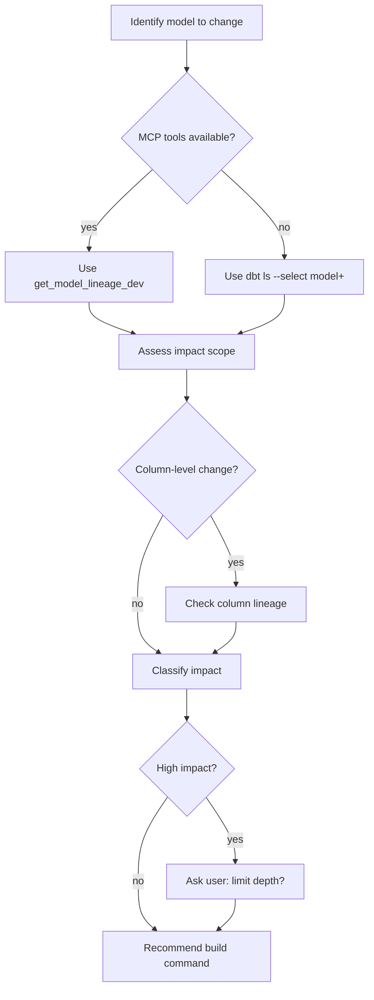

# Evaluating Impact of a dbt Model Change

Assess downstream dependencies before modifying a dbt model. Determines scope of impact and recommends appropriate build selectors.

## When to Use

- Before changing SQL logic in an existing model
- Before renaming, removing, or changing column types
- Before changing model materialization

**Not for:** New models (no downstream dependencies yet)

## Workflow



## Getting Downstream Dependencies

### If dbt MCP Server Available

Check for these tools first - they provide richer lineage data:

| Tool | Use For |
|------|---------|
| `get_model_lineage_dev` | Model-level downstream dependencies |
| `get_column_lineage` | Which downstream models reference specific columns |

### CLI Fallback (Worse data but always available)

**List all downstream models:**
```bash
dbt ls --select model_name+ --output name
```

**Count downstream models:**
```bash
dbt ls --select model_name+ --output name | wc -l
```

**View as JSON with details:**
```bash
dbt ls --select model_name+ --output json
```

## Column-Level Impact

When changing or removing a column, identify which downstream models reference it:

```bash
# Search for column references in downstream model SQL files
# First get the list of downstream models
dbt ls --select model_name+ --output name > /tmp/downstream.txt

# Then search for column usage in those model files
grep -r "column_name" models/ --include="*.sql" | grep -f /tmp/downstream.txt
```

With MCP tools, use `get_column_lineage` for precise tracking.

## Impact Classification

| Level | Criteria | Action |
|-------|----------|--------|
| **Low** | 1-5 downstream models | Proceed with `state:modified+` |
| **Medium** | 6-15 downstream models | Consider limiting depth |
| **High** | 16+ downstream models | Ask user about depth limit |

## Recommending Build Commands

**Standard (all downstream):**
```bash
dbt build --select state:modified+
```

**Limited depth (user choice):**
```bash
# Only 1 level downstream
dbt build --select state:modified+1

# Only 2 levels downstream
dbt build --select state:modified+2

# Only 3 levels downstream
dbt build --select state:modified+3
```

When impact is high, ask the user:

> "This change affects N downstream models. Do you want to:
> 1. Build all downstream models with `state:modified+`
> 2. Limit to a specific depth (e.g., `state:modified+2` for 2 levels)?"

## Quick Reference

| Task | Command |
|------|---------|
| List downstream | `dbt ls --select model_name+` |
| Count downstream | `dbt ls --select model_name+ --output name \| wc -l` |
| Build all affected | `dbt build --select state:modified+` |
| Build limited depth | `dbt build --select state:modified+N` |
| Find column refs | `grep -r "col" models/ --include="*.sql"` |

## Common Mistakes

**Not checking before changing** - Always run impact assessment first, even for "small" changes.

**Ignoring column-level impact** - Removing a column breaks downstream models that reference it. Check column usage, not just model dependencies.

**Building everything** - Use `--select` to limit scope. Never run `dbt build` without selectors on large projects.
