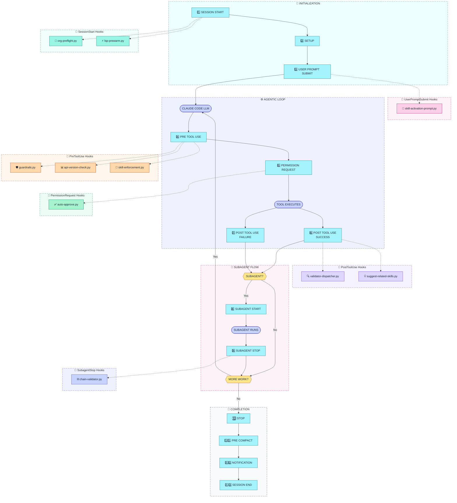

# SF-Skills Hook Architecture Diagram

> Visual representation of how SF-Skills hooks integrate with Claude Code's lifecycle events

---

## Claude Code Hook Lifecycle with SF-Skills Hooks



---

## ASCII Fallback

For terminals and viewers that don't render Mermaid:

```
┌─────────────────────────────────────────────────────────────────────────────────┐
│                     CLAUDE CODE HOOK LIFECYCLE (SF-SKILLS)                      │
└─────────────────────────────────────────────────────────────────────────────────┘

┌─────────────────────────────────────────────────────────────────────────────────┐
│  🚀 INITIALIZATION                                                              │
│  ┌─────────────────┐    ┌─────────────────┐    ┌─────────────────┐             │
│  │ 1. SESSION START│───▶│    2. SETUP     │───▶│3. PROMPT SUBMIT │             │
│  └────────┬────────┘    └─────────────────┘    └────────┬────────┘             │
│           │                                              │                      │
│           ▼                                              ▼                      │
│  ┌─────────────────────────┐              ┌─────────────────────────┐          │
│  │ 🔌 org-preflight.py     │              │🎯 skill-activation-     │          │
│  │ ⚡ lsp-prewarm.py       │              │   prompt.py             │          │
│  └─────────────────────────┘              └─────────────────────────┘          │
└─────────────────────────────────────────────────────────────────────────────────┘
                                       │
                                       ▼
┌─────────────────────────────────────────────────────────────────────────────────┐
│  ⚙️ AGENTIC LOOP                              ┌───────────────────────────────┐ │
│  ┌─────────────────────────────┐              │ 🛡️ guardrails.py             │ │
│  │   CLAUDE CODE / LLM        │◀─────┐       │ 📊 api-version-check.py      │ │
│  └──────────────┬──────────────┘      │       │ 🚫 skill-enforcement.py      │ │
│                 │                     │       └───────────────────────────────┘ │
│                 ▼                     │                      ▲                  │
│  ┌─────────────────────────────┐      │       ┌──────────────┘                  │
│  │     4. PRE TOOL USE         │──────┼───────┘                                 │
│  └──────────────┬──────────────┘      │       ┌───────────────────────────────┐ │
│                 │                     │       │ ✅ auto-approve.py            │ │
│                 ▼                     │       └───────────────────────────────┘ │
│  ┌─────────────────────────────┐      │                      ▲                  │
│  │   5. PERMISSION REQUEST     │──────┼──────────────────────┘                  │
│  └──────────────┬──────────────┘      │                                         │
│                 │                     │                                         │
│                 ▼                     │                                         │
│  ┌─────────────────────────────┐      │                                         │
│  │      TOOL EXECUTES          │      │                                         │
│  └──────────────┬──────────────┘      │                                         │
│                 │                     │       ┌───────────────────────────────┐ │
│        ┌───────┴───────┐              │       │ 🔍 validator-dispatcher.py   │ │
│        ▼               ▼              │       │ 💡 suggest-related-skills.py │ │
│  ┌───────────┐   ┌───────────┐        │       └───────────────────────────────┘ │
│  │ 6. POST   │   │ 7. POST   │        │                      ▲                  │
│  │ SUCCESS   │───│ FAILURE   │────────┼──────────────────────┘                  │
│  └─────┬─────┘   └───────────┘        │                                         │
│        │                              │                                         │
│        ▼                              │                                         │
│  ┌─────────────────────────────┐      │                                         │
│  │      SUBAGENT?              │      │                                         │
│  └─────────┬───────────┬───────┘      │                                         │
│       Yes  │           │ No           │                                         │
│            ▼           │              │                                         │
│  ┌─────────────────┐   │              │                                         │
│  │ 8. SUBAGENT     │   │              │                                         │
│  │    START        │   │              │                                         │
│  └────────┬────────┘   │              │                                         │
│           ▼            │              │       ┌───────────────────────────────┐ │
│  ┌─────────────────┐   │              │       │ ⛓️ chain-validator.py         │ │
│  │ SUBAGENT RUNS   │   │              │       └───────────────────────────────┘ │
│  └────────┬────────┘   │              │                      ▲                  │
│           ▼            │              │                      │                  │
│  ┌─────────────────┐   │              │                      │                  │
│  │ 9. SUBAGENT     │───┼──────────────┼──────────────────────┘                  │
│  │    STOP         │   │              │                                         │
│  └────────┬────────┘   │              │                                         │
│           │            │              │                                         │
│           └────────────┤              │                                         │
│                        ▼              │                                         │
│              ┌─────────────────┐      │                                         │
│              │   MORE WORK?    │      │                                         │
│              └───┬─────────┬───┘      │                                         │
│             Yes  │         │ No       │                                         │
│                  │         │          │                                         │
│                  └─────────┼──────────┘                                         │
│                            │                                                    │
└────────────────────────────│────────────────────────────────────────────────────┘
                             │
                             ▼
┌─────────────────────────────────────────────────────────────────────────────────┐
│  🏁 COMPLETION                                                                  │
│  ┌─────────────────┐    ┌─────────────────┐    ┌─────────────────┐             │
│  │    10. STOP     │───▶│ 11. PRE COMPACT │───▶│ 12. NOTIFICATION│             │
│  └─────────────────┘    └─────────────────┘    └────────┬────────┘             │
│                                                         │                       │
│                                                         ▼                       │
│                                                ┌─────────────────┐              │
│                                                │ 13. SESSION END │              │
│                                                └─────────────────┘              │
└─────────────────────────────────────────────────────────────────────────────────┘
```

---

## Hook Summary Table

| Event | Hook Script | Purpose | Action Type |
|-------|-------------|---------|-------------|
| **SessionStart** | `org-preflight.py` | Validate SF org connectivity | State file |
| **SessionStart** | `lsp-prewarm.py` | Spawn LSP servers in background | Background |
| **UserPromptSubmit** | `skill-activation-prompt.py` | Suggest skills from prompt | Prepend |
| **PreToolUse** | `guardrails.py` | Block dangerous operations | BLOCK/MODIFY |
| **PreToolUse** | `api-version-check.py` | Check API version compatibility | WARN |
| **PreToolUse** | `skill-enforcement.py` | Enforce skill-first workflow | BLOCK |
| **PermissionRequest** | `auto-approve.py` | Smart auto-approval for safe ops | APPROVE/DENY |
| **PostToolUse** | `validator-dispatcher.py` | Route to skill-specific validators | Feedback |
| **PostToolUse** | `suggest-related-skills.py` | Suggest next skills in workflow | Feedback |
| **SubagentStop** | `chain-validator.py` | Validate workflow chain completion | Feedback |

---

## Hook Event Reference

### Lifecycle Events (13 total)

| # | Event | When | Hook Output |
|---|-------|------|-------------|
| 1 | **SessionStart** | Claude Code session begins | State files, background tasks |
| 2 | **Setup** | Configuration loaded | (no hooks) |
| 3 | **UserPromptSubmit** | User sends a message | Prepend context, suggestions |
| 4 | **PreToolUse** | Before tool executes | ALLOW, BLOCK, MODIFY |
| 5 | **PermissionRequest** | Tool needs approval | APPROVE, DENY, defer to user |
| 6 | **PostToolUse (success)** | Tool completed successfully | Feedback, suggestions |
| 7 | **PostToolUse (failure)** | Tool failed | Error analysis, suggestions |
| 8 | **SubagentStart** | Subagent spawned | (no hooks) |
| 9 | **SubagentStop** | Subagent completed | Chain validation |
| 10 | **Stop** | LLM turn complete | (no hooks) |
| 11 | **PreCompact** | Before context compaction | (no hooks) |
| 12 | **Notification** | User notification sent | (no hooks) |
| 13 | **SessionEnd** | Session terminates | Cleanup |

---

## Color Legend

| Color | Hex | Meaning | Nodes |
|-------|-----|---------|-------|
| 🟦 Cyan-200 | `#a5f3fc` | Lifecycle event nodes | S1-S13 |
| 🟩 Teal-200 | `#99f6e4` | SessionStart hooks | org-preflight, lsp-prewarm |
| 🩷 Pink-200 | `#fbcfe8` | AI/Intent detection | skill-activation-prompt |
| 🟧 Orange-200 | `#fed7aa` | Guards/Pre-checks | guardrails, api-version-check, skill-enforcement |
| 🟢 Green-200 | `#a7f3d0` | Approval hooks | auto-approve |
| 🟣 Violet-200 | `#ddd6fe` | Validation/Suggestion | validator-dispatcher, suggest-related-skills |
| 🔵 Indigo-200 | `#c7d2fe` | Execution/Chain | LLM, EXEC, chain-validator |
| 🟡 Amber-200 | `#fde68a` | Decision points | SUBAGENT?, MORE WORK? |

---

## Hook Interaction Patterns

### Pattern 1: Blocking Flow

```
PreToolUse → guardrails.py
         ├─ Allow: Continue to Permission Request
         └─ Block: Return error message to LLM
                   (tool never executes)
```

### Pattern 2: Auto-Approval

```
PermissionRequest → auto-approve.py
         ├─ Approve: Tool executes without user prompt
         ├─ Deny: Block with reason
         └─ No output: Defer to user (shows permission dialog)
```

### Pattern 3: Feedback Chain

```
PostToolUse → validator-dispatcher.py → Validates file
                                      → Sends feedback to LLM
          → suggest-related-skills.py → Analyzes content
                                      → Suggests next skill
```

### Pattern 4: Workflow Tracking

```
SessionStart → org-preflight.py → Writes ~/.claude/.sf-org-state.json
           → lsp-prewarm.py → Writes ~/.claude/.lsp-prewarm-state.json
                            → Status line reads these files
```

---

## Related Documentation

- [Orchestration Architecture](./ORCHESTRATION-ARCHITECTURE.md) - How skill recommendations work
- [Hooks Frontmatter Schema](./hooks-frontmatter-schema.md) - Hook configuration format
- [install-hooks.py](../../../tools/install-hooks.py) - Hook installation script

---

## Diagram Quality Score

```
Score: 72/80 ⭐⭐⭐⭐⭐ Excellent
├─ Accuracy: 18/20      (All 10 hooks correctly placed at their events)
├─ Clarity: 18/20       (Clear flow with dotted lines for hooks)
├─ Completeness: 14/15  (Full lifecycle + all hooks + state files)
├─ Styling: 12/15       (Tailwind 200-level palette, subgraph styling)
└─ Best Practices: 10/10 (Proper Mermaid notation, init config)
```
