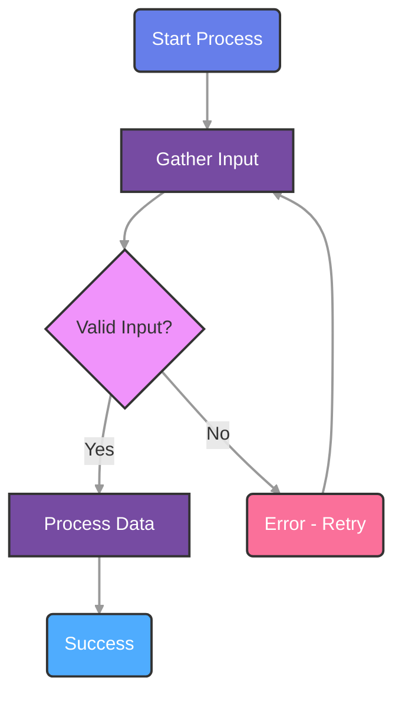
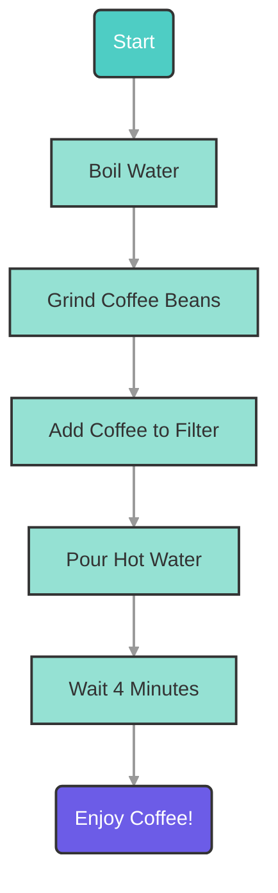
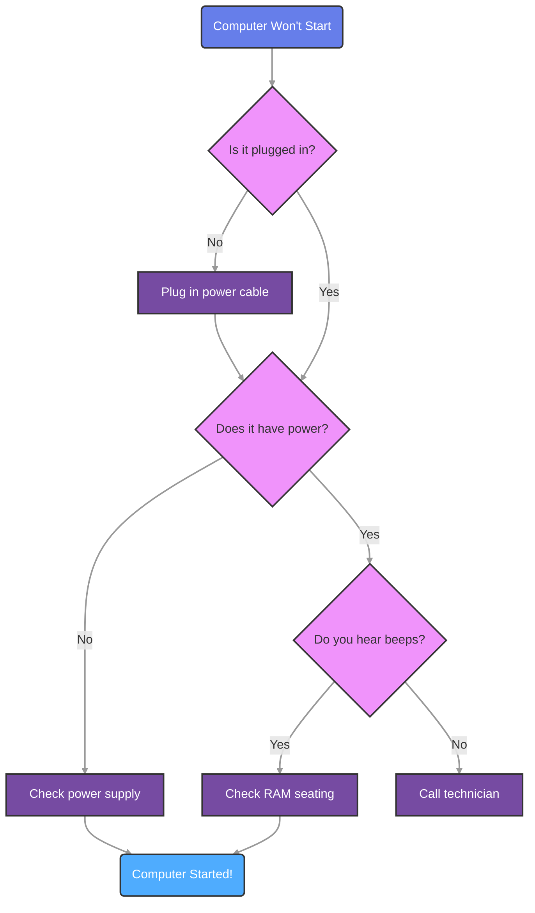
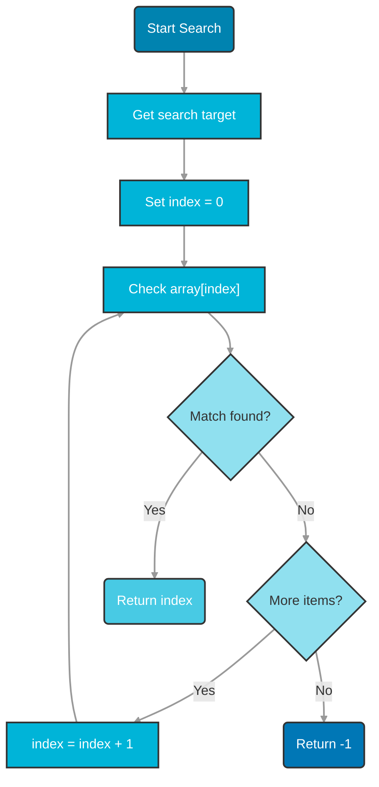

# Mermaid Diagram Generator

## Overview

Generate simple minimalist but colorful interactive workflow diagrams using Mermaid.js for intelligent textbooks. Creates complete MicroSim packages with standalone HTML files, MkDocs integration, and Dublin Core metadata. Each diagram features colorful node backgrounds, 16-point fonts for optimal readability, and follows the educational MicroSim pattern.

Because this skill is part of the workflow for creation of textbooks using mkdocs, the design goal
is to create simple unadorned diagrams without any complex padding, borders or decoration.  This is
because our focus is to educate, not entertain and show off our ability to do rounded corners and gradient shading.

## Working Templates (REQUIRED REFERENCE)

Before generating any Mermaid MicroSim, **you MUST read the template files** in `assets/templates/mermaid/`:

| File | Purpose |
|------|---------|
| `main-template.html` | HTML shell with 2/3 + 1/3 layout, references external CSS/JS |
| `style.css` | All styling for layout, panels, and hover effects |
| `script.js` | Hover interaction logic for info panel |
| `software-lifecycle-example.html` | Complete working example demonstrating all patterns |
| `index-template.md` | Documentation template with proper YAML frontmatter |
| `metadata-template.json` | Dublin Core metadata structure |

**File Structure for Each MicroSim:**
```
docs/sims/[diagram-name]/
├── main.html          # HTML with mermaid code and nodeInfo data
├── style.css          # Copy from template (customize if needed)
├── script.js          # Copy from template (rarely needs changes)
├── index.md           # Documentation page
└── metadata.json      # Dublin Core metadata
```

**CRITICAL**: Copy the structural patterns exactly. The default layout uses:
- **Left 2/3 (66.67%)**: Diagram panel with vertical flowchart
- **Right 1/3 (33.33%)**: Fixed info panel for hover descriptions
- **Zero margin/padding**: Designed for iframe embedding without wasted space

## Default Layout: 2/3 Diagram + 1/3 Info Panel

The standard Mermaid MicroSim layout reserves the right third of the canvas for a persistent info panel:

```
+----------------------------------+----------------+
|                                  |                |
|        DIAGRAM PANEL             |   INFO PANEL   |
|           (66.67%)               |    (33.33%)    |
|                                  |                |
|     flowchart TD                 |   Details      |
|         |                        |   --------     |
|         v                        |                |
|       [Node]                     |   Hover over   |
|         |                        |   a node to    |
|         v                        |   see details  |
|       [Node]                     |                |
|                                  |                |
+----------------------------------+----------------+
```

**Benefits of this layout:**
- Info panel doesn't obscure the diagram (unlike floating tooltips)
- Users can read descriptions while viewing the full flowchart
- Works well in narrow iframes embedded in textbook pages
- Hover interactions feel responsive and educational

## When to Use This Skill

Use the mermaid-generator skill when users request:

- Workflow diagrams or process flows
- Decision trees with branching logic
- Algorithm visualizations
- System architecture flows
- Educational process diagrams
- Step-by-step procedure illustrations
- State transition diagrams
- Any flowchart-style visualization

**Example user requests:**
- "Create a flowchart showing the software development lifecycle"
- "Generate a workflow diagram for the scientific method"
- "Make a decision tree for troubleshooting network issues"
- "Visualize the process of photosynthesis as a diagram"

## Workflow

### Step 1: Gather Diagram Requirements

Analyze the user's description to extract:

1. **Diagram Purpose**: What process or workflow is being illustrated?
2. **Key Steps**: What are the main nodes/steps in the workflow?
3. **Decision Points**: Are there branching decisions (if/then)?
4. **Flow Direction**: Should it be top-down (TD), left-right (LR), or other?
5. **Start/End Points**: Where does the process begin and end?

**If the description is incomplete or unclear**, prompt the user for additional information:

```
To create an accurate workflow diagram, I need more information:

1. What are the main steps in this process?
2. Are there any decision points where the flow branches?
3. What happens in success vs. error scenarios?
4. Should this flow top-down or left-right?
```

**Required information before proceeding:**

- At least 3-5 distinct steps/nodes
- Clear start and end points
- Understanding of the flow sequence

### Step 2: Design the Mermaid Flowchart

Consult `references/mermaid-flowchart-syntax.md` for detailed syntax guidance.

**Design decisions:**

1. **Choose node shapes** based on purpose:
   - Rounded rectangles `("Label")` for start/end
   - Rectangles `["Label"]` for process steps
   - Diamonds `{"Decision?"}` for decision points
   - Circles `(("Label"))` for connectors

2. **Select color palette** from reference guide:
   - Vibrant (purple/blue/pink) for engaging diagrams
   - Professional (turquoise/mint/coral) for formal content
   - Ocean (blue spectrum) for technical content
   - Or create custom palette matching textbook theme

3. **Define style classes** for consistent theming:
   ```
   classDef startNode fill:#667eea,stroke:#333,stroke-width:2px,color:#fff,font-size:16px
   classDef processNode fill:#764ba2,stroke:#333,stroke-width:2px,color:#fff,font-size:16px
   classDef decisionNode fill:#f093fb,stroke:#333,stroke-width:2px,color:#333,font-size:16px
   ```

4. **Ensure 16pt fonts** for all nodes and edge labels:
   - Set `font-size:16px` in all classDef declarations
   - Apply to edge labels: `linkStyle default font-size:16px`

5. **Use top-down direction** unless user specifies otherwise:
   ```
   flowchart TD
   ```

**Example Mermaid code structure:**



### Step 3: Create the MicroSim Directory Structure

Create the diagram directory following the MicroSim pattern:

```bash
mkdir -p /docs/sims/[diagram-name]
```

**Naming convention:**
- Use kebab-case (lowercase with hyphens)
- Descriptive and concise
- Examples: `software-lifecycle`, `scientific-method`, `network-troubleshooting`

### Step 4: Generate Files from Templates

Use the template files in `assets/templates/mermaid/` as a starting point. Replace placeholders with actual content.

**IMPORTANT**: Read `software-lifecycle-example.html` first to see a complete working implementation.

#### 4.1 Create main.html

Copy `assets/templates/mermaid/main-template.html` and replace these placeholders:

- `{{TITLE}}`: Diagram title (e.g., "Software Development Lifecycle")
- `{{SUBTITLE}}`: Brief subtitle (e.g., "Interactive Workflow Diagram")
- `{{MERMAID_CODE}}`: The complete Mermaid flowchart code (from Step 2)
- `{{DESCRIPTION}}`: 2-3 sentence explanation of the diagram
- `{{TOOLTIP_DATA}}`: JavaScript object mapping node IDs to hover descriptions

**Important:** Ensure proper indentation of the Mermaid code within the `<div class="mermaid">` tag.

**Interactive Tooltips (Required Default Feature):**

Every Mermaid diagram MUST include interactive hover tooltips for all nodes. This provides educational context when users hover over each step in the workflow. The tooltip system uses a robust polling approach that works reliably in iframes.

#### 4.2 Create style.css

Copy `assets/templates/mermaid/style.css` directly. No modifications needed unless custom styling is requested.

The default stylesheet provides:
- 2/3 + 1/3 flexbox layout
- Zero margin/padding for iframe embedding
- Info panel styling with header and content areas
- Node hover brightness effect

**Common customizations:**
- Change `.diagram-panel` background color (default: `aliceblue`)
- Adjust `.info-panel` width for different layouts
- Modify `.info-title` color to match diagram theme

#### 4.3 Create script.js

Copy `assets/templates/mermaid/script.js` directly. This file rarely needs modification.

The script provides:
- Robust polling to wait for Mermaid rendering
- Mouse event handlers for node hover
- Info panel content updates

**Note:** The `nodeInfo` object must be defined in main.html BEFORE script.js is loaded.

#### 4.4 Create index.md

Copy `assets/templates/mermaid/index-template.md` and replace placeholders:

- `{{TITLE}}`: Same as main.html title
- `{{OVERVIEW}}`: 1-paragraph overview of the workflow
- `{{DESCRIPTION}}`: Detailed description of the process
- `{{WORKFLOW_STEPS}}`: Bulleted list of main steps:
  ```markdown
  1. **Step Name** - Description of what happens
  2. **Decision Point** - What decision is being made
  3. **Final Step** - How the process concludes
  ```
- `{{KEY_CONCEPTS}}`: Bulleted list of educational concepts illustrated
- `{{RELATED_CONCEPTS}}`: Links to related textbook sections or concepts

#### 4.5 Create metadata.json

Copy `assets/templates/mermaid/metadata-template.json` and replace placeholders:

- `{{TITLE}}`: Diagram title
- `{{DESCRIPTION}}`: Brief description
- `{{SUBJECT}}`: Educational subject area (e.g., "Computer Science", "Biology")
- `{{DATE}}`: Current date in ISO format (YYYY-MM-DD)
- `{{COVERAGE}}`: Scope of content (e.g., "Introductory", "Advanced")
- `{{AUDIENCE}}`: Target audience (e.g., "High School", "Undergraduate")
- `{{NODE_COUNT}}`: Number of nodes in diagram
- `{{EDGE_COUNT}}`: Number of edges/arrows in diagram
- `{{CONCEPTS_LIST}}`: JSON array of concept labels (e.g., `"Algorithm Design", "Data Validation"`)
- `{{BLOOM_LEVEL}}`: Highest Bloom's Taxonomy level addressed (e.g., "Understand", "Apply", "Analyze")

**Example metadata.json:**

```json
{
  "title": "Software Development Lifecycle",
  "description": "Interactive workflow diagram showing the phases of software development from planning through deployment",
  "subject": "Computer Science",
  "creator": "Claude AI with Mermaid Generator Skill",
  "date": "2025-11-06",
  "type": "Interactive Workflow Diagram",
  "format": "text/html",
  "language": "en-US",
  "coverage": "Introductory",
  "rights": "CC BY-NC-SA 4.0",
  "audience": "Undergraduate",
  "diagram_type": "flowchart",
  "direction": "TD",
  "node_count": "8",
  "edge_count": "10",
  "concepts": [
    "Requirements Analysis",
    "System Design",
    "Implementation",
    "Testing",
    "Deployment",
    "Maintenance"
  ],
  "bloom_taxonomy": "Understand",
  "version": "1.0"
}
```

### Step 5: Update MkDocs Navigation

Add the new diagram to the textbook's navigation in `mkdocs.yml`:

```yaml
nav:
  - Visualizations:
    - Software Lifecycle: sims/software-lifecycle/index.md
```

Or integrate into relevant chapter navigation:

```yaml
nav:
  - Chapter 3 - Software Engineering:
    - Introduction: chapters/03/index.md
    - Lifecycle Diagram: sims/software-lifecycle/index.md
```

### Step 6: Validate and Test

Perform quality checks:

1. **Syntax validation**: Ensure Mermaid code renders without errors
2. **File structure**: Verify all 5 files are present (main.html, style.css, script.js, index.md, metadata.json)
3. **Placeholder replacement**: Check that no `{{PLACEHOLDERS}}` remain
4. **Font size verification**: Confirm 16px fonts in Mermaid code and CSS
5. **Color contrast**: Ensure text is readable on colored backgrounds
6. **Responsive design**: Test that diagram works on different screen sizes
7. **Tooltip verification**: Confirm every node has a corresponding tooltip entry
8. **Tooltip font**: Verify tooltip uses `font-family: Arial, Helvetica, sans-serif`
9. **Iframe compatibility**: Test tooltips work when embedded in an iframe

**Test the diagram:**

```bash
cd /docs
mkdocs serve
# Navigate to http://localhost:8000/sims/[diagram-name]/
```

Open main.html directly in browser to test standalone functionality.

### Step 7: Inform the User

Provide a summary of what was created:

```
Created interactive Mermaid workflow diagram: [Diagram Name]

Location: /docs/sims/[diagram-name]/

Files generated:
✓ main.html - Standalone interactive diagram with 2/3 + 1/3 layout
✓ style.css - Layout and styling (customizable)
✓ script.js - Hover interaction logic
✓ index.md - MkDocs integration page
✓ metadata.json - Dublin Core metadata

Features:
• 2/3 diagram panel + 1/3 info panel layout
• Top-down flowchart with vertical columns
• Colorful node backgrounds for visual clarity
• 16-point fonts for optimal readability
• Hover info panel (no floating tooltips)
• Minimal padding for iframe embedding
• [X] nodes and [Y] edges

The diagram illustrates: [brief description]

To view:
1. Standalone: Open /docs/sims/[diagram-name]/main.html
2. In textbook: Run `mkdocs serve` and navigate to the page

Next steps:
- Add navigation link in mkdocs.yml
- Reference from relevant chapter content
- Consider creating related diagrams for connected concepts
```

## Interactive Tooltips (Required Feature)

Every Mermaid diagram MUST include interactive hover tooltips. These tooltips provide educational context when users hover over nodes in the workflow, enhancing the learning experience.

### Tooltip HTML Structure

Add this tooltip div after the mermaid container:

```html
<div id="tooltip"></div>
```

### Tooltip CSS Styling

Include this CSS for the tooltip (note the required font-family):

```css
#tooltip {
    position: absolute;
    background-color: #333;
    color: #fff;
    padding: 8px 12px;
    border-radius: 6px;
    font-family: Arial, Helvetica, sans-serif;
    font-size: 14px;
    max-width: 280px;
    pointer-events: none;
    opacity: 0;
    transition: opacity 0.2s;
    z-index: 1000;
    box-shadow: 0 2px 8px rgba(0,0,0,0.3);
}
#tooltip.visible {
    opacity: 1;
}
.node {
    cursor: pointer;
}
```

### Tooltip Data Structure

Define tooltip content as a JavaScript object mapping node IDs to descriptive text:

```javascript
const tooltips = {
    'Start': 'Begin the process here - this is the entry point',
    'Step1': 'First action to take in the workflow',
    'Decision': 'Evaluate the condition and choose a path',
    'Success': 'Process completed successfully!',
    'Error': 'Handle the error condition and retry if needed'
};
```

**Important:** Node IDs must match the IDs used in your Mermaid flowchart code (the part before the brackets/parentheses).

### Robust Tooltip Initialization

Use this polling-based initialization that works reliably in iframes. **Do NOT use a fixed setTimeout** as Mermaid rendering time varies:

```javascript
const tooltip = document.getElementById('tooltip');

function setupTooltips() {
    const nodes = document.querySelectorAll('.node');
    nodes.forEach(node => {
        const nodeId = node.id.replace('flowchart-', '').split('-')[0];
        if (tooltips[nodeId]) {
            node.addEventListener('mouseenter', (e) => {
                tooltip.textContent = tooltips[nodeId];
                tooltip.classList.add('visible');
            });
            node.addEventListener('mousemove', (e) => {
                const x = e.pageX + 15;
                const y = e.pageY + 15;
                const tooltipRect = tooltip.getBoundingClientRect();
                const maxX = window.innerWidth - tooltipRect.width - 20;
                const maxY = window.innerHeight - tooltipRect.height - 20;
                tooltip.style.left = Math.min(x, maxX) + 'px';
                tooltip.style.top = Math.min(y, maxY) + 'px';
            });
            node.addEventListener('mouseleave', () => {
                tooltip.classList.remove('visible');
            });
        }
    });
}

// Robust polling approach - waits for Mermaid to finish rendering
function waitForMermaid() {
    const mermaidDiv = document.querySelector('.mermaid');
    const svg = mermaidDiv.querySelector('svg');
    if (svg && document.querySelectorAll('.node').length > 0) {
        setupTooltips();
    } else {
        // Check again after a short delay
        setTimeout(waitForMermaid, 100);
    }
}

// Start checking after initial load
if (document.readyState === 'loading') {
    document.addEventListener('DOMContentLoaded', () => setTimeout(waitForMermaid, 100));
} else {
    setTimeout(waitForMermaid, 100);
}
```

### Complete main.html Template with Tooltips

Here is a complete template demonstrating the tooltip implementation:

```html
<!DOCTYPE html>
<html lang="en">
<head>
    <meta charset="UTF-8">
    <meta name="viewport" content="width=device-width, initial-scale=1.0">
    <title>{{TITLE}}</title>
    <script type="module">
        import mermaid from 'https://cdn.jsdelivr.net/npm/mermaid@11/dist/mermaid.esm.min.mjs';
        mermaid.initialize({
            startOnLoad: true,
            theme: 'default',
            flowchart: {
                useMaxWidth: true,
                htmlLabels: true,
                curve: 'basis'
            }
        });
    </script>
    <style>
        * {
            margin: 0;
            padding: 0;
            box-sizing: border-box;
        }
        html, body {
            width: 100%;
            height: 100%;
            overflow: hidden;
        }
        .mermaid {
            width: 100%;
            height: 100vh;
            display: flex;
            justify-content: center;
            align-items: center;
            background-color: aliceblue;
        }
        .mermaid svg {
            max-width: 100%;
            max-height: 100vh;
        }
        #tooltip {
            position: absolute;
            background-color: #333;
            color: #fff;
            padding: 8px 12px;
            border-radius: 6px;
            font-family: Arial, Helvetica, sans-serif;
            font-size: 14px;
            max-width: 280px;
            pointer-events: none;
            opacity: 0;
            transition: opacity 0.2s;
            z-index: 1000;
            box-shadow: 0 2px 8px rgba(0,0,0,0.3);
        }
        #tooltip.visible {
            opacity: 1;
        }
        .node {
            cursor: pointer;
        }
    </style>
</head>
<body>
    <div class="mermaid">
{{MERMAID_CODE}}
    </div>
    <div id="tooltip"></div>
    <script>
        const tooltips = {
{{TOOLTIP_DATA}}
        };

        const tooltip = document.getElementById('tooltip');

        function setupTooltips() {
            const nodes = document.querySelectorAll('.node');
            nodes.forEach(node => {
                const nodeId = node.id.replace('flowchart-', '').split('-')[0];
                if (tooltips[nodeId]) {
                    node.addEventListener('mouseenter', (e) => {
                        tooltip.textContent = tooltips[nodeId];
                        tooltip.classList.add('visible');
                    });
                    node.addEventListener('mousemove', (e) => {
                        const x = e.pageX + 15;
                        const y = e.pageY + 15;
                        const tooltipRect = tooltip.getBoundingClientRect();
                        const maxX = window.innerWidth - tooltipRect.width - 20;
                        const maxY = window.innerHeight - tooltipRect.height - 20;
                        tooltip.style.left = Math.min(x, maxX) + 'px';
                        tooltip.style.top = Math.min(y, maxY) + 'px';
                    });
                    node.addEventListener('mouseleave', () => {
                        tooltip.classList.remove('visible');
                    });
                }
            });
        }

        // Robust polling approach - waits for Mermaid to finish rendering
        function waitForMermaid() {
            const mermaidDiv = document.querySelector('.mermaid');
            const svg = mermaidDiv.querySelector('svg');
            if (svg && document.querySelectorAll('.node').length > 0) {
                setupTooltips();
            } else {
                setTimeout(waitForMermaid, 100);
            }
        }

        if (document.readyState === 'loading') {
            document.addEventListener('DOMContentLoaded', () => setTimeout(waitForMermaid, 100));
        } else {
            setTimeout(waitForMermaid, 100);
        }
    </script>
</body>
</html>
```

### Tooltip Content Guidelines

When writing tooltip descriptions:

1. **Be concise**: 1-2 short sentences maximum
2. **Be educational**: Explain the purpose, not just the label
3. **Use action verbs**: "Evaluate the condition" not "This is where you evaluate"
4. **Add context**: Explain why this step matters in the overall process
5. **Match reading level**: Align with target audience (K-12, undergraduate, etc.)

**Example tooltip content:**

| Node Label | Tooltip Description |
|------------|---------------------|
| "Identify Learning Objective" | "What specific concept should students understand? Be precise!" |
| "Test in p5.js Editor" | "Run the code immediately - does it work as expected?" |
| "Meets Learning Objective?" | "Does this MicroSim effectively teach the intended concept?" |

## Best Practices

### Design Principles

1. **Clarity over Complexity**: Keep diagrams focused on core workflow - if too complex, consider breaking into multiple diagrams
2. **Consistent Styling**: Use the same color palette across related diagrams in a textbook
3. **Meaningful Labels**: Use clear, concise labels (2-5 words max per node)
4. **Logical Flow**: Ensure arrows flow in expected reading direction (top-down or left-right)
5. **Color Semantics**: Use colors consistently (e.g., green for success, red for errors)

### Accessibility

1. **Font Size**: Always use 16px minimum for readability
2. **Color Contrast**: Ensure WCAG AA contrast ratios (4.5:1 minimum)
3. **Text Alternatives**: Provide descriptive text in index.md
4. **Semantic HTML**: Use proper heading structure in documentation

### Educational Integration

1. **Align with Learning Goals**: Map diagram to specific learning objectives
2. **Bloom's Taxonomy**: Tag with appropriate cognitive level
3. **Concept Dependencies**: Link to prerequisite concepts in learning graph
4. **Practice Exercises**: Consider adding comprehension questions in index.md

### Common Patterns

**Linear Process Flow:**
```
Start → Step 1 → Step 2 → Step 3 → End
```

**Decision Tree:**
```
Start → Decision 1 (Yes/No)
  ├─ Yes → Action A → End
  └─ No → Decision 2 (Yes/No)
      ├─ Yes → Action B → End
      └─ No → Action C → End
```

**Loop/Iteration:**
```
Start → Initialize → Process → Check Complete?
  ├─ No → Process (loop back)
  └─ Yes → End
```

**Error Handling:**
```
Start → Try Action → Success?
  ├─ Yes → Continue → End
  └─ No → Error Handler → Retry or Exit
```

## Troubleshooting

### Common Issues

**Issue: Mermaid code doesn't render**
- Check for syntax errors (missing quotes, brackets)
- Ensure `flowchart TD` directive is first line
- Verify no reserved keywords used as IDs (like "end" in lowercase)

**Issue: Fonts not 16px**
- Verify `font-size:16px` in all classDef declarations
- Check `linkStyle default font-size:16px` is present
- Ensure style.css includes `.mermaid .node text` styling

**Issue: Colors not showing**
- Confirm classDef declarations come after flowchart code
- Verify `:::className` syntax on nodes
- Check hex color codes are valid

**Issue: Diagram too large/small**
- Adjust node count (split into multiple diagrams if >15 nodes)
- Use zoom controls in script.js
- Modify CSS max-width settings

**Issue: Labels cut off or truncated**
- Shorten label text
- Use markdown strings for auto-wrapping: `A["Text **bold**"]`
- Increase diagram container width in CSS

**Issue: Tooltips not appearing**
- Verify `waitForMermaid()` polling is used instead of fixed `setTimeout`
- Check that node IDs in tooltips object match Mermaid node IDs exactly
- Ensure `#tooltip` div exists after the mermaid container
- Confirm tooltip CSS includes `opacity: 0` initially and `.visible` class sets `opacity: 1`

**Issue: Tooltips not working in iframes**
- Replace fixed `setTimeout(setupTooltips, 500)` with polling-based `waitForMermaid()`
- Ensure polling checks both for SVG presence AND `.node` elements existing
- Test in both standalone mode and embedded iframe mode

**Issue: Tooltip positioning incorrect**
- Use `e.pageX`/`e.pageY` for positioning relative to the document
- Include boundary checks using `window.innerWidth` and `window.innerHeight`
- Set `pointer-events: none` on tooltip to prevent mouse interference

## Resources

### Bundled References

- **`references/mermaid-flowchart-syntax.md`**: Comprehensive Mermaid syntax guide with examples, node shapes, styling options, and color palettes

### Bundled Templates

Located in `assets/templates/mermaid/`:

- **`main-template.html`**: HTML shell with 2/3 + 1/3 layout, references external CSS/JS
- **`style.css`**: All styling for layout, info panel, and hover effects (easily customizable)
- **`script.js`**: Hover interaction logic with robust Mermaid polling
- **`software-lifecycle-example.html`**: Complete working example with all patterns implemented
- **`index-template.md`**: MkDocs integration template with YAML frontmatter
- **`metadata-template.json`**: Dublin Core metadata template

### External Resources

- Mermaid.js Documentation: https://mermaid.js.org/
- MkDocs Material Theme: https://squidfunk.github.io/mkdocs-material/
- Dublin Core Metadata: https://www.dublincore.org/specifications/dublin-core/

## Examples

### Example 1: Simple Linear Workflow

**User Request:** "Create a diagram showing the steps of making coffee"

**Generated Mermaid Code:**



**Generated Tooltip Data:**

```javascript
const tooltips = {
    'Start': 'Begin making your perfect cup of coffee',
    'Step1': 'Heat water to 200°F (93°C) - just below boiling',
    'Step2': 'Grind beans fresh for maximum flavor',
    'Step3': 'Use 2 tablespoons per 6 oz of water',
    'Step4': 'Pour slowly in circular motion for even extraction',
    'Step5': 'Patience! This allows full flavor development',
    'End': 'Your fresh coffee is ready to enjoy!'
};
```

### Example 2: Decision-Based Workflow

**User Request:** "Create a flowchart for troubleshooting a computer that won't start"

**Generated Mermaid Code:**



### Example 3: Loop-Based Algorithm

**User Request:** "Visualize a simple search algorithm"

**Generated Mermaid Code:**



## Integration with Other Skills

This skill works well with other intelligent textbook skills:

- **learning-graph-generator**: Create diagrams for concepts in the learning graph
- **chapter-content-generator**: Embed diagrams in chapter content
- **microsim-p5**: Use Mermaid for static workflow diagrams, p5.js for dynamic simulations
- **quiz-generator**: Create questions about workflow understanding
- **glossary-generator**: Define terms used in diagram labels

## Version History

**v1.0** - Initial release
- Flowchart diagram generation
- MicroSim package creation
- 16pt fonts and colorful styling
- Top-down rendering default
- Dublin Core metadata support
