# Mermaid Styling Guide (sf-skills Standard)

Use individual `style` declarations with **Tailwind 200-level pastel fills** and **dark strokes** for consistent, visually soft diagrams.

## Spacing Configuration

Add this init directive at the start of every flowchart for optimal readability:

```
%%{init: {"flowchart": {"nodeSpacing": 80, "rankSpacing": 70}} }%%
```

| Option | Value | Effect |
|--------|-------|--------|
| `nodeSpacing` | 80 | 60% more horizontal space (default: 50) |
| `rankSpacing` | 70 | 40% more vertical space (default: 50) |

**Note**: Omit `curve` to use the default smooth curves (`basis`).

## Primary Color Palette (Tailwind 200 + Dark Borders)

| Component | Fill (200) | Stroke (700+) | Text | Usage |
|-----------|------------|---------------|------|-------|
| AI & Agents | `#fbcfe8` | `#be185d` | `#1f2937` | Agentforce, AI features |
| Integration (Orange) | `#fed7aa` | `#c2410c` | `#1f2937` | Connected Apps, OAuth |
| Integration (Teal) | `#99f6e4` | `#0f766e` | `#1f2937` | Named Creds, callouts |
| Development (Violet) | `#ddd6fe` | `#6d28d9` | `#1f2937` | Apex, services |
| Development (Indigo) | `#c7d2fe` | `#4338ca` | `#1f2937` | Flows, automation |
| Foundation (Cyan) | `#a5f3fc` | `#0e7490` | `#1f2937` | Metadata, objects |
| Foundation (Amber) | `#fde68a` | `#b45309` | `#1f2937` | Data, storage |
| DevOps (Green) | `#a7f3d0` | `#047857` | `#1f2937` | Deploy, CI/CD |
| Utility (Slate) | `#e2e8f0` | `#334155` | `#1f2937` | Tooling |

## Subgraph Background Colors (Tailwind 50-level)

| Subgraph | Fill (50) | Stroke | Style |
|----------|-----------|--------|-------|
| AI & Agents | `#fdf2f8` | `#be185d` | dashed |
| Integration | `#fff7ed` | `#c2410c` | dashed |
| Development | `#f5f3ff` | `#6d28d9` | dashed |
| Foundation | `#ecfeff` | `#0e7490` | dashed |
| DevOps | `#ecfdf5` | `#047857` | dashed |

## Preferred: Individual Node Styling

**DO use `style` declarations with 200-level fills**:

```mermaid
flowchart TB
    A["🤖 Agent"]
    B["⚡ Apex"]

    A --> B

    style A fill:#fbcfe8,stroke:#be185d,color:#1f2937
    style B fill:#ddd6fe,stroke:#6d28d9,color:#1f2937
```


**Note**: Use `%%{init}` for spacing/curve config only. Avoid using it for color theming (use individual `style` declarations instead).

## Subgraph Styling

Use 50-level backgrounds with dark dashed borders. Use UPPERCASE for subgraph titles:

```mermaid
%%{init: {"flowchart": {"nodeSpacing": 80, "rankSpacing": 70}} }%%
flowchart TB
    subgraph ai["🤖 AI & AGENTS"]
        A[Agent]
    end

    style ai fill:#fdf2f8,stroke:#be185d,stroke-dasharray:5
```


## Node Label Pattern

Keep labels short (icon + name only). Avoid `<br/>` and `<small>` tags:
```
["🔐 sf-connected-apps"]
```

**Full reference**: See `docs/color-palette.md`
