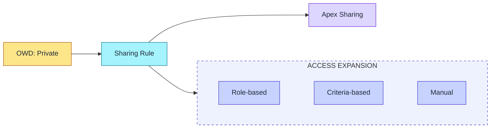

# Role Hierarchy Diagram Template

Flowchart template for visualizing Salesforce role hierarchies and permission structures.

## When to Use
- Documenting org security model
- Planning role hierarchy changes
- Explaining data access patterns
- Security review presentations

## Mermaid Template - Sales Role Hierarchy

```mermaid
%%{init: {"flowchart": {"nodeSpacing": 80, "rankSpacing": 70}} }%%
flowchart TB
    subgraph legend["📋 LEGEND"]
        direction LR
        L1[Role]
        L2([Profile])
        L3{{Permission Set}}
    end

    CEO[CEO]

    subgraph sales["SALES ORGANIZATION"]
        direction TB
        VP_SALES[VP of Sales]

        subgraph regions["REGIONAL DIRECTORS"]
            direction LR
            DIR_WEST[Director - West]
            DIR_EAST[Director - East]
            DIR_CENTRAL[Director - Central]
        end

        subgraph managers["SALES MANAGERS"]
            direction LR
            MGR_W1[Manager - SF]
            MGR_W2[Manager - LA]
            MGR_E1[Manager - NYC]
            MGR_E2[Manager - Boston]
            MGR_C1[Manager - Chicago]
            MGR_C2[Manager - Dallas]
        end

        subgraph reps["SALES REPRESENTATIVES"]
            direction LR
            REP_W[West Reps<br/>12 users]
            REP_E[East Reps<br/>15 users]
            REP_C[Central Reps<br/>10 users]
        end
    end

    subgraph service["SERVICE ORGANIZATION"]
        direction TB
        VP_SVC[VP of Service]

        SVC_MGR[Service Manager]

        subgraph agents["SERVICE AGENTS"]
            direction LR
            AGENT_T1[Tier 1 Support<br/>20 users]
            AGENT_T2[Tier 2 Support<br/>8 users]
        end
    end

    %% Hierarchy connections
    CEO --> VP_SALES
    CEO --> VP_SVC

    VP_SALES --> DIR_WEST
    VP_SALES --> DIR_EAST
    VP_SALES --> DIR_CENTRAL

    DIR_WEST --> MGR_W1
    DIR_WEST --> MGR_W2
    DIR_EAST --> MGR_E1
    DIR_EAST --> MGR_E2
    DIR_CENTRAL --> MGR_C1
    DIR_CENTRAL --> MGR_C2

    MGR_W1 --> REP_W
    MGR_W2 --> REP_W
    MGR_E1 --> REP_E
    MGR_E2 --> REP_E
    MGR_C1 --> REP_C
    MGR_C2 --> REP_C

    VP_SVC --> SVC_MGR
    SVC_MGR --> AGENT_T1
    SVC_MGR --> AGENT_T2

    %% Node Styling - Pastel palette (Tailwind 200-level)
    style CEO fill:#fbcfe8,stroke:#be185d,color:#1f2937
    style VP_SALES fill:#ddd6fe,stroke:#6d28d9,color:#1f2937
    style VP_SVC fill:#ddd6fe,stroke:#6d28d9,color:#1f2937
    style DIR_WEST fill:#c7d2fe,stroke:#4338ca,color:#1f2937
    style DIR_EAST fill:#c7d2fe,stroke:#4338ca,color:#1f2937
    style DIR_CENTRAL fill:#c7d2fe,stroke:#4338ca,color:#1f2937
    style MGR_W1 fill:#a5f3fc,stroke:#0e7490,color:#1f2937
    style MGR_W2 fill:#a5f3fc,stroke:#0e7490,color:#1f2937
    style MGR_E1 fill:#a5f3fc,stroke:#0e7490,color:#1f2937
    style MGR_E2 fill:#a5f3fc,stroke:#0e7490,color:#1f2937
    style MGR_C1 fill:#a5f3fc,stroke:#0e7490,color:#1f2937
    style MGR_C2 fill:#a5f3fc,stroke:#0e7490,color:#1f2937
    style SVC_MGR fill:#a5f3fc,stroke:#0e7490,color:#1f2937
    style REP_W fill:#a7f3d0,stroke:#047857,color:#1f2937
    style REP_E fill:#a7f3d0,stroke:#047857,color:#1f2937
    style REP_C fill:#a7f3d0,stroke:#047857,color:#1f2937
    style AGENT_T1 fill:#a7f3d0,stroke:#047857,color:#1f2937
    style AGENT_T2 fill:#a7f3d0,stroke:#047857,color:#1f2937
    style L1 fill:#e2e8f0,stroke:#334155,color:#1f2937
    style L2 fill:#e2e8f0,stroke:#334155,color:#1f2937
    style L3 fill:#e2e8f0,stroke:#334155,color:#1f2937

    %% Subgraph Styling - 50-level fills with dashed borders
    style legend fill:#f8fafc,stroke:#334155,stroke-dasharray:5
    style sales fill:#f5f3ff,stroke:#6d28d9,stroke-dasharray:5
    style regions fill:#eef2ff,stroke:#4338ca,stroke-dasharray:5
    style managers fill:#ecfeff,stroke:#0e7490,stroke-dasharray:5
    style reps fill:#ecfdf5,stroke:#047857,stroke-dasharray:5
    style service fill:#f5f3ff,stroke:#6d28d9,stroke-dasharray:5
    style agents fill:#ecfdf5,stroke:#047857,stroke-dasharray:5
```



## Mermaid Template - Profile & Permission Set Structure

```mermaid
%%{init: {"flowchart": {"nodeSpacing": 80, "rankSpacing": 70}} }%%
flowchart TB
    subgraph profiles["📋 PROFILES - BASE ACCESS"]
        direction LR
        P_ADMIN([System Admin])
        P_SALES([Sales User])
        P_SVC([Service User])
        P_MKTG([Marketing User])
        P_PARTNER([Partner Community])
    end

    subgraph psets["🔐 PERMISSION SETS - ADDITIVE"]
        direction TB

        subgraph functional["FUNCTIONAL PERMISSIONS"]
            PS_API{{API Access}}
            PS_REPORTS{{Advanced Reports}}
            PS_FLOW{{Flow Admin}}
        end

        subgraph feature["FEATURE PERMISSIONS"]
            PS_CPQ{{CPQ User}}
            PS_EINSTEIN{{Einstein Analytics}}
            PS_INBOX{{Sales Engagement}}
        end

        subgraph object["OBJECT PERMISSIONS"]
            PS_INVOICE{{Invoice Manager}}
            PS_CONTRACT{{Contract Editor}}
            PS_PRODUCT{{Product Admin}}
        end
    end

    subgraph groups["👥 PERMISSION SET GROUPS"]
        direction LR
        PSG_SALES_FULL{{Sales Full Access}}
        PSG_SVC_FULL{{Service Full Access}}
    end

    %% Profile assignments
    P_SALES --> PSG_SALES_FULL
    P_SVC --> PSG_SVC_FULL

    %% Group composition
    PS_API --> PSG_SALES_FULL
    PS_CPQ --> PSG_SALES_FULL
    PS_EINSTEIN --> PSG_SALES_FULL
    PS_INBOX --> PSG_SALES_FULL

    PS_API --> PSG_SVC_FULL
    PS_REPORTS --> PSG_SVC_FULL

    %% Node Styling - Profiles (violet-200)
    style P_ADMIN fill:#ddd6fe,stroke:#6d28d9,color:#1f2937
    style P_SALES fill:#ddd6fe,stroke:#6d28d9,color:#1f2937
    style P_SVC fill:#ddd6fe,stroke:#6d28d9,color:#1f2937
    style P_MKTG fill:#ddd6fe,stroke:#6d28d9,color:#1f2937
    style P_PARTNER fill:#ddd6fe,stroke:#6d28d9,color:#1f2937

    %% Node Styling - Permission Sets (emerald-200)
    style PS_API fill:#a7f3d0,stroke:#047857,color:#1f2937
    style PS_REPORTS fill:#a7f3d0,stroke:#047857,color:#1f2937
    style PS_FLOW fill:#a7f3d0,stroke:#047857,color:#1f2937
    style PS_CPQ fill:#a7f3d0,stroke:#047857,color:#1f2937
    style PS_EINSTEIN fill:#a7f3d0,stroke:#047857,color:#1f2937
    style PS_INBOX fill:#a7f3d0,stroke:#047857,color:#1f2937
    style PS_INVOICE fill:#a7f3d0,stroke:#047857,color:#1f2937
    style PS_CONTRACT fill:#a7f3d0,stroke:#047857,color:#1f2937
    style PS_PRODUCT fill:#a7f3d0,stroke:#047857,color:#1f2937

    %% Node Styling - Groups (orange-200)
    style PSG_SALES_FULL fill:#fed7aa,stroke:#c2410c,color:#1f2937
    style PSG_SVC_FULL fill:#fed7aa,stroke:#c2410c,color:#1f2937

    %% Subgraph Styling - 50-level fills with dashed borders
    style profiles fill:#f5f3ff,stroke:#6d28d9,stroke-dasharray:5
    style psets fill:#ecfdf5,stroke:#047857,stroke-dasharray:5
    style functional fill:#ecfdf5,stroke:#047857,stroke-dasharray:5
    style feature fill:#ecfdf5,stroke:#047857,stroke-dasharray:5
    style object fill:#ecfdf5,stroke:#047857,stroke-dasharray:5
    style groups fill:#fff7ed,stroke:#c2410c,stroke-dasharray:5
```



## ASCII Fallback Template

```
┌─────────────────────────────────────────────────────────────────────────────┐
│                           ROLE HIERARCHY                                    │
└─────────────────────────────────────────────────────────────────────────────┘

                                   ┌─────────┐
                                   │   CEO   │
                                   └────┬────┘
                                        │
                    ┌───────────────────┴───────────────────┐
                    │                                       │
             ┌──────▼──────┐                        ┌──────▼──────┐
             │ VP of Sales │                        │ VP of Svc   │
             └──────┬──────┘                        └──────┬──────┘
                    │                                      │
     ┌──────────────┼──────────────┐              ┌────────▼────────┐
     │              │              │              │ Service Manager │
     ▼              ▼              ▼              └────────┬────────┘
┌─────────┐  ┌─────────┐  ┌─────────┐                     │
│Director │  │Director │  │Director │          ┌──────────┼──────────┐
│  West   │  │  East   │  │ Central │          ▼          ▼          │
└────┬────┘  └────┬────┘  └────┬────┘    ┌─────────┐ ┌─────────┐    │
     │            │            │         │ Tier 1  │ │ Tier 2  │    │
     ▼            ▼            ▼         │ Support │ │ Support │    │
┌─────────┐ ┌─────────┐ ┌─────────┐      │ (20)    │ │  (8)    │    │
│Manager  │ │Manager  │ │Manager  │      └─────────┘ └─────────┘    │
│SF | LA  │ │NYC|BOS  │ │CHI|DAL  │                                 │
└────┬────┘ └────┬────┘ └────┬────┘                                 │
     │           │           │                                       │
     ▼           ▼           ▼                                       │
┌─────────┐ ┌─────────┐ ┌─────────┐                                 │
│ West    │ │ East    │ │ Central │                                 │
│ Reps    │ │ Reps    │ │ Reps    │                                 │
│  (12)   │ │  (15)   │ │  (10)   │                                 │
└─────────┘ └─────────┘ └─────────┘                                 │

┌─────────────────────────────────────────────────────────────────────────────┐
│  DATA ACCESS FLOW                                                           │
│  ─────────────────                                                          │
│  • Roles ABOVE can see records owned by roles BELOW                         │
│  • CEO sees ALL sales and service data                                      │
│  • VP Sales sees all sales data, NOT service data                           │
│  • Managers see only their team's records                                   │
│  • Reps see only their own records                                          │
└─────────────────────────────────────────────────────────────────────────────┘
```

## Security Components

| Component | Purpose | Shape |
|-----------|---------|-------|
| Role | Data visibility hierarchy | Rectangle |
| Profile | Base object/field access | Rounded |
| Permission Set | Additive permissions | Hexagon |
| Permission Set Group | Bundle of perm sets | Hexagon (orange) |

## Data Access Patterns

### OWD (Organization-Wide Defaults)

| Setting | Meaning |
|---------|---------|
| Private | Owner + hierarchy above |
| Public Read Only | All can view |
| Public Read/Write | All can edit |
| Controlled by Parent | Inherits from master |

### Sharing Rules



## Best Practices

1. **Minimize role levels** - 3-5 levels max
2. **Use Permission Set Groups** - Easier to manage
3. **Document exceptions** - Note any sharing rules
4. **Show user counts** - Understand scale
5. **Include profiles** - Show base access

## Customization Points

- Replace example roles with actual org structure
- Add specific user counts
- Include custom permission sets
- Show sharing rule exceptions
