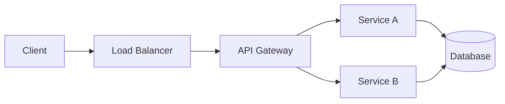

# Explanation Documentation Skill

This skill provides patterns for writing effective explanation documents. Explanations are understanding-oriented content for readers who want to know why things work the way they do.

## Purpose & Audience

**Target readers:**
- Users who want to understand concepts deeply, not just use them
- Architects and technical leads evaluating design decisions
- Team members onboarding to a codebase or system
- Anyone asking "why?" or "how does this work?"

**Explanations are for reading away from the keyboard.** Unlike tutorials or how-to guides, readers aren't trying to accomplish a task while reading. They're building mental models.

**Explanations are NOT:**
- Tutorials (which teach through hands-on doing)
- How-To guides (which accomplish specific goals)
- Reference docs (which look up precise details)

## Explanation Document Template

Use this structure for all explanation documents:

```markdown
---
title: "[Concept/System Name] Explained"
description: "Understand how [concept] works and why it was designed this way"
---

# Understanding [Concept]

Brief intro (2-3 sentences): What this document explains and why it matters. Set expectations for what the reader will understand after reading.

## Overview

High-level summary of the concept. What is it? What problem does it solve? This should be understandable without deep technical knowledge.

## Background and Context

### The Problem

What situation or challenge led to this design? What were users or developers struggling with?

### Historical Context

How did we get here? What came before? This helps readers understand why alternatives were rejected or why certain constraints exist.

## How It Works

### Core Concepts

Explain the fundamental ideas. Use analogies to connect to concepts readers already understand.

<Note>
Use diagrams or visual aids when explaining complex relationships or flows.
</Note>

### The Mechanism

Walk through how the system actually operates. This is conceptual, not procedural - explain the "what happens" rather than "what to do."

### Key Components

Break down the major parts and how they interact. For each component:
- What role does it play?
- How does it relate to other components?

## Design Decisions and Trade-offs

### Why This Approach?

Explain the reasoning behind key design choices. What goals drove these decisions?

### Trade-offs Made

Every design involves trade-offs. Be explicit about:
- What was prioritized
- What was sacrificed
- Under what conditions this design excels or struggles

### Constraints and Assumptions

What constraints shaped the design? What assumptions does it rely on?

## Alternatives Considered

### [Alternative Approach 1]

Brief description of an alternative approach. Why wasn't it chosen? Under what circumstances might it be better?

### [Alternative Approach 2]

Another alternative. Comparing alternatives helps readers understand the design space.

## Implications and Consequences

What does this design mean for:
- Performance?
- Scalability?
- Developer experience?
- Future extensibility?

## Related Concepts

- [Related Concept 1](/concepts/related-1) - How it connects to this topic
- [Related Concept 2](/concepts/related-2) - Another related area
- [Deeper Technical Reference](/reference/detail) - For implementation specifics
```

## Writing Principles

### Focus on Understanding, Not Doing

Explanations answer "why?" and "how does it work?" rather than "how do I?"

| Explanation (good) | How-To (wrong context) |
|-------------------|------------------------|
| "The cache uses LRU eviction because memory is limited and recent items are more likely to be accessed again." | "To configure the cache, set the `maxSize` parameter." |
| "Authentication tokens expire to limit the damage if they're compromised." | "Refresh your token by calling the `/refresh` endpoint." |

### Use Analogies and Mental Models

Connect unfamiliar concepts to things readers already know.

```markdown
<!-- Good: Relatable analogy -->
Think of the message queue like a post office. Messages (letters) are dropped off
by senders and held until recipients pick them up. The post office doesn't care
about the content - it just ensures reliable delivery.

<!-- Avoid: Jumping straight to technical details -->
The message queue implements a FIFO buffer with configurable persistence
and at-least-once delivery semantics.
```

### Explain the "Why" Behind Design Decisions

Don't just describe what exists - explain why it exists that way.

```markdown
<!-- Good: Explains rationale -->
We chose eventual consistency over strong consistency because our read-heavy
workload (100:1 read-to-write ratio) benefits more from low latency than from
immediate consistency. Most users never notice the brief delay.

<!-- Avoid: Just states facts -->
The system uses eventual consistency with a 500ms propagation window.
```

### Discuss Trade-offs Honestly

Every design choice has costs. Acknowledging them builds trust and helps readers make informed decisions.

```markdown
## Trade-offs

This architecture optimizes for **write throughput** at the cost of:

- **Read latency**: Queries may need to hit multiple partitions
- **Complexity**: Developers must understand partition keys
- **Cost**: More storage due to denormalization

This trade-off makes sense for our use case (high-volume event ingestion)
but may not suit read-heavy analytics workloads.
```

### Structure for Reflection, Not Action

Explanations are read linearly, away from the keyboard. Structure them like essays, not manuals.

- **Use flowing prose** more than bullet points
- **Build concepts progressively** - each section prepares for the next
- **Allow for depth** - it's okay if sections are longer than in how-to guides
- **Include context** that would be distracting in task-focused docs

### Connect to the Bigger Picture

Show how this concept relates to other parts of the system or to broader industry patterns.

```markdown
## Related Concepts

Our event sourcing approach is part of our broader CQRS (Command Query
Responsibility Segregation) architecture. Understanding event sourcing
helps explain:

- Why our read models are eventually consistent
- How we achieve audit logging "for free"
- Why replaying events is central to our testing strategy

For more on CQRS, see [Understanding Our Architecture](/concepts/cqrs-architecture).
```

## Components for Explanations

### Diagrams and Visuals

Explanations benefit heavily from visual aids:

```markdown
## System Architecture

The following diagram shows how requests flow through the system:



The load balancer distributes traffic across API gateway instances...
```

### Comparison Tables

Tables work well for comparing approaches:

```markdown
## Comparing Approaches

| Aspect | Monolith | Microservices |
|--------|----------|---------------|
| Deployment | Single unit, simpler | Independent, more complex |
| Scaling | Vertical | Horizontal per service |
| Team autonomy | Lower | Higher |
| Operational overhead | Lower | Higher |

We chose microservices because team autonomy was critical for our
100+ engineer organization...
```

### Callouts for Key Insights

```markdown
<Note>
This is a common source of confusion: the "eventual" in eventual consistency
doesn't mean "maybe" - it means "not immediately, but guaranteed eventually."
</Note>

<Warning>
This design assumes network partitions are rare. In environments with
unreliable networks, consider stronger consistency guarantees.
</Warning>
```

### Expandable Sections for Depth

Use expandables for tangential but valuable details:

```markdown
<Expandable title="Historical note: Why we migrated from Redis">
Our original implementation used Redis for caching. In 2023, we migrated
to a custom solution because...

This context explains why some older code references Redis patterns
even though we no longer use it directly.
</Expandable>
```

## Example Explanation Document

```markdown
---
title: "Understanding Our Authentication System"
description: "Learn how authentication works in our platform and why we designed it this way"
---

# Understanding Our Authentication System

This document explains how our authentication system works and the reasoning
behind its design. After reading, you'll understand the flow from login to
API access and why we made the architectural choices we did.

## Overview

Our authentication system uses short-lived access tokens with long-lived refresh
tokens. This pattern, sometimes called "token rotation," balances security with
user experience by limiting exposure while avoiding frequent re-authentication.

## Background and Context

### The Problem

Modern web applications face competing demands: security teams want frequent
credential rotation, while users expect seamless experiences without constant
logins. Traditional session-based authentication requires server-side state,
complicating horizontal scaling.

### Historical Context

We originally used server-side sessions stored in Redis. As we scaled to
multiple regions, session synchronization became a bottleneck. JWT tokens
emerged as an industry standard for stateless authentication, and we adopted
them in 2022.

## How It Works

### Core Concepts

**Access tokens** are like day passes at a conference. They grant entry for a
limited time and are checked at each door (API endpoint). If someone steals
your day pass, they can only use it until it expires.

**Refresh tokens** are like the registration confirmation you used to get your
day pass. You don't carry it around, but you can use it to get a new day pass
when yours expires.

### The Authentication Flow

When a user logs in:

1. They provide credentials to the authentication service
2. If valid, they receive both an access token (15-minute expiry) and
   a refresh token (7-day expiry)
3. The access token is used for API requests
4. When the access token expires, the refresh token obtains a new one
5. The old refresh token is invalidated, and a new one is issued

This rotation means that even if a refresh token is compromised, it can only
be used once before the legitimate user's next refresh invalidates it.

### Key Components

**Authentication Service**: Issues and validates tokens. Stateless for access
tokens, maintains a denylist for revoked refresh tokens.

**API Gateway**: Validates access tokens on every request. Rejects expired or
malformed tokens before requests reach backend services.

**Token Store**: Maintains refresh token metadata for revocation. Uses Redis
with regional replication.

## Design Decisions and Trade-offs

### Why Short-Lived Access Tokens?

We chose 15-minute expiry based on our threat model. Shorter expiry limits the
window for stolen token abuse, but more frequent refreshes increase latency
and auth service load. Our analysis showed 15 minutes balances these concerns
for our traffic patterns.

### Trade-offs Made

**Prioritized**: Horizontal scalability, security through token rotation
**Sacrificed**: Immediate revocation of access tokens, simplicity

Access tokens remain valid until expiry even after logout. For most use cases,
15 minutes of continued access is acceptable. For high-security operations
(password changes, large transfers), we require re-authentication.

### Constraints and Assumptions

- Clients can securely store refresh tokens (HttpOnly cookies for web)
- Clock skew between servers is under 30 seconds
- Redis is available for refresh token validation

## Alternatives Considered

### Server-Side Sessions

Traditional sessions would allow immediate revocation but require sticky
sessions or distributed session storage. We rejected this due to scaling
complexity and regional latency concerns.

### Longer Access Token Expiry

Longer-lived tokens reduce auth service load but increase risk from token
theft. Given our security requirements, we prioritized shorter windows.

## Implications and Consequences

**Performance**: Auth service handles ~10K refresh requests per minute. Token
validation is CPU-bound (signature verification), so we scale horizontally.

**Developer Experience**: Services never need database access for auth - they
just validate JWT signatures. This simplifies service development.

**User Experience**: Most users never notice token refresh. Mobile apps
refresh proactively to avoid mid-action expiry.

## Related Concepts

- [API Gateway Architecture](/concepts/api-gateway) - How the gateway validates tokens
- [Token Security Best Practices](/concepts/token-security) - Secure storage guidance
- [Authentication API Reference](/reference/auth-api) - Endpoint documentation
```

## Checklist for Explanations

Before publishing, verify:

- [ ] Title indicates this explains a concept (not a how-to)
- [ ] Introduction sets expectations for what reader will understand
- [ ] Background section provides context and history
- [ ] Core concepts explained with analogies or mental models
- [ ] Design decisions include rationale, not just facts
- [ ] Trade-offs discussed honestly
- [ ] Alternatives mentioned and compared
- [ ] Implications for different concerns addressed
- [ ] Related concepts linked
- [ ] Written for reading away from keyboard (no tasks to follow)
- [ ] Progressive structure builds understanding step by step

## When to Use Explanation vs Other Doc Types

| Reader's Question | Doc Type | Focus |
|------------------|----------|-------|
| "How do I do X?" | How-To Guide | Steps to accomplish a goal |
| "Teach me about X" | Tutorial | Learning through guided doing |
| "What is the API for X?" | Reference | Precise technical details |
| "Why does X work this way?" | **Explanation** | Understanding and context |
| "What are the trade-offs of X?" | **Explanation** | Design rationale |
| "How does X relate to Y?" | **Explanation** | Conceptual connections |

### Explanation Signals

Write an explanation when users:
- Ask "why" questions
- Need to make architectural decisions
- Are evaluating whether something fits their use case
- Want to understand design philosophy
- Need context before diving into implementation

### Not an Explanation

If users need to accomplish something while reading, it's not an explanation:
- "How to configure caching" - How-To Guide
- "Cache API reference" - Reference Doc
- "Build a caching layer tutorial" - Tutorial
- "How caching works and why we use LRU" - **Explanation**

## Related Skills

- **docs-style**: Core writing conventions and components
- **howto-docs**: How-To guide patterns for task-oriented content
- **reference-docs**: Reference documentation patterns for lookups
- **tutorial-docs**: Tutorial patterns for learning-oriented content
