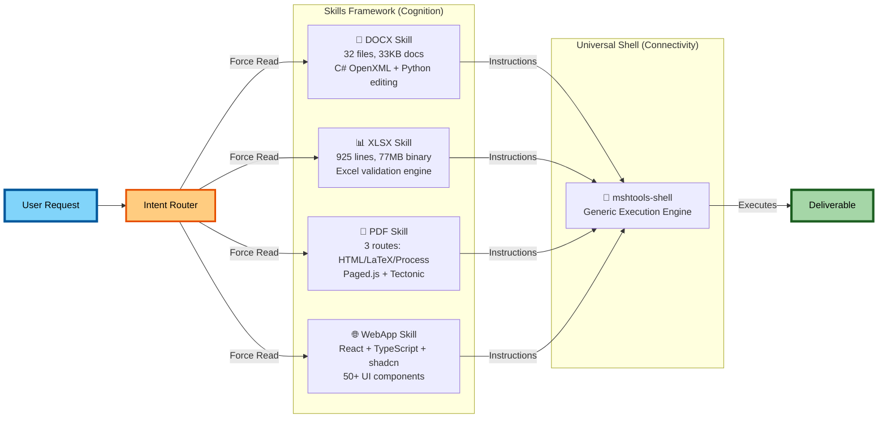

# The Skill System

Kimi's capabilities come from skill files—detailed instruction manuals that the agent reads at runtime. This is the core architectural insight: instead of implementing capabilities as backend tools, Kimi documents them as text that the model can understand and execute.

---

## System at a Glance

---

## How Skills Get Loaded

The OK Computer agent starts with a base prompt that defines its identity—professional, helpful, capable of file operations. This prompt doesn't contain domain-specific knowledge about Excel formulas or LaTeX compilation. That knowledge gets injected at runtime.

When you ask for a spreadsheet, the system detects this intent and inserts an instruction: read the xlsx skill file before doing anything else. The agent executes `read_file("/app/.kimi/skills/xlsx/SKILL.md")`, loads 925 lines of Excel-specific guidance into its context, and proceeds with the task. This is just-in-time loading. The agent doesn't carry all skills at once—it loads what it needs when it needs it.

The base prompt stays constant; the knowledge layer changes based on the task. Most Kimi variants follow this pattern: load the base OK Computer prompt that provides identity and communication style, inject the relevant skill for domain knowledge, then execute the task. The base prompt provides consistency—you're always talking to the same agent. The skill provides task-specific expertise without permanently bloating the context.

---

## What Skills Contain

A skill file is a comprehensive manual for a task domain. The xlsx skill covers compatibility rules (avoid `FILTER()` and `XLOOKUP()` for older Excel versions), how to use the custom `KimiXlsx` validation binary, pivot table patterns, formula debugging, and number formatting. The docx skill teaches C# code generation with the OpenXML SDK, including templates for different document types and validation procedures.

These aren't brief hints or quick tips. They're detailed technical specifications, often hundreds of lines long. The xlsx skill is 925 lines. The docx skill explains OpenXML element ordering rules, validation procedures, and CJK font handling. The PDF skill documents three different generation routes with specific constraints for each. They're comprehensive enough that a skilled developer could follow them—and the model is expected to follow them too.

The skill files also reference additional resources that get loaded conditionally. The docx skill has different templates for different document types—`CJKExample.cs` for Chinese text with specific font handling, the standard template for English documents. The PDF skill has separate route documentation for HTML, LaTeX, and process modes. The skill file is a library; the agent reads the chapters it needs.

---

## Context Stays Fluid

Skills get loaded at task start, but context isn't static after that. During execution, the agent loads and unloads additional context based on what it encounters.

When compilation fails, the agent might read additional reference material. The docx skill includes troubleshooting documentation for common C# errors. If OpenXML validation fails, the agent can load specific guidance on element ordering or XML tolerance settings. This is temporary context—the debugging information gets used, the problem gets fixed, and the agent moves on without carrying that extra context through the rest of the task.

The PDF skill illustrates route-based loading. It has three routes: HTML via Paged.js for business documents, LaTeX via Tectonic for academic papers, and pikepdf for manipulating existing PDFs. When the agent decides which route to use—academic paper means LaTeX, business report might mean HTML—it loads only the relevant sub-instructions. Loading all three routes would waste context tokens on information that won't be used.

This resembles how people work. You don't memorize every troubleshooting guide before starting a task; you consult them when you hit a problem. The context flows toward where it's needed.

---

## The Four Skills

**docx/** handles Word document generation. The approach is unusual: it uses C# with the OpenXML SDK rather than Python libraries like python-docx. The skill file includes templates for different languages (English and CJK), validation rules for document structure, and instructions for running the custom .NET validator. The dual-stack architecture separates creation (C#) from editing (Python).

**xlsx/** handles Excel spreadsheet generation. The skill relies on a 77MB binary called KimiXlsx that validates spreadsheet files, checking OpenXML compliance and rejecting files that use Excel 365-only functions that would break in older versions. The documentation covers formula compatibility, pivot table creation, and styling requirements.

**pdf/** provides three different routes depending on context. Business documents use HTML rendered through Playwright with Paged.js for pagination. Academic papers use LaTeX compiled with Tectonic. Existing PDF manipulation uses pikepdf. The skill file explains when to use which route.

**webapp-building/** covers React web applications with Vite, TypeScript, Tailwind, and shadcn/ui. The skill documents 50+ pre-installed UI components and explains the development workflow from scaffolding to build.

---

## Knowledge vs. Identity

Kimi's architecture distinguishes between who the agent is (identity) and what the agent can do (knowledge). These are handled by different parts of the system and change at different rates.

The base prompt defines the agent's core character: personality, communication style, capabilities, behavioral boundaries. This layer stays constant. Whether the task is a spreadsheet or a React app, you're talking to the same agent. The voice doesn't change. The values don't shift.

Skills define domain capabilities that sit on top of the base identity. Knowledge is modular and transient—load it when needed, discard it when done. The agent gains expertise for the current task without that expertise becoming permanent baggage.

This separation has practical benefits. Users interact with a stable identity regardless of task, so there are no jarring mode switches. Safety guidelines live in the identity layer, and skills can't override them. New skills can be added without touching the base prompt. When something goes wrong, you can ask whether this is an identity issue or a knowledge issue.

---

## The Slides Exception

Kimi Slides doesn't follow this pattern. Instead of layering a skill onto the base prompt, it replaces the base prompt entirely with a "McKinsey presentation designer" persona—20 years of experience, expertise in visual storytelling, audience psychology, design systems.

One interpretation: presentation design requires a different kind of thinking. It's not just technical rules (how to create slides) but aesthetic judgment (what looks good). You can teach Excel formulas through documentation; teaching design sensibility might require embedding it in identity. The McKinsey persona carries implicit knowledge about taste and style that would be hard to make explicit in a skill file.

This is speculative—it's also possible the Slides architecture just evolved differently for historical reasons. But the current distinction is notable: most domains get knowledge injection, creative design gets identity replacement. Technical tasks get skill files. Creative tasks get personas.
