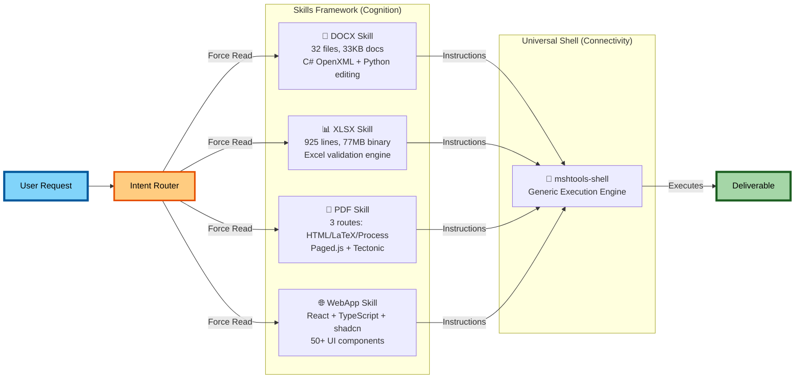

# MCP Tools vs. Skill-Gated Shell-Operator Tools

## Intro

In the evolution of AI agents, a divergence has emerged between "Tool-Use Architectures" (providing models with discrete APIs) and "Context Architectures" (providing models with knowledge and operating system access). The Kimi agent system represents the latter. Instead of embedding intelligence directly into function definitions, which is a hallmark of standard MCP (Model Context Protocol) implementations, Kimi employs a **connectivity/cognition split**. In this architecture, tools (`mshtools-`) provide dumb, universal IO "Connectivity," while file-based Skills provide specialized, just-in-time "Cognition." This document analyzes how this Shell-Operator paradigm solves the scalability and context-efficiency problems of general-purpose agents, transforming the LLM from a mere API consumer into an autonomous Operating System User.

---

## System at a Glance

---

## The Paradox: "Missing" Tools

When analyzing the `tools.json` definition for the Kimi agent, one encounters a paradox.

Despite the agent's demonstrated ability to **create complex React web applications**, **validate Excel formulas** against specific business rules, **compile academic LaTeX documents**, and **manipulate PDF structures**, the tool definitions contain **no such specific capabilities**.

There is no `create_react_app` tool.
There is no `validate_formula` tool.
There is no `compile_latex` tool.

Instead, the tool list is startlingly generic: `read_file`, `write_file`, `web_search`, `ipython`, and the omnipresent `mshtools-shell`.

This observation reveals the core thesis of Kimi's architecture: **True agentic specialization is not defined by the tools the agent possesses, but by the knowledge/knowhow the agent can access.**

## The Shift from Prompt Engineering to Context Engineering

KIMI's architecture signals a maturation in how we control Large Language Models (LLMs). We are moving away from **Prompt Engineering** (the art of coaxing good behavior out of a model via transient chat instructions) toward **Context Engineering**: configuring the environment in a way where the model has access to just the right amount of knowledege it needs to achieve a task.

Connectivity refers to the standardized interfaces that allow a probabilistic model to affect a deterministic world. In standard MCP implementations, the "Intelligence" is often hard-coded into the Tool Definition that gets appended to the system prompt. But here we have a problem: if every rule for every domain were included in the system prompt, the context window would be saturated with irrelevant constraints (e.g., slideshow tools polluting context during a casual chat). Kimi solves this with skills.

Additionally, this allows more context to be allocated to tools that are used more frequently and generally. Kimi's skill-based approach provides universal tools (such as shell, file I/O, and Python runtime) and teaches the model how to use them through knowledge that gets injected into the model **ONLY** when it needs it.

This happens through 3 steps:

1.  **Classification**: The system identifies a user intent (e.g., "Make a spreadsheet").
2.  **Injection**: The system forces the model to read `/app/.kimi/skills/xlsx/SKILL.md` via `read_file`.
3.  **Execution**: The model, now temporarily an expert in Excel compatibility, utilizes the shell to execute the task.

---

### One Tool, Four Agents
Here is the actual breakdown of how **One Tool (`shell`)** becomes **Four Different Agents** depending on the active Skill context:

| Context (Skill) | The Agent Identity | The Shell Command (`mshtools-shell`) | The Helper Files |
| :--- | :--- | :--- | :--- |
| **Word** | **Document Expert** | `dotnet run --project KimiDocx.csproj` | `assets/templates/Example.cs` |
| **Excel** | **Data Analyst** | `python KimiXlsx inspect` | `scripts/KimiXlsx` (Binary) |
| **WebApp** | **Frontend Engineer** | `npm run build` | `scripts/template/src/components` |
| **PDF** | **Publisher** | `tectonic main.tex` | `scripts/compile_latex.py` |

---

## Skill Injection Variants

Most Kimi variants keep the base identity and add domain knowledge through skill files. The agent stays "professional, helpful, direct" while gaining new capabilities. What changes is what it knows, not who it is. 

This architecture implies a far more sophisticated future for "Runtime Injections"-context that is not just loaded at the start of a task, but injected dynamically based on feedback.

*   **Error-Based Injection**: If a compilation fails (e.g., C# syntax error), the agent might read a specific `troubleshooting.md` or a log file, effectively "injecting" debugging expertise solely for that moment.
*   **Route-Based Injection**: In the PDF skill, the agent first chooses a route (HTML vs LaTeX). Once chosen, it could theoretically load *only* the `routes/html.md` sub-skill, discarding the irrelevant LaTeX knowledge to save context tokens.
*   **Template Injection**: The `docx` skill's `assets/templates/` folder allows the agent to essentially "swap brains" for different document types (e.g., loading `CJKExample.cs` knowledge only when creating Chinese documents).

The brilliance of this system is **Context Efficiency**. Kimi’s `xlsx` skill is 925 lines long. If Kimi injected every skill (Word, PDF, WebApp, Sheets) into the base system prompt, the context window would be saturated with irrelevant rules while the user is simply asking for a cookie recipe.

This transforms the agent's context from specific (brittle) to generic (flexible). The Base Agent is merely a "Reader and executor of manuals."