# Container Infrastructure

Kimi runs in a containerized environment with four distinct layers. Understanding this architecture explains how the agent executes code, automates browsers, and manages files.

---

## The Four Layers

```mermaid
graph TD
    subgraph L1["🏛️ Layer 1: Control Plane"]
        direction TB
        FastAPI["kernel_server.py<br/>• 9,434 bytes<br/>• Port 8888<br/>• Uvicorn ASGI<br/>• No auth (container isolation)"]:::control
        Endpoints["/health<br/>/kernel/reset<br/>/kernel/interrupt<br/>/kernel/status"]:::endpoint
        FastAPI -.->|Exposes| Endpoints
    end

    subgraph L2["⚙️ Layer 2: Compute Engine"]
        direction TB
        Jupyter["jupyter_kernel.py<br/>• 17,246 bytes<br/>• IPython kernel<br/>• PID 300-400<br/>• ZeroMQ IPC"]:::compute
        Libs["PyTorch 2.8.0 + CUDA<br/>NumPy, SQLite<br/>Matplotlib (CJK)"]:::lib
        Jupyter -.->|Uses| Libs
    end

    subgraph L3["🌐 Layer 3: Web Tools"]
        direction TB
        Browser["browser_guard.py<br/>• 41,635 bytes<br/>• Playwright + CDP<br/>• Chromium 120.x"]:::web
        Ports["Port 9222: localhost<br/>Port 9223: public<br/>Stealth mode enabled"]:::port
        Browser -.->|Listens| Ports
    end

    subgraph L4["📁 Layer 4: User Workspace"]
        direction TB
        Mount["/mnt/okcomputer/"]
        Upload["upload/<br/>(read-only)"]:::ro
        Output["output/<br/>(read-write)"]:::rw
        Store[".store/<br/>(append-only)"]:::ao
        Mount --> Upload
        Mount --> Output
        Mount --> Store
    end

    FastAPI ==>|"Lifecycle control<br/>(start/stop/reset)"| Jupyter
    Jupyter ==>|"Spawns subprocesses<br/>(Python execution)"| Browser
    Jupyter ==>|"File I/O operations"| Mount
    Browser -.->|"PDF generation<br/>Web scraping"| Output

    classDef control fill:#90caf9,stroke:#0d47a1,stroke-width:4px,color:#000
    classDef endpoint fill:#ce93d8,stroke:#4a148c,stroke-width:2px,stroke-dasharray: 5 5,color:#000
    classDef compute fill:#ffcc80,stroke:#e65100,stroke-width:4px,color:#000
    classDef lib fill:#f48fb1,stroke:#880e4f,stroke-width:2px,stroke-dasharray: 5 5,color:#000
    classDef web fill:#a5d6a7,stroke:#1b5e20,stroke-width:4px,color:#000
    classDef port fill:#c5e1a5,stroke:#33691e,stroke-width:2px,stroke-dasharray: 5 5,color:#000
    classDef ro fill:#ef9a9a,stroke:#b71c1c,stroke-width:3px,color:#000
    classDef rw fill:#a5d6a7,stroke:#1b5e20,stroke-width:3px,color:#000
    classDef ao fill:#ffcc80,stroke:#e65100,stroke-width:3px,color:#000
```

---

The control plane sits at the top. A FastAPI server on port 8888 manages the kernel lifecycle (starting, stopping, and resetting the Python environment). This is how the outer system controls the agent's execution context. The endpoints are simple REST calls: `/kernel/reset` restarts the IPython environment, `/kernel/interrupt` sends SIGINT to running code, and `/kernel/connection` returns ZeroMQ connection information.

The compute engine runs an IPython kernel that handles actual code execution. ZeroMQ provides inter-process communication between the kernel and its clients. The kernel has budgets and limits (10 steps per turn in base chat mode and higher limits in agentic mode) that constrain how much the agent can do before returning control.

The implementation is notably defensive, with multiple fallback strategies for finding the kernel process ID across different jupyter-client versions. First it checks the provisioner API from jupyter-client 7.0+, then the legacy kernel property, then process table scanning with psutil, and finally connection file matching. This kind of compatibility dance suggests the code runs in varied deployment environments.

The web tools layer provides browser automation through Playwright driving Chrome. The browser runs in stealth mode with anti-detection flags like `--disable-blink-features=AutomationControlled`, allowing the agent to interact with web pages that might block obvious automation. External network access is blocked at the container level, so web interactions go through this controlled channel rather than arbitrary HTTP requests.

The module provides two browser implementations: Playwright for high-level automation and Chrome DevTools Protocol for lower-level control. The dual approach provides fallback options; for example, when Playwright's context becomes unresponsive, CDP provides direct process control. The CDP implementation also runs a monitoring loop that auto-restarts the browser if it crashes and creates new tabs if they all close.

The user workspace is a mounted filesystem at `/mnt/okcomputer/` with permission zones. The `upload/` directory is read-only (user files stay protected). The `output/` directory is read-write (deliverables go here). The `.store/` directory is append-only (audit logs and citations accumulate without tampering).

---

## The Binary Tools

Several compiled binaries extend the agent's capabilities beyond what Python alone provides.

**Tectonic** is a 57MB LaTeX compiler that handles academic document generation. Unlike traditional LaTeX distributions, Tectonic automatically downloads packages on demand, making it self-contained.

**KimiXlsx** is a 77MB .NET binary that validates Excel files. It checks OpenXML compliance, recalculates formulas to catch errors, and rejects files using Excel 365-only functions that would break in older versions. The skill file instructs the agent to run validation before delivering any spreadsheet.

**Validator** is a smaller .NET binary (72KB plus 6.9MB of dependencies) that validates Word documents against OpenXML schemas and business rules. The docx skill requires validation after every document generation.

These binaries represent capabilities that would be difficult to implement in pure Python with the same level of correctness. The Excel validation in particular needs to understand formula semantics deeply enough to detect calculation errors.

---

## Network Exposure

The security model assumes container isolation. Within that boundary, services are permissive.

Port 8888 runs the kernel server with CORS `allow_origins=["*"]`; consequently, anyone who can reach the container network can restart the kernel. Port 9223 exposes Chrome's DevTools Protocol, allowing page manipulation and JavaScript execution. Neither service has authentication.

This would be dangerous for a public-facing service. In Kimi's case, these ports are internal to a container that users can't directly reach. The assumption is that only trusted orchestration components connect to them.

The container blocks external network access. Running `curl google.com` times out; `requests.get()` gets connection refused. Web access goes through the browser tools, which presumably have their own controls. The agent can visit web pages but can't make arbitrary HTTP requests from Python.

Chrome runs with `--no-sandbox`, disabling the browser's process isolation. This is required for container environments where Chrome's sandbox conflicts with container security features; essentially, you're trading browser-level sandboxing for container-level sandboxing.

---

## Resilience Features

The infrastructure is designed to recover from failures automatically.

The kernel monitors its own health before each execution attempt, checking both process liveness and responsiveness. If either check fails, it triggers a restart: shutdown the existing kernel, clear the client channels, start fresh, reconnect, reinitialize matplotlib. This happens transparently.

The browser guard runs a monitoring loop that checks process health and tab count. If the browser crashes, it restarts with exponential backoff. If all tabs close, it creates a new one. CDP disconnections trigger reconnection and reinitialization.

This self-healing matters for an agent that might run hundreds of interactions in a session. Without it, any failure would require manual intervention. With it, the agent often recovers transparently and continues working.

```mermaid
graph TB
    subgraph KernelMonitoring ["🔄 Kernel Self-Healing"]
        direction TB
        K1[Check Health]:::check
        K2{Process alive?}:::decision
        K3[Monitor Execution]:::monitor
        K4[Detect Hang/Crash]:::detect
        K5[Kill Process]:::action
        K6[Spawn New Kernel]:::action
        K7[Restore State]:::action
        
        K1 --> K2
        K2 -->|Yes| K3
        K2 -->|No| K5
        K3 --> K4
        K4 -->|Timeout/Error| K5
        K4 -->|OK| K3
        K5 --> K6
        K6 --> K7
        K7 --> K1
    end
    
    subgraph BrowserMonitoring ["🌐 Browser Self-Healing"]
        direction TB
        B1[Monitor Process]:::check
        B2{Chrome alive?}:::decision
        B3{Tabs exist?}:::decision
        B4[Check CDP Connection]:::monitor
        B5[Exponential Backoff]:::action
        B6[Restart Chrome]:::action
        B7[Create New Tab]:::action
        B8[Reconnect CDP]:::action
        
        B1 --> B2
        B2 -->|No| B5
        B2 -->|Yes| B3
        B3 -->|No| B7
        B3 -->|Yes| B4
        B4 -->|Lost| B8
        B4 -->|OK| B1
        B5 --> B6
        B6 --> B1
        B7 --> B1
        B8 --> B1
    end
    
    Trigger["⚠️ Failure Detected"]:::trigger
    Recovery["✅ Service Restored"]:::success
    
    Trigger -.->|Kernel issue| K1
    Trigger -.->|Browser issue| B1
    K7 -.-> Recovery
    B8 -.-> Recovery
    
    classDef check fill:#90caf9,stroke:#0d47a1,stroke-width:3px,color:#000
    classDef decision fill:#ffcc80,stroke:#e65100,stroke-width:3px,color:#000
    classDef monitor fill:#ce93d8,stroke:#4a148c,stroke-width:3px,color:#000
    classDef detect fill:#ef9a9a,stroke:#b71c1c,stroke-width:3px,color:#000
    classDef action fill:#a5d6a7,stroke:#1b5e20,stroke-width:3px,color:#000
    classDef trigger fill:#ef5350,stroke:#b71c1c,stroke-width:4px,color:#000
    classDef success fill:#66bb6a,stroke:#1b5e20,stroke-width:4px,color:#000
```

