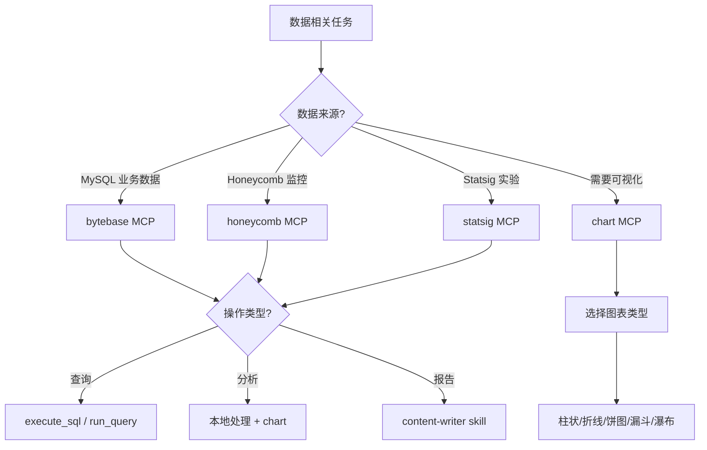

# 🌳 Claude Code 能力决策树

> **Version**: 2.1 (数据分析增强版)
> **Last Updated**: 2026-01-19
> **Status**: Active
> **用途**: 1 秒定位正确工具，60+ 场景速查

---

## ⚡ 1 秒速查（超快版）

```
需要查询外部数据？ → MCP
需要自动化任务？   → Skills (/command)
需要架构建议？     → Plugins（自动激活，直接描述需求）
```

---

## 📚 50+ 场景速查库

### 数据分析场景（25 个）

| # | 任务描述 | 最佳工具 | 示例命令/调用 |
|---|---------|---------|--------------|
| 1 | 查询用户成本数据 | bytebase MCP | `execute_sql("SELECT * FROM users WHERE ...")` |
| 2 | 生成收入趋势图 | bytebase → chart MCP | 查询 → `generate_line_chart(data)` |
| 3 | 查看慢请求 traces | honeycomb MCP | `run_query(query_spec)` |
| 4 | Bot 归因分析 | bytebase (CTE) | 订单前后 ±7 天窗口查询 |
| 5 | A/B 测试结果查询 | statsig MCP | `Get_Experiment_Pulse_Results(experiment)` |
| 6 | 生成成本对比柱状图 | chart MCP | `generate_bar_chart(data, categories)` |
| 7 | 查询数据库表结构 | bytebase MCP | `search_objects(object_type="table")` |
| 8 | 生成用户占比饼图 | chart MCP | `generate_pie_chart(data)` |
| 9 | 分析用户转化漏斗 | chart MCP | `generate_funnel_chart(stages)` |
| 10 | 查询 honeycomb traces | honeycomb MCP | `get_trace(trace_id)` |
| 11 | 生成收入瀑布图 | chart MCP | `generate_waterfall_chart(changes)` |
| 12 | 查看 honeycomb 数据集 | honeycomb MCP | `get_dataset(dataset_slug)` |
| 13 | 实验特性开关查询 | statsig MCP | `Get_Feature_Gate(gate_name)` |
| 14 | 成本趋势分析（30天） | bytebase → chart | 查询 → `generate_line_chart(time_series)` |
| 15 | 查询所有可用字段 | honeycomb MCP | `get_dataset_columns(dataset_slug)` |
| 16 | **Bot毛利率分析** | @bot-margin-analysis.md | `@bot-margin-analysis.md 分析12月` |
| 17 | **Bot收入成本趋势** | @bot-revenue-cost-trend.md | `@bot-revenue-cost-trend.md undress-generator` |
| 18 | **成本按用户类型分析** | @cost-trend-by-user-type.md | `@cost-trend-by-user-type.md 最近7天` |
| 19 | **整体毛利率分析** | @gross-margin-analysis.md | `@gross-margin-analysis.md 最近30天` |
| 20 | **失活邮箱域名分析** | @inactive-email-domains.md | `@inactive-email-domains.md` |
| 21 | **活跃邮箱域名审核** | @active-email-domains.md | `@active-email-domains.md days=7` |
| 22 | **收入与订阅分析** | @revenue-subscription-analysis.md | `2025年整体收入表现` |
| 23 | **主站电量分析** | @main-site-energy-analysis.md | `主站 vs Art 消耗对比` |
| 24 | **Apple IAP 分析** | @apple-payment-analysis.md | `Apple 支付收入分析` |
| 25 | **用户分类成本** | bytebase (6类用户) | CTE 预过滤 + 用户类型分组 |

### 数据分析 Skills 快速选择

| 分析目的 | Skill | 关键词 |
|---------|-------|--------|
| 哪些 bot 盈利/亏损 | Bot毛利率分析 | bot、毛利率、盈利 |
| 特定 bot 趋势变化 | Bot收入成本趋势 | 趋势、时间序列、按天/按周 |
| 免费用户成本占比 | 成本趋势分析 | 免费成本、用户类型 |
| 整体业务是否健康 | 整体毛利率分析 | 整体、毛利率、收入构成 |
| 白名单域名管理 | 失活/活跃邮箱域名 | 白名单、失活、邮箱域名 |
| 全面业务表现 | 收入与订阅分析 | 按月收入、复购率、套餐销售 |
| 主站 vs Art 消耗 | 主站电量分析 | 电量、主站、Art |

### 全栈开发场景（15 个）

| # | 任务描述 | 最佳工具 | 示例命令/调用 |
|---|---------|---------|--------------|
| 16 | Git 提交代码 | `/commit` skill | 自动生成 message + 提交 |
| 17 | 创建 PR | `/create-pr` skill | 分析变更 + 生成描述 + 创建 |
| 18 | 代码审查 | `/code-review` skill | 5 个并行代理审查 |
| 19 | 生成单元测试 | `/write-tests` skill | 自动生成测试用例 |
| 20 | 设计 UI 界面 | ui-ux-pro-max skill | 搜索样式 + 配色 + 字体 + 生成代码 |
| 21 | 查询最新技术文档 | context7 MCP | `query-docs("Next.js 15", "App Router")` |
| 22 | 后端架构设计 | backend-development plugin | 描述需求，自动激活 |
| 23 | 前端组件开发 | frontend-mobile-development | 描述需求，自动激活 |
| 24 | 代码重构建议 | `/refactor` skill | 分析代码 + 提供重构方案 |
| 25 | 添加代码注释 | `/add-comments` skill | 自动生成语义化注释 |
| 26 | 性能优化建议 | `/optimize-performance` skill | 识别瓶颈 + 优化方案 |
| 27 | 一键提交+推送+PR | commit-push-pr skill | 自动化完整 Git 工作流 |
| 28 | **无障碍性检查** | **ESLint + Playwright** | `npm run lint` + `npm run test:accessibility` |
| 29 | **知识库集成** | **KnowledgeBaseService** | 启动时加载 12 个文档到内存 |
| 30 | **Pre-commit Hook 设置** | **Husky** | `npx husky install` + `chmod +x .husky/pre-commit` |

### 浏览器自动化场景（8 个）

| # | 任务描述 | 最佳工具 | 示例命令/调用 |
|---|---------|---------|--------------|
| 28 | 网页数据抓取 | browser-use skill | Agent(task="抓取 HN 前 10 新闻") |
| 29 | E2E 测试 | browser-use skill | 测试登录流程 + 表单提交 |
| 30 | 表单自动填写 | browser-use skill | Agent + 自定义 tools |
| 31 | UI 截图验证 | playwright MCP | `browser_take_screenshot()` |
| 32 | 浏览器交互 | playwright MCP | `browser_click()`, `browser_type()` |
| 33 | 页面快照 | playwright MCP | `browser_snapshot()` |
| 34 | 查看控制台日志 | playwright MCP | `browser_console_messages()` |
| 35 | 网络请求分析 | playwright MCP | `browser_network_requests()` |

### 支付与服务集成场景（10 个）

| # | 任务描述 | 最佳工具 | 示例命令/调用 |
|---|---------|---------|--------------|
| 36 | 创建 Stripe 客户 | stripe MCP | `create_customer(name, email)` |
| 37 | 列出 Stripe 产品 | stripe MCP | `list_products(limit)` |
| 38 | 创建支付价格 | stripe MCP | `create_price(product, unit_amount, currency)` |
| 39 | 查询支付意图 | stripe MCP | `list_payment_intents(customer)` |
| 40 | 创建退款 | stripe MCP | `create_refund(payment_intent, amount)` |
| 41 | 创建 Firebase 项目 | firebase MCP | `firebase_create_project(project_id)` |
| 42 | 部署 Edge Function | firebase MCP | `firebase_deploy_edge_function(files)` |
| 43 | 执行 Firebase SQL | firebase MCP | `firebase_execute_sql(query)` |
| 44 | 创建 Supabase 项目 | supabase MCP | `supabase_create_project(name, region)` |
| 45 | 部署 Supabase 函数 | supabase MCP | `supabase_deploy_edge_function(slug, files)` |

### 营销场景（24 个）

| # | 任务描述 | 最佳工具 | 示例命令/调用 |
|---|---------|---------|--------------|
| 46 | 落地页转化优化 | page-cro skill | 描述页面类型，自动分析 |
| 47 | 首页文案撰写 | copywriting skill | 提供产品信息，生成文案 |
| 48 | 注册流程优化 | signup-flow-cro skill | 分析当前流程，提供方案 |
| 49 | 设置 GA4 追踪 | analytics-tracking skill | 配置事件追踪 |
| 50 | 创建邮件序列 | email-sequence skill | 设计自动化邮件流程 |
| 51 | SEO 技术审计 | seo-audit skill | 全面 SEO 检查 |
| 52 | A/B 测试设计 | ab-test-setup skill | 实验设计 + 实施方案 |
| 53 | 竞品对比页面 | competitor-alternatives skill | 生成对比页 SEO 内容 |
| 54 | 定价策略设计 | pricing-strategy skill | 分析定价模型 |
| 55 | 文案编辑润色 | copy-editing skill | 优化现有文案 |
| 56 | 用户引导优化 | onboarding-cro skill | 提高激活率方案 |
| 57 | 表单转化优化 | form-cro skill | 潜客表单优化 |
| 58 | 弹窗设计优化 | popup-cro skill | 弹窗转化策略 |
| 59 | 付费墙优化 | paywall-upgrade-cro skill | 应用内升级优化 |
| 60 | 程序化 SEO | programmatic-seo skill | 规模化页面生成 |
| 61 | Schema 标记 | schema-markup skill | 结构化数据优化 |
| 62 | 付费广告策略 | paid-ads skill | Google/Meta/LinkedIn 广告 |
| 63 | 免费工具策划 | free-tool-strategy skill | 工程化营销工具 |
| 64 | 推荐计划设计 | referral-program skill | 推荐/联盟计划 |
| 65 | 社交内容创作 | social-content skill | LinkedIn/Twitter 内容 |
| 66 | 产品发布策划 | launch-strategy skill | Product Hunt 发布 |
| 67 | 营销创意灵感 | marketing-ideas skill | 140 个营销创意库 |
| 68 | 营销心理学 | marketing-psychology skill | 70+ 心理学模型 |

### 营销技能快速选择

| 营销目标 | Skill | 关键词触发 |
|---------|-------|-----------|
| 提高转化率 | page-cro | 转化率、优化页面、CRO |
| 写营销文案 | copywriting | 文案、改写、标题、CTA |
| 优化注册 | signup-flow-cro | 注册流程、注册优化 |
| SEO 优化 | seo-audit | SEO、审计、技术 SEO |
| 邮件营销 | email-sequence | 邮件序列、滴灌、自动化 |
| 定价设计 | pricing-strategy | 定价、层级、付费意愿 |
| 产品发布 | launch-strategy | 发布、Product Hunt |
| 营销灵感 | marketing-ideas | 创意、点子、策略 |

### 调试与优化场景（8 个）

| # | 任务描述 | 最佳工具 | 示例命令/调用 |
|---|---------|---------|--------------|
| 69 | 生产故障排查 | honeycomb → bytebase | traces → 数据库慢查询 |
| 70 | SQL 性能优化 | database-optimizer plugin | 分析瓶颈 + CTE 优化 |
| 71 | 错误日志分析 | error-diagnostics plugin | 识别根因 + 修复方案 |
| 72 | 调试代码问题 | `/debug` skill | 错误排查 + 解决方案 |
| 73 | 解释错误根因 | `/explain-issue` skill | 分析日志 + 解释原因 |
| 74 | 修复 Bug | `/fix-bug` skill | 定位问题 + 修复代码 |
| 75 | 代码库搜索 | greptile MCP | `search_custom_context(query)` |
| 76 | 性能监控查询 | honeycomb MCP | 查询 P95 延迟、错误率 |

### DevOps 与部署场景（7 个）

| # | 任务描述 | 最佳工具 | 示例命令/调用 |
|---|---------|---------|--------------|
| 77 | CI/CD 流程设计 | cicd-automation plugin | 描述需求，生成工作流 |
| 78 | K8s manifest 生成 | kubernetes-operations plugin | 生成 Deployment/Service YAML |
| 79 | Terraform 配置 | cloud-infrastructure plugin | IaC 模板生成 |
| 80 | 数据库迁移 | database-migrations plugin | 生成迁移脚本 + 执行 |
| 81 | 云架构设计 | cloud-architect plugin | AWS/Azure/GCP 架构 |
| 82 | GitOps 工作流 | deployment-engineer plugin | ArgoCD/Flux 配置 |
| 83 | 容器安全扫描 | security-scanning plugin | 漏洞扫描 + 修复建议 |

---

## 🎯 交互式决策树

### 决策树 1: 数据操作类任务



### 决策树 2: 开发类任务

```mermaid
graph TD
    A[开发任务] --> B{任务类别?}

    B -->|Git 操作| C[Skills]
    B -->|UI 设计| D[ui-ux-pro-max]
    B -->|架构设计| E[Plugins 自动激活]
    B -->|查文档| F[context7 MCP]

    C --> C1[/commit<br/>/create-pr<br/>/code-review]
    D --> D1[搜索样式 → 生成代码]
    E --> E1[描述需求即可]
    F --> F1[query-docs]

    C1 --> G[实现完成]
    D1 --> G
    E1 --> G
    F1 --> G

    G --> H[/write-tests]
    H --> I[/code-review]
    I --> J{通过?}
    J -->|是| K[/commit]
    J -->|否| C
```

### 决策树 3: 调试类任务

```mermaid
graph TD
    A[调试问题] --> B{问题类型?}

    B -->|性能问题| C[honeycomb MCP]
    B -->|数据问题| D[bytebase MCP]
    B -->|代码错误| E[debugging-toolkit]
    B -->|安全问题| F[security-scanning]

    C --> G[查询 traces]
    D --> H[查询数据]
    E --> I[分析日志]
    F --> J[漏洞扫描]

    G --> K[定位瓶颈]
    H --> K
    I --> K
    J --> K

    K --> L[/fix-bug 或<br/>plugin 自动建议]
```

---

## 🔧 工具选择逻辑

### 优先级系统（3 层）

#### Layer 1: 外部数据访问（最高优先级）

**判断标准**：
- ✅ 需要查询数据库
- ✅ 需要实时监控数据
- ✅ 需要操作外部服务
- ✅ 需要生成图表

**工具选择**：
```
数据库 → bytebase MCP
监控 → honeycomb MCP
实验 → statsig MCP
图表 → chart MCP
文档 → context7 MCP
支付 → stripe MCP
服务 → firebase/supabase MCP
代码 → greptile MCP
浏览器 → playwright MCP
```

#### Layer 2: 自动化任务（次优先级）

**判断标准**：
- ✅ 重复性任务
- ✅ 需要工作流自动化
- ✅ 需要专业工具集成

**工具选择**：
```
Git 操作 → /commit, /create-pr, commit-push-pr
代码质量 → /code-review, /write-tests, /refactor
UI 设计 → ui-ux-pro-max
浏览器 → browser-use, webapp-testing
内容 → content-research-writer
图像 → nano-banana-pro, image-editor
专业 → mcp-builder, skill-creator
```

#### Layer 3: 架构建议（自动触发）

**判断标准**：
- ✅ 需要架构设计
- ✅ 需要代码分析
- ✅ 需要领域专业知识

**工作方式**：
```
直接描述需求 → Plugins 自动激活
例如：
  "设计高可用架构" → backend-development
  "优化 Python 代码" → python-development
  "K8s 部署方案" → kubernetes-operations
```

---

## 📋 MCP/Skills/Plugins 快速参考

### MCP Servers（8 个）

| MCP | 核心能力 | 典型场景 | 工具数量 |
|-----|---------|----------|---------|
| **bytebase** | MySQL 查询 | 业务数据分析 | 2 |
| **honeycomb** | 可观测性 | 性能分析、traces | 10+ |
| **statsig** | 实验平台 | A/B 测试分析 | 5 |
| **chart** | 数据可视化 | 生成统计图表 | 5 |
| **context7** | 文档搜索 | 最新技术文档 | 2 |
| **stripe** | 支付集成 | 支付流程管理 | 20+ |
| **firebase** | Firebase 开发 | 项目/数据库/函数 | 15+ |
| **supabase** | Supabase 开发 | 实时数据库 | 20+ |
| **greptile** | 代码理解 | 代码库搜索 | 5 |
| **playwright** | 浏览器自动化 | E2E 测试、截图 | 20+ |

**详细文档**: [capabilities/MCP_SERVERS.md](./capabilities/MCP_SERVERS.md)

### Skills（13 个高频）

| Skill | 触发方式 | 用途 | 自动化程度 |
|-------|---------|------|-----------|
| `/commit` | Slash 命令 | Git 提交 | 全自动 |
| `/create-pr` | Slash 命令 | 创建 PR | 全自动 |
| `/code-review` | Slash 命令 | 代码审查 | 5 代理并行 |
| `/write-tests` | Slash 命令 | 生成测试 | 全自动 |
| `ui-ux-pro-max` | 自动检测 | UI/UX 设计 | 搜索式 |
| `browser-use` | 自动检测 | 浏览器自动化 | Agent 驱动 |
| `webapp-testing` | 手动调用 | Web 测试 | Playwright 集成 |
| `content-research-writer` | 手动调用 | 研究写作 | 引用辅助 |
| `nano-banana-pro` | 手动调用 | AI 图像生成 | 全自动 |
| `mcp-builder` | 手动调用 | 创建 MCP | 指导式 |
| `skill-creator` | 手动调用 | 创建 Skill | 指导式 |
| `file-organizer` | 手动调用 | 文件整理 | 智能分析 |
| `commit-push-pr` | 手动调用 | 一键 Git 流程 | 全自动 |

**详细文档**: [capabilities/SKILLS_GUIDE.md](./capabilities/SKILLS_GUIDE.md)

### Plugins（91 个，自动激活）

| 类别 | 插件数量 | 激活关键词 | 代表插件 |
|------|---------|-----------|----------|
| **Core Dev** | 24 | Python/Django/FastAPI, 后端/API, React/Vue/移动, K8s/GitOps | python-pro, backend-architect, frontend-developer, kubernetes-architect |
| **Data & AI** | 9 | 数据管道/Spark/dbt, RAG/LLM/Agent, MLOps/模型 | data-engineer, ai-engineer, ml-engineer |
| **Quality** | 13 | 代码审查/安全, 调试/故障, 漏洞扫描 | code-reviewer, debugger, security-auditor |
| **Infrastructure** | 12 | K8s/Helm, AWS/Azure/GCP, CI/CD | kubernetes-architect, cloud-architect, deployment-engineer |
| **Database** | 10 | 数据库架构/SQL, 迁移/优化, 监控/性能 | database-architect, database-optimizer, observability-engineer |
| **Content** | 9 | SEO/内容, 关键词/Meta | seo-content-writer, content-marketer |
| **Specialized** | 14 | Unity/游戏, Web3/智能合约, Flutter/iOS | unity-developer, blockchain-developer, flutter-expert |

**详细文档**: [capabilities/PLUGINS_AUTO.md](./capabilities/PLUGINS_AUTO.md)

---

## 🔄 常见工作流模式

### 模式 1: 数据分析工作流

**方式 A: 使用分析 Skills（推荐）**

```
@bot-margin-analysis.md 分析12月
    ↓
Skill 自动执行：SQL查询 → 数据处理 → 图表生成
    ↓
输出：CSV + 可视化 + 关键发现
```

**方式 B: 手动查询**

```
bytebase 查询原始数据（CTE 预过滤）
    ↓
本地数据处理（聚合、计算、过滤）
    ↓
chart MCP 生成可视化
    ↓
content-writer 生成分析报告（可选）
```

**方式 C: base44 部署**

```
分析模板 .md 文件
    ↓
去掉图表生成步骤 + base44_prompt_mcphub.md
    ↓
部署为单页面交互应用
```

**时间**: 5-15 分钟（Skills）/ 15-30 分钟（手动）
**示例**: Bot 归因分析、成本趋势图、毛利率分析

### 模式 1.5: 数据分析决策流程

```
分析任务
    │
    ├─ 标准分析？ → 使用对应 Skill
    │   ├─ Bot盈利分析 → @bot-margin-analysis.md
    │   ├─ 成本监控 → @cost-trend-by-user-type.md
    │   ├─ 整体健康 → @gross-margin-analysis.md
    │   └─ 白名单管理 → @inactive-email-domains.md
    │
    ├─ 自定义分析？ → bytebase + chart MCP
    │   ├─ 用 CTE 预过滤大表
    │   ├─ 6 种用户分类
    │   └─ Last-Touch 优化版归因
    │
    └─ 需要交互？ → base44 部署

### 模式 2: 全栈开发工作流

```
context7 查询最新文档
    ↓
实现功能代码（Plugins 自动建议）
    ↓
/write-tests 生成测试
    ↓
/code-review 审查代码
    ↓
/commit 提交代码
    ↓
/create-pr 创建 PR
```

**时间**: 30-60 分钟
**示例**: Stripe 支付集成、新 API 开发

### 模式 3: 浏览器自动化工作流

```
browser-use skill 配置 Agent
    ↓
自动执行任务（抓取、测试、填表）
    ↓
生成结果/报告
    ↓
playwright MCP 截图验证（可选）
```

**时间**: 10-30 分钟
**示例**: 网页数据抓取、E2E 测试

### 模式 4: 调试优化工作流

```
honeycomb 查询 traces/metrics
    ↓
定位性能瓶颈
    ↓
bytebase 查询相关数据
    ↓
debugging-toolkit 分析根因
    ↓
/fix-bug 修复问题
    ↓
验证效果
```

**时间**: 20-40 分钟
**示例**: 生产故障排查、SQL 慢查询优化

---

## 💡 常见问题与场景

### Q1: 如何快速选择工具？

**A**: 使用 3 层优先级：
1. **需要外部数据？** → MCP（bytebase, honeycomb, chart）
2. **需要自动化？** → Skills（/commit, ui-ux-pro-max）
3. **需要建议？** → Plugins（直接描述需求，自动激活）

### Q2: MCP 和 Skills 的区别是什么？

**A**:
- **MCP**: 访问外部数据/服务（实时数据、API 调用）
- **Skills**: 执行自动化任务（Git 操作、代码生成、UI 设计）
- **Plugins**: 提供专业知识（架构设计、代码分析）

### Q3: 什么时候用 browser-use vs playwright?

**A**:
- **browser-use**: 复杂浏览器任务（Agent 驱动、网页抓取、E2E 测试）
- **playwright**: 简单浏览器操作（截图、基本交互、快照）

### Q4: Plugins 需要显式调用吗？

**A**: **不需要**。Plugins 根据对话内容自动激活。
- ✅ 正确: "设计高可用架构"
- ❌ 错误: "调用 backend-development plugin"

### Q5: 如何组合多个工具？

**A**: 常见组合模式：
- **数据分析**: `bytebase → 本地处理 → chart → 报告`
- **全栈开发**: `context7 → 实现 → /write-tests → /code-review → /commit`
- **浏览器自动化**: `browser-use → 结果处理 → playwright 截图`
- **调试优化**: `honeycomb → bytebase → debugging-toolkit → /fix-bug`

### Q6: 如何处理复杂的数据分析任务？

**A**: 优先使用分析 Skills，否则分阶段执行：

**方式 1: 使用分析 Skills（推荐）**
- Bot盈利 → `@bot-margin-analysis.md`
- 成本监控 → `@cost-trend-by-user-type.md`
- 整体健康 → `@gross-margin-analysis.md`
- 白名单管理 → `@inactive-email-domains.md`

**方式 2: 手动分析**
1. **数据收集**: bytebase 查询原始数据（CTE 预过滤）
2. **数据处理**: 本地聚合、计算、过滤（6 种用户分类）
3. **可视化**: chart MCP 生成图表
4. **报告生成**: content-writer 生成分析报告

### Q7: 如何选择正确的图表类型？

**A**: 根据数据特征：
- **对比**: 柱状图（`generate_bar_chart`）
- **趋势**: 折线图（`generate_line_chart`）
- **占比**: 饼图（`generate_pie_chart`）
- **转化**: 漏斗图（`generate_funnel_chart`）
- **增减**: 瀑布图（`generate_waterfall_chart`）

### Q8: Git 工作流最佳实践？

**A**: 使用自动化 Skills：
1. **提交**: `/commit` 自动生成 message
2. **审查**: `/code-review` 5 代理并行审查
3. **PR**: `/create-pr` 自动生成描述
4. **一键流程**: `commit-push-pr` 全自动

### Q9: 如何快速查找技术文档？

**A**: 使用 context7 MCP：
```
context7:resolve-library-id → 获取库 ID
    ↓
context7:query-docs → 查询最新文档
```
**优势**: 比 Claude 训练数据更新

### Q10: 如何处理支付集成？

**A**: 使用 stripe MCP：
1. **查文档**: context7 搜索 Stripe 最新文档
2. **创建资源**: stripe MCP 创建客户/产品/价格
3. **测试**: stripe 提供测试卡号
4. **验证**: 查询支付意图、处理 webhooks

---

## 📊 任务类型快速匹配表

| 任务关键词 | 推荐工具 | 场景编号 |
|-----------|---------|---------|
| **查询**、**数据库**、**SQL** | bytebase MCP | #1-7, #25 |
| **图表**、**可视化**、**趋势** | chart MCP | #2, #6, #8-11, #14 |
| **性能**、**traces**、**监控** | honeycomb MCP | #3, #10, #12, #15 |
| **Bot毛利率**、**盈利分析** | @bot-margin-analysis.md | #16 |
| **Bot趋势**、**时间序列** | @bot-revenue-cost-trend.md | #17 |
| **成本分析**、**用户类型** | @cost-trend-by-user-type.md | #18 |
| **整体毛利率**、**业务健康** | @gross-margin-analysis.md | #19 |
| **邮箱域名**、**白名单** | @inactive-email-domains.md | #20-21 |
| **收入分析**、**订阅** | @revenue-subscription-analysis.md | #22 |
| **电量消耗**、**主站 Art** | @main-site-energy-analysis.md | #23 |
| **Apple支付**、**IAP** | @apple-payment-analysis.md | #24 |
| **提交**、**commit**、**Git** | /commit skill | Git场景 |
| **PR**、**Pull Request** | /create-pr skill | Git场景 |
| **审查**、**review**、**代码质量** | /code-review skill | 开发场景 |
| **测试**、**test**、**单元测试** | /write-tests skill | 开发场景 |
| **UI**、**设计**、**界面** | ui-ux-pro-max skill | 开发场景 |
| **文档**、**最新**、**库** | context7 MCP | 开发场景 |
| **架构**、**设计**、**系统** | backend-development plugin | 开发场景 |
| **前端**、**React**、**Vue** | frontend-mobile-development | 开发场景 |
| **浏览器**、**抓取**、**E2E** | browser-use skill | 浏览器场景 |
| **截图**、**快照**、**验证** | playwright MCP | 浏览器场景 |
| **支付**、**Stripe**、**订单** | stripe MCP | 支付场景 |
| **Firebase**、**Supabase** | firebase/supabase MCP | 服务场景 |
| **调试**、**Bug**、**错误** | debugging-toolkit plugin | 调试场景 |
| **K8s**、**容器**、**部署** | kubernetes-operations | DevOps场景 |

---

## 🔗 交叉引用

### 核心文档

| 文档 | 用途 | 路径 |
|------|------|------|
| **CLAUDE.md** | 主配置文档 | [./CLAUDE.md](./CLAUDE.md) |
| **QUICK_START.md** | 会话启动清单 | [./QUICK_START.md](./QUICK_START.md) |
| **CAPABILITY_MATRIX.md** | 能力矩阵详解 | [./references/CAPABILITY_MATRIX.md](./references/CAPABILITY_MATRIX.md) |
| **ERROR_CATALOG.md** | 错误总览 | [./errors/ERROR_CATALOG.md](./errors/ERROR_CATALOG.md) |

### Capability 文档

| 能力类型 | 详细文档 | 路径 |
|---------|---------|------|
| **MCP Servers** | 8 个 MCP 完整指南 | [./capabilities/MCP_SERVERS.md](./capabilities/MCP_SERVERS.md) |
| **Skills** | 46 个 Skills 使用指南 | [./capabilities/SKILLS_GUIDE.md](./capabilities/SKILLS_GUIDE.md) |
| **Plugins** | 91 个 Plugins 自动激活 | [./capabilities/PLUGINS_AUTO.md](./capabilities/PLUGINS_AUTO.md) |
| **Marketplace** | 13 个第三方插件 | [./capabilities/MARKETPLACE_PLUGINS.md](./capabilities/MARKETPLACE_PLUGINS.md) |

### Workflow 文档

| 工作流 | 详细指南 | 路径 |
|--------|---------|------|
| **自动执行模式** | 计划→确认→执行→验收 | [./workflows/AUTO_EXECUTION.md](./workflows/AUTO_EXECUTION.md) |
| **数据分析** | bytebase + chart 工作流 | [./workflows/DATA_ANALYSIS.md](./workflows/DATA_ANALYSIS.md) |
| **全栈开发** | 前后端开发完整流程 | [./workflows/FULL_STACK_DEV.md](./workflows/FULL_STACK_DEV.md) |
| **浏览器自动化** | browser-use + playwright | [./workflows/BROWSER_AUTOMATION.md](./workflows/BROWSER_AUTOMATION.md) |
| **调试运维** | 故障排查与性能优化 | [./workflows/DEBUGGING_OPS.md](./workflows/DEBUGGING_OPS.md) |

### Reference 文档

| 参考资料 | 内容 | 路径 |
|---------|------|------|
| **命令速查表** | 所有 Slash 命令 | [./references/COMMANDS_CHEATSHEET.md](./references/COMMANDS_CHEATSHEET.md) |
| **最佳实践** | 编码规范和模式 | [./references/BEST_PRACTICES.md](./references/BEST_PRACTICES.md) |
| **常见问题** | FAQ 和解决方案 | [./references/FAQ.md](./references/FAQ.md) |

---

## 📌 使用建议

### 新手入门

1. **先看 1 秒速查** - 快速定位工具类型
2. **查 50+ 场景库** - 找到类似任务
3. **看交互式决策树** - 理解决策逻辑
4. **实践验证** - 在项目中使用

### 进阶用法

1. **组合使用** - MCP + Skills + Plugins
2. **并行工作流** - 多个 MCP 并行查询
3. **链式操作** - MCP → 处理 → chart → 报告
4. **自定义优化** - 根据项目调整工具链

### 专家技巧

1. **MCP 优先** - 需要外部数据时首选
2. **Skills 自动化** - 重复任务使用 Skills
3. **Plugins 自然激活** - 直接描述需求
4. **交叉引用** - 结合其他文档深入学习

---

## 🎯 优化说明（v2.0）

### 主要改进

1. **50+ 场景库** - 从 6 个扩展到 60 个场景，覆盖所有主要任务类型
2. **交互式决策树** - 3 个专业决策树（数据/开发/调试）
3. **3 层优先级** - 清晰的工具选择逻辑（外部数据 > 自动化 > 建议）
4. **任务类型匹配表** - 关键词快速定位工具
5. **工作流模式** - 4 种常见工作流模式和时间估算
6. **增强 FAQ** - 10 个常见问题和详细解答
7. **完整交叉引用** - 与 CAPABILITY_MATRIX 和其他文档深度集成

### 支持自动化（OPT-2026-004 基础）

- **任务→工具映射**: 60 个场景 + 关键词匹配表
- **结构化数据**: 便于解析和自动推荐
- **优先级系统**: 清晰的决策逻辑
- **工具链模式**: 标准化工作流

---

**📖 提示**:
- 不确定用什么？查看 [1 秒速查](#-1-秒速查超快版)
- 有具体任务？查找 [50+ 场景库](#-50-场景速查库)
- 想理解逻辑？查看 [交互式决策树](#-交互式决策树)
- 需要深入学习？查看 [交叉引用](#-交叉引用) 中的详细文档
