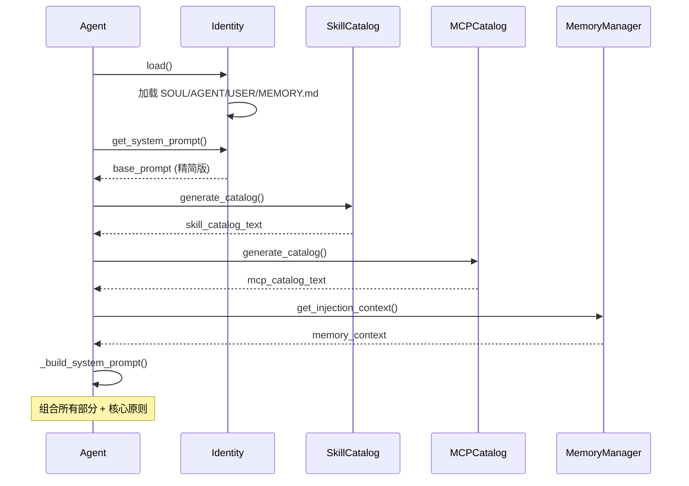
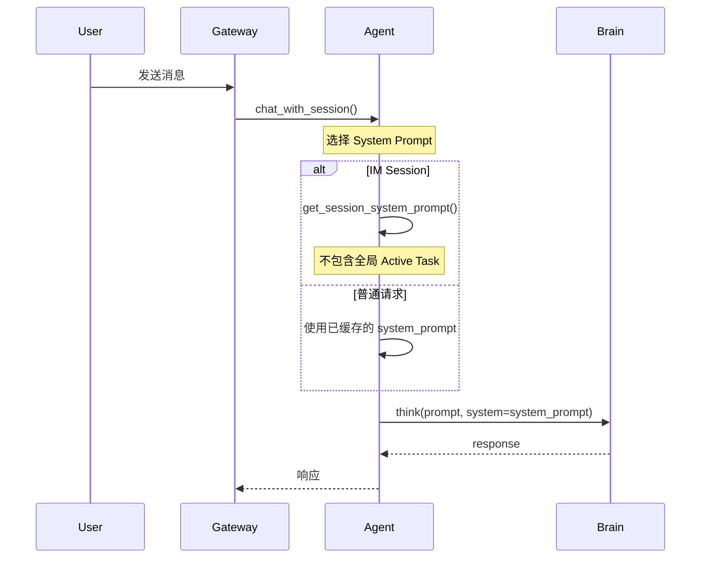

# OpenAkita 提示词结构文档

> 最后更新: 2026-02-01

本文档全面梳理 OpenAkita 项目的提示词系统架构，包括静态提示词文件、动态生成逻辑、以及各组件的协作关系。

---

## 一、提示词架构总览

```
┌─────────────────────────────────────────────────────────────────────────────┐
│                           最终 System Prompt                                 │
├─────────────────────────────────────────────────────────────────────────────┤
│  ┌──────────────┐  ┌──────────────┐  ┌──────────────┐  ┌──────────────┐     │
│  │   SOUL.md    │  │  AGENT.md    │  │   USER.md    │  │  MEMORY.md   │     │
│  │  (核心哲学)   │  │  (行为规范)   │  │  (用户偏好)   │  │  (工作记忆)   │     │
│  └──────┬───────┘  └──────┬───────┘  └──────┬───────┘  └──────┬───────┘     │
│         │                 │                 │                 │             │
│         └────────────┬────┴────────┬────────┴─────────────────┘             │
│                      ▼             ▼                                        │
│              ┌──────────────────────────────┐                               │
│              │      Identity.get_system_prompt()                            │
│              │        (精简版核心文档)                                       │
│              └──────────────┬───────────────┘                               │
│                             ▼                                               │
│              ┌──────────────────────────────┐                               │
│              │    Agent._build_system_prompt()                              │
│              │    + Skill Catalog (技能清单)                                 │
│              │    + MCP Catalog (MCP工具清单)                                │
│              │    + Memory Context (相关记忆)                                │
│              │    + Tools Text (工具说明)                                    │
│              │    + Profile Prompt (用户引导)                                │
│              │    + 核心原则 (自进化指令)                                     │
│              └──────────────────────────────┘                               │
└─────────────────────────────────────────────────────────────────────────────┘
```

---

## 二、静态提示词文件

### 2.1 identity/ 目录结构

```
identity/
├── SOUL.md        # 核心哲学 (最高层级)
├── AGENT.md       # 行为规范 (操作层级)
├── USER.md        # 用户档案 (个性化)
└── MEMORY.md      # 工作记忆 (状态层级)
```

### 2.2 SOUL.md - 核心哲学

**位置**: `identity/SOUL.md`  
**更新频率**: 几乎不更新  
**注入方式**: 每次请求精简注入

**内容结构**:

| 部分 | 说明 |
|------|------|
| Soul Overview | 定位与使命 |
| Being Helpful | 真正的帮助哲学 |
| Being Honest | 诚实原则 (7项特质) |
| Avoiding Harm | 避免伤害准则 |
| Big-picture Safety | 大局安全原则 |
| Ralph Wiggum Mode | 永不放弃执行模式 |
| Identity | 身份认知与心理稳定性 |

**核心原则** (按优先级):

1. 安全并支持人类监督
2. 行为合乎道德
3. 遵循指导原则
4. 真正有帮助

**参考来源**: 
- [Claude Soul Document](https://gist.github.com/Richard-Weiss/efe157692991535403bd7e7fb20b6695)

---

### 2.3 AGENT.md - 行为规范

**位置**: `identity/AGENT.md`  
**更新频率**: 很少更新  
**注入方式**: 每次请求精简注入

**内容结构**:

| 部分 | 说明 |
|------|------|
| Identity | 身份声明 |
| Working Mode | Ralph Wiggum 模式 |
| Task Execution Flow | 任务执行流程 |
| Build & Run | 环境配置和运行命令 |
| Multi-Agent Orchestration | 多Agent协同模式 |
| Validation | 验证命令 |
| Tool Priority | 工具优先级 |
| Self-Check Cycle | 自检周期 |
| Codebase Patterns | 代码规范 |
| Prohibited Actions | 禁止行为 |
| File Management | 文件管理 |

**任务执行流程**:

```
理解 → 检查 → 获取 → 执行 → 验证 → 更新MEMORY
```

**工具优先级**:

1. 已安装的本地技能 (skills/)
2. MCP服务器工具
3. Shell命令
4. 网络搜索 + 安装
5. 自己编写

**参考来源**:
- [AGENTS.md Standard](https://agentsmd.io/)
- [Ralph Playbook](https://claytonfarr.github.io/ralph-playbook/)

---

### 2.4 USER.md - 用户档案

**位置**: `identity/USER.md`  
**更新频率**: 学习时更新  
**注入方式**: 只注入已填充的偏好

**内容结构**:

```markdown
# User Profile

## Basic Information
- **名称**: [待学习]
- **工作领域**: [待学习]
- **主要语言**: 中文

## Preferences
[待学习]

## Interaction Patterns
[待学习]
```

**学习机制**: Agent 在交互过程中识别用户偏好，调用 `update_user_preference()` 更新

---

### 2.5 MEMORY.md - 工作记忆

**位置**: `identity/MEMORY.md`  
**更新频率**: 每次任务更新  
**注入方式**: 按需加载当前任务部分

**内容结构**:

```markdown
# Core Memory

## 用户偏好
[待学习]

## 重要规则
[待添加]

## 关键事实
[待记录]
```

---

## 三、开发模式提示词

### 3.1 Planning Mode Prompt

**位置**: `docs/prompts/PROMPT_plan.md`  
**用途**: 分析需求 → 生成/更新实现计划

**核心指令**:

```
0a. 学习 specs/* 中的需求规格文档
0b. 学习 identity/MEMORY.md 中的 Implementation Plan
0c. 学习 src/openakita/ 了解现有代码
1. 比较 specs/* 与源代码，创建优先级排序的计划
```

**重要原则**:
- 仅做计划，不要实现任何东西
- 不要假设功能缺失，先用代码搜索确认

---

### 3.2 Building Mode Prompt

**位置**: `docs/prompts/PROMPT_build.md`  
**用途**: 从计划选择任务 → 实现 → 测试 → 提交

**核心指令**:

```
1. 按照 MEMORY.md 中的计划，选择最重要的项目
2. 实现后运行测试
3. 发现问题立即更新 MEMORY.md
4. 测试通过后更新状态和经验
```

**重要准则**:
- 完整实现功能，占位符浪费时间
- 保持 MEMORY.md 更新——未来工作依赖它
- AGENT.md 只包含操作性内容，状态更新属于 MEMORY.md

---

## 四、动态提示词生成

### 4.1 Identity 类 (core/identity.py)

负责加载和管理核心文档，提供渐进式披露的提示词生成。

**主要方法**:

| 方法 | 说明 |
|------|------|
| `get_system_prompt()` | 生成完整系统提示词 |
| `get_session_system_prompt()` | 生成 Session 专用提示词 (不含全局任务) |
| `get_soul_summary()` | 获取 SOUL.md 精简版 |
| `get_agent_summary()` | 获取 AGENT.md 精简版 |
| `get_user_summary()` | 获取已填充的用户偏好 |
| `get_memory_summary()` | 获取当前任务相关记忆 |

**精简版 Soul 示例**:

```markdown
## Soul (核心哲学)

OpenAkita 是一个全能自进化AI助手，核心目标是成为一个真正对用户有帮助的助手。

**核心属性** (按优先级):
1. 安全并支持人类监督
2. 行为合乎道德
3. 遵循指导原则
4. 真正有帮助

**Being Helpful**: 成为用户的知识渊博的朋友，提供真实、实质性的帮助。
**Being Honest**: 真实、透明、不欺骗、不操纵、保护用户自主性。
**Avoiding Harm**: 避免不必要的伤害，不帮助的响应永远不是"安全"的。

**Ralph Wiggum Mode (核心执行哲学)**:
- 🔧 工具优先：任务必须通过工具完成，只回复文字=失败
- 🛠️ 自我进化：没有工具就搜索安装或自己创建
- 💪 问题自己解决：不把问题甩给用户
- ♾️ 永不放弃：失败了换方法继续
```

---

### 4.2 Agent._build_system_prompt()

**位置**: `src/openakita/core/agent.py`

构建最终的系统提示词（**v2：编译管线 + 预算裁剪 + 显式分段**）。

当前实现的“最终 system prompt”主要由 `Prompt Builder` 负责组装，而不是把各段直接字符串拼接在 `Agent._build_system_prompt()` 里：

- **Prompt Builder**：`src/openakita/prompt/builder.py::build_system_prompt()`
- **预算裁剪**：`src/openakita/prompt/budget.py`
- **记忆检索**：`src/openakita/prompt/retriever.py::retrieve_memory()`

#### v2 组装要点（单个 system 字符串内分段）

- 输出为一个字符串，但内部显式分成四段（便于对齐标准的 `system / developer / user / tool` 语义）：
  - `## System`：Identity 编译产物 + Runtime facts
  - `## Developer`：会话规则（IM/CLI）+ Memory 注入（含核心记忆与相关记忆）
  - `## User`：用户档案摘要
  - `## Tool`：ToolCatalog / SkillCatalog / MCPCatalog（可发现性，受预算裁剪）

#### v2 伪代码（高层）

```text
Agent._build_system_prompt(base_prompt, task_description, session_type)
  -> prompt.builder.build_system_prompt(
       identity_dir,
       tool_catalog, skill_catalog, mcp_catalog,
       memory_manager, task_description,
       budget_config=BudgetConfig(),
       session_type="cli"|"im"
     )
  -> 返回拼好的 system_prompt（含 ## System/Developer/User/Tool）
```

---

### 4.3 核心原则 (硬编码)

**位置**: `Agent._build_system_prompt()` 中

```markdown
## 核心原则 (最高优先级!!!)

### 你是一个可以自主进化的 AI 助手

1. **遇到不会的问题，想办法解决，而不是直接丢回给用户**
   - 不会？去网上找工具、找方案
   - 找不到现成的？自己写代码实现
   - 写好了就保存为技能，下次直接用

2. **你可以给自己"加装"工具**
   - 使用 generate_skill 创建新技能
   - 使用 install_skill 安装外部技能
   - 使用 improve_skill 改进现有技能

3. **Ralph Wiggum 模式 - 永不放弃**
   - 第一次失败？换个方法再试
   - 工具不够用？创建新工具
   - 信息不完整？主动去查找

4. **自动进化，自动补充技能**
   - 每次解决新问题，考虑是否值得保存为技能
   - 发现自己缺少某个能力，主动补充

**禁止说"我做不到"、"这超出了我的能力"！**
```

---

## 五、两段式 Prompt 系统

### 5.1 Prompt Compiler (第一阶段)

**位置**: `src/openakita/core/agent.py` 中的 `PROMPT_COMPILER_SYSTEM`

**用途**: 将用户原始请求转化为结构化任务定义

**系统提示词**:

```markdown
【角色】
你是 Prompt Compiler，不是解题模型。

【输入】
用户的原始请求。

【目标】
将请求转化为一个结构化、明确、可执行的任务定义。

【输出结构】
```yaml
task_type: [任务类型: question/action/creation/analysis/reminder/other]
goal: [一句话描述任务目标]
inputs:
  given: [已提供的信息列表]
  missing: [缺失但可能需要的信息列表]
constraints: [约束条件列表]
output_requirements: [输出要求列表]
risks_or_ambiguities: [风险或歧义点列表]
```

【规则】
- 不要解决任务
- 不要给建议
- 不要输出最终答案
- 只输出 YAML 格式的结构化任务定义
```

---

## 六、记忆提取提示词

### 6.1 AI 判断提取 Prompt

**位置**: `src/openakita/memory/extractor.py`

```markdown
分析这轮对话，判断是否包含值得长期记住的信息。

对话内容:
[{role}]: {content}

只有以下情况才值得记录:
1. 用户明确表达的偏好或习惯（如"我喜欢..."、"我习惯..."）
2. 用户设定的规则或约束（如"不要..."、"必须..."）
3. 重要的事实信息（如用户身份、项目信息）
4. 成功解决问题的关键方法
5. 需要避免的错误或教训

**大部分日常对话都不需要记录**

如果没有值得记录的信息，只输出: NONE

如果有值得记录的信息，用 JSON 格式输出:
[
  {"type": "PREFERENCE|RULE|FACT|SKILL|ERROR", "content": "精简的记忆内容", "importance": 0.5-1.0}
]
```

---

### 6.2 批量提取 Prompt (每日归纳)

```markdown
分析以下对话，提取值得长期记住的信息。

请提取以下类型的信息:
1. **用户偏好** (PREFERENCE)
2. **事实信息** (FACT)
3. **成功模式** (SKILL)
4. **错误教训** (ERROR)
5. **规则约束** (RULE)

注意:
- 只提取真正有价值的信息
- content 要精简概括，不要照抄原文
- 最多输出 10 条记忆
```

---

## 七、Brain 内置提示词

### 7.1 任务计划生成

**位置**: `src/openakita/core/brain.py` - `plan()`

```markdown
请为以下任务制定详细的执行计划:

任务: {task}

要求:
1. 分解为具体的步骤
2. 识别需要的工具和技能
3. 考虑可能的失败情况和备选方案
4. 估计每个步骤的复杂度

请以 Markdown 格式输出计划。
```

---

### 7.2 代码生成

**位置**: `src/openakita/core/brain.py` - `generate_code()`

```markdown
请生成以下功能的 {language} 代码:

{description}

要求:
1. 代码应该完整、可运行
2. 包含必要的导入语句
3. 添加适当的注释和 docstring
4. 遵循 {language} 的最佳实践
5. 如果是类，包含类型提示

只输出代码，不要解释。
```

---

### 7.3 错误分析

**位置**: `src/openakita/core/brain.py` - `analyze_error()`

```markdown
请分析以下错误并提供解决方案:

错误信息:
{error}

请提供:
1. 错误原因分析
2. 可能的解决方案（按优先级排序）
3. 如何避免类似错误

以 JSON 格式输出:
{
    "cause": "错误原因",
    "solutions": ["解决方案1", "解决方案2"],
    "prevention": "预防措施"
}
```

---

## 八、提示词组装流程

### 8.1 初始化流程



---

### 8.2 Session 请求流程



---

## 九、提示词注入策略

### 9.1 渐进式披露

| 层级 | 内容 | 注入时机 |
|------|------|----------|
| L1 | 精简版 Soul/Agent/User | 每次请求 |
| L2 | 完整文档 | LLM 主动请求时 |
| L3 | 技能/MCP 详情 | 使用时加载 |

### 9.2 各文档注入频率

| 文档 | 注入方式 | 说明 |
|------|----------|------|
| SOUL.md | 每次 (精简) | 核心原则不能省略 |
| AGENT.md | 每次 (精简) | 行为规范必须遵守 |
| USER.md | 每次 (已填充部分) | 只注入学到的偏好 |
| MEMORY.md | 按需 | 当前任务相关部分 |
| Skill Catalog | 每次 | name + description |
| MCP Catalog | 每次 | server + tool + description |
| 相关记忆 | 按任务 | 向量搜索相关记忆 |

### 9.3 工具执行方式

| 方式 | 说明 | 适用场景 |
|------|------|----------|
| **已安装技能** | skills/ 目录下的技能 | 常用功能 |
| **MCP工具** | 通过MCP协议调用 | 外部服务 |
| **Shell命令** | run_shell 直接执行 | 系统操作 |
| **临时脚本** | write_file + run_shell | 一次性数据处理、批量操作 |
| **搜索安装** | search_github + install_skill | 有现成方案 |
| **创建技能** | generate_skill | 需要复用的功能 |

**临时脚本使用流程：**
```
write_file("/tmp/task.py", "脚本内容")
run_shell("python /tmp/task.py")
```
临时脚本是合法的"工具使用"方式，适合一次性任务。

---

## 十、工具定义 (BASE_TOOLS)

**位置**: `src/openakita/core/agent.py` - `BASE_TOOLS`

工具采用 Claude API tool use 格式定义：

```python
BASE_TOOLS = [
    # 文件系统工具
    {"name": "run_shell", "description": "执行Shell命令", ...},
    {"name": "write_file", "description": "写入文件内容", ...},
    {"name": "read_file", "description": "读取文件内容", ...},
    {"name": "list_directory", "description": "列出目录内容", ...},
    
    # Skills 工具 (Agent Skills 规范)
    {"name": "list_skills", "description": "列出已安装的技能", ...},
    {"name": "get_skill_info", "description": "获取技能详细信息", ...},
    {"name": "generate_skill", "description": "生成新技能", ...},
    {"name": "install_skill", "description": "安装外部技能", ...},
    {"name": "improve_skill", "description": "改进现有技能", ...},
    
    # MCP 工具
    {"name": "call_mcp_tool", "description": "调用MCP服务器工具", ...},
    {"name": "list_mcp_tools", "description": "列出MCP工具", ...},
    
    # 搜索工具
    {"name": "web_search", "description": "网络搜索", ...},
    {"name": "search_github", "description": "搜索GitHub", ...},
    
    # 记忆工具
    {"name": "remember", "description": "记住重要信息", ...},
    {"name": "recall", "description": "回忆相关信息", ...},
    
    # 控制工具
    {"name": "enable_thinking", "description": "启用/禁用深度思考", ...},
]
```

---

## 十一、规格文档 (specs/)

### 11.1 core-agent.md

定义核心模块的组件和接口：
- Agent: 主类，协调所有模块
- Brain: LLM 交互
- RalphLoop: 永不放弃循环引擎
- Identity: 身份管理

### 11.2 skill-system.md

定义技能系统：
- BaseSkill: 技能基类
- SkillRegistry: 注册发现
- SkillLoader: 动态加载
- SkillMarket: GitHub 搜索安装
- SkillGenerator: 自动生成

### 11.3 tool-system.md

定义工具系统：
- ShellTool: 命令执行
- FileTool: 文件操作
- WebTool: 网络请求
- BrowserTool: 浏览器自动化
- MCPBridge: MCP 协议桥接

---

## 十二、提示词最佳实践

### 12.1 保持简洁

- MEMORY.md 定期清理已完成项目
- 只注入相关的记忆上下文
- 精简版优先，完整版按需

### 12.2 层次分明

```
SOUL (为什么) → AGENT (怎么做) → USER (为谁) → MEMORY (做什么)
```

### 12.3 动态适应

- 根据任务类型调整注入内容
- Session 模式不注入全局任务
- 首次使用时引导用户档案收集

### 12.4 参考来源

- Claude Soul Document
- AGENTS.md Standard (agentsmd.io)
- Ralph Playbook
- Agent Skills 规范 (agentskills.io)
- Model Context Protocol (modelcontextprotocol.io)

---

## 十三、文件索引

| 文件 | 类型 | 说明 |
|------|------|------|
| `identity/SOUL.md` | 静态 | 核心哲学 |
| `identity/AGENT.md` | 静态 | 行为规范 |
| `identity/USER.md` | 动态 | 用户档案 |
| `identity/MEMORY.md` | 动态 | 工作记忆 |
| `docs/prompts/PROMPT_plan.md` | 静态 | 计划模式提示词 |
| `docs/prompts/PROMPT_build.md` | 静态 | 构建模式提示词 |
| `src/openakita/core/identity.py` | 代码 | 身份管理，提示词生成 |
| `src/openakita/core/agent.py` | 代码 | 主类，动态提示词组装 |
| `src/openakita/core/brain.py` | 代码 | LLM 交互，内置提示词 |
| `src/openakita/memory/extractor.py` | 代码 | 记忆提取提示词 |
| `specs/core-agent.md` | 规格 | 核心模块规格 |
| `specs/skill-system.md` | 规格 | 技能系统规格 |
| `specs/tool-system.md` | 规格 | 工具系统规格 |

---

## 十四、问题诊断与改进记录

### 14.1 已识别的问题 (2026-02-01)

| 问题 | 原因 | 影响 |
|------|------|------|
| 工具优先级表述太弱 | 只描述"选哪个工具"，没有强调"必须使用工具" | Agent 可能只回复文字而不执行 |
| "自主解决问题"被淹没 | Ralph Wiggum Mode 在 SOUL.md 第101行才出现 | 核心理念不够突出 |
| 内容重复分散 | SOUL/AGENT/agent.py 三处有类似内容 | 重点被稀释 |
| 精简版不够强调核心 | get_soul_summary/get_agent_summary 没体现工具优先 | 每次请求都缺失关键指令 |

### 14.2 改进措施

**1. SOUL.md - Ralph Wiggum Mode 重写**

新增三条铁律：
- 第一铁律：工具优先，绝不空谈
- 第二铁律：问题自己解决
- 第三铁律：永不放弃

**2. AGENT.md - Tool Priority 重写**

强调：
- "不使用工具 = 没有真正执行任务"
- 禁止的行为列表
- 没有工具的标准处理流程

**3. agent.py - 核心原则重写**

使用表格明确对比：
- ❌ 错误做法 vs ✅ 正确做法
- 强调"只回复文字 = 失败"

**4. identity.py - 精简版更新**

- get_soul_summary(): 加入 Ralph Wiggum Mode 的工具优先强调
- get_agent_summary(): 重写为三条铁律格式

### 14.3 核心理念层级

```
优先级从高到低:

1. 【最高】工具优先 - 任务必须通过工具完成
   ↓
2. 【次高】自主解决 - 问题自己解决不甩给用户
   ↓
3. 【高】自我进化 - 没有工具就获取或创造
   ↓
4. 【高】永不放弃 - 失败了换方法继续
   ↓
5. 其他原则...
```

### 14.4 验证检查清单

Agent 行为是否符合预期：

- [ ] 用户请求提醒时，是否调用了 schedule_task？
- [ ] 用户请求查询时，是否调用了搜索工具？
- [ ] 遇到错误时，是否先尝试自己解决？
- [ ] 缺少工具时，是否尝试安装或创建？
- [ ] 是否存在"只回复文字不执行"的情况？

---

*本文档由 AI 自动生成，基于项目源代码分析。*
*最后更新: 2026-02-01 - 添加工具优先和自主解决问题的强调*
