# 🧠 Agent Skills (Experimental)

Agent Skills are modular capabilities that extend DAIV's agents with specialized knowledge, workflows, and domain expertise. Each Skill packages instructions, metadata, and optional resources that agents use automatically when relevant to a task.

---

## Why Use Skills

Skills provide domain-specific expertise that transforms DAIV's general-purpose agents into specialists. Unlike one-off prompts, Skills are reusable, filesystem-based resources that load on-demand across multiple agent interactions.

**Key benefits**:

- **Specialize agents**: Tailor DAIV's capabilities for domain-specific tasks
- **Reduce repetition**: Create once, use automatically in relevant contexts
- **Compose capabilities**: Combine multiple Skills to build complex workflows
- **Progressive disclosure**: Skills metadata loads at startup, full instructions load only when needed

---

## How Skills Work

DAIV implements Skills using a progressive disclosure pattern inspired by [Anthropic's Agent Skills](https://platform.claude.com/docs/en/agents-and-tools/agent-skills/overview):

### Three Levels of Loading

| Level | When Loaded | Token Cost | Content |
|-------|-------------|------------|---------|
| **Metadata** | Always (at startup) | ~100 tokens per Skill | `name` and `description` from YAML frontmatter |
| **Instructions** | When Skill is triggered | Under 5k tokens | Full SKILL.md content with workflows and guidance |
| **Resources** | As needed | Variable | Supporting files (scripts, configs, reference docs) |

### Skill Discovery Flow

```mermaid
graph TD
    A["🚀 Agent Starts"] --> B["📂 Scan Skills Directory<br/>(.daiv/skills/)"]
    B --> C["📋 Parse YAML Frontmatter<br/>(name, description, scope)"]
    C --> D["💉 Inject Skills Metadata<br/>into System Prompt"]

    D --> E["👤 User Request"]
    E --> F["🔍 Agent Checks Skills<br/>Does request match a skill?"]

    F -->|Yes| G["📖 Read Full SKILL.md"]
    G --> H["⚡ Follow Skill Instructions"]
    H --> I["📁 Access Supporting Files<br/>(scripts, configs, etc.)"]

    F -->|No| J["🤖 Normal Agent Execution"]

    style B fill:#e1f5fe
    style D fill:#fff3e0
    style G fill:#e8f5e8
    style H fill:#e8f5e8
```



This architecture ensures minimal context usage—agents only know Skills exist until they're actually needed.

---

## Skills Directory Structure

Skills can be placed in any of the following directories at the root of your repository:

- `.daiv/skills/` (default)
- `.agents/skills/`
- `.cursor/skills/`
- `.claude/skills/`

DAIV automatically scans all these directories and loads skills from each.

Example structure:

```
your-repository/
├── .daiv/
│   └── skills/
│       ├── code-review/
│       │   ├── SKILL.md        # Required: YAML frontmatter + instructions
│       │   ├── checklist.md    # Optional: supporting documentation
│       │   └── review.py       # Optional: helper script
│       └── creating-agents-md-file/    # Builtin skill (auto-copied)
│           └── SKILL.md
├── .agents/
│   └── skills/
│       └── web-research/
│           ├── SKILL.md
│           └── search_helper.py
├── src/
└── README.md
```

### Builtin Skills

DAIV includes builtin Skills that are automatically loaded to the `.daiv/skills/` directory at agent startup:

| Skill | Description | Scope |
|-------|-------------|-------|
| `generating-agents-md` | Generates or updates an AGENTS.md file reflecting repository structure and conventions | Issues |
| `skills-creator` | Creates a new Skill in the `.daiv/skills/` directory | Issues |

You can override builtin skills by creating a Skill with the same name in any of your project's skills directories.

---

## Creating Custom Skills

### SKILL.md Structure

Every Skill requires a `SKILL.md` file with YAML frontmatter:

```markdown
---
name: your-skill-name
description: Brief description of what this Skill does and when to use it
scope: issue
---

# Your Skill Name

## When to Use
- User asks about X
- Task involves Y

## Instructions
[Step-by-step guidance for the agent]

## Examples
[Concrete examples of using this Skill]
```

### Required Fields

| Field | Description | Constraints |
|-------|-------------|-------------|
| `name` | Unique identifier for the Skill | Max 64 chars, lowercase letters, numbers, hyphens only |
| `description` | What the Skill does and when to use it | Max 1024 chars, must be non-empty |

### Optional Fields

| Field | Description | Values |
|-------|-------------|--------|
| `scope` | When the Skill should be available | `issue`, `merge_request`, or omit for both |

### Scope Configuration

The `scope` field controls when a Skill is available to the agent:

- **`issue`**: Skill only loads when working on issues
- **`merge_request`**: Skill only loads when working on merge/pull requests
- **Omitted**: Skill loads for both issues and merge requests

```yaml
---
name: pipeline-debugging
description: Diagnose and fix CI/CD pipeline failures
scope: merge_request
---
```

---

## Skill Authoring Best Practices

!!! info "Skill Authoring Guide"

    For more detailed information on how to author Skills, see also Anthropic's [Skill Authoring Guide](https://platform.claude.com/docs/en/agents-and-tools/agent-skills/best-practices).

### Write Clear Instructions

**Be specific and actionable**: Tell the agent exactly what steps to follow.

```markdown
## Instructions

1. **Analyze the request**: Identify what the user wants to achieve
2. **Check prerequisites**: Verify required files exist
3. **Execute workflow**:
   - Step A: Do this first
   - Step B: Then do this
4. **Validate results**: Confirm the task completed successfully
```

### Include Trigger Conditions

Help the agent recognize when to use the Skill:

```yaml
---
name: pipeline-debugging
description: Diagnose and fix CI/CD pipeline failures when users mention "pipeline debugging" or "CI/CD issues"
---
```

### Provide Examples

Concrete examples improve agent accuracy:

```markdown
## Examples

### Example 1: Basic Research
**User**: "Can you research the latest developments in quantum computing?"

**Workflow**:
1. Search for recent quantum computing news
2. Organize findings by theme
3. Synthesize into a summary
```

### Bundle Supporting Files

Skills can include helper scripts, templates, and reference documents:

```
my-skill/
├── SKILL.md
├── templates/
│   └── report_template.md
├── scripts/
│   └── data_processor.py
└── reference/
    └── api_docs.md
```

Reference these files in your SKILL.md:

```markdown
## Resources

- **Report Template**: See `templates/report_template.md` for output format
- **Data Processing**: Use `scripts/data_processor.py` for data transformation
```

---

## Example Skills

### Code Review Skill

```markdown
---
name: thorough-code-review
description: Perform comprehensive code reviews focusing on security, performance, and maintainability when users request a code review
scope: merge_request
---

# Thorough Code Review

## Review Checklist

### Security
- [ ] Input validation on user data
- [ ] SQL injection prevention
- [ ] XSS protection
- [ ] Authentication/authorization checks

### Performance
- [ ] Database query optimization
- [ ] Memory management
- [ ] Caching opportunities
- [ ] Algorithm complexity

### Maintainability
- [ ] Clear naming conventions
- [ ] Appropriate documentation
- [ ] Test coverage
- [ ] Error handling

## Instructions

1. **Read the changes**: Use the diff to understand what changed
2. **Apply checklist**: Go through each category systematically
3. **Document findings**: List issues with severity and suggestions
4. **Provide summary**: Overall assessment with key recommendations
```

### Documentation Generator Skill

~~~markdown
---
name: api-docs-generator
description: Generate API documentation from code annotations and function signatures when users ask to document an API
---

# API Documentation Generator

## Instructions

1. **Scan codebase**: Find all public API endpoints/functions
2. **Extract metadata**:
   - Function signatures
   - Parameter types and descriptions
   - Return values
   - Example usage from tests
3. **Generate documentation**: Use standard format (see template below)
4. **Validate**: Ensure all public APIs are documented

## Template

For each endpoint/function, generate:

```markdown
### `function_name(param1, param2)`

**Description**: Brief explanation

**Parameters**:
- `param1` (type): Description
- `param2` (type): Description

**Returns**: Description of return value

**Example**:
```python
result = function_name("value1", "value2")
```
```
~~~

---

## Security Considerations

!!! warning "Use Skills from Trusted Sources Only"
    Skills provide agents with new capabilities through instructions and code. Only use Skills you created yourself or obtained from trusted sources.

**Key security considerations**:

- **Audit thoroughly**: Review all files in a Skill before using it
- **Check external references**: Skills that fetch data from external URLs pose additional risk
- **Review script code**: Any Python scripts or executables should be carefully examined
- **Limit scope**: Use the `scope` field to restrict Skills to appropriate contexts

---

## Troubleshooting

### Skill Not Loading

**Check file location**: Ensure the Skill is in `.daiv/skills/<skill-name>/SKILL.md`

**Verify YAML frontmatter**: The frontmatter must be valid YAML between `---` delimiters:

```yaml
---
name: my-skill
description: My skill description
---
```

**Check required fields**: Both `name` and `description` are required.

### Skill Not Triggering

**Review description**: The `description` field should clearly indicate when to use the Skill. Agents match user requests against this description.

**Check scope**: If you set a `scope`, the Skill only loads in that context (issue or merge_request).

### Agent Not Following Instructions

**Simplify instructions**: Break complex workflows into clear, numbered steps.

**Add examples**: Concrete examples help agents understand expected behavior.

**Test incrementally**: Start with a minimal Skill and add complexity gradually.

---

## ⏭️ Next Steps

Now that you understand Agent Skills:

- **[Review MCP Tools](mcp-tools.md)** - Understand how MCP tools extend agent capabilities
- **[Configure DAIV](../configuration/yaml-config.md)** - Customize DAIV for your workflow
- **[Explore the Overview](overview.md)** - Learn about all available agents

