# 🤖 Issue Addressor

Issue Addressing is a feature that allows DAIV to address issues by generating a plan and executing the necessary code changes, opening a merge request (GitLab) or pull request (GitHub) with the changes for review.

## Configuration

Enable issue addressing in your `.daiv.yml` configuration file at the repository root:

```yaml
# Enable automated issue resolution
issue_addressing:
  enabled: true
```

| Option    | Type   | Default | Description                                 |
|-----------|--------|---------|---------------------------------------------|
| `enabled` | `bool` | `true`  | Enable or disable the issue addressing feature. |

!!! tip
    Issue addressing is enabled by default. Add `enabled: false` only if you want to disable it.

## Triggering runs

DAIV monitor issues for changes in the issue title, description, labels and state using webhooks. This streamlines the process of issuing a code change and requires no manual intervention to start a run.

**With Label**

You can trigger issue addressing by adding any of the following labels to the issue:
- `daiv` - Standard DAIV issue addressing
- `daiv-auto` - Automatically approve and execute plans (see [Agent Configuration Labels](#agent-configuration-labels))
- `daiv-max` - Use high-performance mode (see [Agent Configuration Labels](#agent-configuration-labels))

Labels are case-insensitive, so `DAIV`, `Daiv`, or `daiv` will all work.

## Agent Configuration Labels

You can configure the plan and execute agent behavior by adding specific labels to your issue:

### `daiv-auto` Label

Automatically approve the plan and proceed with implementation without requiring manual approval. This is useful for trusted scenarios where you want DAIV to execute plans immediately after generation.

**Example:**
- Add the `daiv-auto` label to an issue
- DAIV will generate a plan and automatically execute it without waiting for manual approval

### `daiv-max` Label

Enable high-performance mode with:
- **Model**: Uses `CLAUDE_OPUS_4_5` (more intelligent model) instead of the default `CLAUDE_SONNET_4_5`
- **Thinking Level**: Sets both planning and execution thinking levels to `HIGH` for deeper reasoning

This is useful for complex issues that require more sophisticated analysis and execution.

**Example:**
- Add the `daiv-max` label to an issue
- DAIV will use the more powerful model and higher thinking levels for both planning and execution

### Combining Labels

You can combine labels to get both behaviors:
- `daiv-auto` + `daiv-max`: Automatically approve plans using high-performance mode

## Resetting the plan

You can reset the plan by:

  1. updating the issue title or description.

DAIV will automatically regenerate the plan.

## Plan Approval

DAIV uses a **human-in-the-loop** approach for plan approval. After generating a plan, DAIV waits for explicit approval before executing code changes.

### Approving the Plan

Approve and execute the plan by leaving a comment that mentions DAIV:

```
@daiv proceed
```

DAIV will execute the plan and open a merge request (GitLab) or pull request (GitHub) with the changes for review.

### Why Manual Approval?

Manual plan approval provides:

- **Review opportunity**: Verify the plan before code changes are made
- **Safety**: Prevent unintended changes to your codebase
- **Control**: Choose when and which plans to execute

### Plan Execution Behavior

After a first plan is executed on an issue, executing a second plan will override the previous merge/pull request.

## Workflow

```mermaid
graph TD
    A["👤 Developer"] --> B["📝 Creates Issue<br/>(with 'daiv' label)"]
    B --> C["🔔 Webhook Triggered"]
    C --> D["🤖 Issue Addressor Agent"]
    D --> E["📋 Analyzes Issue<br/>(title, description, images)"]
    E --> F["💡 Generates Plan"]
    F --> G["💬 Posts Plan as Comment<br/>(waits for approval)"]

    H["👤 Developer"] --> I["✅ Approves Plan<br/>(comments approval)"]
    I --> J["🔔 Comment Webhook"]
    J --> K["🔨 Executes Plan<br/>(plan_and_execute agent)"]
    K --> L["📝 Applies Code Changes"]
    L --> M["🎨 Code Formatting"]
    M --> N["📤 Creates Merge/Pull Request"]
    N --> O["💬 Posts MR/PR Link on Issue"]

    G --> P["❌ Plan Needs Changes"]
    P --> Q["📝 Developer Updates Issue"]
    Q --> R["🔄 Regenerates Plan"]
    R --> G

    style B fill:#e1f5fe
    style G fill:#fff3e0
    style I fill:#e8f5e8
    style N fill:#f3e5f5
```


