# 🤖 Review Addressor

Review Addressor is a feature that allows DAIV to address code review comments by applying the changes suggested by the reviewer or answering questions about the codebase.

---

## How to Address Code Review Comments

**To instruct DAIV to address a code review comment, mention DAIV directly in your comment using `@<daiv-username> <your request>`.**

No slash command is required. Simply tag DAIV and describe what you want done.

### Command Format

```
@daiv <your request>
```

Replace `daiv` with your DAIV bot's username if it differs.

### Where to Comment

You can leave comments in two places:

- **In the diff** (inline comments): Comment directly on specific lines of code in the merge/pull request diff
- **On the merge/pull request**: Comment in the general discussion area

---

## Examples

### Request a Code Change

When you want DAIV to modify code based on your review feedback:

```
@daiv use Redis instead of in-memory storage
```

```
@daiv rename this variable to `user_count` for clarity
```

```
@daiv add error handling for the case when the API returns null
```

```
@daiv move this logic to a separate helper function
```

### Ask a Question About the Code

When you want to understand the code better before making a decision:

```
@daiv why is this import inside the method instead of at the top of the file?
```

```
@daiv what is the purpose of this function?
```

```
@daiv is this the most performant way to do this?
```

### Request Specific Fixes

When you spot issues during code review:

```
@daiv this will cause a null pointer exception, please add a null check
```

```
@daiv the indentation is inconsistent here, please fix it
```

```
@daiv this SQL query is vulnerable to injection, please use parameterized queries
```

---

## How It Works

DAIV monitors merge/pull requests for comments that mention DAIV using webhooks. This streamlines the process of addressing code review comments and requires no manual intervention to start a run.

## Workflow

#### 💬 Code Review Response Workflow

```mermaid
graph TD
    A["👥 Code Reviewer"] --> B["💬 Comments on Merge/Pull Request<br/>(requests changes or asks questions)"]
    B --> C["🔔 Comment Webhook"]
    C --> D["🤖 Review Addressor Agent"]
    D --> E["📊 Comment Assessment<br/>(ReviewCommentEvaluator)"]

    E --> F["🔍 Change Request?"]
    F -->|Yes| G["🛠️ Plan & Execute<br/>(code changes needed)"]
    F -->|No| H["💬 Reply to Reviewer<br/>(answer questions)"]

    G --> I["📝 Analyzes Code Context"]
    I --> J["🔨 Applies Code Changes"]
    J --> K["🎨 Code Formatting"]
    K --> L["📤 Commits to MR/PR Branch"]
    L --> M["✅ Marks Discussion Resolved<br/>(GitLab) or Adds Comment (GitHub)"]

    H --> N["🔍 Gathers Context<br/>(if needed)"]
    N --> O["💭 Thinks Through Response"]
    O --> P["💬 Posts Detailed Reply"]

    style B fill:#e1f5fe
    style E fill:#fff3e0
    style G fill:#ffebee
    style H fill:#e8f5e8
    style M fill:#f3e5f5
```


