# MCP Gateway Deployment Modes

This guide describes the three deployment modes available for MCP Gateway Registry on AWS ECS.

## Deployment Mode Decision Matrix

| Scenario | Recommended Mode | `enable_cloudfront` | `enable_route53_dns` |
|----------|------------------|---------------------|----------------------|
| Custom domain with Route53/ACM | Custom Domain | `false` | `true` |
| HTTPS without custom domain | CloudFront | `true` | `false` |
| Local development/testing | Development | `false` | `false` |
| Both access paths needed | Dual Ingress | `true` | `true` |

## Terraform Output: `deployment_mode`

The `deployment_mode` output indicates the active configuration:

| Mode | `enable_cloudfront` | `enable_route53_dns` | Output Value |
|------|---------------------|----------------------|--------------|
| CloudFront | `true` | `false` | `cloudfront` |
| Custom Domain | `false` | `true` | `custom-domain` |
| Dual Ingress | `true` | `true` | `custom-domain` |
| Development | `false` | `false` | `development` |

> **Note:** Dual Ingress reports as `custom-domain` since Route53 DNS is the primary access path.

## Architecture Overview

```mermaid
flowchart TB
    subgraph "Custom Domain Mode"
        U1[Users] -->|HTTPS| R53[Route53 DNS]
        R53 --> ACM1[ACM Certificate]
        ACM1 --> ALB1[ALB with HTTPS]
        ALB1 --> ECS1[ECS Services]
    end

    subgraph "CloudFront Mode"
        U2[Users] -->|HTTPS| CF[CloudFront]
        CF -->|HTTP + Custom Header| ALB2[ALB]
        ALB2 --> ECS2[ECS Services]
    end

    subgraph "Development Mode"
        U3[Users] -->|HTTP| ALB3[ALB DNS]
        ALB3 --> ECS3[ECS Services]
    end
```



## Mode 1: Custom Domain (Route53/ACM)

**Use when:** You have a Route53 hosted zone and want custom domain URLs.

**Configuration:**
```hcl
enable_cloudfront   = false
enable_route53_dns  = true
base_domain         = "mycorp.click"
```

**URLs:**
- Registry: `https://registry.us-west-2.mycorp.click`
- Keycloak: `https://kc.us-west-2.mycorp.click`

**Features:**
- ACM certificates for HTTPS
- Custom domain names
- Route53 DNS records

## Mode 2: CloudFront (No Custom Domain)

**Use when:** You need HTTPS but don't have a custom domain or Route53 hosted zone. Ideal for workshops, demos, evaluations, or any deployment where custom DNS isn't available.

**Configuration:**
```hcl
enable_cloudfront   = true
enable_route53_dns  = false
```

**URLs:**
- Registry: `https://d1234abcd.cloudfront.net`
- Keycloak: `https://d5678efgh.cloudfront.net`

**Features:**
- Default CloudFront certificates (`*.cloudfront.net`)
- No custom domain required
- HTTPS via CloudFront TLS termination
- Custom `X-Cloudfront-Forwarded-Proto` header for correct HTTPS detection

## Mode 3: Development (HTTP Only)

**Use when:** Testing locally or in non-production environments.

**Configuration:**
```hcl
enable_cloudfront   = false
enable_route53_dns  = false
```

**URLs:**
- Registry: `http://<alb-dns-name>`
- Keycloak: `http://<keycloak-alb-dns-name>`

**Features:**
- HTTP only (no HTTPS)
- Direct ALB access
- Simplest configuration

## Mode 4: Dual Ingress (Both)

**Use when:** You need both CloudFront and custom domain access paths.

**Configuration:**
```hcl
enable_cloudfront   = true
enable_route53_dns  = true
base_domain         = "mycorp.click"
```

**URLs:**
- Registry (CloudFront): `https://d1234abcd.cloudfront.net`
- Registry (Custom): `https://registry.us-west-2.mycorp.click`
- Keycloak (CloudFront): `https://d5678efgh.cloudfront.net`
- Keycloak (Custom): `https://kc.us-west-2.mycorp.click`

> **Note:** This is NOT a security risk, but may cause user confusion. A warning is displayed during `terraform apply`.

## Environment Variables

| Variable | Description | Required For |
|----------|-------------|--------------|
| `enable_cloudfront` | Enable CloudFront distributions | CloudFront mode |
| `enable_route53_dns` | Enable Route53 DNS and ACM certificates | Custom Domain mode |
| `base_domain` | Base domain for regional URLs | Custom Domain mode |
| `keycloak_domain` | Full Keycloak domain (non-regional) | Custom Domain mode |
| `root_domain` | Root domain (non-regional) | Custom Domain mode |

## HTTPS Detection

The application detects HTTPS using the following header priority:

1. `X-Forwarded-Proto: https` (CloudFront and ALB deployments)
2. Request URL scheme (direct access)

CloudFront is configured to send `X-Forwarded-Proto: https` as a custom origin header. This is the same header that ALB uses, so the application code works consistently across deployment modes.

> **Note:** We use `X-Forwarded-Proto` (not a custom header like `X-Cloudfront-Forwarded-Proto`) because Keycloak natively recognizes this header for HTTPS detection.

## Troubleshooting

### Session cookies not working with CloudFront

**Symptom:** Login succeeds but user is immediately logged out.

**Cause:** The `Secure` flag on cookies requires HTTPS detection to work correctly.

**Solution:** Verify the `X-Forwarded-Proto` header is being set by CloudFront. Check CloudFront distribution origin settings.

### OAuth2 redirect fails with "Invalid parameter: redirect_uri"

**Symptom:** After clicking login, Keycloak shows "Invalid parameter: redirect_uri" error.

**Cause:** The CloudFront URL is not in Keycloak's allowed redirect URIs for the `mcp-gateway-web` client.

**Solution:** 
1. Re-run `init-keycloak.sh` after generating fresh terraform outputs:
   ```bash
   cd terraform/aws-ecs
   terraform output -json > scripts/terraform-outputs.json
   export INITIAL_ADMIN_PASSWORD="your-password"
   ./scripts/init-keycloak.sh
   ```
2. Or manually add the CloudFront URL to Keycloak:
   - Go to Keycloak Admin → mcp-gateway realm → Clients → mcp-gateway-web
   - Add `https://<cloudfront-domain>/*` and `https://<cloudfront-domain>/oauth2/callback/keycloak` to Valid Redirect URIs
   - Add `https://<cloudfront-domain>` to Web Origins

### OAuth2 redirect_uri is malformed (missing hostname)

**Symptom:** The redirect_uri in the OAuth2 request looks like `https:/oauth2/callback/keycloak` (missing hostname).

**Cause:** The MCP Gateway ECS task doesn't have the correct `REGISTRY_URL` environment variable set.

**Solution:** Ensure `domain_name` is passed to the MCP Gateway module in `main.tf`:
```hcl
domain_name = var.enable_route53_dns ? "registry.${local.root_domain}" : (
  var.enable_cloudfront ? aws_cloudfront_distribution.mcp_gateway[0].domain_name : ""
)
```
Then run `terraform apply` to update the ECS task definition.

### Keycloak shows "HTTPS required" error

**Symptom:** Keycloak returns an error about HTTPS being required.

**Cause:** Keycloak doesn't recognize it's behind HTTPS when accessed via CloudFront.

**Solution:** Ensure CloudFront is sending `X-Forwarded-Proto: https` header (not a custom header name). In `cloudfront.tf`:
```hcl
custom_header {
  name  = "X-Forwarded-Proto"
  value = "https"
}
```
Also ensure Keycloak is configured with `KC_HOSTNAME_URL` (full URL with `https://`) instead of just `KC_HOSTNAME`.

### API returns 403 Forbidden after login

**Symptom:** Login succeeds but API calls return 403 "Access forbidden".

**Cause:** Either the user doesn't have required group memberships, or the MCP scopes haven't been initialized on EFS.

**Solution:**
1. Check user groups in Keycloak Admin → mcp-gateway realm → Users → select user → Groups
2. Ensure user is in `mcp-registry-admin` or `mcp-registry-user` group
3. Run the scopes init task:
   ```bash
   ./scripts/run-scopes-init-task.sh --skip-build
   ```
4. Restart the registry and auth services:
   ```bash
   aws ecs update-service --cluster mcp-gateway-ecs-cluster --service mcp-gateway-v2-registry --force-new-deployment --region us-west-2
   aws ecs update-service --cluster mcp-gateway-ecs-cluster --service mcp-gateway-v2-auth --force-new-deployment --region us-west-2
   ```

### Nginx returns default page instead of registry

**Symptom:** Accessing the registry URL shows the default nginx welcome page.

**Cause:** The nginx default site configuration is intercepting requests before they reach the registry.

**Solution:** The `docker/registry-entrypoint.sh` should remove the default site:
```bash
rm -f /etc/nginx/sites-enabled/default
```
Rebuild and redeploy the registry container.

### Certificate validation timeout

**Symptom:** `terraform apply` hangs on ACM certificate validation.

**Cause:** Route53 hosted zone doesn't exist or DNS propagation is slow.

**Solution:** 
1. Verify the hosted zone exists: `aws route53 list-hosted-zones`
2. Check the `base_domain` matches your hosted zone
3. Wait for DNS propagation (up to 5 minutes)

### CloudFront 502 errors

**Symptom:** CloudFront returns 502 Bad Gateway.

**Cause:** ALB is not responding or security group blocks CloudFront.

**Solution:**
1. Verify ALB health checks are passing
2. Ensure ALB security group allows inbound from CloudFront (via prefix list or `0.0.0.0/0`)
3. Check ECS service is running and healthy

## Custom Domain with CloudFront

While out of scope for automation, you can manually configure a custom domain in front of CloudFront:

1. Create an ACM certificate in `us-east-1` (required for CloudFront)
2. Add the custom domain as an alternate domain name (CNAME) in CloudFront
3. Create a Route53 ALIAS record pointing to the CloudFront distribution
4. Update Keycloak `KC_HOSTNAME` to use the custom domain

Refer to [AWS CloudFront documentation](https://docs.aws.amazon.com/AmazonCloudFront/latest/DeveloperGuide/CNAMEs.html) for detailed instructions.
