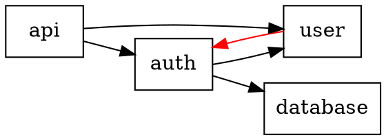

# Dependency Analysis Tools and Techniques

Tools and techniques for analyzing module dependencies and detecting coupling issues in legacy code.

## Table of Contents

1. [Manual Dependency Analysis](#manual-dependency-analysis)
2. [Python Tools](#python-tools)
3. [Java Tools](#java-tools)
4. [JavaScript/TypeScript Tools](#javascripttypescript-tools)
5. [Dependency Visualization](#dependency-visualization)
6. [Detecting Common Issues](#detecting-common-issues)

---

## Manual Dependency Analysis

### Extract Import Statements

**Python:**
```bash
# Find all imports
grep -rh "^import \|^from " --include="*.py" src/ | sort | uniq

# Find imports from specific module
grep -r "from myapp.auth import" --include="*.py"

# Count import frequency
grep -rh "^import \|^from " --include="*.py" | sort | uniq -c | sort -rn
```

**Java:**
```bash
# Find all imports
grep -rh "^import " --include="*.java" src/ | sort | uniq

# Exclude common libraries, focus on internal
grep -rh "^import com.mycompany" --include="*.java" | sort | uniq

# Count import frequency
grep -rh "^import com.mycompany" --include="*.java" | sort | uniq -c | sort -rn
```

**JavaScript:**
```bash
# Find ES6 imports
grep -rh "^import " --include="*.js" --include="*.ts" src/ | sort | uniq

# Find CommonJS requires
grep -rh "require(" --include="*.js" src/ | sort | uniq

# Find relative imports (coupling indicator)
grep -r "from '\\.\\./\\.\\./" --include="*.js"
```

### Create Dependency Matrix

Simple script to map dependencies:

```python
# analyze_deps.py
import os
import re
from collections import defaultdict

def extract_imports(file_path):
    """Extract imports from Python file."""
    imports = []
    with open(file_path, 'r') as f:
        for line in f:
            # Match: from module import something
            match = re.match(r'^from\s+(\S+)\s+import', line)
            if match:
                imports.append(match.group(1))
            # Match: import module
            match = re.match(r'^import\s+(\S+)', line)
            if match:
                imports.append(match.group(1))
    return imports

def build_dependency_map(src_dir):
    """Build map of dependencies."""
    dep_map = defaultdict(list)

    for root, dirs, files in os.walk(src_dir):
        for file in files:
            if file.endswith('.py'):
                file_path = os.path.join(root, file)
                # Convert to module name
                module = file_path.replace(src_dir, '').replace('/', '.').replace('.py', '')
                imports = extract_imports(file_path)
                dep_map[module] = imports

    return dep_map

# Usage
deps = build_dependency_map('src/')
for module, imports in deps.items():
    print(f"{module} depends on:")
    for imp in imports:
        if imp.startswith('myapp'):  # Only internal deps
            print(f"  - {imp}")
```

---

## Python Tools

### 1. pydeps

Generates dependency graphs for Python projects.

**Installation:**
```bash
pip install pydeps
```

**Usage:**
```bash
# Generate dependency graph
pydeps myproject --max-bacon=2

# Create visual graph (requires graphviz)
pydeps myproject --max-bacon=2 --show

# Export to file
pydeps myproject --max-bacon=2 -o deps.png

# Find circular dependencies
pydeps myproject --show-cycles
```

**Output Example:**
```
myapp.auth
  └─> myapp.models.user
      └─> myapp.database
  └─> myapp.utils.validators

myapp.api
  └─> myapp.auth
  └─> myapp.services.email
```

### 2. pipdeptree

Shows dependency tree of installed packages.

**Installation:**
```bash
pip install pipdeptree
```

**Usage:**
```bash
# Show all dependencies
pipdeptree

# Show dependency tree for specific package
pipdeptree -p flask

# Show reverse dependencies (what depends on X)
pipdeptree -r -p sqlalchemy

# Export to JSON
pipdeptree --json > deps.json
```

### 3. modulegraph

Analyzes Python module dependencies.

**Installation:**
```bash
pip install modulegraph
```

**Usage:**
```python
from modulegraph.modulegraph import ModuleGraph

mg = ModuleGraph()
mg.run_script('myapp/__init__.py')

for node in mg.flatten():
    print(f"{node.identifier}: {node.filename}")
```

### 4. Import Linter

Enforce import rules and detect issues.

**Installation:**
```bash
pip install import-linter
```

**Configuration (.importlinter):**
```ini
[importlinter]
root_package = myapp

[importlinter:contract:layers]
name = Enforce layered architecture
type = layers
layers =
    presentation
    business
    data
```

**Usage:**
```bash
lint-imports
```

---

## Java Tools

### 1. JDepend

Analyzes Java package dependencies.

**Maven Configuration:**
```xml
<plugin>
    <groupId>org.codehaus.mojo</groupId>
    <artifactId>jdepend-maven-plugin</artifactId>
    <version>2.0</version>
</plugin>
```

**Usage:**
```bash
mvn jdepend:generate

# View report
open target/site/jdepend-report.html
```

**Metrics Provided:**
- **Afferent Coupling (Ca):** Number of classes outside package that depend on classes inside
- **Efferent Coupling (Ce):** Number of classes inside package that depend on classes outside
- **Instability (I):** Ce / (Ca + Ce)
- **Abstractness (A):** Abstract classes / total classes

### 2. Dependency-Check

Finds dependencies with known vulnerabilities.

**Maven:**
```bash
mvn dependency-check:check

# View report
open target/dependency-check-report.html
```

**Gradle:**
```bash
./gradlew dependencyCheckAnalyze
```

### 3. Maven Dependency Plugin

Analyzes Maven dependencies.

**Usage:**
```bash
# List all dependencies
mvn dependency:list

# Show dependency tree
mvn dependency:tree

# Find dependency conflicts
mvn dependency:tree -Dverbose

# Analyze unused dependencies
mvn dependency:analyze

# Copy dependencies to directory
mvn dependency:copy-dependencies
```

### 4. Archunit

Unit test your architecture.

**Add Dependency:**
```xml
<dependency>
    <groupId>com.tngtech.archunit</groupId>
    <artifactId>archunit</artifactId>
    <version>1.0.0</version>
    <scope>test</scope>
</dependency>
```

**Example Test:**
```java
import com.tngtech.archunit.core.domain.JavaClasses;
import com.tngtech.archunit.core.importer.ClassFileImporter;
import com.tngtech.archunit.lang.ArchRule;

import static com.tngtech.archunit.lang.syntax.ArchRuleDefinition.noClasses;

public class ArchitectureTest {
    JavaClasses classes = new ClassFileImporter()
        .importPackages("com.mycompany");

    @Test
    public void servicesShouldNotAccessControllers() {
        ArchRule rule = noClasses()
            .that().resideInAPackage("..service..")
            .should().accessClassesThat()
            .resideInAPackage("..controller..");

        rule.check(classes);
    }

    @Test
    public void layersShouldBeRespected() {
        ArchRule rule = layeredArchitecture()
            .layer("Controller").definedBy("..controller..")
            .layer("Service").definedBy("..service..")
            .layer("Persistence").definedBy("..repository..")
            .whereLayer("Controller").mayNotBeAccessedByAnyLayer()
            .whereLayer("Service").mayOnlyBeAccessedByLayers("Controller")
            .whereLayer("Persistence").mayOnlyBeAccessedByLayers("Service");

        rule.check(classes);
    }
}
```

---

## JavaScript/TypeScript Tools

### 1. Madge

Generates dependency graphs for JavaScript/TypeScript.

**Installation:**
```bash
npm install -g madge
```

**Usage:**
```bash
# Show dependency tree
madge src/index.js

# Find circular dependencies
madge --circular src/

# Generate visual graph
madge --image deps.png src/

# Export to JSON
madge --json src/ > deps.json

# Show modules that depend on specific file
madge --depends src/utils/helper.js src/
```

### 2. dependency-cruiser

Validates and visualizes dependencies.

**Installation:**
```bash
npm install -g dependency-cruiser
```

**Usage:**
```bash
# Generate dependency report
depcruise src --output-type dot | dot -T svg > deps.svg

# Validate dependency rules
depcruise --validate .dependency-cruiser.js src

# Find circular dependencies
depcruise src --output-type err-long
```

**Configuration (.dependency-cruiser.js):**
```javascript
module.exports = {
  forbidden: [
    {
      name: 'no-circular',
      severity: 'error',
      from: {},
      to: { circular: true }
    },
    {
      name: 'no-orphans',
      severity: 'warn',
      from: { orphan: true },
      to: {}
    }
  ]
};
```

### 3. depcheck

Checks for unused dependencies.

**Installation:**
```bash
npm install -g depcheck
```

**Usage:**
```bash
# Check current project
depcheck

# Detailed output
depcheck --json
```

**Output:**
```json
{
  "dependencies": ["unused-package"],
  "devDependencies": [],
  "missing": {
    "src/index.js": ["missing-package"]
  }
}
```

---

## Dependency Visualization

### Graphviz

Create visual dependency graphs.

**Install:**
```bash
# macOS
brew install graphviz

# Ubuntu/Debian
sudo apt-get install graphviz
```

**Create DOT file:**


**Generate image:**
```bash
dot -Tpng dependencies.dot -o dependencies.png
```

### Cytoscape.js

For interactive web-based visualization.

**Example:**
```html
<!DOCTYPE html>
<html>
<head>
    <script src="https://cdnjs.cloudflare.com/ajax/libs/cytoscape/3.21.0/cytoscape.min.js"></script>
</head>
<body>
    <div id="cy" style="width: 100%; height: 600px;"></div>
    <script>
        var cy = cytoscape({
            container: document.getElementById('cy'),
            elements: [
                { data: { id: 'auth' } },
                { data: { id: 'user' } },
                { data: { id: 'api' } },
                { data: { source: 'api', target: 'auth' } },
                { data: { source: 'auth', target: 'user' } },
            ],
            layout: { name: 'circle' },
            style: [
                {
                    selector: 'node',
                    style: {
                        'label': 'data(id)',
                        'background-color': '#666'
                    }
                }
            ]
        });
    </script>
</body>
</html>
```

---

## Detecting Common Issues

### 1. Circular Dependencies

**Detection:**

```bash
# Python - using pydeps
pydeps myapp --show-cycles

# Java - manual check
find . -name "*.java" -exec grep -l "import com.myapp.auth" {} \; | \
  xargs grep -l "import com.myapp.user"

# JavaScript - using madge
madge --circular src/
```

**Example Output:**
```
Circular dependency detected:
  auth.py → user.py → auth.py
```

**Fix Strategies:**
1. Extract shared code to new module
2. Use dependency injection
3. Move imports inside functions (Python)
4. Refactor to remove bidirectional dependency

### 2. God Modules

Modules that depend on too many others or are depended on by too many.

**Detection:**

```bash
# Count dependencies per module
grep -rh "^import \|^from " --include="*.py" src/ | \
  awk '{print $2}' | sort | uniq -c | sort -rn | head -20
```

**Threshold:** Module with > 10 dependencies is suspect

### 3. Dependency Depth

Deep dependency chains indicate coupling.

**Tool:** Create dependency depth report

```python
def calculate_depth(module, deps, visited=None):
    if visited is None:
        visited = set()
    if module in visited:
        return 0  # Circular
    visited.add(module)

    if module not in deps or not deps[module]:
        return 0

    return 1 + max(calculate_depth(dep, deps, visited.copy())
                   for dep in deps[module])

# Report modules by depth
for module in deps:
    depth = calculate_depth(module, deps)
    if depth > 5:
        print(f"{module}: depth {depth} (too deep!)")
```

### 4. External vs Internal Dependencies

**Analyze dependency distribution:**

```python
internal_deps = []
external_deps = []

for module, imports in deps.items():
    for imp in imports:
        if imp.startswith('myapp'):
            internal_deps.append(imp)
        else:
            external_deps.append(imp)

print(f"Internal dependencies: {len(internal_deps)}")
print(f"External dependencies: {len(external_deps)}")
print(f"Ratio: {len(internal_deps) / len(external_deps):.2f}")
```

**Healthy ratio:** 2:1 to 5:1 (more internal than external)

### 5. Unstable Dependencies

Modules that change frequently and are depended on by many.

**Detection:**
```bash
# Find frequently changed files
git log --format=format: --name-only | \
  grep -E "\\.py$|\\.java$" | \
  sort | uniq -c | sort -rn | head -20

# Cross-reference with dependency count
```

**Red Flag:** Frequently changing module with many dependents

---

## Dependency Metrics

### Coupling Metrics

**Afferent Coupling (Ca):**
Number of modules that depend on this module (fan-in).

**Efferent Coupling (Ce):**
Number of modules this module depends on (fan-out).

**Instability:**
```
I = Ce / (Ca + Ce)
```
- I = 0: Maximally stable (only depended upon)
- I = 1: Maximally unstable (only depends on others)

**Good Practice:**
- Stable modules (low I) should be abstract
- Unstable modules (high I) should be concrete

### Calculating Metrics

```python
def calculate_coupling(deps):
    """Calculate coupling metrics."""
    ca = {}  # Afferent coupling
    ce = {}  # Efferent coupling

    # Calculate Ce (dependencies going out)
    for module, imports in deps.items():
        ce[module] = len([imp for imp in imports if imp.startswith('myapp')])

    # Calculate Ca (dependencies coming in)
    for module in deps:
        ca[module] = sum(1 for m, imps in deps.items()
                        if module in imps)

    # Calculate instability
    instability = {}
    for module in deps:
        total = ca[module] + ce[module]
        if total > 0:
            instability[module] = ce[module] / total
        else:
            instability[module] = 0

    return ca, ce, instability

# Report
ca, ce, inst = calculate_coupling(deps)
for module in sorted(inst, key=inst.get, reverse=True)[:10]:
    print(f"{module}: I={inst[module]:.2f}, Ca={ca[module]}, Ce={ce[module]}")
```

---

## Best Practices

1. **Automate Analysis:** Run dependency checks in CI/CD
2. **Set Thresholds:** Define acceptable coupling levels
3. **Visualize:** Use graphs to communicate architecture
4. **Track Trends:** Monitor dependency metrics over time
5. **Enforce Rules:** Use architectural testing (ArchUnit, import-linter)
6. **Document:** Explain intentional dependencies
7. **Refactor:** Regularly reduce coupling
8. **Review:** Check dependencies in code reviews
