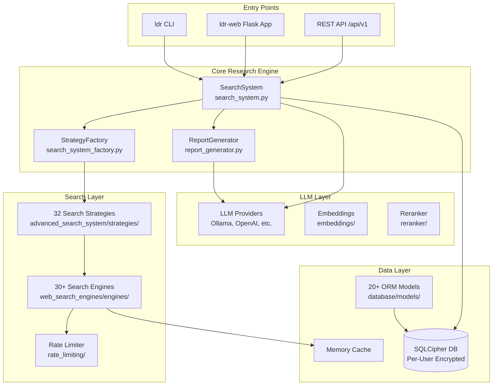
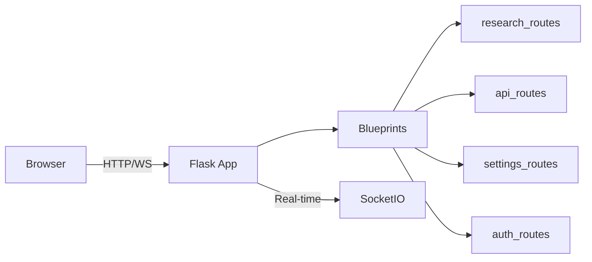
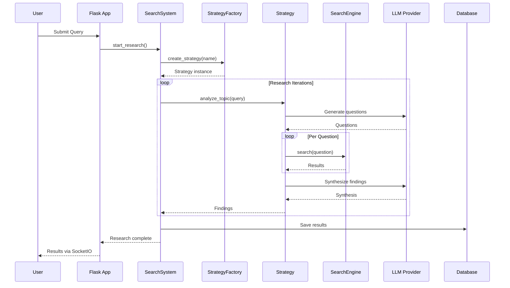
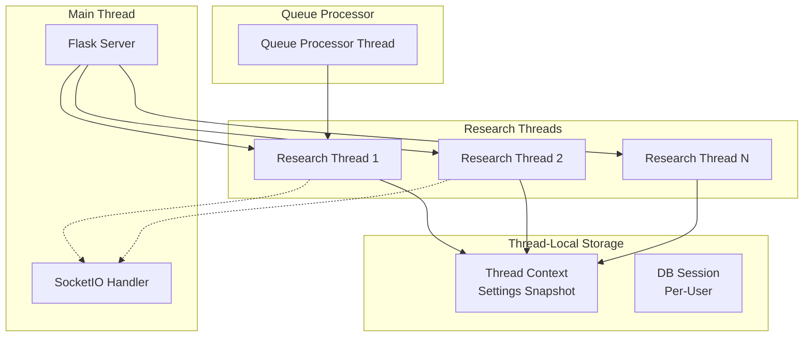
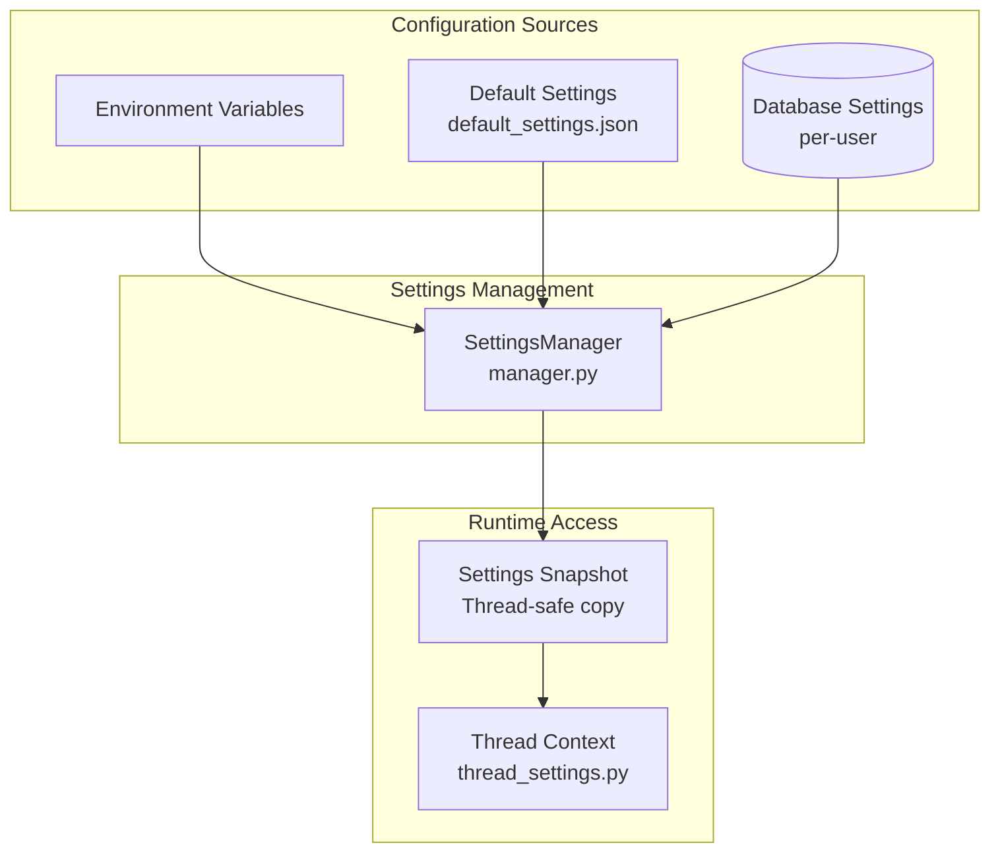

# Architecture Overview

This document provides a comprehensive overview of Local Deep Research's system architecture.

## Table of Contents

- [System Components](#system-components)
- [Entry Points](#entry-points)
- [Research Execution Flow](#research-execution-flow)
- [Module Responsibilities](#module-responsibilities)
- [Threading Model](#threading-model)
- [Configuration System](#configuration-system)
- [Key Interfaces](#key-interfaces)

---

## System Components



---

## Entry Points

### Web Application (`ldr-web`)

**Location:** `src/local_deep_research/web/app.py`

The primary user interface. Launches a Flask server with SocketIO for real-time updates.



**Key files:**
- `web/app.py` - Main entry, starts server
- `web/app_factory.py` - Flask app creation with middleware
- `web/routes/` - Blueprint route handlers
- `web/services/` - Business logic services

### CLI (`ldr`)

**Location:** `src/local_deep_research/main.py`

Command-line interface for headless research operations.

### REST API (`/api/v1`)

**Location:** `src/local_deep_research/web/api.py`

Programmatic access for integrations.

| Endpoint | Method | Purpose |
|----------|--------|---------|
| `/api/v1/quick_summary` | POST | Quick research summary |
| `/api/v1/generate_report` | POST | Full research report |
| `/api/v1/analyze_documents` | POST | Search local collections |
| `/api/v1/health` | GET | Health check |

---

## Research Execution Flow



---

## Module Responsibilities

### Core Modules

| Module | Location | Responsibility |
|--------|----------|----------------|
| **SearchSystem** | `search_system.py` | Orchestrates research, coordinates strategies and engines |
| **StrategyFactory** | `search_system_factory.py` | Creates strategy instances based on configuration |
| **ReportGenerator** | `report_generator.py` | Generates structured reports from research findings |
| **CitationHandler** | `citation_handler.py` | Processes and validates citations |

### Search System

| Module | Location | Responsibility |
|--------|----------|----------------|
| **BaseSearchEngine** | `web_search_engines/search_engine_base.py` | Abstract base for all search engines |
| **SearchEngineFactory** | `web_search_engines/search_engine_factory.py` | Creates engine instances |
| **RateLimitTracker** | `web_search_engines/rate_limiting/tracker.py` | Adaptive rate limiting |
| **RetrieverRegistry** | `web_search_engines/retriever_registry.py` | LangChain retriever integration |

### Strategy System

| Module | Location | Responsibility |
|--------|----------|----------------|
| **BaseSearchStrategy** | `advanced_search_system/strategies/base_strategy.py` | Abstract base for strategies |
| **FindingsRepository** | `advanced_search_system/findings/` | Accumulates research findings |
| **QuestionGenerator** | `advanced_search_system/questions/` | Generates research questions |

### Web Application

| Module | Location | Responsibility |
|--------|----------|----------------|
| **SocketIOService** | `web/services/socket_service.py` | Real-time communication |
| **ResearchService** | `web/services/research_service.py` | Research execution |
| **QueueManager** | `web/queue/` | Background task queue |
| **SessionManager** | `web/auth/session_manager.py` | User session handling |

### Data Layer

| Module | Location | Responsibility |
|--------|----------|----------------|
| **Models** | `database/models/` | SQLAlchemy ORM models |
| **SessionContext** | `database/session_context.py` | Thread-safe DB sessions |
| **EncryptedDB** | `database/encrypted_db.py` | SQLCipher integration |

### LLM Integration

| Module | Location | Responsibility |
|--------|----------|----------------|
| **LLM Providers** | `llm/providers/implementations/` | Provider-specific LLM wrappers |
| **AutoDiscovery** | `llm/providers/auto_discovery.py` | Dynamic provider detection |
| **LLMRegistry** | `llm/llm_registry.py` | Custom LLM registration |

---

## Threading Model



**Key Threading Concepts:**

1. **Thread Context** (`config/thread_settings.py`)
   - Each research thread has its own settings snapshot
   - Prevents race conditions on configuration changes

2. **Per-User DB Sessions** (`database/session_context.py`)
   - Each user has an isolated SQLCipher database
   - Sessions are thread-local via context manager

3. **Queue Processing** (`web/queue/`)
   - Background queue for long-running research
   - Processes items from `QueuedResearch` table

4. **SocketIO Updates**
   - Research threads emit progress via SocketIO
   - Uses threading async mode (not asyncio)

---

## Configuration System



**Configuration Flow:**

1. **Defaults** - Default settings loaded from JSON
2. **Environment** - Environment variables override defaults
3. **Database** - User settings loaded from encrypted per-user DB
4. **Snapshot** - Thread-safe copy created for each research
5. **Access** - Code reads from snapshot via thread context

**Key Settings Categories:**

| Category | Examples |
|----------|----------|
| `llm.*` | Provider, model, temperature, API keys |
| `search.*` | Engine selection, max results, rate limits |
| `app.*` | Debug mode, logging, UI preferences |
| `notifications.*` | Email, webhook configurations |

---

## Key Interfaces

### Search Engine Interface

All search engines implement `BaseSearchEngine`:

```python
class BaseSearchEngine(ABC):
    # Classification flags
    is_public: bool = True
    is_generic: bool = True
    is_scientific: bool = False
    is_local: bool = False
    is_news: bool = False
    is_code: bool = False

    @abstractmethod
    def run(self, query: str) -> List[Dict[str, Any]]:
        """Execute search and return results."""
        # Returns: [{"title": ..., "link": ..., "snippet": ...}]
```

### Strategy Interface

All strategies implement `BaseSearchStrategy`:

```python
class BaseSearchStrategy(ABC):
    def __init__(self, search, model, all_links_of_system,
                 settings_snapshot, **kwargs):
        ...

    @abstractmethod
    def analyze_topic(self, query: str) -> Dict:
        """Execute research strategy."""
        # Returns: {
        #     "findings": [...],
        #     "iterations": int,
        #     "questions": {...},
        #     "formatted_findings": str,
        #     "current_knowledge": {...}
        # }
```

### LLM Provider Interface

All providers extend `OpenAICompatibleProvider`:

```python
class OpenAICompatibleProvider:
    provider_name: str
    api_key_setting: str
    url_setting: str
    default_base_url: str
    default_model: str

    @classmethod
    def create_llm(cls, model_name, temperature, **kwargs) -> BaseChatModel:
        """Create LangChain LLM instance."""
```

---

## Directory Structure

```
src/local_deep_research/
├── search_system.py           # Main orchestrator
├── search_system_factory.py   # Strategy factory
├── report_generator.py        # Report generation
├── citation_handler.py        # Citation processing
│
├── web/                       # Flask application
│   ├── app.py                # Entry point
│   ├── app_factory.py        # App creation
│   ├── routes/               # Blueprint handlers
│   ├── services/             # Business logic
│   ├── queue/                # Task queue
│   └── auth/                 # Authentication
│
├── advanced_search_system/    # Search strategies
│   ├── strategies/           # 32 strategy implementations
│   ├── questions/            # Question generation
│   ├── findings/             # Findings management
│   └── ...
│
├── web_search_engines/        # Search engines
│   ├── engines/              # 30+ engine implementations
│   ├── search_engine_base.py # Abstract base
│   ├── search_engine_factory.py
│   └── rate_limiting/        # Adaptive rate limiting
│
├── database/                  # Data layer
│   ├── models/               # 20+ ORM models
│   ├── session_context.py    # Session management
│   └── encrypted_db.py       # SQLCipher
│
├── llm/                       # LLM integration
│   ├── providers/            # Provider implementations
│   └── llm_registry.py       # Custom LLM registration
│
├── config/                    # Configuration
│   ├── llm_config.py         # LLM setup
│   ├── search_config.py      # Search setup
│   └── thread_settings.py    # Thread context
│
├── settings/                  # Settings management
│   └── manager.py            # SettingsManager
│
└── api/                       # Programmatic API
    ├── client.py             # HTTP client
    └── research_functions.py # Direct functions
```

---

## See Also

- [Database Schema](./DATABASE_SCHEMA.md) - Detailed data model documentation
- [Extension Guide](../developing/EXTENDING.md) - How to add custom components
- [Troubleshooting](../troubleshooting.md) - Common issues and solutions
