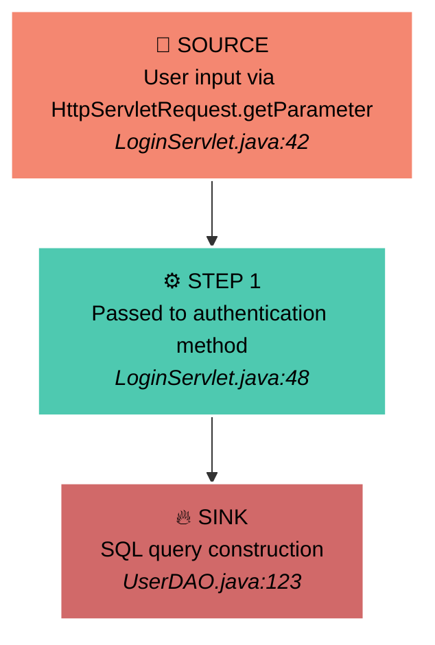

# CodeQL Dataflow Visualization

**Visual representation of dataflow paths from CodeQL analysis**

---

## Overview

The CodeQL integration now includes automatic **dataflow visualization** for all findings that contain data flow information. When CodeQL detects a taint-tracking or dataflow vulnerability, RAPTOR automatically generates visual representations in multiple formats.

## What Gets Visualized

Any CodeQL finding that includes **dataflow paths** (taint tracking from source to sink) will be automatically visualized. This includes vulnerabilities like:

- **SQL Injection** - User input → Database query
- **Command Injection** - User input → System command
- **Path Traversal** - User input → File system operation
- **XSS** - User input → HTML output
- **SSRF** - User input → HTTP request
- **Deserialization** - Untrusted data → Deserialization function

## Output Formats

RAPTOR generates **4 different visualization formats** for each dataflow finding:

### 1. 📊 HTML Interactive Visualization

**File**: `{finding_id}_dataflow.html`

A self-contained, browser-based interactive visualization with:
- **Visual flow graph** showing source → steps → sink
- **Color-coded nodes**:
  - 🔴 **Red**: Source (user-controlled input)
  - 🟢 **Teal**: Intermediate steps
  - 🟡 **Yellow**: Sanitizers/validators
  - 🔥 **Dark Red**: Sink (dangerous operation)
- **Interactive details**: Click any node to see:
  - File path and line number
  - Full source code context
  - Step description
- **D3.js-powered** with smooth animations
- **Dark theme** optimized for security work

**How to Use**:
```bash
# Open in browser
open autonomous/visualizations/{finding_id}_dataflow.html
```

**Example**:


---

### 2. 📝 Mermaid Diagram

**File**: `{finding_id}_dataflow.mmd`

Markdown-compatible Mermaid diagram format for documentation:
- **GitHub/GitLab rendering** - Displays natively in markdown
- **Copy-paste ready** for reports and documentation
- **Clean, professional** appearance
- **Emoji annotations** for easy identification

**How to Use**:
```bash
# Include in markdown files
cat autonomous/visualizations/{finding_id}_dataflow.mmd >> SECURITY_REPORT.md

# Or render standalone
mmdc -i {finding_id}_dataflow.mmd -o diagram.png
```

**Example**:


---

### 3. 🖥️ ASCII Terminal Visualization

**File**: `{finding_id}_dataflow.txt`

Plain text visualization for terminal viewing:
- **Quick preview** without opening browser
- **Includes in logs** automatically
- **SSH-friendly** for remote analysis
- **Copy-paste** into reports

**How to Use**:
```bash
# View in terminal
cat autonomous/visualizations/{finding_id}_dataflow.txt

# Or check logs
tail -n 50 raptor_codeql.log
```

**Example**:
```
================================================================================
CODEQL DATAFLOW VISUALIZATION
================================================================================

Rule: java/sql-injection
Message: Query built from user-controlled source

================================================================================
DATAFLOW PATH
================================================================================

┌─────────────────────────────────────────────────────────────────────────────┐
│ 🔴 SOURCE (User-Controlled Input)                                          │
└─────────────────────────────────────────────────────────────────────────────┘
  Location: src/main/java/com/example/LoginServlet.java:42:20
  Label: HttpServletRequest.getParameter(...)
  Snippet: String username = request.getParameter("username");

       │
       │  Data flows through...
       ▼

┌─────────────────────────────────────────────────────────────────────────────┐
│ ⚙️  STEP 1: Intermediate Processing                                        │
└─────────────────────────────────────────────────────────────────────────────┘
  Location: src/main/java/com/example/LoginServlet.java:48:30
  Label: Parameter to authenticateUser
  Snippet: boolean result = userDAO.authenticateUser(username, password);

       │
       ▼

┌─────────────────────────────────────────────────────────────────────────────┐
│ 🔥 SINK (Dangerous Operation)                                              │
└─────────────────────────────────────────────────────────────────────────────┘
  Location: src/main/java/com/example/dao/UserDAO.java:123:42
  Label: SQL query with tainted string
  Snippet: String query = "SELECT * FROM users WHERE username = '" + username + "'";

================================================================================
```

---

### 4. 🎨 Graphviz DOT Format

**File**: `{finding_id}_dataflow.dot`

Professional graph format with rendering instructions:
- **High-resolution** PNG/SVG/PDF output
- **Customizable** styling
- **Publication-quality** graphics
- **Includes rendering commands**

**How to Use**:
```bash
# Install Graphviz (if not already installed)
# macOS: brew install graphviz
# Ubuntu: sudo apt-get install graphviz

# Render to PNG
dot -Tpng {finding_id}_dataflow.dot -o dataflow.png

# Render to SVG (scalable)
dot -Tsvg {finding_id}_dataflow.dot -o dataflow.svg

# Render to PDF (for reports)
dot -Tpdf {finding_id}_dataflow.dot -o dataflow.pdf
```

**Instructions file**: `{finding_id}_dataflow_instructions.txt` (auto-generated)

---

## Workflow Integration

Visualizations are **automatically generated** during autonomous analysis:

### Using Standalone CodeQL Workflow

```bash
# Run with visualizations (default)
python3 raptor_codeql.py \
  --repo /path/to/code \
  --languages java

# Disable visualizations
python3 raptor_codeql.py \
  --repo /path/to/code \
  --languages java \
  --no-visualizations
```

### Using Integrated Workflow

```bash
# Full workflow with CodeQL + visualizations
python3 raptor_agentic.py \
  --repo /path/to/code \
  --codeql \
  --languages java
```

**Note**: The integrated workflow (raptor_agentic.py) currently generates visualizations only for the standalone CodeQL analysis. Full integration with the unified autonomous analysis is planned for a future release.

---

## Output Directory Structure

```
out/raptor_{repo}_{timestamp}/
│
├── autonomous/
│   ├── visualizations/                    # 📊 All visualizations here
│   │   ├── java_sql-injection_42_dataflow.html       # Interactive HTML
│   │   ├── java_sql-injection_42_dataflow.mmd        # Mermaid diagram
│   │   ├── java_sql-injection_42_dataflow.txt        # ASCII text
│   │   ├── java_sql-injection_42_dataflow.dot        # Graphviz DOT
│   │   ├── java_sql-injection_42_dataflow_instructions.txt
│   │   │
│   │   ├── java_path-injection_78_dataflow.html
│   │   ├── java_path-injection_78_dataflow.mmd
│   │   └── ...
│   │
│   ├── analysis/                          # JSON analysis per finding
│   │   ├── java_sql-injection_42_analysis.json
│   │   │   └── Contains "visualizations": {...}  # Paths to viz files
│   │   └── ...
│   │
│   ├── exploits/                          # Generated exploits
│   └── patches/                           # Generated patches
│
└── codeql/                                # CodeQL scan results
    └── codeql_java.sarif
```

---

## Analysis JSON Integration

Each analysis JSON file includes visualization paths:

```json
{
  "finding": {
    "rule_id": "java/sql-injection",
    "has_dataflow": true,
    "dataflow_path_count": 1,
    ...
  },
  "analysis": {
    "is_exploitable": true,
    ...
  },
  "dataflow_validation": {
    "is_exploitable": true,
    "confidence": 0.95,
    "sanitizers_effective": false,
    ...
  },
  "visualizations": {
    "html": "out/.../autonomous/visualizations/java_sql-injection_42_dataflow.html",
    "mermaid": "out/.../autonomous/visualizations/java_sql-injection_42_dataflow.mmd",
    "ascii": "out/.../autonomous/visualizations/java_sql-injection_42_dataflow.txt",
    "dot": "out/.../autonomous/visualizations/java_sql-injection_42_dataflow.dot"
  }
}
```

---

## Key Features

### 🎯 Automatic Detection
- **Zero configuration** - Works automatically for all dataflow findings
- **Intelligent detection** - Only generates for findings with code flows
- **No overhead** - Disabled findings skip visualization entirely

### 🎨 Professional Quality
- **Dark theme** optimized for security researchers
- **Color-coded** for instant comprehension
- **Multiple formats** for different use cases
- **Publication-ready** output

### 🚀 Performance
- **Parallel generation** - All formats created simultaneously
- **Fast rendering** - Optimized algorithms
- **Minimal overhead** - ~1-2 seconds per finding

### 🛡️ Security-Focused
- **Source highlighting** - Clear identification of user input
- **Sanitizer detection** - Automatic identification of validation
- **Sink emphasis** - Dangerous operations clearly marked
- **Attack path clarity** - Complete flow from input to vulnerability

---

## Use Cases

### 1. **Security Reviews**
Open HTML visualizations in browser during code reviews to quickly understand attack paths.

### 2. **Documentation**
Include Mermaid diagrams in security reports, wikis, and documentation.

### 3. **Terminal Analysis**
Use ASCII visualizations for quick previews when SSH'd into analysis servers.

### 4. **Presentations**
Render Graphviz diagrams to high-resolution images for presentations and papers.

### 5. **Training**
Use visualizations to teach developers about dataflow vulnerabilities.

### 6. **Bug Reports**
Include visualizations in bug bounty submissions to clearly demonstrate attack paths.

---

## Technical Details

### Visualization Algorithm

1. **Extract dataflow** from SARIF `codeFlows` field
2. **Parse locations** (source, intermediate steps, sink)
3. **Read source code** for each location
4. **Detect sanitizers** by analyzing step labels
5. **Generate formats** in parallel:
   - HTML: D3.js force-directed graph
   - Mermaid: Markdown-compatible syntax
   - ASCII: Box-drawing characters
   - DOT: Graphviz graph description language

### Sanitizer Detection

The visualizer automatically identifies sanitizers by looking for keywords in step labels:
- `sanitiz*` (sanitize, sanitizer, sanitization)
- `validat*` (validate, validator, validation)
- `filter*` (filter, filtering)
- `escape*` (escape, escaping)

Detected sanitizers are highlighted in yellow/gold in all visualizations.

---

## Disabling Visualizations

If you want to skip visualization generation (e.g., for performance):

```bash
# Standalone workflow
python3 raptor_codeql.py \
  --repo /path/to/code \
  --no-visualizations

# Integrated workflow
python3 raptor_agentic.py \
  --repo /path/to/code \
  --codeql \
  --no-visualizations
```

**When to Disable**:
- Very large codebases (100+ findings)
- CI/CD pipelines where visualization isn't needed
- When you only need SARIF output
- Performance-critical scenarios

---

## Troubleshooting

### Visualizations Not Generated

**Check 1**: Does the finding have dataflow?
```bash
# Search SARIF for codeFlows
jq '.runs[0].results[] | select(.ruleId == "java/sql-injection") | .codeFlows' codeql_java.sarif
```

If empty, the finding doesn't have dataflow paths.

**Check 2**: Is visualization enabled?
```bash
# Check logs for "Generating dataflow visualizations"
grep "visualizations" raptor_codeql.log
```

**Check 3**: Check for errors
```bash
# Look for visualization errors in logs
grep -i "visualization.*error" raptor_codeql.log
```

### HTML Visualization Not Displaying

**Issue**: D3.js not loading
**Solution**: Open in browser with internet connection (requires CDN)

**Alternative**: Download D3.js locally
```bash
curl https://d3js.org/d3.v7.min.js > d3.min.js
# Edit HTML file to use local d3.min.js
```

### Graphviz Rendering Fails

**Issue**: Graphviz not installed
**Solution**:
```bash
# macOS
brew install graphviz

# Ubuntu/Debian
sudo apt-get install graphviz

# Verify
dot -V
```

---

## Examples

### SQL Injection Example

**Rule**: `java/sql-injection`

**Path**:
1. **Source**: `HttpServletRequest.getParameter("id")` (line 42)
2. **Step 1**: Parameter passed to DAO (line 48)
3. **Sink**: String concatenation in SQL query (line 156)

**Files Generated**:
- `java_sql-injection_42_dataflow.html` - Interactive browser view
- `java_sql-injection_42_dataflow.mmd` - Markdown diagram
- `java_sql-injection_42_dataflow.txt` - Terminal view
- `java_sql-injection_42_dataflow.dot` - Graphviz source

### Command Injection Example

**Rule**: `java/command-injection`

**Path**:
1. **Source**: `HttpServletRequest.getParameter("file")` (line 89)
2. **Step 1**: Stored in variable (line 90)
3. **Step 2**: Passed to helper method (line 95)
4. **Sanitizer**: URL decoding (line 102) [Not effective]
5. **Sink**: `Runtime.getRuntime().exec()` (line 108)

**Visualization** shows sanitizer in yellow but dataflow validation confirms it's bypassable.

---

## Future Enhancements

Planned features for future releases:

- [ ] **Interactive HTML enhancements**
  - Collapse/expand intermediate steps
  - Filter by sanitizer presence
  - Export to image directly from browser

- [ ] **Additional formats**
  - PlantUML diagrams
  - ASCII art graphs (figlet-style)
  - JSON graph format for custom tools

- [ ] **Comparison views**
  - Side-by-side before/after patch
  - Compare multiple similar vulnerabilities

- [ ] **Integration improvements**
  - Full integration with raptor_agentic.py unified workflow
  - Batch visualization for all findings

---

## API Usage

### Standalone Visualization

You can use the visualizer independently:

```python
from pathlib import Path
from packages.codeql.dataflow_visualizer import DataflowVisualizer
from packages.codeql.dataflow_validator import DataflowValidator

# Load SARIF
with open("results.sarif") as f:
    sarif = json.load(f)

finding = sarif["runs"][0]["results"][0]

# Extract dataflow
validator = DataflowValidator(llm_client=None)
dataflow = validator.extract_dataflow_from_sarif(finding)

# Generate visualizations
visualizer = DataflowVisualizer(Path("output"))
viz_paths = visualizer.visualize_all_formats(
    dataflow,
    finding_id="my_finding",
    repo_path=Path("/path/to/repo")
)

print(f"HTML: {viz_paths['html']}")
print(f"Mermaid: {viz_paths['mermaid']}")
print(f"ASCII: {viz_paths['ascii']}")
print(f"DOT: {viz_paths['dot']}")
```

### Command-Line Usage

```bash
# Visualize a specific finding from SARIF
python3 packages/codeql/dataflow_visualizer.py \
  --sarif results.sarif \
  --repo /path/to/repo \
  --finding-index 0 \
  --format all \
  --out visualizations/

# Generate only HTML
python3 packages/codeql/dataflow_visualizer.py \
  --sarif results.sarif \
  --repo /path/to/repo \
  --finding-index 0 \
  --format html
```

---

## Summary

✅ **4 visualization formats** - HTML, Mermaid, ASCII, Graphviz
✅ **Automatic generation** - Zero configuration needed
✅ **Professional quality** - Publication-ready output
✅ **Multiple use cases** - Reviews, docs, reports, training
✅ **Fast performance** - Minimal overhead
✅ **Security-focused** - Designed for vulnerability analysis

**Dataflow visualization makes CodeQL findings instantly understandable, speeding up security analysis and improving communication about vulnerabilities.**

---

For more information, see:
- [CodeQL Integration Documentation](./README.md)
- [Phase 2 Overview](./PHASE2_OVERVIEW.md)
- [Complete Integration Guide](../../CODEQL_INTEGRATION_COMPLETE.md)
