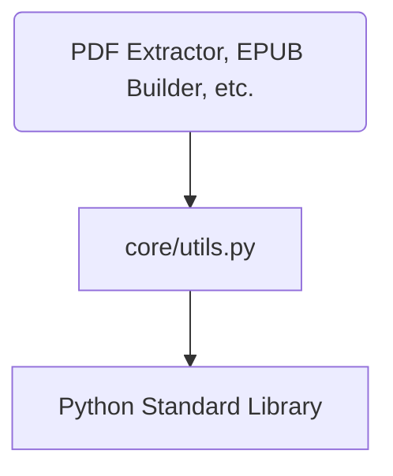

# System Design & Architecture

## Architecture Overview
**What is the high-level system structure?**

`core/utils.py` is a foundation layer. It does not depend on other project modules.

## Data Models
**What data do we need to manage?**

- **LoggingConfig:** Configuration for log levels and formats.
- **PathHelpers:** Functions for directory creation, file extension checks, etc.

## API Design
**How do components communicate?**

### Internal interfaces
- `get_logger(name: str) -> logging.Logger`: Returns a configured logger instance.
- `ensure_dir(path: Path) -> None`: Ensures a directory exists.
- `get_project_root() -> Path`: Returns the root directory of the project.

## Component Breakdown
**What are the major building blocks?**

- **Logger Module:** Wrapper around `logging`.
- **File System Utils:** Wrapper around `pathlib`.
- **Constants:** Shared constants like `DEFAULT_ENCODING`, `VERSION`.

## Design Decisions
**Why did we choose this approach?**

- **Functional approach:** Small, pure functions where possible for easy testing.
- **Pathlib over os.path:** More modern and readable path manipulation in Python.
- **Environment-based config:** Logging level can be adjusted without code changes using the `LOG_LEVEL` environment variable.

## Non-Functional Requirements
**How should the system perform?**

- **Performance:** Minimal overhead.
- **Reliability:** Must not crash; robust error handling for file operations.
- **Typing:** Strict type hinting for all public APIs.
