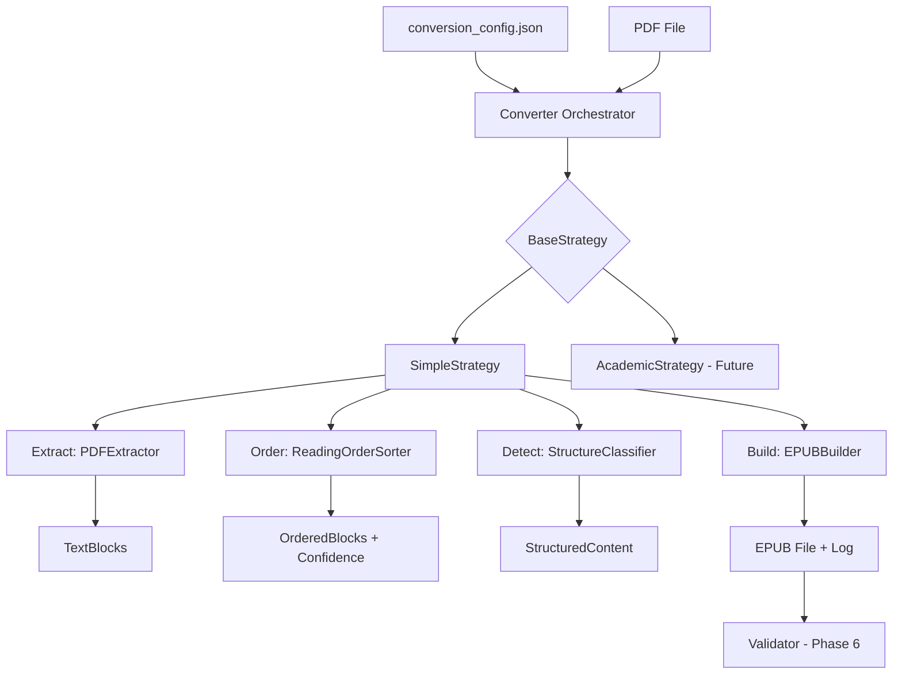

# System Design & Architecture

## Architecture Overview
**What is the high-level system structure?**



**Component Responsibilities:**
- **Converter**: Orchestrator that loads config, selects strategy, coordinates workflow
- **BaseStrategy**: Abstract class defining convert() interface and extension points
- **SimpleStrategy**: Concrete implementation for fiction/simple books
- **EPUBBuilder**: Creates valid EPUB3 files from structured content

**Technology Stack:**
- Python 3.14+
- PyMuPDF (fitz) for PDF extraction
- lxml for EPUB XML generation
- zipfile for EPUB packaging

## Data Models

### Input: ConversionConfig
```python
@dataclass
class ConversionConfig:
    page_ranges: PageRanges           # skip/content/endnotes
    exclude_regions: ExcludeRegions   # top/bottom/left/right %
    multi_column: MultiColumnConfig   # enabled, column_count, threshold
    reading_order_strategy: str       # "xy_sort" | "column_based"
    heading_detection: HeadingConfig
    footnote_processing: FootnoteConfig
    metadata: BookMetadata            # title, author, language
```

### Intermediate: StructuredContent
```python
@dataclass
class StructuredContent:
    chapters: List[Chapter]
    metadata: BookMetadata
    reading_order_confidence: float   # 0.0-1.0
    images: List[ImageResource]       # Extracted images from PDF
    
@dataclass
class Chapter:
    title: str
    level: int                        # 1-3 for H1/H2/H3
    content: str                      # HTML content
    footnotes: List[Footnote]
    
@dataclass
class Footnote:
    marker: str                       # "[1]" or "1"
    id: str                           # "fn-chapter-1-note-1"
    text: str

@dataclass
class ImageResource:
    id: str                           # "img-page-5-1"
    filename: str                     # "image001.png"
    data: bytes                       # Image binary data
    format: str                       # "png" | "jpeg" | "gif"
    width: int
    height: int
    page_num: int                     # Source page in PDF

@dataclass
class BookMetadata:
    title: str
    author: str
    language: str                     # ISO 639-1 code ("en", "ru", etc.)
    publisher: Optional[str] = None
    isbn: Optional[str] = None
    description: Optional[str] = None
```

### Output: ConversionResult
```python
@dataclass
class ConversionResult:
    epub_path: Path
    status: str                       # "success" | "warning" | "failed"
    reading_order_confidence: float
    log: ConversionLog
    
@dataclass
class ConversionLog:
    timestamp: datetime
    strategy_used: str
    config: ConversionConfig
    steps_completed: List[str]
    warnings: List[str]
    errors: List[str]
```

## API Design

### Converter Interface
```python
class Converter:
    def __init__(self, strategy: str = "simple"):
        """Initialize with strategy name."""
        
    def convert(
        self,
        pdf_path: Path,
        output_path: Path,
        config: ConversionConfig = None
    ) -> ConversionResult:
        """
        Main conversion method.
        
        Workflow:
        1. Load/validate config
        2. Select and instantiate strategy
        3. Execute strategy.convert()
        4. Generate conversion log
        5. Return result
        """
```

### BaseStrategy Interface
```python
class BaseStrategy(ABC):
    """Abstract base for all conversion strategies."""
    
    def convert(self, pdf_path: Path, config: ConversionConfig) -> StructuredContent:
        """Template method - calls hooks in order."""
        blocks = self.extract(pdf_path, config)
        ordered = self.order_blocks(blocks, config)
        structured = self.detect_structure(ordered, config)
        return structured
    
    @abstractmethod
    def extract(self, pdf_path, config) -> List[TextBlock]:
        """Override to customize extraction."""
    
    @abstractmethod
    def order_blocks(self, blocks, config) -> Tuple[List[TextBlock], float]:
        """Override to customize reading order."""
    
    @abstractmethod
    def detect_structure(self, blocks, config) -> StructuredContent:
        """Override to customize structure detection."""
```

### EPUBBuilder Interface
```python
class EPUBBuilder:
    def build(
        self,
        content: StructuredContent,
        output_path: Path
    ) -> Path:
        """
        Create EPUB3 file from structured content.
        
        Steps:
        1. Create EPUB directory structure
        2. Extract metadata from PDF (title, author, ISBN)
        3. Save images to OEBPS/images/
        4. Generate content.opf (metadata, spine, image manifest)
        5. Generate toc.ncx (table of contents)
        6. Generate chapter XHTML files (with  tags)
        7. Package as ZIP with .epub extension
        """
```

## Component Breakdown

### Converter (Orchestrator)
**Responsibilities:**
- Load and validate conversion config
- Instantiate the correct strategy
- Handle errors and generate logs
- Create ConversionResult

**Dependencies:**
- strategies/* (imports dynamically)
- epub_builder
- core.utils (logging, path handling)

### BaseStrategy (Abstract)
**Responsibilities:**
- Define conversion workflow (template method pattern)
- Provide extension points for customization
- Enforce consistent interface

**Key Methods:**
- `convert()` - template method
- `extract()`, `order_blocks()`, `detect_structure()` - hooks

### SimpleStrategy (Concrete)
**Responsibilities:**
- Implement conversion for simple fiction books
- Use Y-sort for reading order
- Detect chapters by font size

**Algorithm:**
1. **Extract**: Call PDFExtractor with exclude_regions
   - Extract text blocks
   - Extract images from PDF pages
   - Extract metadata (title, author, ISBN from PDF info)
2. **Order**: Use YSorter (simple top-to-bottom)
3. **Detect**:
   - FontAnalyzer to identify heading fonts
   - StructureClassifier to mark H1/paragraph blocks
   - StructureBuilder to group into chapters
4. **Return**: StructuredContent (with metadata and images)

### EPUBBuilder (EPUB Creator)
**Responsibilities:**
- Generate valid EPUB3 structure
- Create XHTML content files
- Handle footnote linking
- Package as ZIP

**EPUB Structure:**
```
book.epub/
├── mimetype
├── META-INF/
│   └── container.xml
└── OEBPS/
    ├── content.opf       # Package document
    ├── toc.ncx           # Navigation
    ├── stylesheet.css
    ├── chapter1.xhtml
    ├── chapter2.xhtml
    └── images/
```

## Design Decisions

### Decision 1: Strategy Pattern
**Why:** Different book types require different processing logic
**Alternatives:**
- Single monolithic converter with if/else → too complex, hard to extend
- Separate converter classes → code duplication

**Chosen:** Strategy pattern with template method
- **Pros:** Clean extension, reusable base logic, testable
- **Cons:** More files, need base class maintenance

### Decision 2: Separate Converter from Strategy
**Why:** Converter handles orchestration/logging, Strategy handles conversion logic
**Alternative:** Single Converter class with strategy as parameter → couples orchestration with logic

**Chosen:** Separate concerns
- Converter: config, error handling, logging
- Strategy: pure conversion logic

### Decision 3: EPUBBuilder as Separate Module
**Why:** Building EPUB is complex enough to be standalone
**Alternative:** Include in Strategy → violates SRP

**Chosen:** Dedicated EPUBBuilder in core/
- Can be reused by all strategies
- Testable independently
- Follows existing pattern (pdf_extractor, epub_extractor in core/)

### Decision 4: No Validation in Converter
**Why:** Separation of concerns - conversion and validation are distinct phases
**Alternative:** Auto-validate after conversion → couples concerns, makes testing harder

**Chosen:** Validation is separate (Phase 6)
- Converter focuses on creating EPUB
- Validation is optional, orchestrated by CLI

### Decision 5: Extract Metadata and Images
**Why:** Complete EPUB requires metadata (title, author) and embedded images
**Alternatives:**
- Manual metadata input → requires user interaction
- Skip images → incomplete conversion for illustrated books

**Chosen:** Extract from PDF automatically
- **Metadata:** Read from PDF info dict (title, author, subject, keywords)
  - Fallback to "Unknown" if missing
  - Allow override via ConversionConfig.metadata
- **Images:** Extract all images from PDF pages
  - Save to EPUB OEBPS/images/ folder
  - Update XHTML to include  tags at original positions
  - Support PNG, JPEG, GIF formats

### Decision 6: Fail-Fast Config Validation
**Why:** Better to fail early with clear message than fail mid-conversion
**Alternative:** Validate lazily as each field is used → harder to debug

**Chosen:** Validate config immediately in Converter.__init__()
- Check required fields (metadata.title, metadata.author)
- Validate types (exclude_regions 0.0-1.0, page_ranges are ints)
- Validate enums (reading_order_strategy in ["y_sort", "xy_cut"])
- Raise ValueError with specific field name if invalid

## Non-Functional Requirements

### Performance Targets
- Convert single-column 300-page book: <30 seconds
- Memory usage: <500MB for typical book
- No performance degradation for books up to 1000 pages

### Reliability
- Fail fast with clear error messages (e.g., "PDF is encrypted")
- Never corrupt input file
- Always create conversion log, even on failure

### Maintainability
- Each strategy <300 lines of code
- Clear docstrings for all public methods
- Type hints for all function signatures

### Extensibility
- New strategies can be added without modifying base code
- Config format is extensible (new fields don't break old strategies)
- EPUBBuilder can support EPUB2 in future (currently EPUB3 only)
