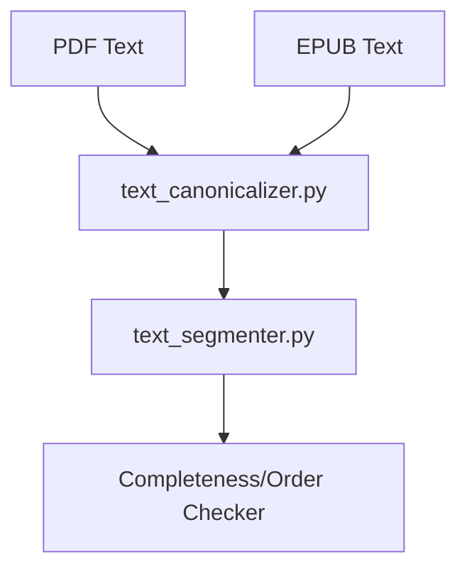

# System Design & Architecture

## Architecture Overview
**What is the high-level system structure?**

The `text_canonicalizer` is a utility in the `validation` namespace. It is used by both PDF and EPUB extractors before passing text to the validator.

## Data Models
**What data do we need to manage?**

- **Ligature Map:** A dictionary of Unicode ligatures and their multi-character expansions.
- **CanonicalizationConfig:** Toggle for conservative/aggressive modes.

## API Design
**How do components communicate?**

### Primary Interface
- `canonicalize(text: str, aggressive: bool = False) -> str`
- `resolve_ligatures(text: str) -> str`
- `remove_hyphenation(text: str) -> str`

## Component Breakdown
**What are the major building blocks?**

- **Unicode Normalizer:** Uses `unicodedata.normalize('NFKC', text)`.
- **Ligature Resolver:** Regex-based replacement of common ligatures.
- **Hyphenation Cleaner:** Logic to detect and remove end-of-line hyphens (e.g. `-\s*\n`).

## Design Decisions
**Why did we choose this approach?**

- **NFKC:** We chose Compatibility Decomposition followed by Canonical Composition (NFKC) because it handles many formatting differences (like super/subscripts or precomposed characters) that might differ between PDF and EPUB.
- **Regex for hyphens:** More robust than simple string replacement for handling whitespace around hyphens.

## Non-Functional Requirements
**How should the system perform?**

- **Correctness:** Must not introduce new words or change word order.
- **Performance:** Stream-friendly or efficient string builders.
