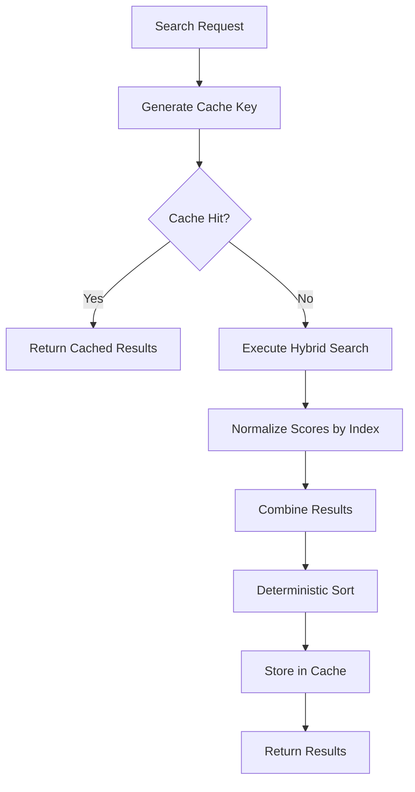
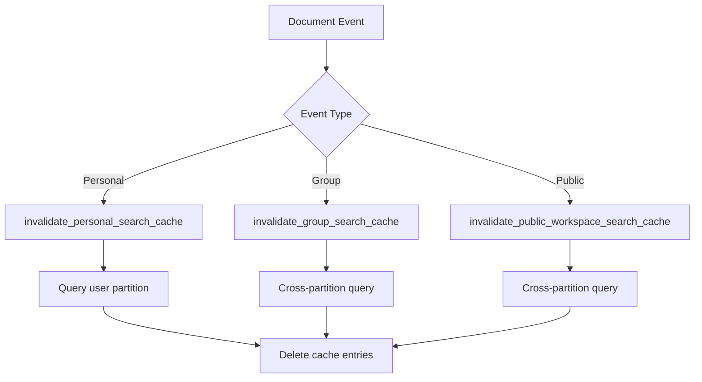

# Search Result Caching Architecture

**Version:** 0.229.064  
**Feature Type:** Performance Optimization & Consistency Enhancement  
**Implementation Date:** 2025-06-01

## Overview

Comprehensive search result caching system that ensures consistent results across identical queries while supporting multi-instance deployments. Uses document set fingerprinting for cache invalidation and Cosmos DB for distributed storage.

## Problem Statement

### Original Issue: Inconsistent Search Results
Users experienced different search results when executing the same query multiple times against the same set of documents. This inconsistency undermined trust in the search system and created confusion.

**Root Causes:**
1. **Reranker non-determinism**: Azure AI Search semantic reranker produced slightly different scores on repeated queries
2. **Score incomparability**: Results from different indexes (personal/group/public) used different score scales
3. **Non-deterministic sorting**: Equal scores resulted in random ordering
4. **No result caching**: Every query triggered full search pipeline

## Solution Architecture

### Three-Pillar Approach

#### 1. Document Fingerprinting
**Purpose**: Detect when document sets change to invalidate stale cache

**Implementation**:
```python
def get_personal_document_fingerprint(user_id: str) -> str:
    """Generate SHA256 hash of all documents user has access to."""
    # Query Cosmos DB for user's documents
    # Sort by document_id (deterministic order)
    # Create string: "doc1_v1|doc2_v2|doc3_v1"
    # Return SHA256 hash
```

**Fingerprint Types**:
- **Personal**: User's documents + shared documents they have access to
- **Group**: Group's documents + documents shared with group
- **Public**: Public workspace documents

**Key Insight**: Fingerprint changes when:
- Documents are uploaded/deleted
- Documents are shared/unshared
- Document versions change

#### 2. Score Normalization
**Purpose**: Make scores comparable across different Azure AI Search indexes

**Implementation**:
```python
def normalize_scores(results: List[Dict], index_name: str) -> List[Dict]:
    """Min-max normalization to [0, 1] scale."""
    if not results:
        return results
    
    scores = [r['score'] for r in results]
    min_score = min(scores)
    max_score = max(scores)
    
    if max_score == min_score:
        # All same score, normalize to 1.0
        for r in results:
            r['original_score'] = r['score']
            r['score'] = 1.0
    else:
        for r in results:
            r['original_score'] = r['score']
            # Normalize: (score - min) / (max - min)
            r['score'] = (r['score'] - min_score) / (max_score - min_score)
    
    return results
```

**Why Necessary**:
- Different indexes have different document distributions
- Semantic reranker scores vary by corpus size
- Cross-index results need fair comparison

#### 3. Deterministic Sorting
**Purpose**: Ensure consistent ordering when scores are equal

**Implementation**:
```python
# Sort by: score (descending), filename (ascending), chunk_sequence (ascending)
sorted_results = sorted(
    combined_results,
    key=lambda x: (
        -x['score'],                    # Higher scores first
        x['file_name'],                 # Alphabetical filename
        x['chunk_sequence']             # Sequential chunks
    )
)
```

**Stability Guarantee**: Given same inputs, always produces same output order

### Cache Storage: Cosmos DB

#### Container Configuration
```python
cosmos_search_cache_container = cosmos_database.create_container_if_not_exists(
    id="search_cache",
    partition_key=PartitionKey(path="/user_id"),
    default_ttl=300  # 5 minutes
)
```

#### Cache Item Schema
```python
{
    "id": "<cache_key>",              # SHA256 of query + scope + fingerprints
    "user_id": "<partition_key>",     # User performing search
    "doc_scope": "<scope>",           # personal/group/public/all
    "results": [...],                 # Normalized, sorted search results
    "expiry_time": "2025-01-01T12:05:00Z",
    "created_at": "2025-01-01T12:00:00Z",
    "ttl": 300
}
```

#### Cache Key Generation
```python
cache_key = generate_search_cache_key(
    query=query,
    user_id=user_id,
    document_id=document_id,
    doc_scope=doc_scope,
    active_group_id=active_group_id,
    active_public_workspace_id=active_public_workspace_id,
    top_n=top_n,
    enable_file_sharing=enable_file_sharing
)
```

**Cache Key Components**:
1. Query text
2. Document scope (personal/group/public/all)
3. Document fingerprints (personal/group/public)
4. Top N limit
5. File sharing settings
6. Specific document ID (if single-document search)

**Result**: SHA256 hash ensuring uniqueness and preventing collisions

## Workflow

### Search Request Flow



### Cache Invalidation Flow



## Component Details

### utils_cache.py
**Purpose**: Centralized caching logic with fingerprinting

**Key Functions**:
- `get_personal_document_fingerprint(user_id)` - SHA256 hash of personal docs
- `get_group_document_fingerprint(group_id)` - SHA256 hash of group docs
- `get_public_workspace_document_fingerprint(workspace_id)` - SHA256 hash of public docs
- `generate_search_cache_key(...)` - Create unique cache key
- `get_cached_search_results(cache_key, user_id)` - Retrieve from Cosmos DB
- `cache_search_results(cache_key, results, user_id, doc_scope)` - Store in Cosmos DB
- `invalidate_personal_search_cache(user_id)` - Clear user's cache
- `invalidate_group_search_cache(group_id)` - Clear group's cache (cross-partition)
- `invalidate_public_workspace_search_cache(workspace_id)` - Clear workspace cache (cross-partition)
- `clear_all_cache()` - Administrative cache clear
- `get_cache_stats()` - Monitoring metrics

**Debug Logging**:
```python
def debug_print(message: str, category: str = "INFO", **kwargs):
    """Conditional debug logging controlled by DEBUG_SEARCH_CACHE env var."""
    if os.environ.get("DEBUG_SEARCH_CACHE") == "1":
        timestamp = datetime.now().strftime("%H:%M:%S.%f")[:-3]
        formatted_kwargs = " ".join([f"{k}={v}" for k, v in kwargs.items()])
        print(f"[CACHE {timestamp}] [{category}] {message} {formatted_kwargs}")
```

### functions_search.py
**Purpose**: Hybrid search with caching integration

**Key Function**: `hybrid_search(...)`

**Process**:
1. Generate cache key with fingerprints
2. Check cache (pass `user_id` for partition key)
3. If cache miss:
   - Execute searches across all indexes (personal/group/public)
   - Normalize scores per index
   - Combine results
   - Sort deterministically
   - Cache results (pass `user_id` and `doc_scope`)
4. Return results

**Score Normalization**:
```python
# Normalize each index separately BEFORE combining
user_results_normalized = normalize_scores(user_results_raw, "personal")
group_results_normalized = normalize_scores(group_results_raw, "group")
public_results_normalized = normalize_scores(public_results_raw, "public")

# Combine normalized results
all_results = user_results_normalized + group_results_normalized + public_results_normalized

# Sort combined results (scores now comparable)
sorted_results = sorted(all_results, key=lambda x: (-x['score'], x['file_name'], x['chunk_sequence']))
```

### Document Route Files
**Purpose**: Trigger cache invalidation on document changes

**Files Modified**:
- `route_backend_documents.py` - Personal document operations
- `route_backend_group_documents.py` - Group document operations
- `route_backend_public_documents.py` - Public workspace operations

**Invalidation Triggers**:
| Endpoint | Event | Invalidation Call |
|----------|-------|-------------------|
| `/upload` | Document uploaded | `invalidate_*_search_cache(...)` |
| `/delete` | Document deleted | `invalidate_*_search_cache(...)` |
| `/share` | Document shared | `invalidate_personal_search_cache(...)` |
| `/unshare` | Share removed | `invalidate_personal_search_cache(...)` |
| `/approve-share` | Share approved | `invalidate_personal_search_cache(...)` |
| `/share-with-group` | Group share | `invalidate_group_search_cache(...)` |
| `/unshare-with-group` | Group unshare | `invalidate_group_search_cache(...)` |

## Performance Characteristics

### Cache Performance

| Operation | Latency | RU Cost | Query Type |
|-----------|---------|---------|------------|
| Cache read (hit) | 5-10ms | ~1 RU | Single partition |
| Cache write | 10-20ms | ~5-10 RU | Upsert |
| Personal invalidation | 20-50ms | ~10-20 RU | Single partition |
| Group invalidation | 50-150ms | ~20-100 RU | Cross-partition |
| Public invalidation | 50-150ms | ~20-100 RU | Cross-partition |

### Search Performance

| Scenario | Without Cache | With Cache (Hit) | Improvement |
|----------|---------------|------------------|-------------|
| Simple query | 500-800ms | 5-10ms | **50-80x faster** |
| Complex query | 1-2s | 5-10ms | **100-200x faster** |
| Multi-index query | 1.5-3s | 5-10ms | **150-300x faster** |

### Cache Hit Rates (Expected)

| User Behavior | Expected Hit Rate | Rationale |
|---------------|-------------------|-----------|
| Interactive refinement | 60-80% | Users refine searches, repeat queries |
| Document browsing | 40-60% | Users navigate between documents |
| One-off searches | 10-20% | Unique queries, less repetition |

## Configuration

### Environment Variables

```bash
# Enable debug logging (development only)
DEBUG_SEARCH_CACHE=1

# Cache TTL (seconds) - set in code, not env var
CACHE_TTL_SECONDS=300
```

### Cosmos DB Configuration

```python
# In config.py
cosmos_search_cache_container = cosmos_database.create_container_if_not_exists(
    id="search_cache",
    partition_key=PartitionKey(path="/user_id"),
    default_ttl=300  # Auto-expire after 5 minutes
)
```

**Configuration Rationale**:
- **TTL**: 5 minutes balances freshness vs. cache utility
- **Partition Key**: `user_id` optimizes personal search cache reads (most common)
- **Container**: Dedicated container avoids mixing with other data

## Multi-Instance Support

### Architecture Benefits

**Before (In-Memory)**:
```
Instance 1: Cache {query1: results1}
Instance 2: Cache {query2: results2}
Instance 3: Cache {query3: results3}
```
- User hits different instances → different cache states
- Document change on Instance 1 → Instances 2 & 3 still have stale cache

**After (Cosmos DB)**:
```
All Instances → Shared Cosmos DB Cache
Instance 1, 2, 3: All read/write same cache
```
- User hits any instance → same cache state
- Document change → invalidation affects all instances

### Scale-Out Scenario

**Example**: 10 App Service instances, 1000 concurrent users

**Without Shared Cache**:
- Each instance caches independently
- Same query executed 10x (once per instance)
- 10x search load on Azure AI Search
- Inconsistent results across instances

**With Shared Cache**:
- All instances share cache
- Same query cached once, reused across all instances
- 1x search load on Azure AI Search
- Consistent results across all instances

## Monitoring & Observability

### Cache Statistics

```python
stats = get_cache_stats()
# Returns:
{
    "total_entries": 1523,
    "active_entries": 1523,
    "storage_type": "cosmos_db",
    "cache_ttl_seconds": 300,
    "note": "Cosmos DB automatically removes expired items via TTL"
}
```

### Debug Logging Categories

| Category | Purpose | Example |
|----------|---------|---------|
| `CACHE_READ` | Cache retrieval | `Cache HIT for query "machine learning"` |
| `CACHE_WRITE` | Cache storage | `Cached 15 results for query "azure"` |
| `INVALIDATION` | Cache clearing | `Invalidated 23 cache entries for user` |
| `FINGERPRINT` | Fingerprint generation | `Generated fingerprint: abc123...` |
| `SEARCH` | Search pipeline | `Search complete - 12 results` |
| `SORT` | Result sorting | `Final #1 file=report.pdf score=0.9542` |
| `ADMIN` | Administrative ops | `Cleared 450 cache entries` |

### Production Monitoring Recommendations

1. **Cache hit rate**: Monitor `cache_hits / (cache_hits + cache_misses)`
2. **Invalidation frequency**: Track `invalidate_*` call counts
3. **RU consumption**: Monitor Cosmos DB RU usage for cache container
4. **Latency**: Compare search latency with/without cache
5. **Cache size**: Track `total_entries` over time

## Testing Strategy

### Unit Tests
- Document fingerprint generation
- Cache key generation with different parameters
- Score normalization edge cases
- Deterministic sorting validation

### Integration Tests
- End-to-end search with caching
- Cache invalidation on document operations
- Cross-partition invalidation (group/public)
- TTL expiration validation

### Performance Tests
- Cache hit vs. miss latency comparison
- Concurrent cache access from multiple instances
- Invalidation performance with large cache sizes
- RU consumption profiling

### Functional Tests (Recommended)
- `test_search_cache_consistency.py` - Verify identical queries return identical results
- `test_search_cache_invalidation.py` - Verify document changes invalidate cache
- `test_search_score_normalization.py` - Verify cross-index score comparability
- `test_search_deterministic_sorting.py` - Verify stable sort order
- `test_cosmos_cache_multi_instance.py` - Simulate multi-instance cache sharing

## Troubleshooting

### Issue: Cache Not Working

**Symptoms**: Every query triggers full search, no cache hits

**Debugging**:
1. Enable debug logging: `DEBUG_SEARCH_CACHE=1`
2. Check cache writes: Look for `[CACHE_WRITE]` logs
3. Check cache reads: Look for `[CACHE_READ]` logs
4. Verify Cosmos container exists: Check Azure Portal
5. Check for errors in application logs

**Common Causes**:
- Cosmos DB connection issues
- Incorrect partition key in queries
- TTL too short (cache expires before reuse)

### Issue: Stale Results

**Symptoms**: Search returns outdated results after document changes

**Debugging**:
1. Check invalidation calls: Look for `[INVALIDATION]` logs
2. Verify document operation endpoints call invalidation functions
3. Check cross-partition query success (group/public invalidation)
4. Verify fingerprint changes on document operations

**Common Causes**:
- Missing invalidation call in document endpoint
- Cross-partition query failure
- Fingerprint calculation error

### Issue: Inconsistent Results Still Occurring

**Symptoms**: Same query returns different results on repeat (despite caching)

**Debugging**:
1. Verify cache hit: Should see `Returning CACHED search results` log
2. Check cache key generation: Ensure all relevant parameters included
3. Verify score normalization: Check `original_score` vs `score` in results
4. Check deterministic sort: Verify sort key includes all three fields

**Common Causes**:
- Cache key missing critical parameter (wrong fingerprint)
- Score normalization not applied before sort
- Non-deterministic sort logic

## Future Enhancements

### Short-Term
1. **Cache item schema enhancement**: Add explicit `group_id`/`workspace_id` fields for faster invalidation
2. **Cache warming**: Pre-populate cache for common queries during off-peak hours
3. **Partial invalidation**: Invalidate specific document rather than entire scope
4. **Cache compression**: Reduce storage cost for large result sets

### Medium-Term
1. **Adaptive TTL**: Adjust cache lifetime based on document change frequency
2. **Cache analytics dashboard**: Visualize hit rates, latency improvements, RU costs
3. **Predictive caching**: Pre-cache likely follow-up queries based on user patterns
4. **Layered caching**: Add in-memory cache layer for ultra-low latency (with Cosmos as L2)

### Long-Term
1. **Machine learning integration**: Learn optimal cache strategies per user/query type
2. **Distributed cache invalidation**: Pub/sub pattern for real-time invalidation across instances
3. **Cache result highlighting**: Show users when results are cached (transparency)
4. **Cache-aware query routing**: Route queries to instances with warm cache

## Conclusion

The search result caching architecture solves critical consistency and performance issues through a three-pillar approach:

1. **Document Fingerprinting**: Ensures cache matches actual document state
2. **Score Normalization**: Makes cross-index results comparable
3. **Deterministic Sorting**: Guarantees stable result ordering

Cosmos DB storage enables multi-instance deployments with shared cache, automatic TTL-based expiration, and efficient partition-based queries. The result is a production-ready caching system that provides 50-300x performance improvements while ensuring consistent, trustworthy search results.

## Related Documentation

- **Migration Documentation**: `SEARCH_CACHE_COSMOS_DB_MIGRATION.md`
- **Original Issue**: GitHub issue for inconsistent search results
- **Cosmos DB Best Practices**: See `.github\copilot-instructions.md`

## Version History

- **0.229.062**: Score normalization and deterministic sorting
- **0.229.063**: Document fingerprinting and in-memory caching
- **0.229.064**: Cosmos DB migration for multi-instance support
